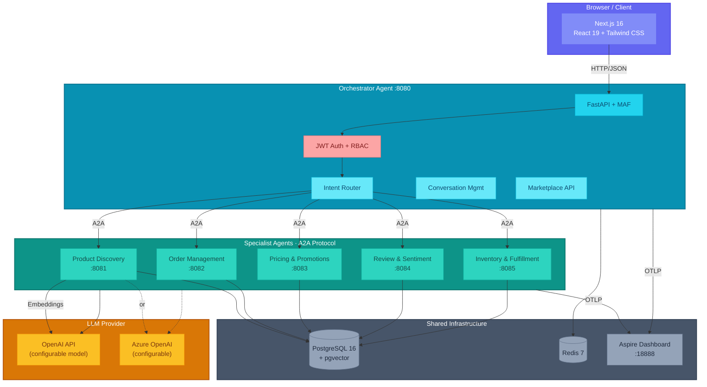

# E-Commerce Agents

[](https://github.com/nitin27may/e-commerce-agents/actions/workflows/tests.yml)
[](https://github.com/nitin27may/e-commerce-agents/actions/workflows/build-images.yml)
[](LICENSE)
[](https://python.org)
[](https://dotnet.microsoft.com)
[](https://nextjs.org)
[](https://github.com/microsoft/agent-framework)
[](https://github.com/pgvector/pgvector)
[](https://docs.docker.com/compose/)

A **multi-agent e-commerce platform** built with [Microsoft Agent Framework](https://github.com/microsoft/agent-framework) (MAF). Six specialized AI agents collaborate over the **A2A protocol** to handle product discovery, orders, pricing, reviews, inventory and support — with **two complete, working backends, Python and .NET / C#**, behind one Next.js frontend.

### Run it

```bash
git clone https://github.com/nitin27may/e-commerce-agents.git
cd e-commerce-agents
cp .env.minimal .env          # set OPENAI_API_KEY — the only variable a first run needs
./scripts/dev.sh --demo       # pulls prebuilt images, seeds, and starts everything
```

Then open **http://localhost:3000** and sign in as `alice.johnson@gmail.com` / `customer123`.
Docker is the only requirement — no Python, .NET or Node needed.

`--demo` pulls the ten released images from GitHub Container Registry instead of building them,
which is the difference between roughly **one minute and roughly twelve**. Images are published for
`linux/amd64` and `linux/arm64`, so Apple Silicon runs natively.

**Building from source instead** — drop the flag. This is the contributor path, and the one to use
if you have changed any code:

```bash
./scripts/dev.sh              # builds all ten images locally, then seeds and starts
```

**On Windows**, use `scripts/dev.ps1` — the PowerShell twin of the bash script, same flags:

```powershell
Copy-Item .env.minimal .env    # then set OPENAI_API_KEY in .env
./scripts/dev.ps1 -Demo
```

[WSL2](https://learn.microsoft.com/windows/wsl/install) still gives the best experience, and
everything above works unchanged inside it.

Full detail — the .NET stack, WSL2 notes, running with no API key, and what to do when something
breaks: the **[Quick Start page](https://nitinksingh.com/e-commerce-agents/getting-started/quick-start.html)**.

**Generative UI, not raw JSON.** The chat surface never dumps a tool result as text or a code block. Every agent response is inspected by shape and rendered as the right interactive component: a single detailed result becomes a card, a list becomes a table, a distribution or trend becomes a chart, a status becomes a tone-coded badge — see it live in the [screens gallery](https://nitinksingh.com/e-commerce-agents/getting-started/demo-guide.html) (review sentiment: rating distribution + 6-month trend, rendered from the same data an LLM would otherwise only describe in prose).

**Pick your stack:** [`agents/python/`](./agents/python/) or [`agents/dotnet/`](./agents/dotnet/) — same schema, same prompts, same frontend for either (toggle with `NEXT_PUBLIC_BACKEND_STACK`). Parity is enforced by a dual-backend test gate, and [`docs/parity-matrix.md`](./docs/parity-matrix.md) lists the remaining differences row by row.

**Full documentation:** **[nitinksingh.com/e-commerce-agents](https://nitinksingh.com/e-commerce-agents/)** — the concepts library, all 34 tutorial chapters, and the architecture reference, with every diagram rendered.

Companion demo repo for the AI article series on [nitinksingh.com](https://nitinksingh.com):
**[MAF v1: Putting It All Together](https://nitinksingh.com/posts/maf-v1-21-putting-it-all-together/)**
(the current Python + .NET series) and
**[Building a Multi-Agent E-Commerce Platform — The Complete Guide](https://nitinksingh.com/posts/building-a-multi-agent-e-commerce-platform-the-complete-guide/)**
(the original Python-only walkthrough). The articles are optional background — this repo and its
[documentation site](https://nitinksingh.com/e-commerce-agents/) are the canonical, always-current source.


---

## Where to start

| I want to... | Go here |
|---|---|
| **Just run it** | [Run it](#run-it) above — Docker, one command |
| Run the .NET backend, or Windows, or with no API key | [Quick Start](https://nitinksingh.com/e-commerce-agents/getting-started/quick-start.html) |
| Configure it | [Configuration](docs/configuration.md) — one `.env`, and how it reaches each service |
| Read the documentation | **[nitinksingh.com/e-commerce-agents](https://nitinksingh.com/e-commerce-agents/)** — rendered and searchable |
| **Brand new to AI — never run a model or written an agent** | [AI Knowledge Hub](https://nitinksingh.com/ai-resources/) — eleven modules, ten labs, free and local |
| Learn what an agent even is — new to AI/agents | [Concepts](https://nitinksingh.com/e-commerce-agents/concepts/) — start at page 01 |
| Understand how the agents work / add a new one | [Architecture](docs/architecture.md) · [Adding an Agent](docs/adding-an-agent.md) |
| Use the MCP server | [MCP Integration](docs/mcp-integration.md) |
| Follow the step-by-step tutorial series | [tutorials/README.md](./tutorials/README.md) — 34 chapters |
| See what shipped and what is next | [Roadmap](https://nitinksingh.com/e-commerce-agents/getting-started/roadmap.html) · [CHANGELOG](CHANGELOG.md) |
| See the generative UI, test users and scenarios to try | [Demo guide](https://nitinksingh.com/e-commerce-agents/getting-started/demo-guide.html) |

---

## Architecture



Six agents — five specialists behind one orchestrator — over the A2A protocol, with the same schema and the
same frontend for either backend. Full detail — request flow, agent internals, the database schema
and the API surface — is in **[Architecture](https://nitinksingh.com/e-commerce-agents/architecture/)**.

**Pick your stack:** [`agents/python/`](./agents/python/) or [`agents/dotnet/`](./agents/dotnet/) —
toggle with `NEXT_PUBLIC_BACKEND_STACK`. Parity is enforced by a dual-backend test gate, and
[`docs/parity-matrix.md`](./docs/parity-matrix.md) lists the remaining differences row by row.

---

## Documentation

Everything below is published, searchable and cross-linked at
**[nitinksingh.com/e-commerce-agents](https://nitinksingh.com/e-commerce-agents/)** — with all
71 Mermaid diagrams rendered as diagrams. The site is generated from this repository by
`scripts/build_docs_site.py`, so the files here are always the source of truth; nothing lives
only on the site.

| Section | What's in it |
|---------|--------------|
| **[Concepts](https://nitinksingh.com/e-commerce-agents/concepts/)** | 14 pages for readers new to agents — what an agent is, the agentic loop, tools, harnesses, why multi-agent, orchestration patterns, graphs, state and memory, grounding, guardrails, HITL, evaluation, observability and cost, production concerns |
| **[Tutorials](https://nitinksingh.com/e-commerce-agents/tutorials/)** | 34 chapters. Every chapter that ships code ships both Python and .NET, and every one is gated in CI — the tests replay fixtures (Python) or drive a scripted client (.NET), so the whole suite runs with no key and no network |
| **[Architecture](https://nitinksingh.com/e-commerce-agents/architecture/)** | [System design](docs/architecture.md) · [agent flows](docs/agent-flows.md) · [database schema](docs/database-schema.md) · [API reference](docs/api-reference.md) · [frontend](docs/frontend.md) · [workflows](docs/workflows/README.md) |
| **[Guides](https://nitinksingh.com/e-commerce-agents/guides/)** | [Adding an agent](docs/adding-an-agent.md) · [MCP integration](docs/mcp-integration.md) · [telemetry](docs/telemetry.md) · [security](docs/security-guide.md) · [agent quality and evals](docs/agent-quality.md) · [MAF best practices](docs/maf-best-practices.md) · [releasing](docs/releasing.md) |
| **[Getting Started](https://nitinksingh.com/e-commerce-agents/getting-started/)** | [Quick start](docs/quick-start.md) · [configuration](docs/configuration.md) · [deployment](docs/deployment.md) · [troubleshooting](docs/troubleshooting.md) |
| **[Reference](https://nitinksingh.com/e-commerce-agents/reference/)** | [Python vs .NET parity matrix](docs/parity-matrix.md) · [agent audit matrix](docs/agent-audit-matrix.md) · [glossary](tutorials/_shared/jargon-glossary.md) · [Mermaid style guide](tutorials/_shared/mermaid-style-guide.md) |
| **[Demo guide](https://nitinksingh.com/e-commerce-agents/getting-started/demo-guide.html)** | Test users, the agent catalog, scenarios to try, and the screens gallery |
| **[Roadmap](https://nitinksingh.com/e-commerce-agents/getting-started/roadmap.html)** | What shipped, what is in progress, and what is deliberately not done |

Contributor-facing docs stay in the repo rather than on the site:
[CONTRIBUTING.md](CONTRIBUTING.md) (setup, conventions, testing policy, PR checklist),
[CHANGELOG.md](CHANGELOG.md) (what changed in each release) and [CLAUDE.md](CLAUDE.md).

---

## Tech stack

| Layer | Technology |
|-------|-----------|
| Agent framework | [Microsoft Agent Framework](https://github.com/microsoft/agent-framework) v1 — Python (`agent-framework-core`) **and** .NET (`Microsoft.Agents.AI`) |
| Agent communication | A2A protocol, plus MCP for data access |
| LLM | OpenAI / Azure OpenAI, or any OpenAI-compatible endpoint (Ollama, vLLM, OpenRouter) |
| Backend | Python 3.12 + FastAPI · .NET 10 + ASP.NET Core |
| Data | PostgreSQL 16 + pgvector · Redis 7 |
| Frontend | Next.js 16, React 19, Tailwind 4, shadcn/ui |
| Telemetry | OpenTelemetry → .NET Aspire Dashboard |

Versions, ports and every environment variable: **[Deployment](./docs/deployment.md)** and
**[Configuration](./docs/configuration.md)**.

---

## What's next

This is an active project. The short version of where it goes from here — the full list, with
checkboxes and the reasoning for the order, is on the
**[Roadmap](https://nitinksingh.com/e-commerce-agents/getting-started/roadmap.html)**.

| Next | What it is |
|---|---|
| **Azure and Microsoft Foundry** | The biggest gap today: there is no Azure path at all. Not one deployment — the same six agents in **three topologies** (Container Apps, Foundry as model provider, Foundry Hosted Agents), with what each one costs you. One deployment is a tutorial; three with trade-offs is a reference |
| **Finish the gates** | The dual-backend parity suite runs locally but not in CI, and the .NET eval suite needs its baselines. Every parity claim this repo makes rests on a gate nobody runs automatically |
| **Retrieval and tooling** | A typed filter DSL for `search_products`, the two MCP servers published to PyPI, and prompt caching — now measurable, because the cost counter ships |
| **Cross-framework comparison** | The same non-trivial system built a third way — Claude Agent SDK or LangGraph — so the differences are attributable to the framework rather than to the problem. Gated on Azure landing first |

The roadmap also records what is **deliberately not** planned, and why, so those are not mistaken
for oversights.

> **Watch this repository** to be notified when these land — use *Watch → Custom → Releases* for
> release-only notifications, or *Watch → All Activity* to follow the work as it happens. Each
> release is written up in the [CHANGELOG](CHANGELOG.md), which says plainly when something never
> worked and for how long.

---

## Contributing

1. Fork the repository
2. Create a feature branch: `git checkout -b feature/your-feature`
3. Make your changes and ensure tests pass
4. Submit a pull request

See [CONTRIBUTING.md](CONTRIBUTING.md) for detailed setup, conventions, testing policy, and PR checklist.

---

## License

This project is licensed under the [MIT License](LICENSE).

---

Built with [Microsoft Agent Framework](https://github.com/microsoft/agent-framework) and [A2A Protocol](https://google.github.io/A2A/).

**Built by [Nitin Singh](https://github.com/nitin27may)** &middot; [Documentation](https://nitinksingh.com/e-commerce-agents/) &middot; [More projects](https://nitinksingh.com/projects/)
