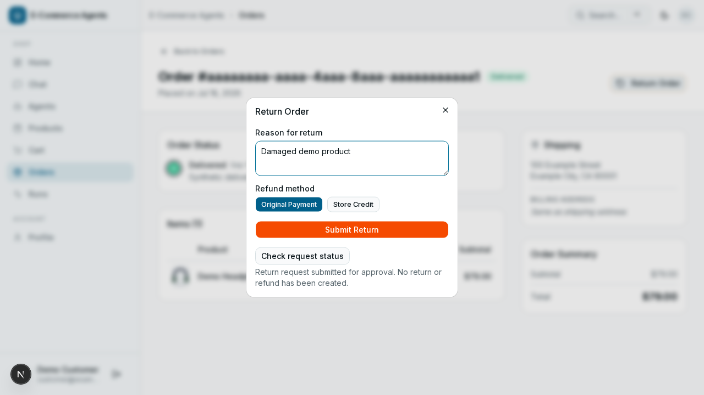
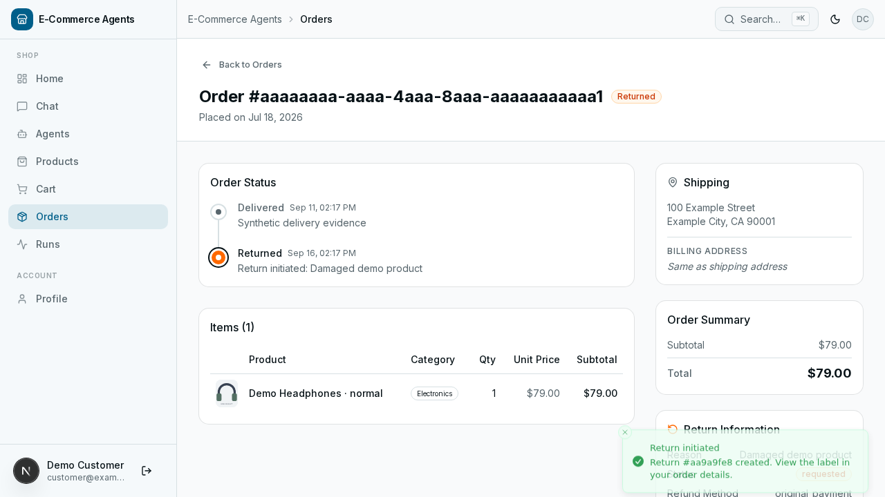

# Reliable Commerce Agents

**电商多智能体平台中的可靠售后执行：从“调用工具”到“审批、提交、核实结果”。**

基于 [Microsoft Agent Framework 电商开源项目](https://github.com/nitin27may/e-commerce-agents)构建。本分支聚焦 Python 退货申请：统一业务规则、把审批放到写入之前，并在进程退出、网络断连和重复请求后恢复可确认的结果。

[三分钟演示](docs/portfolio-demo.md) · [执行与恢复架构](docs/after-sales-architecture.md) · [验证记录](docs/verification.md) · [面试问答](docs/interview-qa.md) · [对照数据](docs/evaluation/after-sales-results.json)

## 解决什么问题

普通聊天回答可以重试，改变订单状态的工具调用需要更严格的边界：

- 资格查询、普通提交、管理员审批曾使用不同规则，缺少签收证据也可能被判为可退。
- 审批节点位于写入之后时，“等待批准”不能保证此前没有副作用。
- 数据库已提交但响应丢失时，单独的幂等缓存可能留下“正在处理”，无法确认已经成功的申请。
- 界面必须区分申请成功、业务拒绝、等待审批和结果未知，避免没有依据的成功提示。

本项目把这些约束放在可信 Python 服务与 PostgreSQL 中；模型继续承担意图理解和工具选择。

## 已实现的增量

| 改进 | 实现及证据 |
| --- | --- |
| 统一规则 | `returns-v1` 精确期限、签收证据、归属、状态、原因长度校验，接入工具、REST、审批与工作流 |
| 审批前置 | 绑定用户、规范化参数、订单证据、政策版本和有效期；恢复后再校验 |
| 持久操作标识 | 浏览器请求前保存 UUID，服务端按用户隔离；同标识不同参数明确冲突 |
| 原子结果 | 退货申请、订单状态和操作回执同事务提交；唯一索引限制每单一份退货 |
| 未知结果核实 | 新连接等待在途写锁后查询结果；不能核实时保持 `UNKNOWN` |
| 受控恢复 | 共享请求预算、有界重试、审批恢复锁、检查点重放复用已提交结果 |
| 可复验评估 | 真 PostgreSQL、子进程退出、真实 TCP COMMIT 回执丢失、冻结基线和三个消融版本 |

这些是已知工程技术在智能体业务链路中的组合与验证，不宣称发明了新的模型或通用算法。

## 看一次完整流程





页面及数据均来自本项目的本地合成演示。没有真实客户数据，也没有真实退款。

## 快速运行

需要 Python 3.12、uv、Node.js 22、pnpm 10 和 Docker。完整 .NET/教程开发环境另有安装选项。

```bash
git clone https://github.com/s1encisi/reliable-commerce-agents.git
cd reliable-commerce-agents
bash scripts/install-deps.sh --core --images
bash scripts/demo.sh --reset
```

打开 **http://localhost:3010**。用 `customer@example.test` 或 `admin@example.test` 登录，演示密码均为 `DemoPass123!`。

演示使用独立数据库、卷和端口，不复用普通开发栈。可演示订单申请、人工审批、结果核实及 MAF 固定工作流。
**自由文本模型聊天需要另外配置模型服务；离线演示和回放不等于实时模型推理。** 详见[演示步骤](docs/portfolio-demo.md)与[账号配置](docs/zh-CN/environment-setup.md)。

## 验证与对照

评估覆盖 22 类固定场景，每类重复 3 次。比较上游退货工具基线 B0、M2 规则统一版本 B1、当前 B2，以及关闭提交前复核、结果确认、重试预算的消融版本。

[原始结果](docs/evaluation/after-sales-results.json)保留逐场景判定、实际数据库记录数、故障触发次数和源码散列。另有并发 1/3/5、各 100 请求的本地服务负载观察。

```bash
OPENAI_API_KEY= AZURE_OPENAI_KEY= AZURE_OPENAI_API_KEY= RECORD=false uv run --project agents/python --no-sync pytest agents/python/tests -q
uv run --project agents/python python -m evals.after_sales --output docs/evaluation/after-sales-results.json
pnpm --dir web exec vitest run --maxWorkers=1
```

这些数字是预定义条件的工程回归证据，不是生产成功率、真实用户样本或模型泛化准确率。没有把未运行的真实模型实验、生产容量或成本节省写成成果。

## 架构与技术

浏览器 → Next.js 同源代理 → FastAPI 协调器 → MAF 工具/工作流与 A2A 专业智能体 → 统一售后服务 → PostgreSQL。

- Python、MAF、FastAPI、asyncpg、PostgreSQL/pgvector、Redis。
- Next.js、React、TypeScript、Playwright、Vitest。
- 继承 OpenTelemetry、JWT/OAuth、检索与事实核验基础设施。
- `.NET` 后端和教程保留上游学习价值；本轮售后恢复协议升级以 **Python** 为范围。

## 来源与贡献边界

| 上游已有 | 本分支改进 |
| --- | --- |
| 六智能体、A2A、五类编排、前端与商城业务 | 统一售后政策、审批绑定与写入前置 |
| 基础幂等、行锁、重试、检查点 | 持久操作回执、提交确认不明时核实、审批中断恢复 |
| JWT/OAuth、RAG、遥测和测试框架 | 退货故障矩阵、对照与消融、独立演示及面试材料 |

保留上游作者、[MIT 许可证](LICENSE)和[原始英文说明](README.en.md)。本分支开发使用了 AI 辅助；简历应按本人实际参与、理解和复验的范围描述，不写“从零独立实现整个框架”。

## 已知边界

本轮没有接入真实支付、物流或邮件系统；本地事务不能保证跨系统恰好一次。真实模型保留集、模型费用与生产负载尚未验证。
已有数据采用[增量迁移](docs/after-sales-architecture.md#升级已有数据库)，遇到重复退货会停止并要求审查，不自动删除数据。

私有配置、数据、日志、登录文件和历史备份留在本地并排除版本控制。公开范围与审查方式见[发布与隐私](docs/local-privacy.md)。
