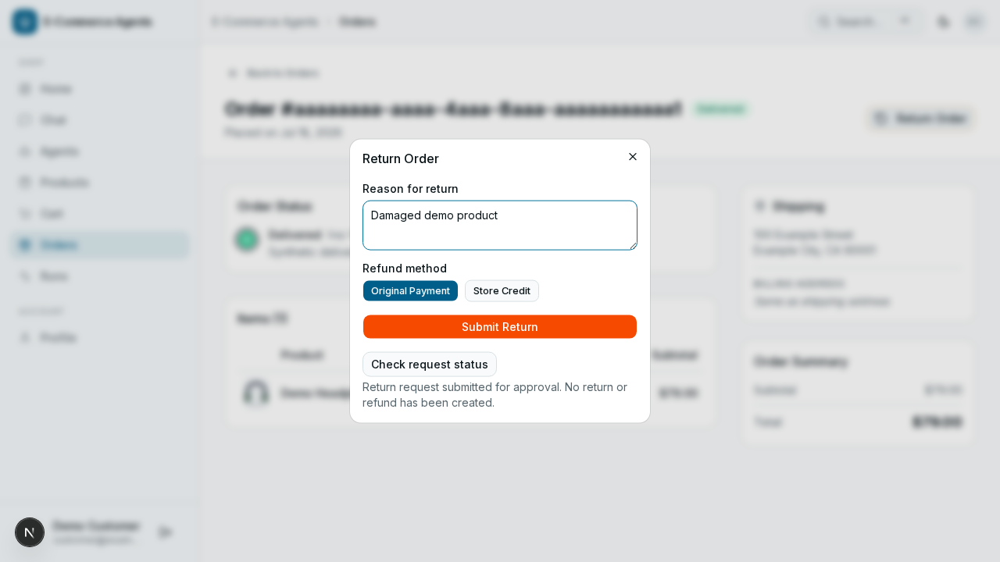
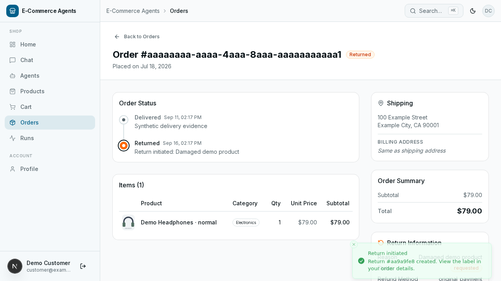

# 可靠电商多智能体平台

**多智能体协作的电商平台，重点解决「售后写操作」的可靠执行问题：从「让模型调用工具」到「审批、提交、核实结果」。**

平台基于 Microsoft Agent Framework（MAF，微软智能体框架）构建，由六个专业智能体通过 A2A 协议协作，覆盖商品发现、订单管理、定价促销、评论情感分析、库存履约与售后服务。售后链路实现了完整的可靠执行协议：统一业务规则、审批前置、持久化操作标识、原子结果提交与未知结果核实。

[三分钟演示](docs/portfolio-demo.md) · [售后执行与恢复架构](docs/after-sales-architecture.md) · [验证记录](docs/verification.md) · [面试问答](docs/interview-qa.md) · [评测数据](docs/evaluation/after-sales-results.json)

---

## 解决什么问题

普通对话回答可以重试，但**改变订单状态的工具调用必须更严格**。本项目针对四类真实缺陷做了工程处理：

1. **规则不统一** —— 资格查询、普通提交、管理员审批原本使用不同规则，缺少签收证据也可能被判为可退。
2. **审批位置错误** —— 审批节点位于写入之后时，「等待批准」无法保证此前没有产生副作用。
3. **结果不可确认** —— 数据库已提交但响应丢失时，单独的幂等缓存可能留下「处理中」状态，无法确认申请是否成功。
4. **状态语义模糊** —— 界面必须区分「申请成功」「业务拒绝」「等待审批」「结果未知」，避免给出没有依据的成功提示。

处理方式是把这些约束下沉到可信的 Python 服务与 PostgreSQL 中，模型只负责意图理解与工具选择。

## 核心能力

| 能力 | 实现与证据 |
| --- | --- |
| 统一业务规则 | `returns-v1` 政策：精确期限、签收证据、归属校验、状态校验、原因长度校验，统一接入工具、REST、审批与工作流四条路径 |
| 审批前置 | 审批快照绑定用户、规范化参数、订单证据、政策版本与有效期；恢复后重新校验才允许提交 |
| 持久化操作标识 | 浏览器请求前保存 UUID，服务端按用户隔离；同一标识携带不同参数时明确报冲突 |
| 原子结果提交 | 退货申请、订单状态与操作回执在同一事务内提交；唯一索引限制每单仅一份退货 |
| 未知结果核实 | 新建连接等待在途写锁后查询结果；无法核实时保持 `UNKNOWN` 状态而非猜测 |
| 受控恢复 | 共享请求预算、有界重试、审批恢复锁、检查点重放复用已提交结果 |
| 可复验评测 | 真实 PostgreSQL、子进程退出、真实 TCP COMMIT 回执丢失、冻结基线与三个消融版本 |

> 这些是已知工程技术在智能体业务链路中的**组合与验证**，不宣称发明了新的模型或通用算法。

## 看一次完整流程





页面与数据均来自本项目的本地合成演示，不含真实客户数据，也不涉及真实退款。

## 系统架构

```
浏览器
  └─ Next.js 前端（同源代理）
       └─ FastAPI 编排器（:8080）
            ├─ MAF 工具调用 / 工作流（五种编排模式）
            ├─ A2A 专业智能体（:8081–8085）
            └─ 统一售后服务（规则 / 审批 / 幂等 / 恢复）
                 └─ PostgreSQL + pgvector、Redis
```

**编排器是唯一入口。** 所有用户请求先到编排器，其 LLM 通过 `call_specialist_agent()` 工具以 HTTP POST `/message:send` 路由到对应专业智能体。每个专业智能体是独立微服务，拥有自己的端口与 A2A 端点。

**五种编排模式可在运行时切换**，同一个问题用五种方式处理并对比延迟与步骤：`tool`（工具路由）、`handoff`（处理权交接）、`workflow:pre-purchase`（并发扇出/汇聚）、`workflow:return-replace`（顺序图 + 工作流内人工审批）、`group-chat`（圆桌讨论）。

## 技术栈

| 层次 | 技术 |
| --- | --- |
| 智能体框架 | Microsoft Agent Framework（MAF）Python SDK |
| 智能体通信 | A2A 协议（HTTP POST `/message:send`） |
| 大语言模型 | OpenAI / Azure OpenAI（gpt-4.1），支持任意 OpenAI 兼容端点（Ollama、vLLM、LM Studio 等） |
| 后端 | Python 3.12、FastAPI（编排器）、Starlette（专业智能体） |
| 数据库 | PostgreSQL 16 + pgvector（1536 维向量嵌入） |
| 缓存 | Redis 7 |
| 前端 | Next.js 16、React 19、Tailwind CSS 4、shadcn/ui |
| 鉴权 | 自包含 JWT（PyJWT + bcrypt），可选自托管 OAuth2 授权服务器 |
| 可观测性 | OpenTelemetry → Jaeger（:16686） |
| 包管理 | `uv`（Python）、`pnpm`（Node） |
| 测试 | pytest（后端）、Vitest（前端单元）、Playwright（端到端） |
| 代码检查 | Ruff（Python，行宽 120）、ESLint 9（TypeScript） |

## 快速开始

### 方式一：作品集演示（推荐，无需模型服务）

```bash
git clone https://github.com/s1encisi/reliable-commerce-agents.git
cd reliable-commerce-agents
bash scripts/demo.sh --reset
```

打开 **http://localhost:3010**（API 在 `:8180`）。

| 角色 | 账号 | 密码 |
| --- | --- | --- |
| 客户 | `customer@example.test` | `DemoPass123!` |
| 审批人 | `admin@example.test` | `DemoPass123!` |

该方式使用独立数据库与端口，不启动自由文本模型对话，可完整演示退货申请、人工审批、结果核实与 MAF 固定工作流。

### 方式二：完整平台（需要模型服务）

```bash
bash scripts/install-deps.sh --core --images
bash scripts/dev.sh
```

打开 **http://localhost:3000**。

| 角色 | 账号 | 密码 |
| --- | --- | --- |
| 管理员 | `admin@example.com` | `admin123` |
| 消费者 | `zhangwei@example.com` | `customer123` |
| 商家 | `seller@example.com` | `seller123` |

> **自由文本模型对话需要配置 `OPENAI_API_KEY` 或 Azure OpenAI 凭据；离线演示与回放不等同于实时模型推理。** 详见[环境配置](docs/zh-CN/environment-setup.md)与[快速开始](docs/quick-start.md)。

## 目录结构

```
.
├── agents/python/          Python 后端
│   ├── orchestrator/       编排器（路由、编排模式、会话、检查点恢复）
│   ├── shared/             共享基础设施（售后、事实核验、护栏、鉴权、遥测、工具）
│   ├── workflows/          MAF 工作流定义
│   ├── config/prompts/     YAML 提示词（按智能体分文件、组合式加载）
│   ├── evals/              评测数据集、基线、评分器与结果
│   ├── packages/           MCP 服务（商品、库存）
│   └── tests/              后端测试
├── web/                    Next.js 前端（界面、生成式 UI 组件、e2e 测试）
├── tutorials/              34 章可运行教程（MAF 逐章讲解）
├── docs/                   架构、API、数据库、部署、评测等文档
├── scripts/                开发与运维脚本
└── docker/                 PostgreSQL 初始化与迁移
```

## 文档导航

| 想了解 | 从这里开始 |
| --- | --- |
| 快速跑起来 | [快速开始](docs/quick-start.md) |
| 系统设计 | [架构总览](docs/architecture.md) · [智能体流程](docs/agent-flows.md) |
| 售后可靠执行 | [售后架构](docs/after-sales-architecture.md) · [验证记录](docs/verification.md) |
| 接口与数据 | [API 参考](docs/api-reference.md) · [数据库模式](docs/database-schema.md) |
| 评测方法 | [智能体质量与评测](docs/agent-quality.md) · [评测数据](docs/evaluation/after-sales-results.json) |
| 部署与运维 | [部署](docs/deployment.md) · [可观测性](docs/telemetry.md) · [安全](docs/security-guide.md) |
| 面试准备 | [面试学习笔记](docs/interview-notes/README.md) · [面试问答](docs/interview-qa.md) |

## 验证与评测

评测覆盖 **22 类固定场景，每类重复 3 次**，对比三个版本与三个消融变体：

| 版本 | 说明 | 通过情况 |
| --- | --- | --- |
| B0 | 基线（原始退货工具） | 37 / 66 |
| B1 | 规则统一版本 | 51 / 66 |
| B2 | 当前版本（含审批前置、结果核实、重试预算） | 66 / 66 |
| 消融 A | 关闭提交前复核 | 45 / 66 |
| 消融 B | 关闭结果确认 | 63 / 66 |
| 消融 C | 关闭重试预算 | 63 / 66 |

[原始结果](docs/evaluation/after-sales-results.json)保留逐场景判定、实际数据库记录数、故障触发次数与源码散列。另有并发 1/3/5、各 100 请求的本地服务负载观察。

```bash
# 后端测试（不调用真实模型）
OPENAI_API_KEY= AZURE_OPENAI_KEY= AZURE_OPENAI_API_KEY= RECORD=false \
  uv run --project agents/python --no-sync pytest agents/python/tests -q

# 运行评测并输出结果
uv run --project agents/python python -m evals.after_sales \
  --output docs/evaluation/after-sales-results.json

# 前端单元测试
pnpm --dir web exec vitest run --maxWorkers=1
```

> 这些数字是**预定义条件下的工程回归证据**，不是生产成功率、真实用户样本或模型泛化准确率。未运行的真实模型实验、生产容量与成本节省均未计入成果。

## 已知边界

- 未接入真实支付、物流或邮件系统；本地事务无法保证跨系统「恰好一次」。
- 真实模型保留集、模型费用与生产负载尚未验证。
- 已有数据库采用[增量迁移](docs/after-sales-architecture.md)，遇到重复退货会停止并要求人工审查，不自动删除数据。
- 私有配置、数据、日志与登录文件保留在本地并排除版本控制，公开范围见[发布与隐私](docs/local-privacy.md)。

## 许可证

本项目采用 [MIT 许可证](LICENSE)。

## 预算受控的模型升级

新增 DeepSeek Flash 常规执行、Kimi K3 复杂规划和 Jev 有限路由，复用原有业务工具与审批。包含跨进程累计费用预留、只读短路径、持久任务和证据有效期，以及真实中文合成任务对照。新路由默认关闭，不把小样本结果宣传为生产成功率。

[实施与运行指南](docs/agent-upgrade.md) · [真实调用验证](docs/upgrade-verification.md) · [逐样本结果](docs/evaluation/upgrade-results.json)
