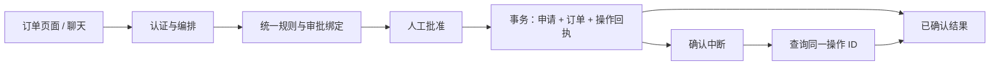
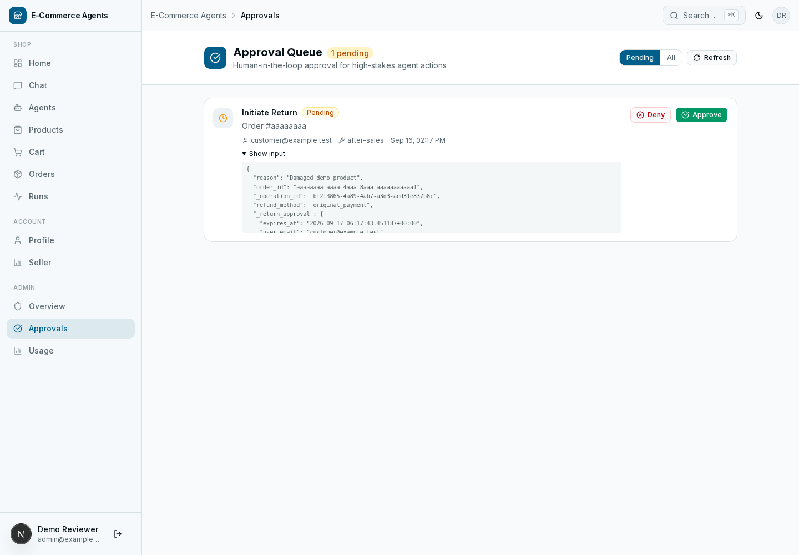

# Reliable Commerce Agents

**让电商 Agent 的售后操作可审批、可重试、可核实。** 项目基于开源电商多智能体平台，围绕退货申请实现统一业务规则、人工审批、持久操作回执和故障恢复，避免把模型回复或 HTTP 成功误当成业务已经完成。

平台通过 Microsoft Agent Framework、FastAPI 和 A2A 风格 HTTP 通信连接编排器与专业智能体；Next.js 前端提供聊天、订单、审批和运行记录页面。

## 核心能力

- **规则一致：** 普通工具、HTTP 请求与工作流调用同一退货服务，依据可信用户身份、订单归属和签收证据判定资格。
- **先审批再写入：** 审批绑定订单、参数、政策版本和有效期，执行前重新核对，不允许模型绕过审批。
- **可恢复的执行：** 按用户隔离操作 ID，使用 PostgreSQL 事务、行锁和唯一约束保存业务结果；相同请求可重放原回执。
- **明确处理未知结果：** 提交后连接中断时先查询实际结果，无法确认则保留“未知”，不盲目重复写入。
- **可观测与评估：** 检查点、运行事件和故障注入测试支撑恢复验证；可选模型路由提供费用预算和结构化决策约束，默认关闭。


```mermaid
flowchart LR
  UI[订单页面 / 聊天] --> API[认证与编排]
  API --> P[统一规则与审批绑定]
  P --> A[人工批准]
  A --> T[事务：申请 + 订单 + 操作回执]
  T --> R[已确认结果]
  T --> U[确认中断]
  U --> Q[查询同一操作 ID]
  Q --> R
```

关键实现位于 [`shared/after_sales`](agents/python/shared/after_sales/)、[`shared/hitl.py`](agents/python/shared/hitl.py) 和 [`return_replace.py`](agents/python/workflows/return_replace.py)。

## 演示

下图为仓库已有的本地合成订单审批界面：



离线演示使用独立 Compose 项目和合成数据，不需要模型账号。准备 Python 3.12、uv、Node.js 22、pnpm 10 和 Docker 后：

```bash
bash scripts/install-deps.sh --core --images
bash scripts/demo.sh
```

打开 `http://localhost:3010`。演示流程为客户提交申请、审批人批准、客户查询实际结果；缺少签收证据或超过期限的订单会分别进入核实或拒绝路径。完整账户与端口说明见 [演示指南](docs/portfolio-demo.md)。

真实模型对话需单独配置提供方并使用 `scripts/dev.sh`，离线工作流不会被当作实时模型推理。配置模板为 [.env.example](.env.example)。

## 技术栈与工程取舍

Python 3.12、Microsoft Agent Framework、FastAPI、asyncpg、PostgreSQL/pgvector、Redis、OpenTelemetry；前端使用 Next.js、React、TypeScript 和 Tailwind CSS。Python 与前端分别由 `uv.lock` 和 `pnpm-lock.yaml` 固定依赖。

业务规则和执行结果由可信服务与数据库决定，LLM 负责理解和编排。操作回执解决同一数据库内的重试恢复；没有接入真实支付、物流或邮件，也不将本地事务描述为跨系统“恰好一次”。

## 验证

2026-09-30 本地运行售后规则、入口、恢复和兼容预算相关的 69 项既有测试，全部通过：

```bash
cd agents/python
uv sync --frozen --all-packages --extra dev
OPENAI_API_KEY= AZURE_OPENAI_KEY= AZURE_OPENAI_API_KEY= RECORD=false \
  uv run --no-sync pytest tests/test_after_sales_policy.py tests/test_after_sales_entries.py \
  tests/test_after_sales_recovery.py tests/test_legacy_jev_budget.py -q
```

仓库还提供 [售后故障评估器](agents/python/evals/after_sales.py)、固定对照和 [原始评估数据](docs/evaluation/after-sales-results.json)。这些是受控合成场景下的工程证据，不代表生产成功率。

## 进一步阅读

[售后架构](docs/after-sales-architecture.md) · [快速开始](docs/quick-start.md) · [配置](docs/configuration.md) · [API](docs/api-reference.md) · [模型路由与预算](docs/agent-upgrade.md)

本项目基于 [nitin27may/e-commerce-agents](https://github.com/nitin27may/e-commerce-agents) 演进；上游提供平台基础，本仓库的售后可靠性与决策评估实现可在对应模块和测试中核对。采用 [MIT 许可证](LICENSE)。
