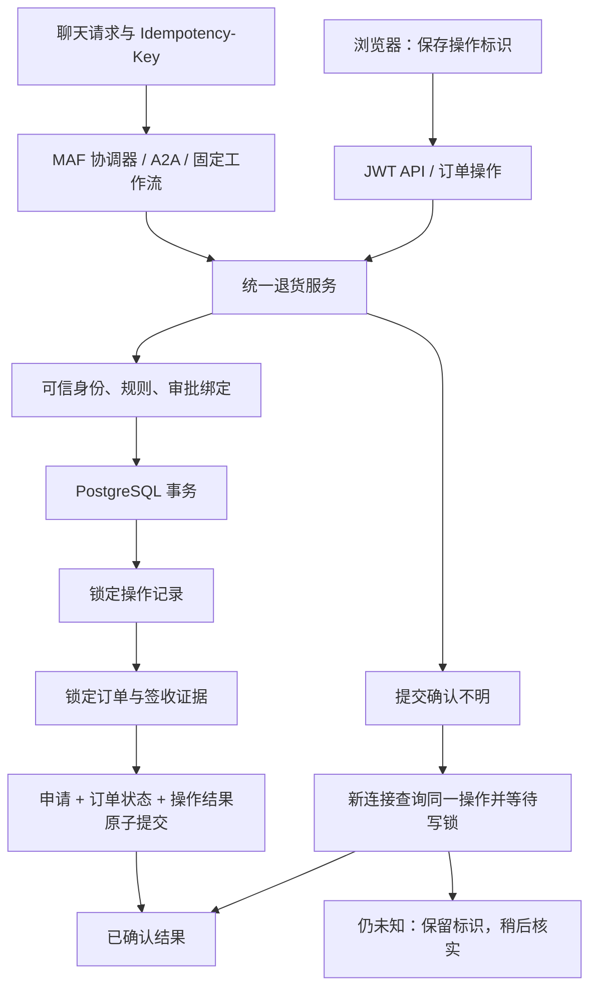

# 售后执行与恢复架构

本分支在上游六智能体平台上升级 Python 退货申请链路。MAF 仍负责工具调用和工作流，可信服务层负责授权、业务规则与持久结果。



## 身份、规则与审批

- 身份由认证上下文提供。客户端操作标识通过 `Idempotency-Key` 进入可信上下文；工具参数没有“跳过审批”或改身份的选项。
- 向专业智能体传递标识时使用经过服务认证的 A2A 请求头。没有显式标识的旧工具调用会由规范化参数生成稳定标识。
- 标识不是密码；任何结果查询仍按当前用户和当前订单归属校验。
- 签收后连续 30×24 小时内可申请，包含截止时刻。签收证据缺失、矛盾或时间非法时转人工核实。
- 开启 HITL 或金额超过阈值时必须审批。审批绑定用户、参数、订单证据、政策版本和有效期，执行前再次核对。

## 持久操作与事务

`after_sales_operations` 的主键为 `(user_id, operation_id)`，保存参数散列、政策版本、状态和结果。
同一标识不同参数返回 `OPERATION_CONFLICT`；成功结果重放原 `return_id`，不再重新申请。

操作预留先持久化，业务事务再按“操作记录 → 订单 → 状态证据”顺序加锁。
退货记录、订单状态、操作结果和工具审批的执行结果在同一个 PostgreSQL 事务中提交。
工作流审批的等待记录与操作等待状态一起持久化，拒绝也写入终态回执；工作流恢复完成标记
在流程结束时更新，中途退出由操作回执支持重放恢复。
数据库唯一索引进一步约束每个订单最多一份退货。

`NEEDS_REVIEW` 可在证据补齐后重新检查；`REJECTED` 是当前意图的终态，新的明确意图使用新标识。
`UNKNOWN` 描述调用方无法确认结果，不会覆盖数据库已经提交的成功结果。

操作事件保存已持久化的决策序号，未提交的暂时重试另有 `after_sales.retry` 日志。
工具审计区分技术异常与 `business_outcome` / `business_success`，不会把没有抛异常当作业务成功。

查询结果时获取共享行锁，等待在途事务完成，避免把旧的 `READY` 快照误当成“已回滚”。
提交前明确失败可有界重试；COMMIT 已发出后的异常先核实，无法核实时返回未知，不盲目重写。

## 工作流恢复

审批节点在首次业务写入之前。检查点保存用户、原因、审批绑定和操作标识。
恢复接口保存批准/拒绝决定，并持有 PostgreSQL session advisory lock；连接消失后锁自动释放，
后续请求可恢复 `processing` 记录，但必须沿用原决定。

即使进程在业务提交后、工作流完成记录之前退出，重放提交节点也会读取同一操作的成功结果。
最终防重依据是操作事务和唯一约束，不能只依赖“等待了足够长时间”。

## 超时与边界

准备阶段最多 3 次尝试，确认未提交的写入最多 3 次尝试，共享 10 秒应用预算；确认也受剩余预算约束。
这里的“尝试”不是 SQL 语句数量。取消会停止新增尝试，但不承诺远端在途工作瞬间停止。

本实现只覆盖同一 PostgreSQL 内的退货申请，不能推广为支付、邮件或物流系统的跨系统恰好一次保证。
未来接入外部副作用需要供应商幂等键、outbox 和对账。真实模型质量与跨智能体总成本未在本轮测量。

## 升级已有数据库

```bash
uv run --project agents/python --no-sync python scripts/migrate_db.py
```

迁移可重复执行，不清空数据。发现已有重复退货会停止，要求人工检查，不能通过删除数据掩盖冲突。
新库初始化 SQL 与增量迁移由测试检查一致性。

关键实现见 `shared/after_sales/`、`shared/hitl.py`、`workflows/return_replace.py`；验证见
[故障测试](../agents/python/tests/test_after_sales_recovery.py)和[对照结果](evaluation/after-sales-results.json)。
