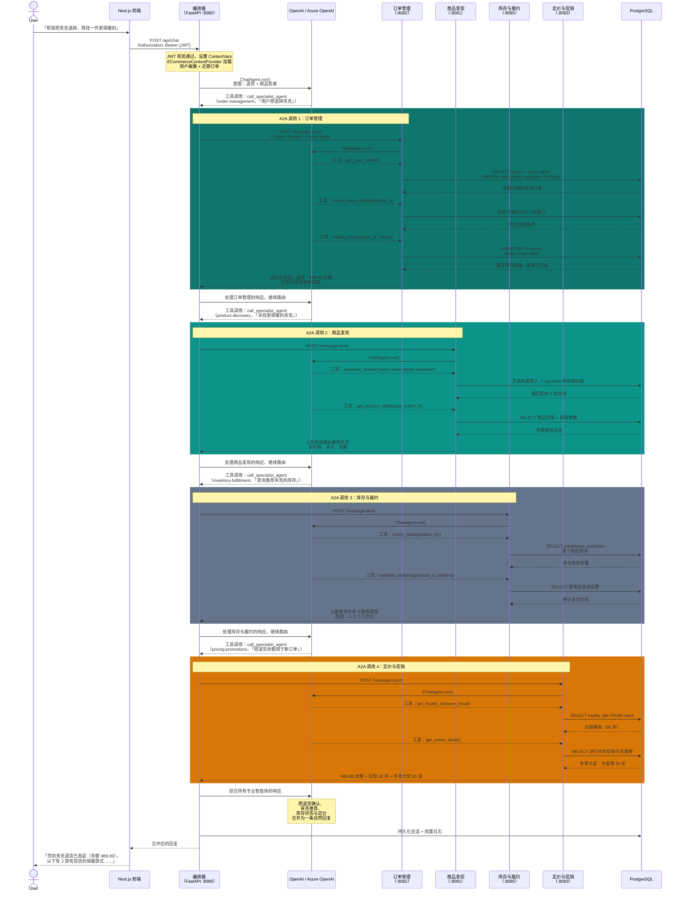
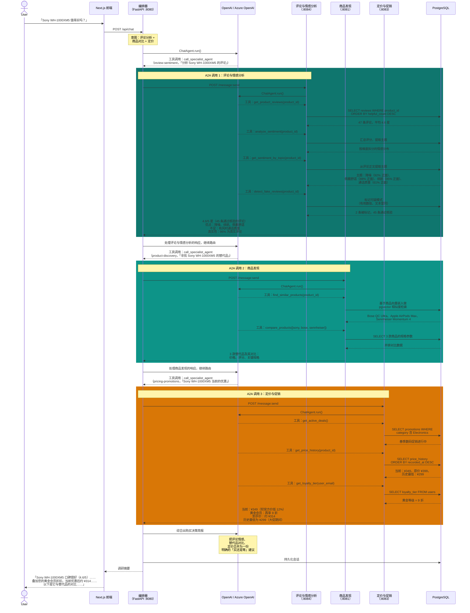
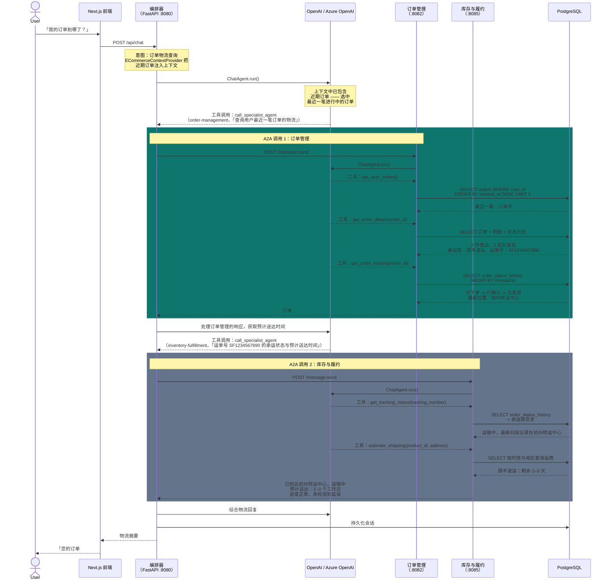
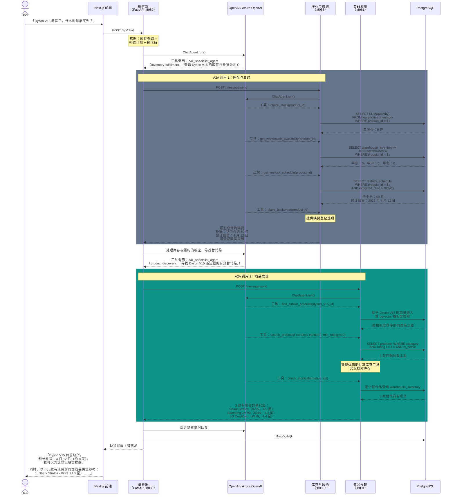
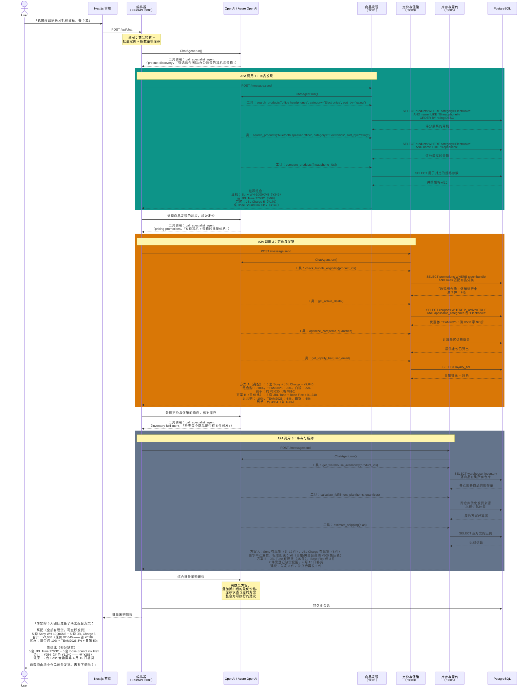

# 智能体协作流程

可靠电商多智能体平台中五个多智能体协作场景的详细时序图。每个流程都展示了编排器如何识别意图、通过 A2A 协议路由到多个专业智能体，并综合出统一的回复。

---

## 流程 1：退货与换购

**用户**：「帮我把夹克退掉，再找一件更保暖的」

该流程横跨四个智能体：订单管理检查退货资格并发起退货，商品发现寻找更保暖的替代品，库存确认现货，定价负责抵扣退货余额。

---

## 流程 2：购买前调研

**用户**：「Sony WH-1000XM5 值得买吗？」

该调研流程会调用评论与情感分析做口碑分析、商品发现找替代品、定价与促销查当前优惠 —— 最终给用户一份完整的购买决策简报。

---

## 流程 3：我的订单到哪了

**用户**：「我的订单到哪了？」

一个聚焦的两智能体流程：订单管理取出订单详情与物流轨迹，随后库存与履约查询承运商的实时状态与预计送达时间。

---

## 流程 4：缺货提醒

**用户**：「Dyson V15 缺货了，什么时候能买到？」

库存与履约检查库存量与补货计划，如果等待时间过长，商品发现会找出有现货的替代品。

---

## 流程 5：批量采购优化

**用户**：「我要给团队买耳机和音箱，各 5 套」

商品发现筛选候选，定价计算批量折扣与可用优惠券，库存确认所请求数量在各仓库的实际可发情况。

---

## 流程小结

| 流程 | 涉及智能体 | 关键模式 |
|------|----------------|-------------|
| **退货与换购** | 订单管理 -> 商品发现 -> 库存 -> 定价 | 顺序链：先执行操作（退货），再检索、再核对、最后优化 |
| **购买前调研** | 评论与情感分析 -> 商品发现 -> 定价 | 并行调研：汇集口碑、替代品与优惠 |
| **我的订单到哪了** | 订单管理 -> 库存与履约 | 聚焦式：先取订单数据，再取承运与送达状态 |
| **缺货提醒** | 库存与履约 -> 商品发现 | 兜底方案：先查库存，不可得时给出替代品 |
| **批量采购** | 商品发现 -> 定价 -> 库存 | 完整流水线：筛选、价格优化、履约核对 |

### 各流程共有的模式

- **上下文注入**：每个智能体在处理前都会通过 `ECommerceContextProvider` 拿到用户画像与近期订单。这让个性化（会员等级、购买历史）成为可能，而无需用户重复说明。
- **共享工具**：智能体可以调用主领域之外的工具。商品发现会调用 `check_stock()`（共享库存工具）以避免推荐缺货商品，从而减少不必要的 A2A 往返。
- **顺序 A2A**：编排器一次只调用一个专业智能体，每次响应都会影响下一次调用的消息。这是刻意的 —— 后面的智能体需要前面结果的上下文（例如定价需要先知道推荐了哪些商品）。
- **LLM 综合**：编排器的 LLM 不只是拼接专业智能体的回复，而是把它们综合成一条自然、连贯、结构清晰且带明确下一步动作的消息。
- **身份传递**：用户身份通过每次 A2A 调用上的 `X-User-Email` 与 `X-User-Role` 请求头传递，随后写入 ContextVars。每个工具查询都按用户过滤 —— 客户之间不存在数据泄露。

---

## 相关内容

- [`docs/architecture.md`](architecture.md) —— 系统总览、A2A 协议、编排器路由
- [`docs/maf-best-practices.md`](maf-best-practices.md) —— 编排模式（顺序、并发、处理权交接、人工参与）
- [`docs/adding-an-agent.md`](adding-an-agent.md) —— 如何把新的专业智能体加入路由表
- [`docs/mcp-integration.md`](mcp-integration.md) —— 把 MCP 作为专业智能体工具的另一种数据层
- [项目 README](../README.md)
