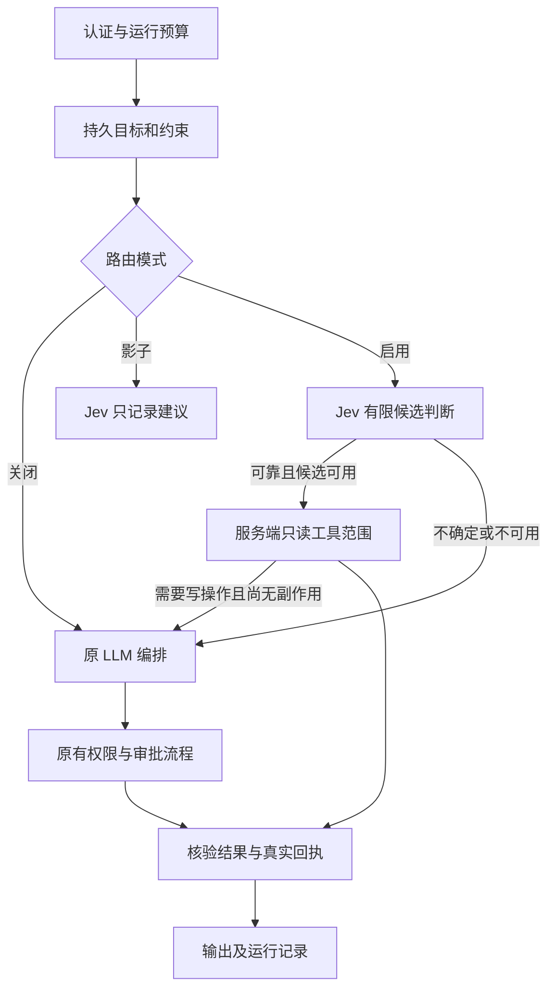

# 模型分工、预算与可靠执行升级

本次升级保持 Python／MAF／PostgreSQL／Redis／Next.js 架构。新增能力默认关闭或显式调用，原有售后审批与原子回执继续生效。

## 模型分工与累计额度

| 提供方 | 模型与用途 | 本次活动累计上限 |
|---|---|---:|
| DeepSeek | `deepseek-flash`，常规执行，关闭思考 | 50 元 |
| Moonshot | `kimi-k3`，复杂规划，`reasoning_effort=high` | 20 元，最多 8 次尝试 |
| TypeSafe | `jev-1.13.0`，有限候选专业路由 | 1 美元，最多 100 次尝试 |

额度包括探测、失败、重试和复测，不随服务重启重置。`shared.campaign_budget` 用固定文件锁与原子替换保存账本。请求发出前预留上界，响应后根据已知用量保守结算；未知结果继续占用预留，不能按免费处理。达到 85% 后停止评测扩样。认证、余额或配置错误会停止对应提供方，不继续循环调用。

价格来自 `agents/python/config/model-prices.json`，必须显式加载并在有效期内使用。它是保守费用上界：DeepSeek 不假定低峰或缓存优惠；K3 将可能的缓存写入计入输入上界。它不是提供方账单。

该账本适用于本机多进程或支持 POSIX 文件锁的同一共享目录。多个容器必须显式挂载同一个账本目录；不能各用容器私有路径，也不能声称已实现多主机数据库预算协调。

## 主请求链



`decision-router` 通过现有模式注册表进入阻塞与 SSE 接口。`DECISION_ROUTING_MODE` 支持 `off`、`shadow`、`active`，默认 `off`。`DECISION_MIN_PROBABILITY` 默认 1.0，正式阈值必须从开发样本确定，不能把 Jev 的 confidence 当作正确率。

只读范围由专业服务中间件强制检查，而非相信模型对风险的判断。若它拦截了写意图，聊天可以回到原审批路径；任务执行器则保持未完成，不能用先前一次成功查询冒充写操作完成。网络结果未知时不走这条回退。

## 上下文、任务与记忆

- `shared.context_pipeline` 采用确定性的收集、选择与结构化。关键目标、约束、未解决问题、证据及回执保留；超限时要求拆分任务，不静默丢约束。
- 会话关键状态保存在 `conversation_contexts`，按所有者隔离并在短事务内更新，避免历史超过 50 条后丢失早期约束。
- `agent_tasks` 保存任务版本、规划、结果及回执历史。先原子认领，再在事务外调用模型或工具；已完成步骤不重复执行。
- 只读回执默认有效 300 秒。过期回执及依赖它的结果重新核实，旧回执进入历史，不被覆盖删除。
- K3 只能生成最多 8 步的计划，依赖必须形成拓扑顺序，目标和约束不可改写。最多两次规划；计划结构合法不等于业务正确，步骤还需实际工具证据。
- 模型写入的记忆标记为 `model_proposal`，需要用户确认才能被长期检索；原有未核实记忆保留但不自动当作事实。

新增接口均复用已有用户认证：

| 接口 | 行为 |
|---|---|
| `POST /api/tasks` | 创建目标与约束 |
| `GET /api/tasks/{id}` | 读取自己的任务 |
| `POST /api/tasks/{id}/plan` | 携带 revision 认领规划，调用 K3 |
| `POST /api/tasks/{id}/next` | 携带 revision 执行下一个只读步骤 |
| `POST /api/tasks/{id}/recover` | 显式恢复中断的只读步骤，不适用于售后写操作 |
| `POST /api/memories/{id}/confirm` | 用户确认自己的记忆 |

## 配置与迁移

在 WSL/Linux 内使用现有 uv 环境。凭据从运行环境读取，或由评测入口通过关闭回显的交互输入获取；不要写入代码、命令行参数或提交的配置。

关键配置：`LLM_PROVIDER=deepseek`、`DEEPSEEK_API_KEY`、`MOONSHOT_API_KEY`、`TYPESAFE_API_KEY`、`MODEL_PRICES_JSON`、`CAMPAIGN_BUDGET_PATH`。`APP_ENV_FILE=/dev/null` 可禁止加载仓库私人环境文件。

`EMBEDDING_PROVIDER` 与聊天模型分离。新提供方未配置嵌入时退回带 `retrieval_mode=lexical` 标记的词法结果，不把聊天密钥送到嵌入接口。未知模型的旧美元估算返回 None；新模型费用由本币账本记录。

已有数据库使用增量迁移，不能通过重建数据卷升级：

```bash
# DATABASE_URL 必须由运行环境显式提供。
uv run --project agents/python --no-sync python scripts/migrate_upgrade.py
```

迁移文件为 `docker/postgres/migrations/002_task_state.sql`；新库初始化也包含相同结构。迁移没有删除用户、订单、审批或历史记录。

## 可靠性与观测

- SSE 同时限制帧数和缓冲字节，兼容 `put` 与 `put_nowait`，正确编码多行文本和卡片。
- `VERIFIED_OUTPUT_ONLY=true` 配合 `GROUNDING_MODE=enforce`，等待最终核验后输出，不能撤回已发出的未核验内容。
- 普通 POST 不自动重试；只有显式证明安全的请求或只读服务调用才可使用退避重试。断流不意味着业务未执行。
- 订单事实核验按用户隔离。合法 UUID 不再被银行卡／SSN 脱敏误伤。
- 可信运行标识及截止时间跨 A2A 传播；默认每次运行最多 24 次模型调用，所有尝试仍服从累计费用上限。
- 新增模型尝试数、耗时与本币费用上界指标，标签不含用户身份、原始问题或推理文本。

可选观测后端使用 Collector、Prometheus 与本地轮转日志：

```bash
docker compose --env-file /dev/null -f docker-compose.yml -f docker-compose.observability.yml config --quiet
```

指标按 provider 和 currency 分组，不能直接把人民币与美元相加。网络地址默认仅绑定 localhost；此次工作不包含公网发布或云部署。

## 复现与结果边界

```bash
cd agents/python
uv run --offline --no-sync python -m evals.upgrade_evaluation
```

评测入口使用独立 PostgreSQL 容器、合成用户与商品，并启动独立端口的真实服务。它保留已有尝试，避免重启重花预算。结果写入 `.local/upgrade-evaluation`；不要删除账本来重新获得额度。

数据集分为 20 条开发任务、30 条留出路由任务、12 条 HTTP 任务与 4 条复杂规划任务。数据为助手编写的合成案例，不是独立人工标注的真实用户样本。四组配置分别为原上下文／GSSC 与原路由／Jev 的组合。

程序契约通过率检查工具和指定内容，不等于完整语义成功率；同一目标可能存在其他合法工具路径。单次顺序运行的延迟分位数仅作描述，不能外推生产容量或声称统计显著收益。复杂任务的计划校验、实际执行和恢复分别报告。

本轮结果见 [真实评测记录](evaluation/upgrade-results.json) 与 [实施验证报告](upgrade-verification.md)。默认保持 Jev 关闭，现有小样本不足以支持自动扩大真实流量。
