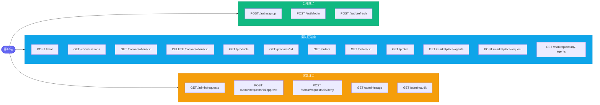

# API 参考

可靠电商多智能体平台通过编排器（orchestrator）服务（FastAPI，端口 8080）对外暴露 20 个 REST 端点。所有端点均以 `/api/` 为前缀。

## 路由总览



## 认证

所有需要认证的端点都必须在 `Authorization` 请求头中携带 `Bearer` 令牌：

```
Authorization: Bearer <access_token>
```

令牌是使用 `JWT_SECRET` 签名的 JWT（PyJWT + bcrypt）。访问令牌包含 `sub`（邮箱）、`role`、`user_id` 和 `type: "access"`；刷新令牌包含 `sub` 和 `type: "refresh"`。

管理员端点还会额外校验 `role == "admin"`，校验失败时返回 `403`。

---

## 认证（公开）

### POST /api/auth/signup

创建新的用户账号并返回令牌。

| 字段 | 取值 |
|-------|-------|
| 认证  | 公开 |

**请求体**

```json
{
  "email": "alice.johnson@gmail.com",
  "password": "securepassword",
  "name": "Alice Johnson"
}
```

**响应** `200`

```json
{
  "access_token": "eyJhbGciOi...",
  "refresh_token": "eyJhbGciOi...",
  "user": {
    "id": "550e8400-e29b-41d4-a716-446655440000",
    "email": "alice.johnson@gmail.com",
    "name": "Alice Johnson",
    "role": "customer",
    "loyalty_tier": "bronze",
    "total_spend": 0.0
  }
}
```

**错误**
- `409` 邮箱已被注册

---

### POST /api/auth/login

认证已有用户并返回令牌。

| 字段 | 取值 |
|-------|-------|
| 认证  | 公开 |

**请求体**

```json
{
  "email": "alice.johnson@gmail.com",
  "password": "securepassword"
}
```

**响应** `200`

```json
{
  "access_token": "eyJhbGciOi...",
  "refresh_token": "eyJhbGciOi...",
  "user": {
    "id": "550e8400-e29b-41d4-a716-446655440000",
    "email": "alice.johnson@gmail.com",
    "name": "Alice Johnson",
    "role": "customer",
    "loyalty_tier": "gold",
    "total_spend": 4200.0
  }
}
```

**错误**
- `401` 邮箱或密码无效
- `403` 账号已被停用

---

### POST /api/auth/refresh

用刷新令牌换取新的访问令牌。

| 字段 | 取值 |
|-------|-------|
| 认证  | 公开（请求体中需携带有效的刷新令牌） |

**请求体**

```json
{
  "refresh_token": "eyJhbGciOi..."
}
```

**响应** `200`

```json
{
  "access_token": "eyJhbGciOi..."
}
```

**错误**
- `401` 刷新令牌已过期 / 无效 / 类型错误
- `403` 账号已被停用

---

## 聊天

### POST /api/chat

向编排器智能体发送一条消息。编排器会按需路由到专业智能体（specialist agent），并返回汇总后的响应。

| 字段 | 取值 |
|-------|-------|
| 认证  | 需要 JWT |

**请求体**

```json
{
  "message": "What are the best noise-cancelling headphones under $350?",
  "conversation_id": null
}
```

`conversation_id` 为可选字段。省略或传入 `null` 即开始一个新会话；传入已有的 ID 则继续该会话（会加载最近 50 条消息作为上下文）。

**响应** `200`

```json
{
  "response": "I found several great options for noise-cancelling headphones under $350...",
  "conversation_id": "a1b2c3d4-e5f6-7890-abcd-ef1234567890",
  "agents_involved": ["orchestrator", "product-discovery", "pricing-promotions"]
}
```

**错误**
- `401` 令牌缺失或无效
- `404` 会话不存在（当提供了 `conversation_id` 但它不属于当前用户时）

---

## 会话

### GET /api/conversations

列出已认证用户的会话，按最近活动时间排序。

| 字段 | 取值 |
|-------|-------|
| 认证  | 需要 JWT |

**响应** `200`

```json
[
  {
    "id": "a1b2c3d4-e5f6-7890-abcd-ef1234567890",
    "title": "What are the best noise-cancelling headphones under $350?",
    "message_count": 4,
    "created_at": "2026-04-01T10:30:00+00:00",
    "last_message_at": "2026-04-01T10:35:22+00:00"
  }
]
```

最多返回 50 个活跃会话，已软删除的会话不计入其中。

---

### GET /api/conversations/{conversation_id}

获取单个会话及其完整的消息历史。

| 字段 | 取值 |
|-------|-------|
| 认证  | 需要 JWT |

**响应** `200`

```json
{
  "id": "a1b2c3d4-e5f6-7890-abcd-ef1234567890",
  "title": "What are the best noise-cancelling headphones under $350?",
  "created_at": "2026-04-01T10:30:00+00:00",
  "last_message_at": "2026-04-01T10:35:22+00:00",
  "messages": [
    {
      "id": "msg-uuid-1",
      "role": "user",
      "content": "What are the best noise-cancelling headphones under $350?",
      "agent_name": null,
      "agents_involved": [],
      "metadata": {},
      "tokens_in": 0,
      "tokens_out": 0,
      "created_at": "2026-04-01T10:30:00+00:00"
    },
    {
      "id": "msg-uuid-2",
      "role": "assistant",
      "content": "I found several great options...",
      "agent_name": "orchestrator",
      "agents_involved": ["orchestrator", "product-discovery"],
      "metadata": {},
      "tokens_in": 150,
      "tokens_out": 320,
      "created_at": "2026-04-01T10:30:05+00:00"
    }
  ]
}
```

**错误**
- `404` 会话不存在或不属于当前用户

---

### DELETE /api/conversations/{conversation_id}

软删除会话（将 `is_active` 置为 `FALSE`），消息仍保留在数据库中。

| 字段 | 取值 |
|-------|-------|
| 认证  | 需要 JWT |

**响应** `200`

```json
{
  "status": "deleted"
}
```

**错误**
- `404` 会话不存在或不属于当前用户

---

## 商品

### GET /api/products

浏览和搜索商品目录，支持筛选与排序。

| 字段 | 取值 |
|-------|-------|
| 认证  | 需要 JWT |

**查询参数**

| 参数        | 类型    | 默认值    | 说明 |
|-------------|---------|-----------|-------------|
| `category`  | string  | -         | 按分类筛选（Electronics、Clothing、Home、Sports、Books） |
| `min_price` | float   | -         | 最低价格筛选 |
| `max_price` | float   | -         | 最高价格筛选 |
| `search`    | string  | -         | 对商品名称与描述执行 ILIKE 搜索 |
| `sort`      | string  | `rating`  | 排序方式：`rating`、`price_asc`、`price_desc`、`newest`、`name` |
| `limit`     | int     | `50`      | 每页数量 |
| `offset`    | int     | `0`       | 分页偏移量 |

**响应** `200`

```json
{
  "products": [
    {
      "id": "prod-uuid-1",
      "name": "Sony WH-1000XM5",
      "description": "Premium wireless noise-cancelling headphones with 30-hour battery...",
      "category": "Electronics",
      "brand": "Sony",
      "price": 299.99,
      "original_price": 349.99,
      "image_url": "/images/products/sony-wh1000xm5.jpg",
      "rating": 4.7,
      "review_count": 12
    }
  ],
  "total": 50,
  "categories": ["Books", "Clothing", "Electronics", "Home", "Sports"]
}
```

在列表视图中，商品描述会被截断为 200 个字符。

---

### GET /api/products/{product_id}

获取商品的完整详情，包括规格参数、库存水平、评论以及评分分布。

| 字段 | 取值 |
|-------|-------|
| 认证  | 需要 JWT |

**响应** `200`

```json
{
  "id": "prod-uuid-1",
  "name": "Sony WH-1000XM5",
  "description": "Premium wireless noise-cancelling headphones with 30-hour battery life...",
  "category": "Electronics",
  "brand": "Sony",
  "price": 299.99,
  "original_price": 349.99,
  "image_url": "/images/products/sony-wh1000xm5.jpg",
  "rating": 4.7,
  "review_count": 12,
  "specs": {
    "type": "Over-ear",
    "battery": "30 hours",
    "noise_cancelling": true,
    "weight": "250g",
    "connectivity": "Bluetooth 5.2"
  },
  "in_stock": true,
  "total_stock": 145,
  "warehouses": [
    { "name": "East", "region": "east", "quantity": 50 },
    { "name": "Central", "region": "central", "quantity": 65 },
    { "name": "West", "region": "west", "quantity": 30 }
  ],
  "reviews": [
    {
      "id": "review-uuid-1",
      "rating": 5,
      "title": "Best headphones I've owned",
      "body": "The noise cancellation is incredible...",
      "verified": true,
      "reviewer": "Alice Johnson",
      "date": "2026-03-15T14:20:00+00:00"
    }
  ],
  "rating_distribution": {
    "1": 1,
    "2": 0,
    "3": 2,
    "4": 3,
    "5": 6
  }
}
```

**错误**
- `404` 商品不存在

---

## 订单

### GET /api/orders

列出已认证用户的订单，可按状态筛选。

| 字段 | 取值 |
|-------|-------|
| 认证  | 需要 JWT |

**查询参数**

| 参数      | 类型   | 默认值  | 说明 |
|-----------|--------|---------|-------------|
| `status`  | string | -       | 按状态筛选：placed、confirmed、shipped、out_for_delivery、delivered、cancelled、returned |
| `limit`   | int    | `20`    | 每页数量 |
| `offset`  | int    | `0`     | 分页偏移量 |

**响应** `200`

```json
{
  "orders": [
    {
      "id": "order-uuid-1",
      "status": "delivered",
      "total": 349.98,
      "carrier": "Express",
      "tracking": "EXP-12345-US",
      "item_count": 2,
      "date": "2026-03-20T09:15:00+00:00"
    }
  ],
  "total": 8
}
```

---

### GET /api/orders/{order_id}

获取订单的完整详情，包括订单项、状态历史、收货地址以及退货信息。

| 字段 | 取值 |
|-------|-------|
| 认证  | 需要 JWT |

**响应** `200`

```json
{
  "id": "order-uuid-1",
  "status": "delivered",
  "total": 349.98,
  "shipping_address": {
    "street": "123 Main St",
    "city": "New York",
    "state": "NY",
    "zip": "10001",
    "country": "US"
  },
  "carrier": "Express",
  "tracking": "EXP-12345-US",
  "coupon": "SAVE10",
  "discount": 35.0,
  "date": "2026-03-20T09:15:00+00:00",
  "items": [
    {
      "product_id": "prod-uuid-1",
      "name": "Sony WH-1000XM5",
      "category": "Electronics",
      "image_url": "/images/products/sony-wh1000xm5.jpg",
      "quantity": 1,
      "unit_price": 299.99,
      "subtotal": 299.99
    }
  ],
  "status_history": [
    {
      "status": "placed",
      "notes": "Order received",
      "location": null,
      "timestamp": "2026-03-20T09:15:00+00:00"
    },
    {
      "status": "delivered",
      "notes": "Delivered to front door",
      "location": "New York, NY",
      "timestamp": "2026-03-23T14:30:00+00:00"
    }
  ],
  "return": null
}
```

当存在退货时，`return` 字段的内容为：

```json
{
  "id": "return-uuid-1",
  "reason": "Defective product",
  "status": "refunded",
  "refund_method": "original_payment",
  "refund_amount": 299.99,
  "created_at": "2026-03-25T10:00:00+00:00",
  "resolved_at": "2026-03-28T16:00:00+00:00"
}
```

**错误**
- `404` 订单不存在或不属于当前用户

---

## 个人资料

### GET /api/profile

获取已认证用户的个人资料，包括会员等级权益与活动计数。

| 字段 | 取值 |
|-------|-------|
| 认证  | 需要 JWT |

**响应** `200`

```json
{
  "id": "user-uuid-1",
  "email": "alice.johnson@gmail.com",
  "name": "Alice Johnson",
  "role": "customer",
  "loyalty_tier": "gold",
  "total_spend": 4200.0,
  "member_since": "2025-12-01T00:00:00+00:00",
  "order_count": 15,
  "review_count": 8,
  "tier_benefits": {
    "discount_pct": 10.0,
    "free_shipping_threshold": 25.0,
    "priority_support": true
  }
}
```

**错误**
- `404` 用户不存在

---

## 智能体市场

### GET /api/marketplace/agents

列出市场中所有上架的活跃智能体。

| 字段 | 取值 |
|-------|-------|
| 认证  | 需要 JWT |

**响应** `200`

```json
[
  {
    "id": "agent-uuid-1",
    "name": "product-discovery",
    "display_name": "Product Discovery",
    "description": "Searches products by keyword, category, price range, and semantic similarity.",
    "category": "Shopping",
    "icon": "search",
    "status": "active",
    "version": "1.0",
    "capabilities": ["search", "recommend", "compare"],
    "requires_approval": true,
    "allowed_roles": ["power_user", "admin"]
  }
]
```

---

### POST /api/marketplace/request

为指定智能体提交访问申请。

| 字段 | 取值 |
|-------|-------|
| 认证  | 需要 JWT |

**请求体**

```json
{
  "agent_name": "product-discovery",
  "role_requested": "power_user",
  "use_case": "I need advanced product search capabilities for comparison shopping."
}
```

**响应** `200`（待审批）

```json
{
  "id": "req-uuid-1",
  "agent_name": "product-discovery",
  "status": "pending",
  "message": "Your request has been submitted and is pending admin approval."
}
```

**响应** `200`（自动批准，当 `requires_approval = false` 时）

```json
{
  "id": "req-uuid-1",
  "agent_name": "product-discovery",
  "status": "approved",
  "message": "Access granted automatically — no approval required."
}
```

**错误**
- `404` 智能体不存在
- `409` 该智能体已存在待处理的申请
- `409` 用户已拥有该智能体的访问权限

---

### GET /api/marketplace/my-agents

列出已认证用户已获授权访问的智能体。

| 字段 | 取值 |
|-------|-------|
| 认证  | 需要 JWT |

**响应** `200`

```json
[
  {
    "agent_name": "product-discovery",
    "display_name": "Product Discovery",
    "description": "Searches products by keyword, category, price range, and semantic similarity.",
    "category": "Shopping",
    "icon": "search",
    "role": "power_user",
    "granted_at": "2026-03-01T12:00:00+00:00"
  }
]
```

---

## 管理员

所有管理员端点都要求 JWT 中携带 `role: "admin"`。非管理员用户会收到 `403 Admin access required`。

### GET /api/admin/requests

列出所有用户中待处理的访问申请。

| 字段 | 取值 |
|-------|-------|
| 认证  | 仅管理员 |

**响应** `200`

```json
[
  {
    "id": "req-uuid-1",
    "agent_name": "product-discovery",
    "role_requested": "power_user",
    "use_case": "I need advanced product search capabilities.",
    "status": "pending",
    "created_at": "2026-04-01T08:00:00+00:00",
    "user_email": "bob.smith@gmail.com",
    "user_name": "Bob Smith",
    "user_role": "customer"
  }
]
```

---

### POST /api/admin/requests/{request_id}/approve

批准一条待处理的访问申请，并在同一事务中创建对应的 `agent_permissions` 记录。

| 字段 | 取值 |
|-------|-------|
| 认证  | 仅管理员 |

**请求体**

```json
{
  "admin_notes": "Approved for trial period."
}
```

`admin_notes` 为可选字段（默认为空字符串）。

**响应** `200`

```json
{
  "status": "approved",
  "request_id": "req-uuid-1"
}
```

**错误**
- `404` 申请不存在
- `409` 申请已被批准/拒绝

---

### POST /api/admin/requests/{request_id}/deny

拒绝一条待处理的访问申请。

| 字段 | 取值 |
|-------|-------|
| 认证  | 仅管理员 |

**请求体**

```json
{
  "admin_notes": "Insufficient justification."
}
```

**响应** `200`

```json
{
  "status": "denied",
  "request_id": "req-uuid-1"
}
```

**错误**
- `404` 申请不存在
- `409` 申请已被批准/拒绝

---

### GET /api/admin/usage

获取最近 30 天的汇总使用统计，包含按智能体拆分的明细以及 7 天的每日趋势。

| 字段 | 取值 |
|-------|-------|
| 认证  | 仅管理员 |

**响应** `200`

```json
{
  "period": "last_30_days",
  "overall": {
    "total_requests": 1250,
    "unique_users": 18,
    "total_tokens_in": 450000,
    "total_tokens_out": 680000,
    "avg_duration_ms": 2300,
    "total_tool_calls": 3400
  },
  "by_agent": [
    {
      "agent_name": "orchestrator",
      "request_count": 500,
      "unique_users": 18,
      "tokens_in": 180000,
      "tokens_out": 250000,
      "avg_duration_ms": 2100,
      "error_count": 5
    },
    {
      "agent_name": "product-discovery",
      "request_count": 320,
      "unique_users": 15,
      "tokens_in": 95000,
      "tokens_out": 150000,
      "avg_duration_ms": 1800,
      "error_count": 2
    }
  ],
  "daily_trend": [
    {
      "day": "2026-04-04",
      "request_count": 85,
      "unique_users": 12
    },
    {
      "day": "2026-04-03",
      "request_count": 92,
      "unique_users": 14
    }
  ]
}
```

---

### GET /api/admin/audit

从 `usage_logs` 获取详细的审计日志，并为每条记录关联对应的 `agent_execution_steps`。

| 字段 | 取值 |
|-------|-------|
| 认证  | 仅管理员 |

**查询参数**

| 参数 | 类型 | 默认值 | 说明 |
|-----------|------|---------|-------------|
| `limit`   | int  | `50`    | 每页数量（最大 200） |
| `offset`  | int  | `0`     | 分页偏移量 |

**响应** `200`

```json
{
  "entries": [
    {
      "id": "log-uuid-1",
      "agent_name": "orchestrator",
      "user_email": "alice.johnson@gmail.com",
      "user_name": "Alice Johnson",
      "input_summary": "What are the best headphones?",
      "tokens_in": 150,
      "tokens_out": 420,
      "tool_calls_count": 2,
      "duration_ms": 2450,
      "status": "success",
      "error_message": null,
      "trace_id": "4bf92f3577b34da6a3ce929d0e0e4736",
      "created_at": "2026-04-04T10:15:00+00:00",
      "steps": [
        {
          "step_index": 0,
          "tool_name": "call_specialist_agent",
          "tool_input": { "agent_name": "product-discovery" },
          "tool_output": { "result": "Found 3 matching products..." },
          "status": "success",
          "duration_ms": 1200
        }
      ]
    }
  ],
  "total": 1250,
  "limit": 50,
  "offset": 0
}
```

`trace_id` 字段与 Jaeger 中的 OpenTelemetry 追踪（trace）相关联，因此可以从审计日志下钻到分布式追踪。

---

## 错误响应格式

所有错误响应都遵循 FastAPI 的标准格式：

```json
{
  "detail": "Description of the error"
}
```

| 状态码      | 含义 |
|-------------|---------|
| `401`       | JWT 缺失、已过期或无效 |
| `403`       | 权限不足（例如非管理员访问管理员路由） |
| `404`       | 资源不存在或不属于当前认证用户 |
| `409`       | 冲突（邮箱重复、访问申请重复、申请已处理） |

---

## 相关文档

- [`docs/architecture.md`](architecture.md) — 请求如何从浏览器经编排器流向专业智能体
- [`docs/database-schema.md`](database-schema.md) — 这些端点读写的数据库表
- [`docs/deployment.md`](deployment.md) — 如何启动整个技术栈，使这些端点可被访问
- [`docs/frontend.md`](frontend.md) — Next.js 客户端如何调用这些端点
- [项目 README](../README.md)
