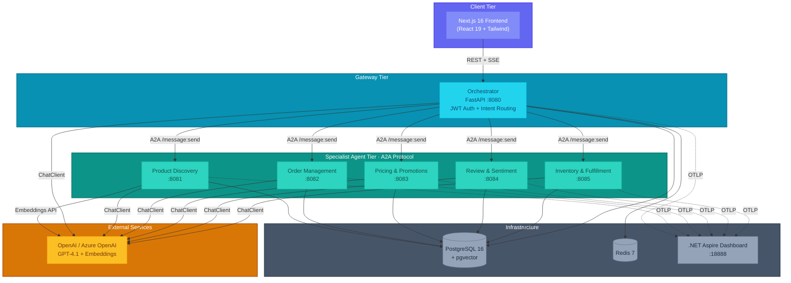
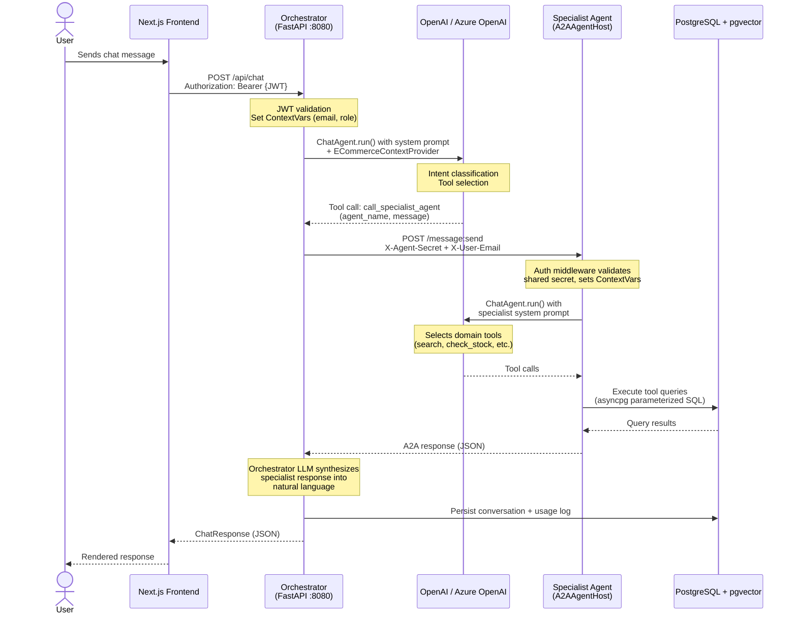
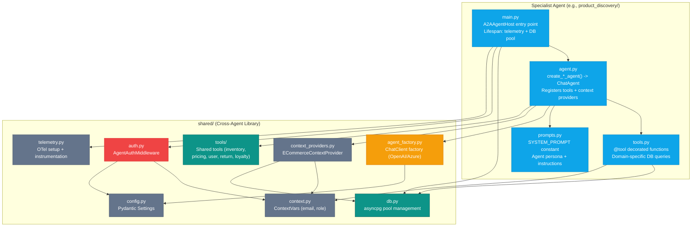
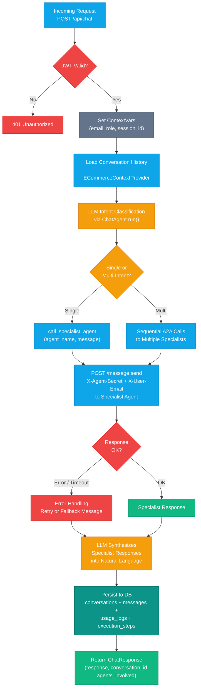
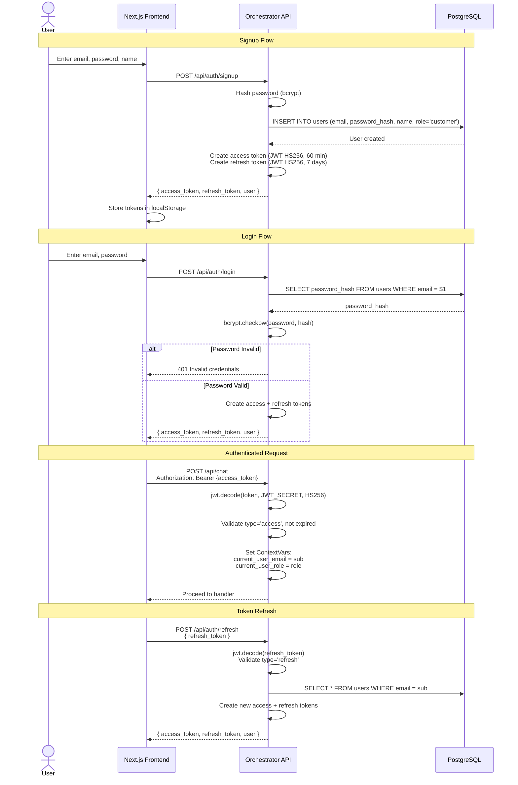
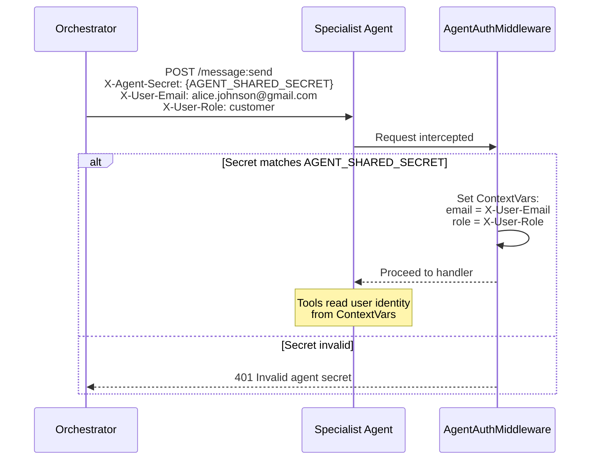

# Architecture

E-Commerce Agents is a multi-agent e-commerce platform built on Microsoft Agent Framework (MAF). Six specialized agents collaborate via A2A protocol, orchestrated by a central Customer Support agent that classifies user intent and routes requests to the right specialist.

---

## 1. System Overview

The platform comprises three tiers: a Next.js frontend, a FastAPI orchestrator gateway backed by five specialist agents, and shared infrastructure (PostgreSQL + pgvector, Redis, .NET Aspire Dashboard).



---

## 2. Agent Communication Pattern

All user requests enter through the Orchestrator. The Orchestrator classifies intent, calls one or more specialist agents via A2A, and synthesizes a unified response.



---

## 3. Agent Architecture

Every specialist agent follows a consistent four-file structure. The Orchestrator is the only agent that uses FastAPI directly -- all specialists use `A2AAgentHost` from the MAF A2A library.



### Agent Inventory

| Agent | Port | Module | Key Tools |
|-------|------|--------|-----------|
| **Orchestrator** | 8080 | `orchestrator/` | `call_specialist_agent` (A2A router) |
| **Product Discovery** | 8081 | `product_discovery/` | `search_products`, `semantic_search`, `compare_products`, `find_similar_products`, `get_trending_products` |
| **Order Management** | 8082 | `order_management/` | `get_user_orders`, `get_order_details`, `get_order_tracking`, `cancel_order`, `modify_order`, `check_return_eligibility`, `initiate_return`, `process_refund` |
| **Pricing & Promotions** | 8083 | `pricing_promotions/` | `validate_coupon`, `optimize_cart`, `get_active_deals`, `check_bundle_eligibility`, `get_loyalty_tier`, `calculate_loyalty_discount` |
| **Review & Sentiment** | 8084 | `review_sentiment/` | `get_product_reviews`, `analyze_sentiment`, `get_sentiment_by_topic`, `get_sentiment_trend`, `detect_fake_reviews`, `compare_product_reviews` |
| **Inventory & Fulfillment** | 8085 | `inventory_fulfillment/` | `check_stock`, `get_warehouse_availability`, `get_restock_schedule`, `estimate_shipping`, `compare_carriers`, `calculate_fulfillment_plan`, `place_backorder` |

---

## 4. Orchestrator Pattern

The Orchestrator is the single entry point for all user traffic. It handles authentication, intent classification via LLM, agent routing via A2A, and conversation persistence.



---

## 5. Auth Flow

E-Commerce Agents uses self-contained JWT authentication (PyJWT + bcrypt). There is no external identity provider. Inter-agent calls use a shared secret instead of JWT.

### User Authentication



### Inter-Agent Authentication



### RBAC Roles

| Role | Access Level | Description |
|------|-------------|-------------|
| `customer` | Default | Standard shopping, orders, reviews |
| `power_user` | Extended | Access to advanced agent features via marketplace |
| `seller` | Seller tools | Draft review responses, view sentiment reports |
| `admin` | Full | Approve access requests, manage agent catalog, all operations |

For the full security architecture — threat model, guardrails middleware stack, identity-spoof detection, SQL ownership filters, and production hardening checklist — see [`docs/security-guide.md`](security-guide.md).

---

## 6. Data Flow

End-to-end data flow showing how a user request traverses the system, from initial HTTP request through agent processing to database persistence.

```mermaid
flowchart LR
    subgraph Input["Request"]
        USER_MSG["User Message<br/>'Find me wireless headphones<br/>under $200 with good reviews'"]
    end

    subgraph Auth["Authentication"]
        JWT_CHECK["JWT Decode<br/>HS256 Validation"]
        CTX_SET["ContextVars Set<br/>email + role"]
    end

    subgraph Orchestration["Orchestration Layer"]
        CTX_LOAD["Context Loaded<br/>User profile + recent orders<br/>(ECommerceContextProvider)"]
        LLM_ROUTE["LLM Classifies Intent<br/>-> product-discovery<br/>-> review-sentiment"]
    end

    subgraph A2A_1["Product Discovery Agent"]
        PD_LLM["ChatAgent selects tools"]
        PD_SEARCH["semantic_search()<br/>Embed query -> pgvector"]
        PD_FILTER["search_products()<br/>category + price filter"]
        PD_STOCK["check_stock()<br/>Cross-check inventory"]
    end

    subgraph A2A_2["Review & Sentiment Agent"]
        RS_LLM["ChatAgent selects tools"]
        RS_REVIEWS["get_product_reviews()"]
        RS_SENT["analyze_sentiment()<br/>Rating breakdown + themes"]
    end

    subgraph Synthesis["Response Synthesis"]
        COMBINE["Orchestrator LLM combines:<br/>- Product results<br/>- Stock status<br/>- Review summaries<br/>into natural language"]
    end

    subgraph Persist["Persistence"]
        CONV["conversations table"]
        MSG["messages table<br/>(user + assistant)"]
        USAGE["usage_logs table<br/>+ execution_steps"]
    end

    subgraph Output["Response"]
        RESP["ChatResponse<br/>Products + reviews + stock<br/>agents_involved: [product-discovery,<br/>review-sentiment]"]
    end

    USER_MSG --> JWT_CHECK
    JWT_CHECK --> CTX_SET
    CTX_SET --> CTX_LOAD
    CTX_LOAD --> LLM_ROUTE

    LLM_ROUTE -->|"A2A call 1"| PD_LLM
    PD_LLM --> PD_SEARCH
    PD_LLM --> PD_FILTER
    PD_LLM --> PD_STOCK

    LLM_ROUTE -->|"A2A call 2"| RS_LLM
    RS_LLM --> RS_REVIEWS
    RS_LLM --> RS_SENT

    PD_SEARCH --> COMBINE
    PD_FILTER --> COMBINE
    PD_STOCK --> COMBINE
    RS_REVIEWS --> COMBINE
    RS_SENT --> COMBINE

    COMBINE --> CONV
    COMBINE --> MSG
    COMBINE --> USAGE
    COMBINE --> RESP

    style USER_MSG fill:#0ea5e9,stroke:#0284c7,color:#fff
    style JWT_CHECK fill:#ef4444,stroke:#dc2626,color:#fff
    style CTX_SET fill:#64748b,stroke:#475569,color:#fff
    style CTX_LOAD fill:#0ea5e9,stroke:#0284c7,color:#fff
    style LLM_ROUTE fill:#f59e0b,stroke:#d97706,color:#fff
    style PD_LLM fill:#f59e0b,stroke:#d97706,color:#fff
    style PD_SEARCH fill:#0ea5e9,stroke:#0284c7,color:#fff
    style PD_FILTER fill:#0ea5e9,stroke:#0284c7,color:#fff
    style PD_STOCK fill:#0ea5e9,stroke:#0284c7,color:#fff
    style RS_LLM fill:#f59e0b,stroke:#d97706,color:#fff
    style RS_REVIEWS fill:#0ea5e9,stroke:#0284c7,color:#fff
    style RS_SENT fill:#0ea5e9,stroke:#0284c7,color:#fff
    style COMBINE fill:#f59e0b,stroke:#d97706,color:#fff
    style CONV fill:#0d9488,stroke:#115e59,color:#fff
    style MSG fill:#0d9488,stroke:#115e59,color:#fff
    style USAGE fill:#0d9488,stroke:#115e59,color:#fff
    style RESP fill:#10b981,stroke:#059669,color:#fff
```



---

## 7. Technology Decisions

| Decision | Choice | Rationale |
|----------|--------|-----------|
| **Agent Framework** | Microsoft Agent Framework (MAF) Python SDK | First-class `ChatAgent` abstraction with `@tool` decorators, `ContextProvider`, and built-in A2A support. Avoids hand-rolling function-calling loops. |
| **Inter-Agent Protocol** | A2A via `agent-framework-a2a` | Standard protocol for agent-to-agent communication. Each specialist exposes `/message:send`. Decoupled from transport -- could swap HTTP for gRPC later. |
| **LLM Provider** | OpenAI / Azure OpenAI (configurable) | Single `ChatClient` interface via MAF. Swap with `LLM_PROVIDER` env var. Azure for production (managed identity, RBAC); OpenAI for local dev — or any OpenAI-compatible endpoint (Ollama, LM Studio, vLLM, OpenRouter) via `LLM_BASE_URL` for a fully local, zero-cost dev loop. |
| **Database** | PostgreSQL 16 + pgvector | Single database for relational data and vector embeddings. `text-embedding-3-small` (1536 dims) for semantic product search. IVFFlat index for fast cosine similarity. |
| **Web Framework** | FastAPI (orchestrator) + Starlette (specialists) | FastAPI for the orchestrator because it needs REST endpoints (auth, chat, marketplace, admin). Specialists use the lighter `A2AAgentHost` which wraps Starlette. |
| **Auth** | Self-contained JWT (HS256) + bcrypt | No external IdP dependency for the demo. Access tokens (60 min) + refresh tokens (7 days). Inter-agent auth via shared secret header. |
| **User Context** | Python ContextVars | Request-scoped state (email, role) set by auth middleware, read by any `@tool` function. No need to pass user info through function parameters. |
| **DB Access** | asyncpg (raw SQL) | Maximum control over queries. No ORM overhead. Parameterized `$1, $2` syntax prevents SQL injection. Connection pool (5-20) per agent. |
| **Telemetry** | OpenTelemetry -> .NET Aspire Dashboard | Auto-instrumented: httpx (LLM + A2A calls), asyncpg (DB queries), FastAPI/Starlette (HTTP). Custom spans for A2A calls and tool execution. All correlate via trace_id. |
| **Cache** | Redis 7 | Session data and conversation state caching. Alpine image for minimal footprint. |
| **Frontend** | Next.js 16 + React 19 + Tailwind + shadcn/ui | Server Components by default, `pnpm` for package management. Minimal client-side JS. |
| **Containerization** | Docker Compose + multi-target Dockerfile | All 6 agents share one Dockerfile with `ARG AGENT_NAME`. Each agent is a separate service with its own port. Single `docker compose up --build` to start everything. |
| **Package Management** | `uv` (Python) + `pnpm` (Node) | `uv` for fast dependency resolution and virtual environment management. `pnpm` for disk-efficient node_modules. |

---

## 8. A2A Protocol

All inter-agent communication uses the A2A (Agent-to-Agent) protocol. The orchestrator calls each specialist via an HTTP POST to `/message:send`. There is no message broker or event bus — calls are synchronous HTTP within the Docker network.

### Endpoint

```
POST http://{agent-host}:{port}/message:send
```

Each specialist registers this endpoint automatically via `A2AAgentHost` from `agent-framework-a2a`. The host, port, and service name come from the `AGENT_REGISTRY` env var, which the orchestrator reads at startup.

### Request format

```json
{
  "message": {
    "parts": [
      { "type": "text", "text": "Find wireless headphones under $200" }
    ]
  },
  "history": [
    { "role": "user", "content": "What headphones do you have?" },
    { "role": "assistant", "content": "We have several options..." }
  ]
}
```

The orchestrator forwards the last 10 conversation turns (each truncated to 500 characters) in `history`. This gives specialists enough context for follow-up questions without unbounded payload growth.

### Authentication headers

| Header | Value | Purpose |
|--------|-------|---------|
| `X-Agent-Secret` | `AGENT_SHARED_SECRET` env var | Validates the caller is a trusted orchestrator; rejected with 401 if missing or wrong |
| `X-User-Email` | e.g. `alice@example.com` | Propagates user identity for per-user data scoping in tool queries |
| `X-User-Role` | `customer`, `seller`, `admin` | Propagates RBAC role for permission checks inside `@tool` functions |

`AgentAuthMiddleware` in `shared/auth.py` validates the secret and sets ContextVars (`current_user_email`, `current_user_role`) that every `@tool` function reads directly — no need to thread user identity through function parameters.

### Response

The specialist returns its full agent response as JSON. The orchestrator passes this to its own LLM for synthesis into the final natural-language reply.

### Why synchronous HTTP?

The platform uses synchronous A2A calls (one specialist at a time) rather than parallel fan-out for two reasons: each agent turn is fast enough that sequential calls stay well within acceptable latency, and later specialists often need context from earlier results (Pricing needs to know which products were recommended before it can optimize the cart).

For the full sequence diagram showing JWT validation, context loading, and A2A call flow, see [§2. Agent Communication Pattern](#2-agent-communication-pattern).

## Related

- [`docs/agent-flows.md`](agent-flows.md) — five multi-agent collaboration sequence diagrams
- [`docs/security-guide.md`](security-guide.md) — threat model, guardrails, full auth hardening checklist
- [`docs/maf-best-practices.md`](maf-best-practices.md) — MAF @tool, middleware, and orchestration patterns
- [`docs/adding-an-agent.md`](adding-an-agent.md) — step-by-step guide to adding a specialist agent
- [Project README](../README.md)
