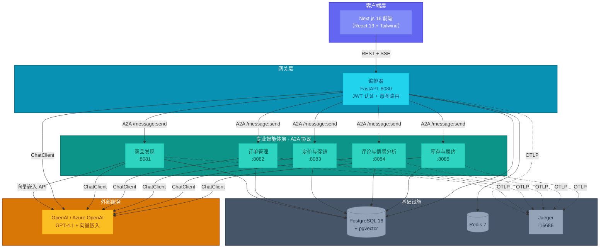
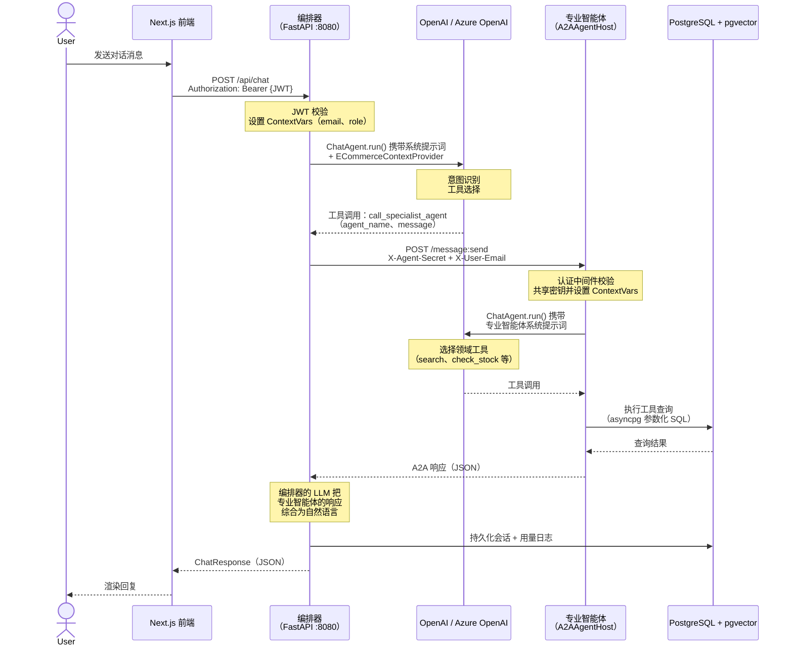
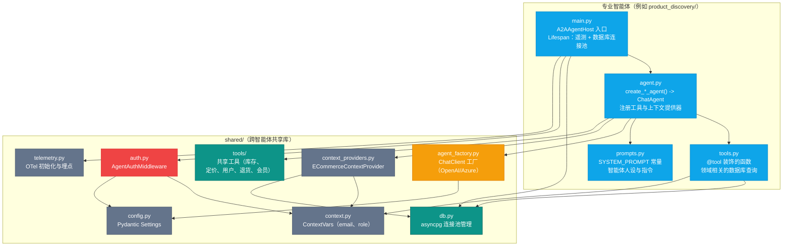
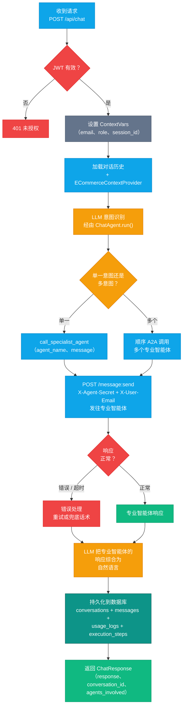
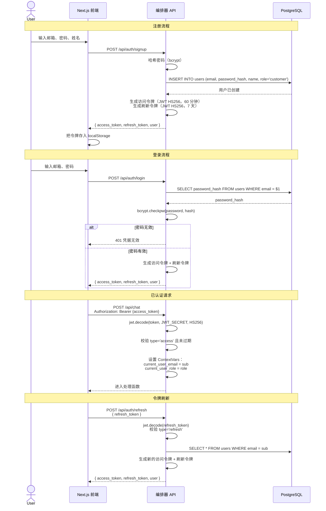
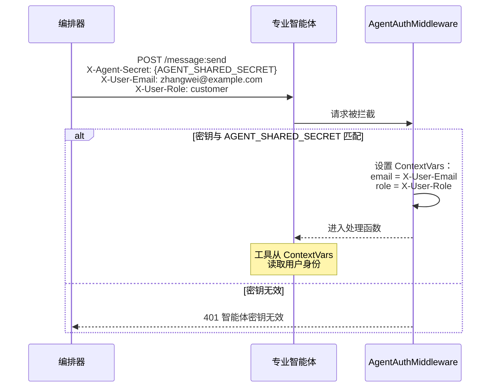
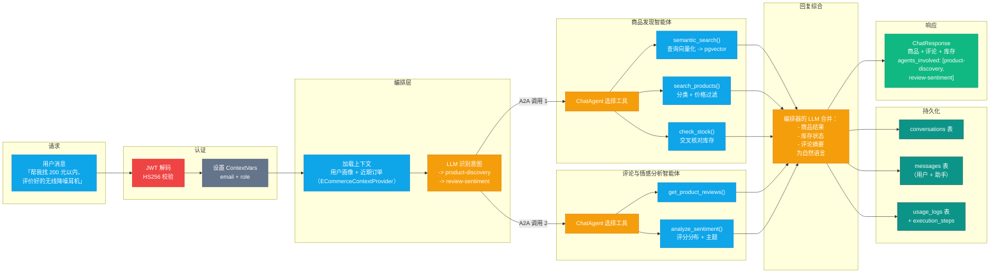

# 架构

可靠电商多智能体平台是一个基于微软智能体框架（Microsoft Agent Framework，MAF）构建的多智能体电商平台。六个专业智能体通过 A2A 协议（Agent-to-Agent，智能体间通信协议）协作，由中央客服编排器统一调度，它负责识别用户意图并把请求路由到合适的专业智能体。

---

## 1. 系统总览

平台由三层构成：Next.js 前端、以 FastAPI 实现并背靠五个专业智能体的编排网关，以及共享基础设施（PostgreSQL + pgvector、Redis、Jaeger）。


```mermaid
graph TB
    subgraph Client["客户端层"]
        FE["Next.js 16 前端<br/>（React 19 + Tailwind）"]
    end

    subgraph Gateway["网关层"]
        ORCH["编排器<br/>FastAPI :8080<br/>JWT 认证 + 意图路由"]
    end

    subgraph Agents["专业智能体层 · A2A 协议"]
        PD["商品发现<br/>:8081"]
        OM["订单管理<br/>:8082"]
        PP["定价与促销<br/>:8083"]
        RS["评论与情感分析<br/>:8084"]
        IF["库存与履约<br/>:8085"]
    end

    subgraph Infra["基础设施"]
        PG[("PostgreSQL 16<br/>+ pgvector")]
        RD[("Redis 7")]
        JAEGER["Jaeger<br/>:16686"]
    end

    subgraph External["外部服务"]
        LLM["OpenAI / Azure OpenAI<br/>GPT-4.1 + 向量嵌入"]
    end

    FE -->|"REST + SSE"| ORCH
    ORCH -->|"A2A /message:send"| PD
    ORCH -->|"A2A /message:send"| OM
    ORCH -->|"A2A /message:send"| PP
    ORCH -->|"A2A /message:send"| RS
    ORCH -->|"A2A /message:send"| IF

    PD --> PG
    OM --> PG
    PP --> PG
    RS --> PG
    IF --> PG

    ORCH --> PG
    ORCH --> RD

    PD -->|"向量嵌入 API"| LLM
    ORCH -->|"ChatClient"| LLM
    PD -->|"ChatClient"| LLM
    OM -->|"ChatClient"| LLM
    PP -->|"ChatClient"| LLM
    RS -->|"ChatClient"| LLM
    IF -->|"ChatClient"| LLM

    ORCH -.->|"OTLP"| JAEGER
    PD -.->|"OTLP"| JAEGER
    OM -.->|"OTLP"| JAEGER
    PP -.->|"OTLP"| JAEGER
    RS -.->|"OTLP"| JAEGER
    IF -.->|"OTLP"| JAEGER

    style Client fill:#6366f1,stroke:#4f46e5,stroke-width:2px,color:#fff
    style FE fill:#818cf8,stroke:#6366f1,color:#fff

    style Gateway fill:#0891b2,stroke:#0e7490,stroke-width:2px,color:#fff
    style ORCH fill:#22d3ee,stroke:#06b6d4,color:#0c4a6e

    style Agents fill:#0d9488,stroke:#0f766e,stroke-width:2px,color:#fff
    style PD fill:#2dd4bf,stroke:#14b8a6,color:#134e4a
    style OM fill:#2dd4bf,stroke:#14b8a6,color:#134e4a
    style PP fill:#2dd4bf,stroke:#14b8a6,color:#134e4a
    style RS fill:#2dd4bf,stroke:#14b8a6,color:#134e4a
    style IF fill:#2dd4bf,stroke:#14b8a6,color:#134e4a

    style Infra fill:#475569,stroke:#334155,stroke-width:2px,color:#fff
    style PG fill:#94a3b8,stroke:#64748b,color:#1e293b
    style RD fill:#94a3b8,stroke:#64748b,color:#1e293b
    style JAEGER fill:#94a3b8,stroke:#64748b,color:#1e293b

    style External fill:#d97706,stroke:#b45309,stroke-width:2px,color:#fff
    style LLM fill:#fbbf24,stroke:#f59e0b,color:#78350f
```

---

## 2. 智能体通信模式

所有用户请求都经由编排器进入。编排器识别意图，通过 A2A 调用一个或多个专业智能体，并汇总出统一的回复。


```mermaid
sequenceDiagram
    actor User
    participant FE as Next.js 前端
    participant ORCH as 编排器<br/>（FastAPI :8080）
    participant LLM as OpenAI / Azure OpenAI
    participant AGENT as 专业智能体<br/>（A2AAgentHost）
    participant DB as PostgreSQL + pgvector

    User->>FE: 发送对话消息
    FE->>ORCH: POST /api/chat<br/>Authorization: Bearer {JWT}

    Note over ORCH: JWT 校验<br/>设置 ContextVars（email、role）

    ORCH->>LLM: ChatAgent.run() 携带系统提示词<br/>+ ECommerceContextProvider
    Note over LLM: 意图识别<br/>工具选择

    LLM-->>ORCH: 工具调用：call_specialist_agent<br/>（agent_name、message）

    ORCH->>AGENT: POST /message:send<br/>X-Agent-Secret + X-User-Email
    Note over AGENT: 认证中间件校验<br/>共享密钥并设置 ContextVars

    AGENT->>LLM: ChatAgent.run() 携带<br/>专业智能体系统提示词
    Note over LLM: 选择领域工具<br/>（search、check_stock 等）
    LLM-->>AGENT: 工具调用

    AGENT->>DB: 执行工具查询<br/>（asyncpg 参数化 SQL）
    DB-->>AGENT: 查询结果

    AGENT-->>ORCH: A2A 响应（JSON）

    Note over ORCH: 编排器的 LLM 把<br/>专业智能体的响应<br/>综合为自然语言

    ORCH->>DB: 持久化会话 + 用量日志
    ORCH-->>FE: ChatResponse（JSON）
    FE-->>User: 渲染回复
```

---

## 3. 智能体架构

每个专业智能体都遵循一致的四文件结构。编排器是唯一直接使用 FastAPI 的智能体 —— 所有专业智能体都使用 MAF A2A 库提供的 `A2AAgentHost`。


```mermaid
graph TB
    subgraph AgentHost["专业智能体（例如 product_discovery/）"]
        MAIN["main.py<br/>A2AAgentHost 入口<br/>Lifespan：遥测 + 数据库连接池"]
        AGENTPY["agent.py<br/>create_*_agent() -> ChatAgent<br/>注册工具与上下文提供器"]
        TOOLS["tools.py<br/>@tool 装饰的函数<br/>领域相关的数据库查询"]
        PROMPTS["prompts.py<br/>SYSTEM_PROMPT 常量<br/>智能体人设与指令"]
    end

    subgraph SharedLib["shared/（跨智能体共享库）"]
        CONFIG["config.py<br/>Pydantic Settings"]
        DBMOD["db.py<br/>asyncpg 连接池管理"]
        AUTH["auth.py<br/>AgentAuthMiddleware"]
        CTX["context.py<br/>ContextVars（email、role）"]
        CTXPROV["context_providers.py<br/>ECommerceContextProvider"]
        FACTORY["agent_factory.py<br/>ChatClient 工厂（OpenAI/Azure）"]
        TELEM["telemetry.py<br/>OTel 初始化与埋点"]
        SHARED_TOOLS["tools/<br/>共享工具（库存、<br/>定价、用户、退货、会员）"]
    end

    MAIN --> AGENTPY
    MAIN --> DBMOD
    MAIN --> AUTH
    MAIN --> TELEM
    AGENTPY --> TOOLS
    AGENTPY --> PROMPTS
    AGENTPY --> FACTORY
    AGENTPY --> CTXPROV
    AGENTPY --> SHARED_TOOLS
    TOOLS --> DBMOD
    TOOLS --> CTX
    CTXPROV --> CTX
    CTXPROV --> DBMOD
    AUTH --> CTX
    AUTH --> CONFIG
    FACTORY --> CONFIG

    style MAIN fill:#0ea5e9,stroke:#0284c7,color:#fff
    style AGENTPY fill:#0ea5e9,stroke:#0284c7,color:#fff
    style TOOLS fill:#0ea5e9,stroke:#0284c7,color:#fff
    style PROMPTS fill:#0ea5e9,stroke:#0284c7,color:#fff
    style CONFIG fill:#64748b,stroke:#475569,color:#fff
    style DBMOD fill:#0d9488,stroke:#115e59,color:#fff
    style AUTH fill:#ef4444,stroke:#dc2626,color:#fff
    style CTX fill:#64748b,stroke:#475569,color:#fff
    style CTXPROV fill:#64748b,stroke:#475569,color:#fff
    style FACTORY fill:#f59e0b,stroke:#d97706,color:#fff
    style TELEM fill:#64748b,stroke:#475569,color:#fff
    style SHARED_TOOLS fill:#0d9488,stroke:#0f766e,color:#fff
```

### 智能体清单

| 智能体 | 端口 | 模块 | 关键工具 |
|-------|------|--------|-----------|
| **编排器** | 8080 | `orchestrator/` | `call_specialist_agent`（A2A 路由） |
| **商品发现** | 8081 | `product_discovery/` | `search_products`、`semantic_search`、`compare_products`、`find_similar_products`、`get_trending_products` |
| **订单管理** | 8082 | `order_management/` | `get_user_orders`、`get_order_details`、`get_order_tracking`、`cancel_order`、`modify_order`、`check_return_eligibility`、`initiate_return`、`process_refund` |
| **定价与促销** | 8083 | `pricing_promotions/` | `validate_coupon`、`optimize_cart`、`get_active_deals`、`check_bundle_eligibility`、`get_loyalty_tier`、`calculate_loyalty_discount` |
| **评论与情感分析** | 8084 | `review_sentiment/` | `get_product_reviews`、`analyze_sentiment`、`get_sentiment_by_topic`、`get_sentiment_trend`、`detect_fake_reviews`、`compare_product_reviews` |
| **库存与履约** | 8085 | `inventory_fulfillment/` | `check_stock`、`get_warehouse_availability`、`get_restock_schedule`、`estimate_shipping`、`compare_carriers`、`calculate_fulfillment_plan`、`place_backorder` |

---

## 4. 编排器模式

编排器是所有用户流量的唯一入口。它负责认证、通过 LLM 做意图识别、通过 A2A 做智能体路由，以及会话持久化。


```mermaid
flowchart TD
    REQ["收到请求<br/>POST /api/chat"]
    JWT{"JWT 有效？"}
    REJECT["401 未授权"]
    SETCTX["设置 ContextVars<br/>（email、role、session_id）"]
    LOAD["加载对话历史<br/>+ ECommerceContextProvider"]
    CLASSIFY["LLM 意图识别<br/>经由 ChatAgent.run()"]

    SINGLE{"单一意图还是<br/>多意图？"}

    ROUTE_ONE["call_specialist_agent<br/>（agent_name、message）"]
    ROUTE_MULTI["顺序 A2A 调用<br/>多个专业智能体"]

    A2A_CALL["POST /message:send<br/>X-Agent-Secret + X-User-Email<br/>发往专业智能体"]

    TIMEOUT{"响应<br/>正常？"}
    ERROR["错误处理<br/>重试或兜底话术"]
    RESPONSE["专业智能体响应"]

    SYNTH["LLM 把专业智能体的<br/>响应综合为<br/>自然语言"]

    PERSIST["持久化到数据库<br/>conversations + messages +<br/>usage_logs + execution_steps"]
    RETURN["返回 ChatResponse<br/>（response、conversation_id、<br/>agents_involved）"]

    REQ --> JWT
    JWT -->|否| REJECT
    JWT -->|是| SETCTX
    SETCTX --> LOAD
    LOAD --> CLASSIFY
    CLASSIFY --> SINGLE

    SINGLE -->|单一| ROUTE_ONE
    SINGLE -->|多个| ROUTE_MULTI
    ROUTE_ONE --> A2A_CALL
    ROUTE_MULTI --> A2A_CALL

    A2A_CALL --> TIMEOUT
    TIMEOUT -->|错误 / 超时| ERROR
    TIMEOUT -->|正常| RESPONSE

    ERROR --> SYNTH
    RESPONSE --> SYNTH
    SYNTH --> PERSIST
    PERSIST --> RETURN

    style REQ fill:#0ea5e9,stroke:#0284c7,color:#fff
    style JWT fill:#ef4444,stroke:#dc2626,color:#fff
    style REJECT fill:#ef4444,stroke:#dc2626,color:#fff
    style SETCTX fill:#64748b,stroke:#475569,color:#fff
    style LOAD fill:#0ea5e9,stroke:#0284c7,color:#fff
    style CLASSIFY fill:#f59e0b,stroke:#d97706,color:#fff
    style SINGLE fill:#f59e0b,stroke:#d97706,color:#fff
    style ROUTE_ONE fill:#0ea5e9,stroke:#0284c7,color:#fff
    style ROUTE_MULTI fill:#0ea5e9,stroke:#0284c7,color:#fff
    style A2A_CALL fill:#0ea5e9,stroke:#0284c7,color:#fff
    style TIMEOUT fill:#ef4444,stroke:#dc2626,color:#fff
    style ERROR fill:#ef4444,stroke:#dc2626,color:#fff
    style RESPONSE fill:#10b981,stroke:#059669,color:#fff
    style SYNTH fill:#f59e0b,stroke:#d97706,color:#fff
    style PERSIST fill:#0d9488,stroke:#115e59,color:#fff
    style RETURN fill:#10b981,stroke:#059669,color:#fff
```

---

## 5. 认证流程

可靠电商多智能体平台使用自包含的 JWT 认证（PyJWT + bcrypt）。没有外部身份提供方。智能体之间的调用使用共享密钥而非 JWT。

### 用户认证


```mermaid
sequenceDiagram
    actor User
    participant FE as Next.js 前端
    participant ORCH as 编排器 API
    participant DB as PostgreSQL

    Note over User,DB: 注册流程
    User->>FE: 输入邮箱、密码、姓名
    FE->>ORCH: POST /api/auth/signup
    ORCH->>ORCH: 哈希密码（bcrypt）
    ORCH->>DB: INSERT INTO users (email, password_hash, name, role='customer')
    DB-->>ORCH: 用户已创建
    ORCH->>ORCH: 生成访问令牌（JWT HS256，60 分钟）<br/>生成刷新令牌（JWT HS256，7 天）
    ORCH-->>FE: { access_token, refresh_token, user }
    FE->>FE: 把令牌存入 localStorage

    Note over User,DB: 登录流程
    User->>FE: 输入邮箱、密码
    FE->>ORCH: POST /api/auth/login
    ORCH->>DB: SELECT password_hash FROM users WHERE email = $1
    DB-->>ORCH: password_hash
    ORCH->>ORCH: bcrypt.checkpw(password, hash)
    alt 密码无效
        ORCH-->>FE: 401 凭据无效
    else 密码有效
        ORCH->>ORCH: 生成访问令牌 + 刷新令牌
        ORCH-->>FE: { access_token, refresh_token, user }
    end

    Note over User,DB: 已认证请求
    FE->>ORCH: POST /api/chat<br/>Authorization: Bearer {access_token}
    ORCH->>ORCH: jwt.decode(token, JWT_SECRET, HS256)
    ORCH->>ORCH: 校验 type='access' 且未过期
    ORCH->>ORCH: 设置 ContextVars：<br/>current_user_email = sub<br/>current_user_role = role
    ORCH-->>FE: 进入处理函数

    Note over User,DB: 令牌刷新
    FE->>ORCH: POST /api/auth/refresh<br/>{ refresh_token }
    ORCH->>ORCH: jwt.decode(refresh_token)<br/>校验 type='refresh'
    ORCH->>DB: SELECT * FROM users WHERE email = sub
    ORCH->>ORCH: 生成新的访问令牌 + 刷新令牌
    ORCH-->>FE: { access_token, refresh_token, user }
```

### 智能体间认证


```mermaid
sequenceDiagram
    participant ORCH as 编排器
    participant AGENT as 专业智能体
    participant MW as AgentAuthMiddleware

    ORCH->>AGENT: POST /message:send<br/>X-Agent-Secret: {AGENT_SHARED_SECRET}<br/>X-User-Email: zhangwei@example.com<br/>X-User-Role: customer

    AGENT->>MW: 请求被拦截

    alt 密钥与 AGENT_SHARED_SECRET 匹配
        MW->>MW: 设置 ContextVars：<br/>email = X-User-Email<br/>role = X-User-Role
        MW-->>AGENT: 进入处理函数
        Note over AGENT: 工具从 ContextVars<br/>读取用户身份
    else 密钥无效
        MW-->>ORCH: 401 智能体密钥无效
    end
```

### RBAC 角色

| 角色 | 权限级别 | 说明 |
|------|-------------|-------------|
| `customer` | 默认 | 常规购物、订单、评论 |
| `power_user` | 扩展 | 通过应用市场使用高级智能体功能 |
| `seller` | 商家工具 | 起草评论回复、查看情感分析报告 |
| `admin` | 完全 | 审批访问申请、管理智能体目录、全部操作 |

完整的安全架构 —— 威胁模型、护栏中间件栈、身份伪造检测、SQL 归属过滤，以及生产环境加固清单 —— 见 [`docs/security-guide.md`](security-guide.md)。

---

## 6. 数据流

端到端数据流，展示一次用户请求如何穿越系统：从最初的 HTTP 请求，经由智能体处理，直到数据库持久化。


```mermaid
flowchart LR
    subgraph Input["请求"]
        USER_MSG["用户消息<br/>「帮我找 200 元以内、<br/>评价好的无线降噪耳机」"]
    end

    subgraph Auth["认证"]
        JWT_CHECK["JWT 解码<br/>HS256 校验"]
        CTX_SET["设置 ContextVars<br/>email + role"]
    end

    subgraph Orchestration["编排层"]
        CTX_LOAD["加载上下文<br/>用户画像 + 近期订单<br/>（ECommerceContextProvider）"]
        LLM_ROUTE["LLM 识别意图<br/>-> product-discovery<br/>-> review-sentiment"]
    end

    subgraph A2A_1["商品发现智能体"]
        PD_LLM["ChatAgent 选择工具"]
        PD_SEARCH["semantic_search()<br/>查询向量化 -> pgvector"]
        PD_FILTER["search_products()<br/>分类 + 价格过滤"]
        PD_STOCK["check_stock()<br/>交叉核对库存"]
    end

    subgraph A2A_2["评论与情感分析智能体"]
        RS_LLM["ChatAgent 选择工具"]
        RS_REVIEWS["get_product_reviews()"]
        RS_SENT["analyze_sentiment()<br/>评分分布 + 主题"]
    end

    subgraph Synthesis["回复综合"]
        COMBINE["编排器的 LLM 合并：<br/>- 商品结果<br/>- 库存状态<br/>- 评论摘要<br/>为自然语言"]
    end

    subgraph Persist["持久化"]
        CONV["conversations 表"]
        MSG["messages 表<br/>（用户 + 助手）"]
        USAGE["usage_logs 表<br/>+ execution_steps"]
    end

    subgraph Output["响应"]
        RESP["ChatResponse<br/>商品 + 评论 + 库存<br/>agents_involved: [product-discovery,<br/>review-sentiment]"]
    end

    USER_MSG --> JWT_CHECK
    JWT_CHECK --> CTX_SET
    CTX_SET --> CTX_LOAD
    CTX_LOAD --> LLM_ROUTE

    LLM_ROUTE -->|"A2A 调用 1"| PD_LLM
    PD_LLM --> PD_SEARCH
    PD_LLM --> PD_FILTER
    PD_LLM --> PD_STOCK

    LLM_ROUTE -->|"A2A 调用 2"| RS_LLM
    RS_LLM --> RS_REVIEWS
    RS_LLM --> RS_SENT

    PD_SEARCH --> COMBINE
    PD_FILTER --> COMBINE
    PD_STOCK --> COMBINE
    RS_REVIEWS --> COMBINE
    RS_SENT --> COMBINE

    COMBINE --> CONV
    COMBINE --> MSG
    COMBINE --> USAGE
    COMBINE --> RESP

    style USER_MSG fill:#0ea5e9,stroke:#0284c7,color:#fff
    style JWT_CHECK fill:#ef4444,stroke:#dc2626,color:#fff
    style CTX_SET fill:#64748b,stroke:#475569,color:#fff
    style CTX_LOAD fill:#0ea5e9,stroke:#0284c7,color:#fff
    style LLM_ROUTE fill:#f59e0b,stroke:#d97706,color:#fff
    style PD_LLM fill:#f59e0b,stroke:#d97706,color:#fff
    style PD_SEARCH fill:#0ea5e9,stroke:#0284c7,color:#fff
    style PD_FILTER fill:#0ea5e9,stroke:#0284c7,color:#fff
    style PD_STOCK fill:#0ea5e9,stroke:#0284c7,color:#fff
    style RS_LLM fill:#f59e0b,stroke:#d97706,color:#fff
    style RS_REVIEWS fill:#0ea5e9,stroke:#0284c7,color:#fff
    style RS_SENT fill:#0ea5e9,stroke:#0284c7,color:#fff
    style COMBINE fill:#f59e0b,stroke:#d97706,color:#fff
    style CONV fill:#0d9488,stroke:#115e59,color:#fff
    style MSG fill:#0d9488,stroke:#115e59,color:#fff
    style USAGE fill:#0d9488,stroke:#115e59,color:#fff
    style RESP fill:#10b981,stroke:#059669,color:#fff
```

---

## 7. 技术选型

| 决策 | 选择 | 理由 |
|----------|--------|-----------|
| **智能体框架** | 微软智能体框架（Microsoft Agent Framework，MAF）Python SDK | 开箱即用的 `ChatAgent` 抽象，配合 `@tool` 装饰器、`ContextProvider` 与内置 A2A 支持，无需手写函数调用循环。 |
| **智能体间协议** | 通过 `agent-framework-a2a` 使用 A2A | 智能体间通信的标准协议。每个专业智能体暴露 `/message:send`。与传输层解耦 —— 日后可把 HTTP 换成 gRPC。 |
| **LLM 提供方** | OpenAI / Azure OpenAI（可配置） | 通过 MAF 统一到单一 `ChatClient` 接口，用 `LLM_PROVIDER` 环境变量切换。生产用 Azure（托管身份、RBAC）；本地开发用 OpenAI —— 或通过 `LLM_BASE_URL` 接入任何兼容 OpenAI 的端点（Ollama、LM Studio、vLLM、OpenRouter），实现完全本地、零成本的开发闭环。 |
| **数据库** | PostgreSQL 16 + pgvector | 用同一个数据库承载关系型数据与向量嵌入。语义商品检索使用 `text-embedding-3-small`（1536 维）。IVFFlat 索引用于快速余弦相似度检索。 |
| **Web 框架** | FastAPI（编排器）+ Starlette（专业智能体） | 编排器用 FastAPI，因为它需要 REST 端点（认证、对话、应用市场、管理）。专业智能体使用更轻量的 `A2AAgentHost`，它封装了 Starlette。 |
| **认证** | 自包含 JWT（HS256）+ bcrypt | 演示环境不依赖外部身份提供方。访问令牌（60 分钟）+ 刷新令牌（7 天）。智能体间认证通过共享密钥请求头。 |
| **用户上下文** | Python ContextVars | 按请求作用域的状态（email、role），由认证中间件设置，任何 `@tool` 函数都可读取。无需通过函数参数传递用户信息。 |
| **数据库访问** | asyncpg（原生 SQL） | 对查询拥有最大控制力，没有 ORM 开销。参数化的 `$1, $2` 语法可防止 SQL 注入。每个智能体一个连接池（5–20）。 |
| **遥测** | OpenTelemetry -> Jaeger | 自动埋点：httpx（LLM + A2A 调用）、asyncpg（数据库查询）、FastAPI/Starlette（HTTP）。A2A 调用与工具执行有自定义跨度。全部通过 trace_id 关联。 |
| **缓存** | Redis 7 | 缓存会话数据与对话状态。使用 Alpine 镜像以最小化体积。 |
| **前端** | Next.js 16 + React 19 + Tailwind + shadcn/ui | 默认使用服务端组件，用 `pnpm` 管理依赖。客户端 JS 尽可能少。 |
| **容器化** | Docker Compose + 多目标 Dockerfile | 全部 6 个智能体共用一份 Dockerfile，通过 `ARG AGENT_NAME` 区分。每个智能体是独立服务，各自占用端口。一条 `docker compose up --build` 即可启动全部服务。 |
| **包管理** | `uv`（Python）+ `pnpm`（Node） | `uv` 提供快速的依赖解析与虚拟环境管理。`pnpm` 提供磁盘高效的 node_modules。 |

---

## 8. A2A 协议

所有智能体间通信都使用 A2A（Agent-to-Agent，智能体间通信协议）。编排器通过 HTTP POST 调用每个专业智能体的 `/message:send`。没有消息代理或事件总线 —— 调用是 Docker 网络内的同步 HTTP。

### 端点

```
POST http://{agent-host}:{port}/message:send
```

每个专业智能体都通过 `agent-framework-a2a` 的 `A2AAgentHost` 自动注册该端点。主机、端口与服务名来自 `AGENT_REGISTRY` 环境变量，编排器在启动时读取它。

### 请求格式

```json
{
  "message": {
    "parts": [
      { "type": "text", "text": "帮我找 200 元以内的无线降噪耳机" }
    ]
  },
  "history": [
    { "role": "user", "content": "你们有哪些耳机？" },
    { "role": "assistant", "content": "我们有以下几款……" }
  ]
}
```

编排器会在 `history` 中转发最近 10 轮对话（每轮截断到 500 字符）。这既能让专业智能体在追问时有足够上下文，又避免请求体无限制增长。

### 认证请求头

| 请求头 | 取值 | 用途 |
|--------|-------|---------|
| `X-Agent-Secret` | `AGENT_SHARED_SECRET` 环境变量 | 校验调用方是可信编排器；缺失或错误时返回 401 |
| `X-User-Email` | 例如 `zhangwei@example.com` | 传递用户身份，用于工具查询中的按用户数据范围限定 |
| `X-User-Role` | `customer`、`seller`、`admin` | 传递 RBAC 角色，用于 `@tool` 函数内部的权限检查 |

`shared/auth.py` 中的 `AgentAuthMiddleware` 校验密钥并设置 ContextVars（`current_user_email`、`current_user_role`），每个 `@tool` 函数都直接读取它们 —— 无需把用户身份穿过函数参数。

### 响应

专业智能体以 JSON 返回完整的智能体响应。编排器把它交给自己的 LLM，综合为最终的自然语言回复。

### 为什么用同步 HTTP？

平台使用同步 A2A 调用（一次一个专业智能体）而非并行扇出，原因有两个：单个智能体的处理足够快，顺序调用完全落在可接受的延迟范围内；而后面的专业智能体往往需要前面结果的上下文（定价需要先知道推荐了哪些商品，才能优化购物车）。

完整的时序图（含 JWT 校验、上下文加载与 A2A 调用流程）见[§2. 智能体通信模式](#2-智能体通信模式)。

## 相关内容

- [`docs/agent-flows.md`](agent-flows.md) —— 五张多智能体协作时序图
- [`docs/security-guide.md`](security-guide.md) —— 威胁模型、护栏、完整认证加固清单
- [`docs/maf-best-practices.md`](maf-best-practices.md) —— MAF 的 @tool、中间件与编排模式
- [`docs/adding-an-agent.md`](adding-an-agent.md) —— 新增专业智能体的分步指南
- [项目 README](../README.md)
