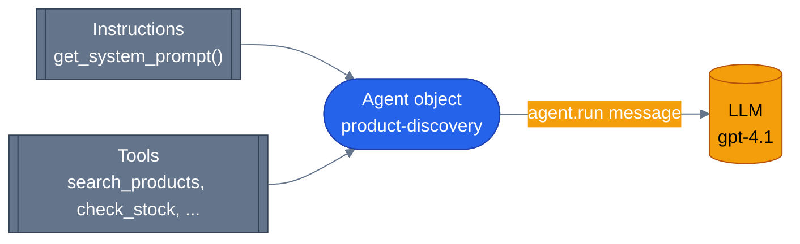

# What is an agent

> **New to this?** [Tool calling](https://nitinksingh.com/ai-resources/02-agents/tool-calling/) on the AI Knowledge Hub covers the
> same ground from scratch, vendor-neutral, with a lab you can run locally for free.
> This page assumes the concept and shows how it is built *here*.

## What it is

An agent is a language model given three things it doesn't have on its own: **instructions**
(what it's supposed to do and how), **tools** (functions it's allowed to call to get real
information or take real action), and **a loop** (a runtime that keeps asking the model "what
next?" until it has a final answer, executing whatever tool calls the model asks for along the
way).

None of those three things is optional. A model with instructions but no tools can only talk —
it can describe how it would look up an order, but it can't actually look one up. A model with
tools but no loop can make one tool call and stop; it can't chain "search for the product, then
check if it's in stock, then answer" into a single turn. And a model with a loop but no
instructions doesn't know what it's for.

The honest analogy: an agent is not a chatbot with extra steps, and it is not "a really good
prompt." It's closer to giving an intern a job description, a specific set of tools they're
allowed to use (a search box, a phone, a specific database view), and a manager who keeps
checking "are you done, or do you need to do something else first?" until the intern says
they're done. The model is the intern. The loop is the manager. The tools are what makes the
intern's answers actually true instead of just plausible-sounding.

## Why it matters

A raw language model call is a single, stateless transformation: text in, text out. It has no
way to check whether what it's about to say is actually true, because it has no way to check
anything — it can only generate text that's statistically plausible given its training data. Ask
a raw model "what's my order status?" and it will produce a *plausible-looking* answer, not a
*real* one, because it has never seen your order.

Giving the model tools closes that gap — but only if something manages the back-and-forth of
"model wants to call a tool → code runs the tool → model sees the result → model decides what's
next." That management is the part that turns "a model with some functions defined nearby" into
an agent that can actually complete a multi-step task.

## When to use it — and when not to

Use an agent when the task genuinely needs the loop: the right sequence of tool calls isn't
knowable in advance, and the model has to decide "given what I just learned, what do I need next?"
Order lookup + tracking + carrier lookup, in an order the model works out from the question, is
a real example of this in the codebase.

**Don't reach for an agent when:**
- The sequence of steps is always the same. That's a plain function, or at most a fixed pipeline —
  building an agent to always call `search`, then always call `checkout`, in the same order, adds
  a model call, latency, and cost for something a five-line script already does deterministically.
- You don't need language understanding at any step. If the input is already structured (a form,
  an API payload) and no step needs to interpret free text, there's no reason to route it through
  a model at all.
- You need a guaranteed, auditable sequence of operations for something high-stakes (money moving,
  data being deleted) with no room for the model to decide differently than expected. That's a
  workflow with fixed steps, not a place to let a model choose — see
  [graphs in agent systems](07-graphs-in-agent-systems.md) and
  [human-in-the-loop](11-human-in-the-loop.md) for how this repo actually draws that line for its
  own high-stakes actions.

## How it works here

Every specialist agent in this repo is built the same way. Here's `product-discovery`'s
constructor, in full, at [`agents/python/product_discovery/agent.py`](https://github.com/nitin27may/e-commerce-agents/blob/main/agents/python/product_discovery/agent.py):

```python
return Agent(
    client=create_chat_client(),
    name="product-discovery",
    description="Natural language product search, semantic similarity, recommendations, and price tracking.",
    instructions=get_system_prompt(current_user_role.get() or "customer"),
    tools=tools,
    context_providers=[ECommerceContextProvider()],
    middleware=build_specialist_middleware(),
)
```

Map that straight onto the three ingredients:

- **Instructions** — `get_system_prompt(...)`, loaded per request and role-aware (a seller and a
  customer get different instructions from the same agent — see
  `agents/python/config/prompts/product-discovery.yaml`).
- **Tools** — the `tools` list, built a few lines earlier from this agent's own `AGENT_TOOLS`
  (`agents/python/product_discovery/agent.py`) — functions like `search_products`,
  `check_stock`, `get_price_history`.
- **The loop** — not visible in this constructor at all. It's implicit: whatever calls
  `agent.run(...)` on this object gets the full think → call-tool → observe → think cycle for
  free, supplied by the Microsoft Agent Framework. See
  [the agentic loop](02-the-agentic-loop.md) for exactly where that happens and how to see it run.

All six agents in this repo — the orchestrator plus five specialists — follow this exact shape:
`create_chat_client()`, role-aware `instructions`, a domain-specific `tools` list, and the same
`build_specialist_middleware()` call. You can confirm this yourself:
[`agents/python/order_management/agent.py`](https://github.com/nitin27may/e-commerce-agents/blob/main/agents/python/order_management/agent.py),
[`agents/python/pricing_promotions/agent.py`](https://github.com/nitin27may/e-commerce-agents/blob/main/agents/python/pricing_promotions/agent.py),
[`agents/python/review_sentiment/agent.py`](https://github.com/nitin27may/e-commerce-agents/blob/main/agents/python/review_sentiment/agent.py),
[`agents/python/inventory_fulfillment/agent.py`](https://github.com/nitin27may/e-commerce-agents/blob/main/agents/python/inventory_fulfillment/agent.py), and the orchestrator's own agent at
[`agents/python/orchestrator/agent.py`](https://github.com/nitin27may/e-commerce-agents/blob/main/agents/python/orchestrator/agent.py) (whose only tool is `call_specialist_agent` — see
[why multi-agent](05-why-multi-agent.md)).



Next: [the agentic loop](02-the-agentic-loop.md) — what actually happens when you call
`agent.run(...)` on this object.
