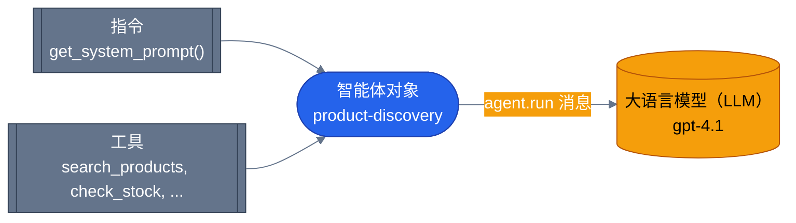

# 什么是智能体

> **初次接触？** 本页假定你已经了解这个概念，重点展示它在本项目中是如何实现的。

## 它是什么

智能体（agent）就是一个被赋予了三样东西的大语言模型（LLM）——这三样东西它自己并不具备：**指令**
（该做什么、怎么做）、**工具**（被允许调用的函数，用来获取真实信息或执行真实操作），以及
**一个循环**（一个运行框架，不断追问模型「接下来做什么？」，直到它给出最终答案，并在过程中
执行模型请求的每一次工具调用）。

这三样缺一不可。只有指令、没有工具的模型只能空谈——它可以描述自己会怎么查订单，但查不了。
只有工具、没有循环的模型只能调用一次工具就停下，没法把「先搜商品，再看有没有货，然后回答」
串成一轮对话。而有循环、没有指令的模型则不知道自己该干什么。

一个贴切的类比：智能体不是「多了几步的聊天机器人」，也不是「一段特别好的提示词」。它更像
给一个实习生一份岗位说明、一套他有权使用的工具（一个搜索框、一部电话、某个特定的数据库
视图），再加一个不断追问「你做完了吗？还是得先做别的事？」直到实习生说做完了的主管。模型
是那个实习生，循环是那个主管，而工具才是让实习生的回答真的成立、而不只是听起来合理的关键。

## 为什么重要

裸调一次大语言模型是一次单一的、无状态的变换：文本进、文本出。它没有办法核实自己即将说出
的话是否属实，因为它没有任何核实的途径——它只能生成在训练数据下统计上最像样的文本。问一个
裸模型「我的订单到哪了？」，它会给出一个*看起来*合理的答案，而不是一个*真实*的答案，因为它
从没见过你的订单。

给模型配上工具能补上这个缺口——但前提是有东西在管理「模型想调工具 → 代码执行工具 → 模型
看到结果 → 模型决定下一步」这一来一回。正是这层管理，把「一个旁边定义了几个函数的模型」
变成了真正能完成多步任务的智能体。

## 什么时候用——什么时候不用

当任务确实需要这个循环时，才用智能体：正确的工具调用顺序事先无法确定，必须由模型根据
「刚学到的东西，下一步要什么？」来判断。订单查询 + 物流跟踪 + 承运商查询，顺序由模型从问题中
自行推导——这就是本代码库里的真实例子。

**以下情况不要用智能体：**
- 步骤顺序永远相同。那就是一个普通函数，最多是一条固定流水线——为了「总是先调 `search`、再
  调 `checkout`」而搭一个智能体，等于为一件五行脚本就能确定性完成的事，额外付出一次模型调用、
  延迟和成本。
- 任何一步都不需要语言理解。如果输入已经是结构化的（一张表单、一个 API 负载），且没有哪一步
  需要解读自由文本，那就完全没有理由让它绕道模型。
- 你需要为高风险操作（资金流动、数据删除）提供有保证、可审计的操作序列，不允许模型做出与
  预期不同的决定。那是一条步骤固定的工作流，而不是交给模型自行选择的地方——关于本仓库如何
  在自身的高风险操作上划这条线，见[智能体系统中的图](07-graphs-in-agent-systems.md)和
  [人工参与](11-human-in-the-loop.md)。

## 本项目怎么实现

本仓库中每个专业智能体（specialist agent）的构建方式都一样。下面是 `product-discovery` 的
构造函数完整代码，位于 [`agents/python/product_discovery/agent.py`](../../agents/python/product_discovery/agent.py)：

```python
return Agent(
    client=create_chat_client(),
    name="product-discovery",
    description="Natural language product search, semantic similarity, recommendations, and price tracking.",
    instructions=get_system_prompt(current_user_role.get() or "customer"),
    tools=tools,
    context_providers=[ECommerceContextProvider()],
    middleware=build_specialist_middleware(),
)
```

把它直接对应到那三样东西上：

- **指令** —— `get_system_prompt(...)`，按请求加载、感知角色（同一个智能体，商家和客户拿到的
  指令不同——见 `agents/python/config/prompts/product-discovery.yaml`）。
- **工具** —— `tools` 列表，由几行之前根据该智能体自己的 `AGENT_TOOLS`
  （`agents/python/product_discovery/agent.py`）构建而成——包含 `search_products`、
  `check_stock`、`get_price_history` 这类函数。
- **循环** —— 在这个构造函数里完全看不到。它是隐式的：任何对这个对象调用 `agent.run(...)`
  的地方，都会免费获得完整的「思考 → 调工具 → 观察 → 再思考」循环，由微软智能体框架
  （Microsoft Agent Framework，MAF）提供。关于它具体发生在哪里、怎么看到它运行，见
  [智能体循环](02-the-agentic-loop.md)。

本仓库的六个智能体——一个编排器加五个专业智能体——都遵循完全相同的形态：
`create_chat_client()`、感知角色的 `instructions`、一份领域专属的 `tools` 列表，以及同一个
`build_specialist_middleware()` 调用。你可以自己核对：
[`agents/python/order_management/agent.py`](../../agents/python/order_management/agent.py)、
[`agents/python/pricing_promotions/agent.py`](../../agents/python/pricing_promotions/agent.py)、
[`agents/python/review_sentiment/agent.py`](../../agents/python/review_sentiment/agent.py)、
[`agents/python/inventory_fulfillment/agent.py`](../../agents/python/inventory_fulfillment/agent.py)，以及编排器自己的智能体
[`agents/python/orchestrator/agent.py`](../../agents/python/orchestrator/agent.py)（它唯一的工具是 `call_specialist_agent`——见
[为什么要多智能体](05-why-multi-agent.md)）。


```mermaid
%%{init: {'theme':'base', 'themeVariables': {
  'primaryColor': '#2563eb','primaryTextColor': '#ffffff','primaryBorderColor': '#1e40af',
  'lineColor': '#64748b','secondaryColor': '#f59e0b','tertiaryColor': '#10b981',
  'background': 'transparent'}}}%%
flowchart LR
  classDef core     fill:#2563eb,stroke:#1e40af,color:#ffffff
  classDef external fill:#f59e0b,stroke:#b45309,color:#000000
  classDef infra    fill:#64748b,stroke:#334155,color:#ffffff

  instructions[["指令<br/>get_system_prompt()"]]
  tools[["工具<br/>search_products, check_stock, ..."]]
  agent(["智能体对象<br/>product-discovery"])
  model[("大语言模型（LLM）<br/>gpt-4.1")]

  instructions --> agent
  tools --> agent
  agent -->|agent.run 消息| model

  class instructions,tools infra
  class agent core
  class model external
```

下一页：[智能体循环](02-the-agentic-loop.md) —— 当你对这个对象调用 `agent.run(...)` 时，实际
发生了什么。
