# The agentic loop

> **New to this?** [The agent loop](https://nitinksingh.com/ai-resources/02-agents/the-agent-loop/) on the AI Knowledge Hub covers the
> same ground from scratch, vendor-neutral, with a lab you can run locally for free.
> This page assumes the concept and shows how it is built *here*.

## What it is

The agentic loop is the cycle that runs every time you call `agent.run(...)`: the model **thinks**
(decides what to do next given the conversation so far), optionally **calls a tool** (asks the
runtime to execute a specific function with specific arguments), the runtime **observes** (runs
that function for real and hands the result back to the model as a new message), and the model
**thinks again** — now with that result in view. This repeats until the model produces a plain
text answer instead of a tool call, at which point the loop ends and that text is returned to
whoever called `agent.run(...)`.

The important part is that this is a *loop*, not a single request/response pair. One user question
can drive the model through several rounds of "call a tool, look at the result, call another tool"
before it ever produces the sentence the user sees.

## Why it matters

Without the loop, "agent" would just mean "a model that's allowed to call one function." That's
not enough for anything but the simplest tasks. Consider "is the Sony WH-1000XM5 in stock, and
how fast can it ship to 10001?" — answering that well takes at least two tool calls
(`check_stock`, then a shipping-estimate lookup), and the second call's arguments depend on
something the model only knows *after* the first call returns. A single-shot model can't do that;
it would have to guess both answers at once, from nothing.

The loop is also what turns "the model called some functions" into something you can inspect and
trust incrementally: each iteration is a discrete, loggable step — a specific tool, specific
arguments, a specific result — rather than one opaque black-box answer. That's what makes
[grounding verification](09-grounding-and-rag.md) and the [agentic timeline UI](#how-it-works-here)
possible at all: there's something concrete to check at each step, not just a final paragraph.

## When to use it — and when not to

You don't choose to use the loop or not — if you're using `agent.run(...)` with tools attached at
all, you get it. The design decision that actually matters is **how many iterations you're willing
to let the model take**, and **whether the model should be allowed to decide the sequence of tool
calls at all** for a given task. If a task's tool-call sequence is always the same regardless of
what the model learns along the way, that's a signal you might not need the loop's flexibility —
see [what is an agent](01-what-is-an-agent.md#when-to-use-it--and-when-not-to) and
[graphs in agent systems](07-graphs-in-agent-systems.md) for when a fixed sequence beats letting
the model improvise one.

## How it works here

This repo doesn't implement its own version of the loop — it deliberately doesn't. An earlier
version of this codebase had a hand-rolled OpenAI chat-completions loop; it was removed once the
Microsoft Agent Framework's native `agent.run()` was confirmed to handle everything it needs,
including streaming and Azure. The loop itself lives inside the `agent_framework` package, not
this repo — what you can see here is the boundary: where the loop is invoked, and where its
result lands.

That boundary is [`agents/python/shared/agent_host.py`](https://github.com/nitin27may/e-commerce-agents/blob/main/agents/python/shared/agent_host.py). Non-streaming:

```python
# agents/python/shared/agent_host.py
response = await agent.run(messages, options=_run_options())
```

Streaming — same loop, but you get to watch each step arrive instead of waiting for the whole
thing:

```python
# agents/python/shared/agent_host.py
stream = agent.run(messages, stream=True, options=_run_options())
async for update in stream:
```

Every tool call the loop makes along the way is recorded by `StepRecorderMiddleware`
([`agents/python/shared/agent_observability.py`](https://github.com/nitin27may/e-commerce-agents/blob/main/agents/python/shared/agent_observability.py)) into that request's step list. The proof that the
loop actually ran more than once for a given query is visible in the browser: open the chat UI,
ask something that needs two facts (like the stock-and-shipping example above), and watch
[`web/src/components/chat/agent-timeline.tsx`](https://github.com/nitin27may/e-commerce-agents/blob/main/web/src/components/chat/agent-timeline.tsx) render one row per tool call — `search_products`,
then `check_stock`, then the final answer — each expandable to show exactly what arguments went
in and what came back ([`agent-timeline.tsx`](https://github.com/nitin27may/e-commerce-agents/blob/main/web/src/components/chat/agent-timeline.tsx)). That timeline *is* the agentic loop, made
visible.

```mermaid
%%{init: {'theme':'base', 'themeVariables': {
  'primaryColor': '#2563eb','primaryTextColor': '#ffffff','primaryBorderColor': '#1e40af',
  'lineColor': '#64748b','secondaryColor': '#f59e0b','tertiaryColor': '#10b981',
  'background': 'transparent'}}}%%
flowchart LR
  classDef core     fill:#2563eb,stroke:#1e40af,color:#ffffff
  classDef external fill:#f59e0b,stroke:#b45309,color:#000000
  classDef success  fill:#10b981,stroke:#047857,color:#ffffff

  start(["User question"]) --> think1["Model thinks:<br/>what do I need?"]
  think1 -->|wants a tool| call1[["call_tool<br/>e.g. check_stock"]]
  call1 --> observe1["Runtime executes it,<br/>result appended to messages"]
  observe1 --> think2["Model thinks again,<br/>now with that result"]
  think2 -->|wants another tool| call2[["call_tool<br/>e.g. get_shipping_estimate"]]
  call2 --> observe2["Result appended"]
  observe2 --> think3["Model thinks again"]
  think3 -->|done, plain text| final(["Final answer returned<br/>to agent.run caller"])

  class start,final success
  class think1,think2,think3 core
  class call1,call2 external
```



Next: [tools](03-tools.md) — what actually makes a Python function something the model is allowed
to call in the first place.
