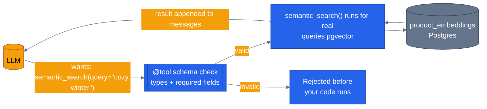

# Tools

> **New to this?** [Tool calling](https://nitinksingh.com/ai-resources/02-agents/tool-calling/) on the AI Knowledge Hub covers the
> same ground from scratch, vendor-neutral, with a lab you can run locally for free.
> This page assumes the concept and shows how it is built *here*.

## What it is

A tool is a normal function that the model has been told about — its name, a description of what
it does, and the shape of the arguments it takes — so that instead of the model guessing at an
answer, it can ask the runtime to run that function for real and hand back the result.

The model never executes your code directly. It can't — it's a language model, it can only
produce text. What actually happens is: the model produces a structured message that says, in
effect, "call `check_stock` with `product_id="abc123"`." The agent runtime sees that message,
finds the real `check_stock` function, calls it with those arguments, and appends whatever it
returns back into the conversation as a new message, formatted so the model can read it. The
model then continues from there. "The model calls a tool" is a convenient shorthand for that
whole round trip — the model itself never runs anything.

## Why it matters

A model calling a tool "wrong" isn't a hypothetical — it's the default outcome without a contract.
If the model can only see a function's name and has to guess what arguments it wants, it will
guess: wrong types, missing required fields, made-up parameter names. The **schema** — a
machine-readable description of exactly what arguments a tool takes, their types, and which are
required — is what lets the model construct a call that will actually work, and it's also what
lets the runtime validate the call *before* running it, rejecting a malformed one instead of
letting bad input reach your database.

Typed arguments matter for a second reason too: they're what makes a tool call something you can
safely execute without re-checking it in application code every time. If a tool's schema says
`limit: int`, the runtime enforces that before your function body ever runs — you don't need a
defensive `if not isinstance(limit, int)` inside every tool.

## When to use it — and when not to

Give the model a tool for anything it needs to know or do that isn't already in its training data
or the conversation: current data (prices, stock, order status — anything that changes after the
model was trained), actions with side effects (canceling an order, applying a coupon), or
anything requiring precision the model can't reliably produce on its own (exact totals, real
UUIDs — see [grounding and RAG](09-grounding-and-rag.md) for what happens when a model tries to
produce those *without* a tool).

**Don't** turn everything into a tool. A function that just reformats text the model already has,
or that doesn't touch anything outside the conversation, adds a round trip for no benefit — the
model can just write the text. And don't give a tool more power than the task in front of it
needs: a `search_products` tool that also happens to accept an `admin_override` flag is a tool
whose blast radius is bigger than its purpose, regardless of whether the current prompt would ever
trigger it.

## How it works here

Every tool in this repo follows the same pattern: the Microsoft Agent Framework's `@tool` decorator,
plus Python's `Annotated[type, Field(description=...)]` on every parameter. Here's a real one, in
full, from [`agents/python/product_discovery/tools.py`](https://github.com/nitin27may/e-commerce-agents/blob/main/agents/python/product_discovery/tools.py):

```python
@tool(name="semantic_search", description="Search products using semantic similarity via pgvector embeddings. Best for vague or descriptive queries like 'something cozy for winter' or 'gift for a tech enthusiast'.")
async def semantic_search(
    query: Annotated[str, Field(description="Descriptive search query in natural language")],
    limit: Annotated[int, Field(description="Max results")] = 5,
) -> list[dict]:
```

Four things happen here at once:
1. `@tool(name=..., description=...)` is what makes this function visible to a model at all —
   without it, `semantic_search` is just a Python function nobody outside this file can call.
2. The decorator's `description` and each parameter's `Field(description=...)` are what the model
   actually reads to decide *when* to call this tool and *how* to fill in its arguments — write
   these as if you're briefing a new hire, not documenting internals.
3. `Annotated[str, ...]` / `Annotated[int, ...]` are enforced automatically: a call with `limit`
   set to `"five"` instead of `5` is rejected before this function body ever runs.
4. `limit: ... = 5` is a real Python default — the model can omit it and get sensible behavior.

This exact pattern repeats for every tool in the repo — `store_memory`/`recall_memories`
([`agents/python/shared/tools/memory_tools.py`](https://github.com/nitin27may/e-commerce-agents/blob/main/agents/python/shared/tools/memory_tools.py)), the orchestrator's own routing tool
([`agents/python/orchestrator/agent.py`](https://github.com/nitin27may/e-commerce-agents/blob/main/agents/python/orchestrator/agent.py)), and every tool in every specialist's `tools.py`.

One more layer worth knowing about: [`agents/python/shared/tool_inputs.py`](https://github.com/nitin27may/e-commerce-agents/blob/main/agents/python/shared/tool_inputs.py) adds a second line of
defense *underneath* the tools that touch money or destructive actions (canceling an order,
issuing a refund) — Pydantic models like `CancelOrderInput`/`ProcessRefundInput` that re-validate
arguments inside the tool body itself, plus small shared helpers like `clamp_limit()` (used across
several tools to keep `limit` arguments in a sane range regardless of what the model asks for).
The `@tool` schema stops obviously malformed calls before they run; `tool_inputs.py` is the
belt-and-suspenders check for the handful of tools where "obviously malformed" isn't the only
thing you need to catch.



Next: [the agent harness](04-agent-harness.md) — what it actually takes to run one of these
agents as a real, reachable service, not just a script.
