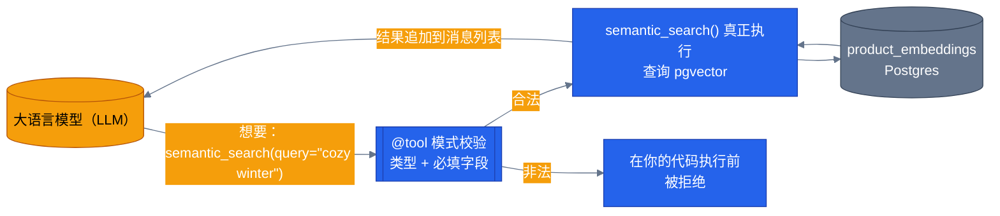

# 工具

> **初次接触？** 本页假定你已经了解这个概念，重点展示它在本项目中是如何实现的。

## 它是什么

工具（tool）就是一个普通函数，只不过已经告诉了模型它的信息——名字、作用描述，以及参数的
形态——这样模型就不必去猜答案，而是可以要求运行框架真正执行这个函数并把结果交回来。

模型从不直接执行你的代码。它也做不到——它是一个语言模型，只能产出文本。实际发生的是：模型
产出一条结构化消息，大意是「用 `product_id="abc123"` 调用 `check_stock`」。智能体运行框架
看到这条消息，找到真正的 `check_stock` 函数，用那些参数调用它，并把返回值作为一条新消息追加
回对话中，格式化为模型可读的形式。模型随后从那里继续。「模型调用了工具」只是对整趟往返的
一个方便说法——模型自己从不运行任何东西。

## 为什么重要

模型「调错」工具不是假设，而是没有契约时的默认结果。如果模型只能看到一个函数的名字、必须
自己猜参数，它就会猜：类型错、必填字段缺失、参数名凭空编造。**模式（schema）**——一份机器
可读的描述，精确说明一个工具接受哪些参数、类型是什么、哪些必填——正是让模型能构造出真正
可用调用的东西，也正是让运行框架能在执行*之前*校验调用、拒绝格式错误的调用，而不是让坏数据
进入数据库的东西。

带类型的参数还有第二个重要意义：它们让一次工具调用成为可以被安全执行、无需每次都在应用代码
里重新检查的东西。如果某个工具的模式声明了 `limit: int`，运行框架会在你的函数体执行之前强制
这一点——你不需要在每个工具里都写防御性的 `if not isinstance(limit, int)`。

## 什么时候用——什么时候不用

凡是模型需要知道或去做、而其训练数据或当前对话里又没有的东西，都应该给它一个工具：实时数据
（价格、库存、订单状态——任何在模型训练之后会变化的东西）、带副作用的操作（取消订单、使用
优惠券），或者任何需要模型无法可靠自行产出的精确信息（精确总额、真实 UUID——模型*没有*工具
却试图产出这类东西时会怎样，见[事实核验与 RAG](09-grounding-and-rag.md)）。

**不要**把所有东西都变成工具。一个只是重新格式化模型已有文本的函数，或者不触及对话之外任何
东西的函数，只会白白增加一次往返——模型自己就能写出那段文本。也不要把工具的权力给得比眼前
任务所需更大：一个 `search_products` 工具如果恰好还接受 `admin_override` 标志，那它的影响范围
就超过了它的用途，无论当前提示词是否可能触发它。

## 本项目怎么实现

本仓库的每个工具都遵循同一模式：微软智能体框架的 `@tool` 装饰器，加上 Python 的
`Annotated[type, Field(description=...)]` 标注每个参数。下面是来自
[`agents/python/product_discovery/tools.py`](../../agents/python/product_discovery/tools.py) 的一个真实例子（完整）：

```python
@tool(name="semantic_search", description="Search products using semantic similarity via pgvector embeddings. Best for vague or descriptive queries like 'something cozy for winter' or 'gift for a tech enthusiast'.")
async def semantic_search(
    query: Annotated[str, Field(description="Descriptive search query in natural language")],
    limit: Annotated[int, Field(description="Max results")] = 5,
) -> list[dict]:
```

这里同时发生了四件事：
1. `@tool(name=..., description=...)` 是让这个函数对模型可见的关键——没有它，`semantic_search`
   只是一个本文件之外谁都调不到的 Python 函数。
2. 装饰器的 `description` 和每个参数的 `Field(description=...)`，才是模型真正读到、用来判断
   *何时*调用这个工具、以及*如何*填写参数的内容——写这些文字时要像在给新同事交代任务，而不是
   在写内部文档。
3. `Annotated[str, ...]` / `Annotated[int, ...]` 会被自动强制：把 `limit` 传成 `"five"` 而不是
   `5`，会在函数体执行之前就被拒绝。
4. `limit: ... = 5` 是真正的 Python 默认值——模型可以省略它，并获得合理的行为。

这个模式在本仓库的每个工具上重复出现——`store_memory`/`recall_memories`
（[`agents/python/shared/tools/memory_tools.py`](../../agents/python/shared/tools/memory_tools.py)）、编排器自己的路由工具
（[`agents/python/orchestrator/agent.py`](../../agents/python/orchestrator/agent.py)），以及每个专业智能体 `tools.py` 里的每个工具。

还有一层值得了解：[`agents/python/shared/tool_inputs.py`](../../agents/python/shared/tool_inputs.py) 在那些涉及资金或破坏性操作
（取消订单、发起退款）的工具*之下*又加了一道防线——像 `CancelOrderInput`/`ProcessRefundInput`
这样的 pydantic 模型会在工具函数体内部重新校验参数，另外还有一些小的共享辅助函数，比如
`clamp_limit()`（被多个工具使用，无论模型要求什么，都把 `limit` 参数限制在合理范围内）。`@tool`
的模式能在执行前挡住明显格式错误的调用；`tool_inputs.py` 则是针对那一小批「明显格式错误」并非
唯一需要拦截的情况的工具，做的一道双保险。


```mermaid
%%{init: {'theme':'base', 'themeVariables': {
  'primaryColor': '#2563eb','primaryTextColor': '#ffffff','primaryBorderColor': '#1e40af',
  'lineColor': '#64748b','secondaryColor': '#f59e0b','tertiaryColor': '#10b981',
  'background': 'transparent'}}}%%
flowchart LR
  classDef core     fill:#2563eb,stroke:#1e40af,color:#ffffff
  classDef external fill:#f59e0b,stroke:#b45309,color:#000000
  classDef infra    fill:#64748b,stroke:#334155,color:#ffffff

  model[("大语言模型（LLM）")] -->|"想要：semantic_search(query=&quot;cozy winter&quot;)"| schema[["@tool 模式校验<br/>类型 + 必填字段"]]
  schema -->|合法| fn["semantic_search() 真正执行<br/>查询 pgvector"]
  schema -->|非法| reject["在你的代码执行前<br/>被拒绝"]
  fn --> db[("product_embeddings<br/>Postgres")]
  db --> fn
  fn -->|结果追加到消息列表| model

  class model external
  class schema,fn core
  class db infra
```

下一页：[智能体运行框架](04-agent-harness.md) —— 要让这些智能体作为真实、可访问的服务跑起来
（而不只是一个脚本），到底需要什么。
