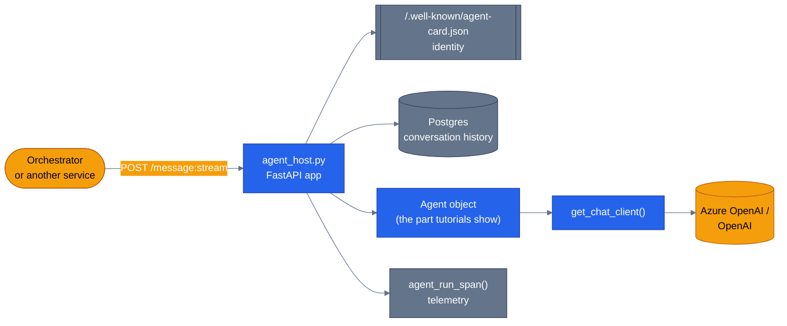

# The agent harness

> **New to this?** [The harness](https://nitinksingh.com/ai-resources/02-agents/the-harness/) on the AI Knowledge Hub covers the
> same ground from scratch, vendor-neutral, with a lab you can run locally for free.
> This page assumes the concept and shows how it is built *here*.

## What it is

The harness is everything that turns "an `Agent` object in a Python process" into a real,
reachable, production service: a network transport so other things can actually talk to it, a
lifecycle (something starts it up and shuts it down cleanly), an identity (something other
services can address it by), a way to load conversation history so it's not starting fresh every
message, and telemetry so you can tell what it's doing. Tutorials and samples almost always skip
this — they build the `Agent` object and call `.run()` on it in the same script. Production
doesn't get to skip it.

## Why it matters

Every one of those concerns is invisible right up until it's the reason something breaks.
No transport means nothing else can reach this agent — in a multi-agent system, that's fatal,
since specialists have to be callable by the orchestrator over the network, not just importable
in the same process. No lifecycle management means a container that hangs on shutdown, or that
serves traffic before its dependencies (like the database connection pool) are ready. No identity
means the orchestrator has no way to know it's really talking to the `product-discovery` agent and
not something pretending to be it. No history means every message starts a brand-new conversation
with no memory of the last one. No telemetry means the first time you learn a request is slow is
when a user complains.

## When to use it — and when not to

You need a real harness the moment an agent has to be reachable by something other than the
process that created it — which, in a multi-agent system, is immediately: the orchestrator has to
reach every specialist over the network (see [why multi-agent](05-why-multi-agent.md)). A
single-agent script that runs once and exits — a batch job, a one-off tutorial chapter — doesn't
need any of this; building it anyway is pure overhead for something with no callers to serve.

## How it works here

Every specialist in this repo is hosted the same way, by the same shared module:
[`agents/python/shared/agent_host.py`](https://github.com/nitin27may/e-commerce-agents/blob/main/agents/python/shared/agent_host.py). `create_agent_app()` (line 178) builds one FastAPI app per
agent with:

- **Transport** — `POST /message:send` (line 225, request/response) and `POST /message:stream`
  (line 263, Server-Sent Events) — the two shapes any other agent or the orchestrator can call
  into this one.
- **Identity** — `GET /.well-known/agent-card.json` (line 216), an A2A-convention discovery
  document any caller can fetch to confirm who they're talking to before sending real traffic.
- **Lifecycle** — a `lifespan` async context manager (lines 201-208) running `on_startup`/
  `on_shutdown` callbacks, so a specialist doesn't accept traffic before it's actually ready and
  cleans up connections on the way out.
- **History** — `_rehydrate_history_from_session()` (lines 128-172), which reads recent
  conversation turns straight from Postgres so a specialist picks up mid-conversation context
  instead of starting cold every message. (This is the *session* piece of
  [state, memory, and sessions](08-state-memory-and-sessions.md) — the harness is where it gets
  wired in, not where the concept itself lives.)
- **Telemetry** — every request is wrapped in `agent_run_span(agent_name)` (lines 247, 298 — see
  [observability and cost](13-observability-and-cost.md) for what that buys you), and per-request
  state like the step recorder and grounding ledger is reset at the top of each handler
  (lines 245-246, 296-297) so one request's data never leaks into the next.

The other half of the harness is *which* model this agent actually talks to, which is a separate
concern from hosting it: `agents/python/shared/factory.py::get_chat_client()` (lines 64-120)
picks the concrete client — `OpenAIChatClient`, Azure's `OpenAIChatCompletionClient`, or a
recorded-fixture `ReplayChatClient` for keyless testing — based on `LLM_PROVIDER`. Every
`create_*_agent()` factory calls this (via a thin re-export, `create_chat_client()`, in
[`agents/python/shared/agent_factory.py`](https://github.com/nitin27may/e-commerce-agents/blob/main/agents/python/shared/agent_factory.py)) rather than constructing a client inline, so swapping
providers is a config change, not a code change, across all six agents at once.

Next: [why multi-agent](05-why-multi-agent.md) — what a single agent, hosted well, still isn't
good at, and what splitting into several buys you.
