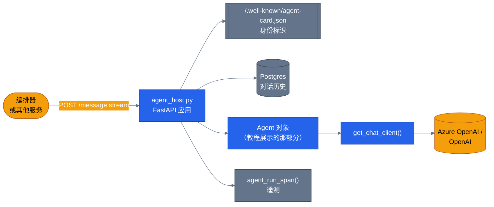

# 智能体运行框架

> **初次接触？** 本页假定你已经了解这个概念，重点展示它在本项目中是如何实现的。

## 它是什么

运行框架（harness）是把「Python 进程里的一个 `Agent` 对象」变成真实、可访问的生产服务所需要
的全部东西：网络传输层，好让别的东西能真正与它通信；生命周期（有东西负责干净地启动和关闭它）；
身份标识（其他服务可以用来寻址它）；一种加载对话历史的方式，使它不必每条消息都从零开始；以及
遥测，让你能知道它在做什么。教程和示例几乎总是跳过这些——它们在同一个脚本里构建 `Agent` 对象
并调用 `.run()`。生产环境跳不过去。

## 为什么重要

这些关注点在成为故障原因之前都是隐形的。没有传输层，其他任何东西都到不了这个智能体——在
多智能体系统中这是致命的，因为专业智能体必须能被编排器通过网络调用，而不只是在同一个进程里
被导入。没有生命周期管理，容器会在关闭时挂住，或者在依赖（比如数据库连接池）就绪之前就开始
接收流量。没有身份标识，编排器就无法确认自己真的在跟 `product-discovery` 智能体说话，而不是
什么冒充它的东西。没有历史，每条消息都会开启一段全新的对话，对上一段毫无记忆。没有遥测，
你第一次知道某个请求很慢，是用户来投诉的时候。

## 什么时候用——什么时候不用

一旦智能体需要被创建它的进程之外的任何东西访问，你就需要一个真正的运行框架——而在多智能体
系统里，这一点是立刻成立的：编排器必须通过网络访问每一个专业智能体（见
[为什么要多智能体](05-why-multi-agent.md)）。只运行一次就退出的单智能体脚本——一个批处理任务、
教程里的某一章——不需要这些；硬要搭出来，对一件根本没有调用方的事来说纯属额外开销。

## 本项目怎么实现

本仓库中每个专业智能体都由同一个共享模块以相同方式托管：
[`agents/python/shared/agent_host.py`](../../agents/python/shared/agent_host.py)。`create_agent_app()`（第 178 行）为每个智能体构建一个
FastAPI 应用，包含：

- **传输层** —— `POST /message:send`（第 225 行，请求/响应）和 `POST /message:stream`
  （第 263 行，SSE（Server-Sent Events，服务端推送事件））——任何其他智能体或编排器都可以调用
  进来的两种形态。
- **身份标识** —— `GET /.well-known/agent-card.json`（第 216 行），一份遵循 A2A 协议
  （Agent-to-Agent，智能体间通信协议）约定的发现文档，任何调用方都可以先获取它，确认自己在跟
  谁说话，再发送真实流量。
- **生命周期** —— 一个 `lifespan` 异步上下文管理器（第 201-208 行），运行 `on_startup`/
  `on_shutdown` 回调，这样专业智能体在真正就绪之前不会接收流量，并在退出时清理连接。
- **历史** —— `_rehydrate_history_from_session()`（第 128-172 行），直接从 Postgres 读取最近的
  对话轮次，使专业智能体能够接上对话中途的上下文，而不是每条消息都冷启动。（这就是
  [状态、记忆与会话](08-state-memory-and-sessions.md)里的*会话*部分——运行框架是它被接进来的
  地方，而不是这个概念本身所在的地方。）
- **遥测** —— 每个请求都被包在 `agent_run_span(agent_name)` 中（第 247、298 行——它能带来什么见
  [可观测性与成本](13-observability-and-cost.md)），并且每次请求的状态（步骤记录器、事实核验
  台账）都会在每个处理函数的开头被重置（第 245-246、296-297 行），这样一个请求的数据绝不会
  泄漏到下一个。

运行框架的另一半是*这个智能体到底跟哪个模型说话*，这与托管它是两个不同的问题：
`agents/python/shared/factory.py::get_chat_client()`（第 64-120 行）根据 `LLM_PROVIDER` 挑选
具体客户端——`OpenAIChatClient`、Azure 的 `OpenAIChatCompletionClient`，或者用于无密钥测试的
录制回放客户端 `ReplayChatClient`。每个 `create_*_agent()` 工厂都调用它（通过
[`agents/python/shared/agent_factory.py`](../../agents/python/shared/agent_factory.py) 中一个薄薄的再导出 `create_chat_client()`），而不是
内联构造客户端，因此在全部六个智能体上，切换提供商是一次配置变更，而不是代码变更。

```mermaid
%%{init: {'theme':'base', 'themeVariables': {
  'primaryColor': '#2563eb','primaryTextColor': '#ffffff','primaryBorderColor': '#1e40af',
  'lineColor': '#64748b','secondaryColor': '#f59e0b','tertiaryColor': '#10b981',
  'background': 'transparent'}}}%%
flowchart LR
  classDef core     fill:#2563eb,stroke:#1e40af,color:#ffffff
  classDef external fill:#f59e0b,stroke:#b45309,color:#000000
  classDef infra    fill:#64748b,stroke:#334155,color:#ffffff

  caller(["编排器<br/>或其他服务"]) -->|"POST /message:stream"| harness["agent_host.py<br/>FastAPI 应用"]
  harness --> card[["/.well-known/agent-card.json<br/>身份标识"]]
  harness --> history[("Postgres<br/>对话历史")]
  harness --> agent["Agent 对象<br/>（教程展示的那部分）"]
  agent --> client["get_chat_client()"]
  client --> llm[("Azure OpenAI /<br/>OpenAI")]
  harness --> otel["agent_run_span()<br/>遥测"]

  class caller,llm external
  class harness,agent,client core
  class history infra
  class card,otel infra
```

下一页：[为什么要多智能体](05-why-multi-agent.md) —— 一个托管良好的单智能体仍然不擅长什么，
以及拆成多个能换来什么。
