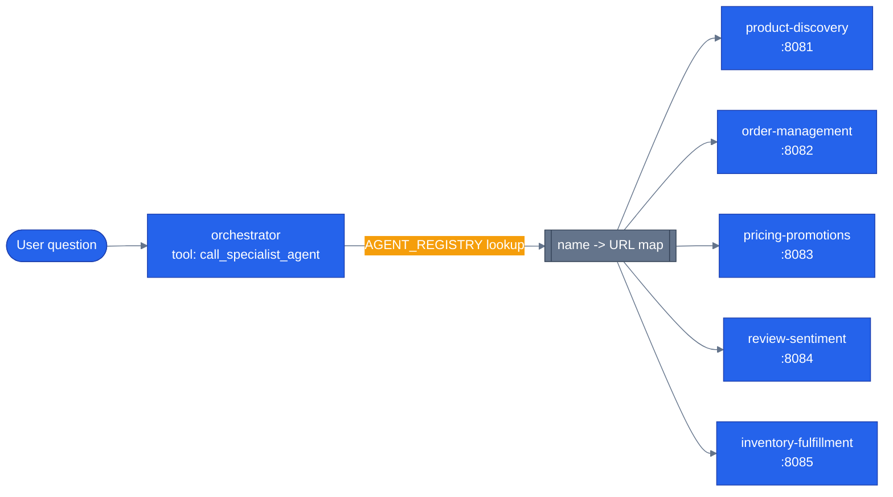

# Why multi-agent

> **New to this?** [The harness](https://nitinksingh.com/ai-resources/02-agents/the-harness/) on the AI Knowledge Hub covers the
> same ground from scratch, vendor-neutral, with a lab you can run locally for free.
> This page assumes the concept and shows how it is built *here*.

## What it is

A multi-agent system is more than one agent, each with its own narrower instructions and tool
set, that hand work to each other instead of one agent trying to do everything. "Multi-agent"
doesn't describe a specific mechanism — there are several different ways agents can hand off work
to each other, covered in [orchestration patterns](06-orchestration-patterns.md) — it just
describes the decision to split responsibilities across more than one agent in the first place.

## Why it matters

A single agent with every tool from every domain attached runs into real, specific problems as it
grows, not just "it feels big":

- **Tool sprawl.** A model has to choose the right tool out of whatever's on the list for every
  single call. Ten well-named, domain-specific tools is a fair choice. Fifty tools spanning
  product search, order management, pricing, reviews, and inventory is a much harder one — more
  tools that sound similar, more chances the model picks the wrong one.
- **Context limits.** Every tool's name, description, and schema takes up space in what the model
  sees on every single call, whether or not that tool gets used this turn. A monolithic agent pays
  that cost for every domain's tools, on every request, forever.
- **Conflicting instructions.** "Be concise" for order status and "be thorough" for product
  research are both reasonable instructions — for different jobs. Cramming both into one system
  prompt means picking a winner, or a mushy compromise that serves neither well.
- **Blast radius.** A prompt-injection attempt or a bug in one domain's tool shouldn't be able to
  touch a completely unrelated domain's data. One agent with everything attached means "one bug,
  everything's in scope." Several agents, each scoped to its own domain, means a compromise in one
  is contained to what that agent could already reach.

None of this is free to fix, either — and this is the part most before-and-after breakdowns skip.
Splitting into multiple agents adds real cost: **latency** (a request that used to be one model
call can now involve a routing decision plus a specialist call — two round trips instead of one),
**tokens** (every hop re-sends context), and a bigger **failure surface** (more services that can
be slow, down, or wrong). Multi-agent is a trade, not a strict upgrade — you're paying latency and
complexity to buy focus and containment.

## When to use it — and when not to

Split into multiple agents when the domains genuinely don't overlap and each has enough of its
own tools/instructions to be a real specialty — product search and order management are a clean
split in this repo because a customer question about "is this in stock" and a question about
"where's my package" need almost none of the same tools or context.

**Don't** split for its own sake. If two "specialties" would end up needing the same three tools
and near-identical instructions, that's one agent with a slightly longer tool list, not two agents
— you'd be paying the latency and token cost of a hop for a split that doesn't actually reduce
tool sprawl or contain any real blast radius.

## How it works here

This repo runs six agents: one orchestrator plus five specialists, each scoped to one domain —
`product-discovery`, `order-management`, `pricing-promotions`, `review-sentiment`,
`inventory-fulfillment`. Each is its own process (see [the agent harness](04-agent-harness.md)),
with its own `agent.py`/`tools.py`/`prompts.py`.

The orchestrator doesn't have domain tools at all — its only tool is
`call_specialist_agent`, defined at [`agents/python/orchestrator/agent.py`](https://github.com/nitin27may/e-commerce-agents/blob/main/agents/python/orchestrator/agent.py). It looks up
where a named specialist actually lives via `AGENT_REGISTRY`
(`agents/python/orchestrator/agent.py`), a flat `name -> base URL` map — parsed from
`shared.config.settings.AGENT_REGISTRY`, a JSON string set in the environment
(`.env.example:165`):

```json
{
  "product-discovery": "http://product-discovery:8081",
  "order-management": "http://order-management:8082",
  "pricing-promotions": "http://pricing-promotions:8083",
  "review-sentiment": "http://review-sentiment:8084",
  "inventory-fulfillment": "http://inventory-fulfillment:8085"
}
```

Calling a specialist means a real HTTP request to that URL's `/message:send` or `/message:stream`
(the same endpoints from [the agent harness](04-agent-harness.md)) — this is genuinely
inter-process, not a function call dressed up to look like one. That's the actual cost this page
warned about: every specialist call is a network round trip, with its own latency and its own
chance to fail ([`orchestrator/agent.py`](https://github.com/nitin27may/e-commerce-agents/blob/main/agents/python/orchestrator/agent.py) catches timeouts and HTTP errors around this call
and returns a plain-language error rather than crashing — see
[production concerns](14-production-concerns.md) for how far that error handling does and doesn't
go).



The orchestrator picking exactly one specialist per turn, via a tool call it decides to make, is
only *one* way to organize a multi-agent system — the next page covers the others this repo
actually implements and when each one wins.

Next: [orchestration patterns](06-orchestration-patterns.md).
