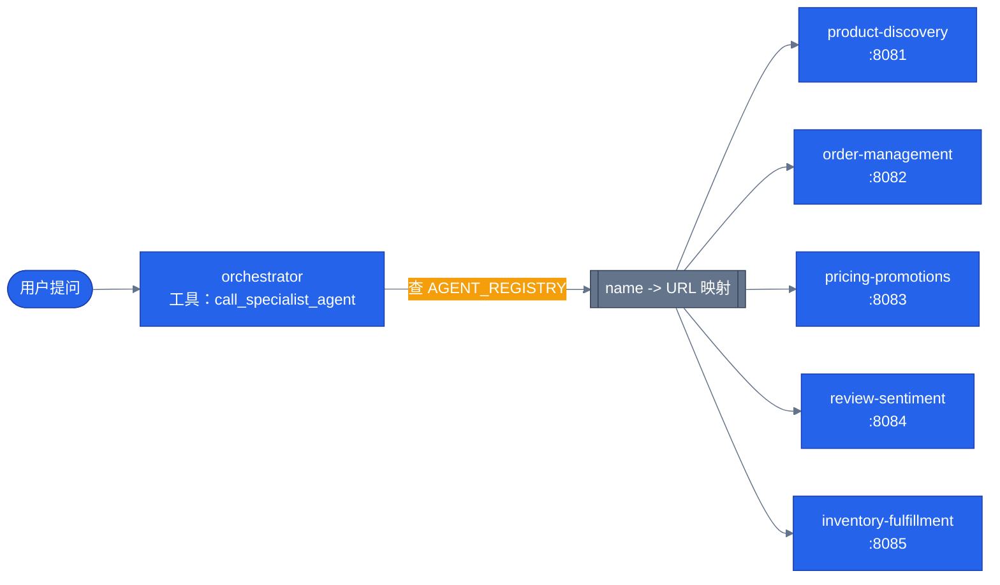

# 为什么要多智能体

> **初次接触？** 本页假定你已经了解这个概念，重点展示它在本项目中是如何实现的。

## 它是什么

多智能体系统就是不止一个智能体，每个都有自己更窄的指令和工具集，它们把工作交给彼此，而不是
由一个智能体试图包办一切。「多智能体」并不描述某种具体机制——智能体之间交接工作的方式有好
几种，见[编排模式](06-orchestration-patterns.md)——它只描述「决定把职责拆分到不止一个智能体上」
这个决定本身。

## 为什么重要

一个挂载了所有领域全部工具的单智能体，随着规模增长会撞上真实而具体的问题，而不只是「感觉
很大」：

- **工具泛滥。** 模型必须在每次调用时从列表里挑出正确的工具。十个命名良好、领域明确的工具是
  合理的选择；五十个横跨商品搜索、订单管理、定价、评论和库存的工具则难得多——听起来相似的
  工具更多，模型选错的概率也更高。
- **上下文限制。** 每个工具的名字、描述和模式，无论本轮是否用到，都会占用模型每次调用所见
  空间的一部分。单体式智能体要为每个领域的工具、在每次请求上、永远地支付这份成本。
- **指令冲突。** 订单状态要「简洁」、商品调研要「详尽」，都是合理的指令——但对应不同的工作。
  把两者塞进同一个系统提示词，就意味着必须选一个赢家，或者得到一个两边都不讨好的糊状折中。
- **影响范围。** 一次提示词注入尝试，或某个领域工具里的一个 bug，不应该能够触及一个完全无关
  领域的数据。一个挂载了所有东西的智能体意味着「一个 bug，全都在射程内」。多个各自限定在自己
  领域内的智能体，意味着一个环节被攻破时，影响被限制在该智能体本就能够触及的范围内。

这些问题的修复也都不是免费的——而这正是大多数「改造前后对比」会略过的部分。拆成多个智能体会
带来真实成本：**延迟**（过去一次模型调用就能完成的请求，现在可能涉及一次路由决策加一次专业
智能体调用——两次往返而不是一次）、**token**（每一跳都要重新发送上下文），以及更大的
**故障面**（更多服务可能变慢、宕机或出错）。多智能体是一种权衡，不是纯粹的升级——你付出延迟
和复杂度，换回聚焦与隔离。

## 什么时候用——什么时候不用

当各领域确实不重叠，且每个领域都有足够多的自有工具/指令构成真正的专精时，才拆成多个智能体
——商品搜索和订单管理在本仓库里是一个干净的分割，因为「这个还有货吗」和「我的包裹到哪了」
这两个客户问题，几乎不需要相同的工具或上下文。

**不要**为了拆而拆。如果两个「专精领域」最终需要同样那三个工具和几乎相同的指令，那它是一个
工具列表稍长一点的智能体，而不是两个智能体——你会为一次并不真正减少工具泛滥、也不隔离任何
真实影响范围的拆分，付出一次跳转的延迟和 token 成本。

## 本项目怎么实现

本仓库运行六个智能体：一个编排器加五个专业智能体，各自限定在一个领域——`product-discovery`、
`order-management`、`pricing-promotions`、`review-sentiment`、`inventory-fulfillment`。每个都是
独立进程（见[智能体运行框架](04-agent-harness.md)），有自己的 `agent.py`/`tools.py`/`prompts.py`。

编排器根本没有领域工具——它唯一的工具是 `call_specialist_agent`，定义在
[`agents/python/orchestrator/agent.py`](../../agents/python/orchestrator/agent.py)。它通过 `AGENT_REGISTRY`
（`agents/python/orchestrator/agent.py`）查找某个具名专业智能体实际所在的位置，这是一个扁平的
`name -> base URL` 映射——从 `shared.config.settings.AGENT_REGISTRY` 解析而来，后者是环境变量中
设置的一个 JSON 字符串（`.env.example:165`）：

```json
{
  "product-discovery": "http://product-discovery:8081",
  "order-management": "http://order-management:8082",
  "pricing-promotions": "http://pricing-promotions:8083",
  "review-sentiment": "http://review-sentiment:8084",
  "inventory-fulfillment": "http://inventory-fulfillment:8085"
}
```

调用一个专业智能体意味着向那个 URL 的 `/message:send` 或 `/message:stream` 发出真实的 HTTP
请求（就是[智能体运行框架](04-agent-harness.md)里那套端点）——这是真正的进程间通信，不是包装
成函数调用的样子。这正是本页前面警告过的那份真实成本：每次专业智能体调用都是一次网络往返，
有自己的延迟、也有自己的失败概率（
[`orchestrator/agent.py`](../../agents/python/orchestrator/agent.py) 在调用周围捕获超时和 HTTP 错误，返回一段平实的错误说明而不是
崩溃——这套错误处理走到了哪一步、没走到哪一步，见[生产环境关注点](14-production-concerns.md)）。


```mermaid
%%{init: {'theme':'base', 'themeVariables': {
  'primaryColor': '#2563eb','primaryTextColor': '#ffffff','primaryBorderColor': '#1e40af',
  'lineColor': '#64748b','secondaryColor': '#f59e0b','tertiaryColor': '#10b981',
  'background': 'transparent'}}}%%
flowchart LR
  classDef core     fill:#2563eb,stroke:#1e40af,color:#ffffff
  classDef infra    fill:#64748b,stroke:#334155,color:#ffffff

  user(["用户提问"]) --> orch["orchestrator<br/>工具：call_specialist_agent"]
  orch -->|查 AGENT_REGISTRY| registry[["name -> URL 映射"]]
  registry --> pd["product-discovery<br/>:8081"]
  registry --> om["order-management<br/>:8082"]
  registry --> pp["pricing-promotions<br/>:8083"]
  registry --> rs["review-sentiment<br/>:8084"]
  registry --> inv["inventory-fulfillment<br/>:8085"]

  class orch,pd,om,pp,rs,inv core
  class registry infra
```

编排器每轮通过一次它自行决定的工具调用、精确挑选一个专业智能体，这只是组织多智能体系统的
*一种*方式——下一页会介绍本仓库实际实现的其余方式，以及各自在什么情况下更优。

下一页：[编排模式](06-orchestration-patterns.md)。
