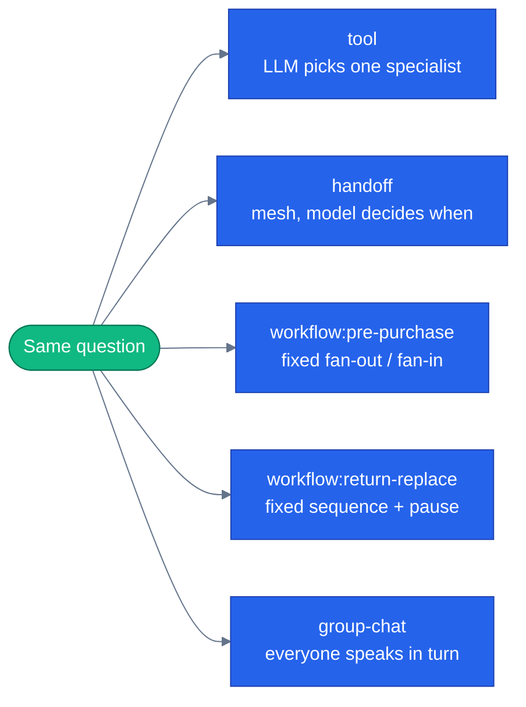

# Orchestration patterns

This is the centerpiece page. If you read nothing else in this concepts library, read this one —
it's the question practitioners actually have ("when do I use a router vs. a handoff vs. a
workflow?"), and it's unanswerable from a single isolated sample of any one pattern.

> **New to this?** [The harness](https://nitinksingh.com/ai-resources/02-agents/the-harness/) on the AI Knowledge Hub covers the
> same ground from scratch, vendor-neutral, with a lab you can run locally for free.
> This page assumes the concept and shows how it is built *here*.

## What it is

An orchestration pattern is *how* a multi-agent system decides who does what, and in what order.
[Why multi-agent](05-why-multi-agent.md) covered the reasons to split work across several agents;
this page covers the different mechanisms for actually coordinating them once you have. They are
not interchangeable — each makes a different trade between flexibility and predictability.

## Why it matters

"Multi-agent" is not one thing. A system where an LLM decides, per message, which specialist to
call is a completely different shape — with different failure modes, different guarantees, and a
different debugging experience — than a system where a fixed graph always runs the same five steps
in the same order. Picking the wrong pattern for a task shows up later as either "the model keeps
making a bad routing decision I can't easily override" (too much flexibility for a task that
needed a fixed sequence) or "I have to write a whole new code path every time the steps change"
(too little flexibility for a task that genuinely needed the model's judgment).

## When to use it — and when not to

Covered per-pattern below — the short version is: let the model decide when the right sequence of
steps genuinely depends on things you can't know in advance; fix the sequence when it doesn't.

## How it works here — five patterns, one endpoint

This repo runs the *same domain* — an e-commerce customer support and shopping assistant — through
five different orchestration mechanisms, selectable per request. That's the point: you can ask the
same question through each mode and compare, not just read about each one in isolation. The
registry is [`agents/python/orchestrator/modes/__init__.py`](https://github.com/nitin27may/e-commerce-agents/blob/main/agents/python/orchestrator/modes/__init__.py):

```python
MODES: dict[str, OrchestrationMode] = {
    "tool": ToolRouterMode(),
    "handoff": HandoffMode(),
    "workflow:pre-purchase": PrePurchaseMode(),
    "workflow:return-replace": ReturnReplaceMode(),
    "group-chat": GroupChatMode(),
}
```

Every mode implements the same `run()` contract ([`orchestrator/modes/base.py`](https://github.com/nitin27may/e-commerce-agents/blob/main/agents/python/orchestrator/modes/base.py)), so the web UI, the
`/api/chat` route, and the eval harness can all drive any of them identically — see
[`web/src/components/chat/mode-switcher.tsx`](https://github.com/nitin27may/e-commerce-agents/blob/main/web/src/components/chat/mode-switcher.tsx) and [`mode-comparison.tsx`](https://github.com/nitin27may/e-commerce-agents/blob/main/web/src/components/chat/mode-comparison.tsx) for the UI that lets you run
one prompt through several modes side by side, with real latency and token numbers.

### `tool` — LLM-driven routing (the default)

The orchestrator has one tool, `call_specialist_agent`, and decides per turn which specialist to
call and what to tell them — see [why multi-agent](05-why-multi-agent.md) for the actual
mechanism. This is the most flexible pattern and the least predictable: the model is making a
real decision every time, which is exactly right when the right specialist genuinely depends on
what the user asked, and exactly wrong when you need a guarantee that step B always follows step
A. [`orchestrator/modes/tool_router.py`](https://github.com/nitin27may/e-commerce-agents/blob/main/agents/python/orchestrator/modes/tool_router.py) describes it as wrapping "exactly what the chat route
did directly before this module existed" — it's the simplest mode, and the one every other mode
is compared against.

**Use it when:** the right next step depends on free-form user intent and the set of possible
next steps is open-ended. **Don't use it when:** you need a guarantee about what runs, in what
order, every time.

### `handoff` — a fixed mesh, LLM decides *when* to hand off

MAF's `HandoffBuilder` builds a mesh of participants where control mechanically passes from one
agent to another — the orchestrator doesn't decide *which* specialist via a tool call each turn;
instead, whichever agent currently holds the conversation decides when to hand it off to a
specific other participant in the mesh ([`orchestrator/modes/handoff_mode.py`](https://github.com/nitin27may/e-commerce-agents/blob/main/agents/python/orchestrator/modes/handoff_mode.py),
[`orchestrator/handoff.py`](https://github.com/nitin27may/e-commerce-agents/blob/main/agents/python/orchestrator/handoff.py)). This is a different flexibility trade than `tool` mode: the *mesh
topology* (who can hand off to whom) is fixed in advance, but *when* a handoff happens within
that topology is still the model's call.

**Use it when:** you want a bounded, known set of possible participants and transitions, but still
need the model to judge the right moment to switch. **Don't use it when:** `tool` mode's simpler
single-hop routing already covers the case — a mesh is more moving parts for the same outcome if
every request only ever needs one specialist.

### `workflow:pre-purchase` — fan-out / fan-in, no model routing at all

A fixed MAF `WorkflowBuilder` graph: one input fans out to three specialist checks running
concurrently (reviews, stock, price history), which fan back in to a single merge step, then a
synthesis step. No model decides the order or which steps run — every request runs the same graph.
See [graphs in agent systems](07-graphs-in-agent-systems.md) for exactly how this graph is built
and rendered live.

**Use it when:** the steps and their order are always the same, and some of them can genuinely run
in parallel — the model's judgment isn't needed to decide *whether* to check stock, only to
synthesize a *final answer* once every check is back. **Don't use it when:** the set of steps
actually needs to vary by request.

### `workflow:return-replace` — a sequential graph with a hard pause built in

Another fixed MAF workflow, this time sequential rather than fan-out: eligibility check, return
initiation, replacement search, an in-workflow approval gate for high-value returns, then loyalty
discount and finalize ([`orchestrator/modes/workflow_mode.py`](https://github.com/nitin27may/e-commerce-agents/blob/main/agents/python/orchestrator/modes/workflow_mode.py)). The approval gate is worth
its own page — see [human-in-the-loop](11-human-in-the-loop.md), which contrasts this mechanism
directly against [`shared/hitl.py`](https://github.com/nitin27may/e-commerce-agents/blob/main/agents/python/shared/hitl.py)'s middleware-based approach.

**Use it when:** the task is a fixed sequence *and* part of that sequence must be able to pause for
longer than a single request (waiting on a human, in this case) and resume later, possibly on a
different server. **Don't use it when:** nothing in the sequence needs to survive past the current
request.

### `group-chat` — every participant speaks, in order, on a shared transcript

Named panelists take turns over a shared transcript, each seeing what every prior speaker said,
followed by a moderator that synthesizes a verdict ([`orchestrator/modes/group_chat_mode.py`](https://github.com/nitin27may/e-commerce-agents/blob/main/agents/python/orchestrator/modes/group_chat_mode.py)).
This is structurally distinct from every pattern above: it isn't a fan-out (nothing runs
concurrently), it isn't an LLM tool router (no one decides *whether* a panelist speaks — every
panelist always speaks), and it isn't a handoff (control doesn't permanently transfer — it returns
to the transcript after each turn).

**Use it when:** a decision genuinely benefits from multiple named perspectives being visible to
each other, not just to the final synthesizer — e.g. "should I buy these headphones," where a
value-focused take and a quality-focused take might disagree, and seeing *both* is the point.
**Don't use it when:** you just need one correct answer and multiple viewpoints add noise, not
signal.

### What's missing

**Magentic** (a planner-executor pattern where a lead agent dynamically plans and assigns work to
a team, adjusting the plan as it learns) is not implemented in this repo yet. The mode registry's
own docstring flags this: `get_mode()` raises a clear, named error for `"magentic"` rather than
pretending it exists. It's tracked as a later addition, not silently missing.



Next: [graphs in agent systems](07-graphs-in-agent-systems.md) — how a fixed workflow like
`workflow:pre-purchase` is actually built and rendered.
