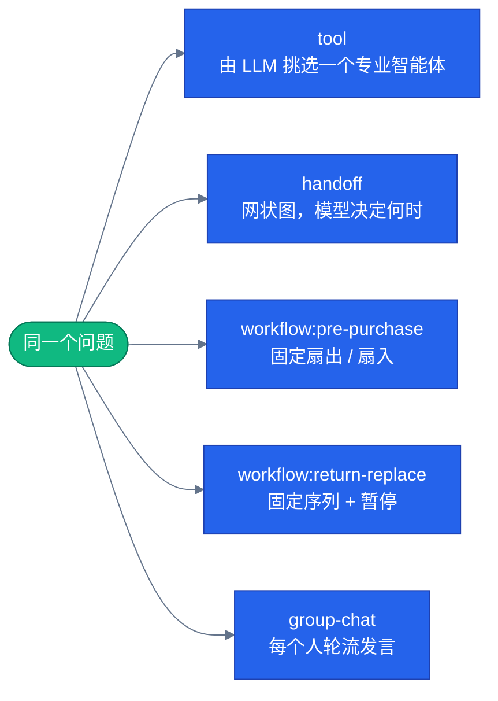

# 编排模式

本页是核心篇章。如果你在这套概念文档里只读一页，就读这一页——它回答的是从业者真正会问的问题
（「我什么时候该用路由、什么时候该用处理权交接、什么时候该用工作流？」），而这个问题靠孤立地
看任意一个模式的示例是回答不了的。

> **初次接触？** 本页假定你已经了解这个概念，重点展示它在本项目中是如何实现的。

## 它是什么

编排模式指的是多智能体系统*如何*决定谁做什么、以什么顺序做。[为什么要多智能体](05-why-multi-agent.md)
讲了把工作拆到多个智能体上的理由；本页讲的是拆完之后，协调它们的几种不同机制。它们不能互相
替代——每一种都在灵活性与可预测性之间做了不同的取舍。

## 为什么重要

「多智能体」并不是一件事。一个由大语言模型（LLM）逐条消息决定该调用哪个专业智能体的系统，
与一个固定图永远按同样顺序跑同样五个步骤的系统，形态完全不同——故障模式不同、保证不同、调试
体验也不同。给任务挑错模式，日后会表现为两种症状之一：「模型老是做出我难以覆盖的错误路由
决策」（对一个本需要固定序列的任务给了过多灵活性），或者「每次步骤一变我就得写一整条新代码
路径」（对一个确实需要模型判断的任务给了过少灵活性）。

## 什么时候用——什么时候不用

下面按模式分别说明——简短版本是：当正确的步骤顺序确实取决于你事先无法知道的东西时，让模型来
决定；当不取决于时，就把顺序固定下来。

## 本项目怎么实现——五种模式，一个端点

本仓库让*同一个领域*——一个电商客服与购物助手——跑过五种不同的编排机制，可按请求选择。这正是
关键：你可以把同一个问题分别用每种模式问一遍并做对比，而不只是孤立地读介绍。注册表在
[`agents/python/orchestrator/modes/__init__.py`](../../agents/python/orchestrator/modes/__init__.py)：

```python
MODES: dict[str, OrchestrationMode] = {
    "tool": ToolRouterMode(),
    "handoff": HandoffMode(),
    "workflow:pre-purchase": PrePurchaseMode(),
    "workflow:return-replace": ReturnReplaceMode(),
    "group-chat": GroupChatMode(),
}
```

每种模式都实现同一个 `run()` 契约（[`orchestrator/modes/base.py`](../../agents/python/orchestrator/modes/base.py)），因此 Web UI、
`/api/chat` 路由和评测运行框架都能以完全相同的方式驱动其中任何一种——让某个提示词并排跑过
多种模式、并显示真实延迟与 token 数字的界面，见
[`web/src/components/chat/mode-switcher.tsx`](../../web/src/components/chat/mode-switcher.tsx) 和 [`mode-comparison.tsx`](../../web/src/components/chat/mode-comparison.tsx)。

### `tool` —— 由 LLM 驱动的路由（默认）

编排器只有一个工具 `call_specialist_agent`，它每轮决定调用哪个专业智能体、以及告诉它什么——
实际机制见[为什么要多智能体](05-why-multi-agent.md)。这是最灵活、也最不可预测的模式：模型每
一次都在做真实的决策，当正确的专业智能体确实取决于用户问了什么时，这完全正确；当你需要保证
步骤 B 永远跟在步骤 A 之后时，这就完全错误。
[`orchestrator/modes/tool_router.py`](../../agents/python/orchestrator/modes/tool_router.py) 把它描述为「就是本模块出现之前聊天路由直接做的那件事」
的封装——它是最简单的模式，也是其他每种模式用来对比的基准。

**什么时候用：** 下一步是什么取决于自由形式的用户意图，且可能的下一步是开放集合。
**什么时候不用：** 你需要保证每次运行什么、按什么顺序运行。

### `handoff` —— 固定网状拓扑，由 LLM 决定*何时*交接

MAF 的 `HandoffBuilder` 构建一张参与者网状图，控制权会在智能体之间机械地传递——编排器不再每轮
通过工具调用来决定*哪个*专业智能体；取而代之的是，当前持有对话的智能体自己决定何时把它交给
网中的某个特定参与者（[`orchestrator/modes/handoff_mode.py`](../../agents/python/orchestrator/modes/handoff_mode.py)、
[`orchestrator/handoff.py`](../../agents/python/orchestrator/handoff.py)）。这与 `tool` 模式是不同的灵活性取舍：*网状拓扑*（谁能交给谁）
事先固定，但在这个拓扑内*何时*发生交接仍由模型决定。

**什么时候用：** 你想要一个有界、已知的可能参与者与转移集合，但仍需要模型判断切换的恰当时机。
**什么时候不用：** `tool` 模式更简单的单跳路由已经覆盖了该场景——如果每个请求永远只需要一个
专业智能体，网状图只是为同样的结果增加了更多活动部件。

### `workflow:pre-purchase` —— 扇出/扇入，完全没有模型路由

一条固定的 MAF `WorkflowBuilder` 图：一个输入扇出到三个并发运行的专业检查（评论、库存、价格
历史），它们再扇入合并到一个归并步骤，然后是一个综合步骤。没有任何模型决定顺序或哪些步骤运行
——每个请求都跑同一张图。这张图具体怎么构建、怎么实时渲染，见
[智能体系统中的图](07-graphs-in-agent-systems.md)。

**什么时候用：** 步骤及其顺序永远相同，且其中一些确实可以并行运行——决定*是否*要查库存不需要
模型判断，只需要在每项检查都返回后综合出一个*最终回答*。**什么时候不用：** 步骤集合确实需要随
请求变化。

### `workflow:return-replace` —— 带硬性暂停的顺序图

又一条固定的 MAF 工作流，这次是顺序而非扇出：资格校验、发起退货、换货搜索、针对高价值退货的
工作流内审批门，然后是会员折扣与收尾
（[`orchestrator/modes/workflow_mode.py`](../../agents/python/orchestrator/modes/workflow_mode.py)）。那个审批门值得单独一页——见
[人工参与](11-human-in-the-loop.md)，那里把这个机制与 [`shared/hitl.py`](../../agents/python/shared/hitl.py) 基于中间件的做法做了直接对比。

**什么时候用：** 任务是固定序列，*并且*序列中的某一部分必须能暂停得比单个请求更久（这里是在
等人），之后再恢复，而且可能在另一台服务器上恢复。**什么时候不用：** 序列中没有任何东西需要
活过当前请求。

### `group-chat` —— 每个参与者按顺序在共享记录上发言

具名的小组成员轮流在共享记录上发言，每个人都能看到此前每位发言者说了什么，最后由一位主持人
综合出结论（[`orchestrator/modes/group_chat_mode.py`](../../agents/python/orchestrator/modes/group_chat_mode.py)）。它与上面每一种模式在结构上都不同：
它不是扇出（没有东西并发运行），不是 LLM 工具路由（没人决定小组成员*是否*发言——每个成员
总是发言），也不是处理权交接（控制权不会永久转移——每轮之后都回到记录上）。

**什么时候用：** 一个决策确实受益于多个具名视角彼此可见，而不只是对最终综合者可见——比如
「我该不该买这副耳机」，一个侧重性价比的观点和一个侧重品质的观点可能相互矛盾，而*同时*看到
两者才是重点。**什么时候不用：** 你只需要一个正确答案，多视角带来的是噪声而不是信号。

### 尚缺的部分

**Magentic 动态编排**（一种规划器-执行器模式：由一个主导智能体动态规划并把工作分配给一个团队，
并随着了解的深入调整计划）在本仓库中尚未实现。模式注册表自己的文档字符串明确指出了这一点：
`get_mode()` 对 `"magentic"` 会抛出一个清晰、具名的错误，而不是假装它存在。它被记录为后续
新增项，而不是被悄悄略过。


```mermaid
%%{init: {'theme':'base', 'themeVariables': {
  'primaryColor': '#2563eb','primaryTextColor': '#ffffff','primaryBorderColor': '#1e40af',
  'lineColor': '#64748b','secondaryColor': '#f59e0b','tertiaryColor': '#10b981',
  'background': 'transparent'}}}%%
flowchart LR
  classDef core     fill:#2563eb,stroke:#1e40af,color:#ffffff
  classDef success  fill:#10b981,stroke:#047857,color:#ffffff
  classDef infra    fill:#64748b,stroke:#334155,color:#ffffff

  q(["同一个问题"]) --> tool["tool<br/>由 LLM 挑选一个专业智能体"]
  q --> handoff["handoff<br/>网状图，模型决定何时"]
  q --> fanout["workflow:pre-purchase<br/>固定扇出 / 扇入"]
  q --> seq["workflow:return-replace<br/>固定序列 + 暂停"]
  q --> gc["group-chat<br/>每个人轮流发言"]

  class q success
  class tool,handoff,fanout,seq,gc core
```

下一页：[智能体系统中的图](07-graphs-in-agent-systems.md) —— 像 `workflow:pre-purchase` 这样的
固定工作流实际上是怎么构建和渲染的。
