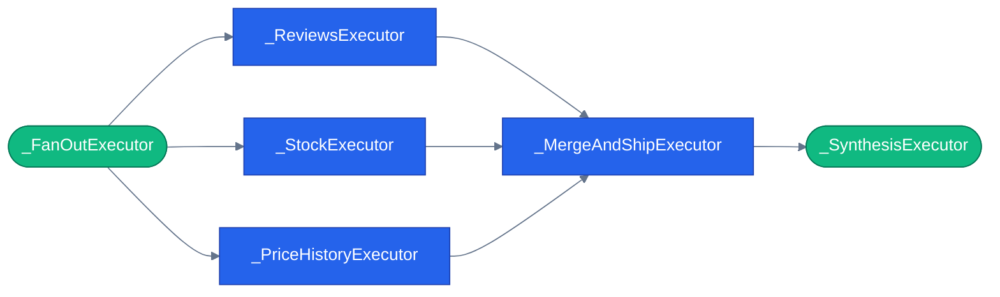

# Graphs in agent systems

> **New to this?** [The agent loop](https://nitinksingh.com/ai-resources/02-agents/the-agent-loop/) on the AI Knowledge Hub covers the
> same ground from scratch, vendor-neutral, with a lab you can run locally for free.
> This page assumes the concept and shows how it is built *here*.

## What it is

A graph, in this context, is a fixed structure of **nodes** (units of work — here, "executors":
plain classes that do one job, like "check stock" or "merge results") connected by **edges**
(which node's output feeds which node's input). Once built, the graph's shape doesn't change per
request — every run walks the same nodes in the same order, except where the graph explicitly
allows branching or concurrency.

This is a different idea from an if/else ladder even though both are "fixed logic," because a
graph makes the *shape* of the computation a first-class, inspectable thing: you can list every
node, list every edge, and render the whole thing as a diagram, without executing it. An if-ladder
buried across several functions can't be inspected that way — you'd have to read the code to
reconstruct the shape.

## Why it matters

Once a system has more than a handful of fixed steps, an if-ladder starts hiding real structure.
Consider "check reviews, check stock, and check price history, then merge all three before
answering" — as nested conditionals and sequential calls, it's not obvious from a glance that the
three checks *can* run concurrently and don't depend on each other, or where exactly the "wait for
all three" point is. As a graph with an explicit fan-out to three nodes and a fan-in back to one,
that structure is the *definition*, not an inference you have to make from reading imperative code.

Graphs also buy you things imperative code doesn't get for free: automatic parallelism (the fan-out
above runs three nodes concurrently just by being drawn that way — the runtime doesn't need to be
told to use `asyncio.gather`), a natural place to persist progress mid-run (checkpoint after any
node — see [state, memory, and sessions](08-state-memory-and-sessions.md)), and a structure you can
render as a live diagram instead of describing in prose.

## When to use it — and when not to

Reach for a graph when the steps and their dependencies are fixed and you want that structure to
be explicit and inspectable — especially once concurrency or a mid-run pause enters the picture.
[Orchestration patterns](06-orchestration-patterns.md) covers `workflow:pre-purchase` and
`workflow:return-replace`, the two modes in this repo built this way.

**Don't** reach for a graph when the sequence of steps genuinely needs to vary per request based
on the model's judgment — that's what `tool` or `handoff` mode are for. A graph's whole value is
that its shape is fixed; forcing a graph to encode "sometimes step B, sometimes step C, depending
on what the model decides" usually means smuggling a router back in through conditional edges,
at which point you've built the flexibility of `tool` mode with more ceremony.

## How it works here

[`workflows/pre_purchase.py`](https://github.com/nitin27may/e-commerce-agents/blob/main/agents/python/workflows/pre_purchase.py) is a real fan-out/fan-in graph. Six executor classes, each a small,
focused unit of work:

```python
# agents/python/workflows/pre_purchase.py
class _FanOutExecutor(Executor):        # line 49 — kicks off the three parallel checks
class _ReviewsExecutor(Executor):       # line 60
class _StockExecutor(Executor):         # line 79
class _PriceHistoryExecutor(Executor):  # line 98
class _MergeAndShipExecutor(Executor):  # line 117 — waits for all three, merges
class _SynthesisExecutor(Executor):     # line 148 — final answer
```

And the edges that connect them, `_build_maf_workflow()` at line 229:

```python
# agents/python/workflows/pre_purchase.py
return (
    WorkflowBuilder(start_executor=fan_out, name="pre-purchase")
    .add_fan_out_edges(fan_out, [reviews, stock, price])
    .add_fan_in_edges([reviews, stock, price], merge)
    .add_edge(merge, synthesis)
    .build()
)
```

Read that literally: one start node, fanning out to three nodes that run concurrently, fanning
back in to one merge node, then a plain edge to synthesis. That's the entire shape of the
workflow — no hidden branching, nothing else going on.

This graph isn't just internal structure — it's rendered live. `PrePurchaseMode.graph_mermaid()`
([`orchestrator/modes/workflow_mode.py`](https://github.com/nitin27may/e-commerce-agents/blob/main/agents/python/orchestrator/modes/workflow_mode.py)) returns a Mermaid string built from the *same*
executor ids used at runtime, and the web UI ([`web/src/components/chat/orchestration-graph.tsx`](https://github.com/nitin27may/e-commerce-agents/blob/main/web/src/components/chat/orchestration-graph.tsx))
fetches that string and re-applies the house palette client-side (lines 20-23) to animate nodes
from idle → active → done as real `event: node` SSE frames arrive during a run. The id convention
that makes this correlation possible — dashes in an executor id become underscores in the Mermaid
node id, and back — is implemented on both sides deliberately, not by coincidence:
`workflow_mode.py`'s comment explains the graph-side half, `toMermaidId()`
([`orchestration-graph.tsx`](https://github.com/nitin27may/e-commerce-agents/blob/main/web/src/components/chat/orchestration-graph.tsx)) is the client-side half.

**Not every mode has a graph.** `is_graph=True`/`False` on each mode's `capabilities`
([`orchestrator/modes/base.py`](https://github.com/nitin27may/e-commerce-agents/blob/main/agents/python/orchestrator/modes/base.py)) is an honest signal, not a formality: `tool` mode
(`tool_router.py`) and `handoff` mode (`handoff_mode.py`) both set `is_graph=True` or
`False` correctly, but only three of the five registered modes — `workflow:pre-purchase`,
`workflow:return-replace`, and `group-chat` — actually implement `graph_mermaid()` with real
output. `tool_router.py` and `handoff_mode.py` both return `None`: a plain LLM tool
router has no fixed graph to draw (the "graph" is different on every request, since the model
decides it), and `handoff`'s mesh doesn't render a live diagram yet even though its topology is
fixed — a real gap, not a design choice, tracked rather than glossed over.



Next: [state, memory, and sessions](08-state-memory-and-sessions.md) — including how a paused
graph like `workflow:return-replace`'s survives past the request that paused it.
