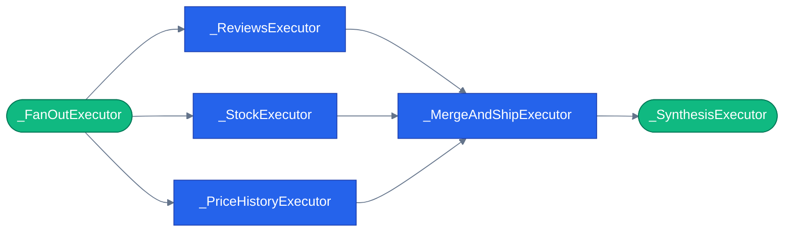

# 智能体系统中的图

> **初次接触？** 本页假定你已经了解这个概念，重点展示它在本项目中是如何实现的。

## 它是什么

在这个语境下，图（graph）是一种固定的结构：**节点**（工作单元——这里指「执行器」：只做一件事
的普通类，比如「查库存」或「合并结果」）由**边**（哪个节点的输出喂给哪个节点的输入）连接。一旦
构建完成，图的形状就不会随请求变化——每次运行都按相同顺序走过相同的节点，除非图明确允许分支
或并发。

这与 if/else 阶梯是不同的概念，尽管两者都是「固定逻辑」，因为图让计算的*形状*成为一等、可检查
的东西：你可以列出每个节点、每条边，并把整体渲染成一张图，而无需执行它。散落在多个函数里的
if 阶梯无法这样被检查——你必须读代码才能重建出形状。

## 为什么重要

一旦系统有超过一小撮固定步骤，if 阶梯就开始掩盖真实结构。想想「查评论、查库存、查价格历史，
然后在回答前把三者合并」——写成嵌套条件和顺序调用时，一眼看不出这三项检查*可以*并发运行、
彼此不依赖，也看不出「等三项都完成」这一点究竟在哪。写成一张带显式扇出到三个节点、再扇入回
一个节点的图，这个结构就是*定义本身*，而不是你必须读命令式代码才能推断出来的东西。

图还能给你一些命令式代码无法免费获得的东西：自动并行（上面那个扇出仅仅因为画成这样，三个
节点就并发运行——运行框架不需要被额外告知去用 `asyncio.gather`）、运行中途持久化进度的自然
位置（任意节点之后都可打检查点——见[状态、记忆与会话](08-state-memory-and-sessions.md)），以及
一个可以渲染成实时图、而不必用文字描述的结构。

## 什么时候用——什么时候不用

当步骤及其依赖关系固定、且你希望这个结构显式且可检查时，就用图——尤其是当并发或运行中途暂停
进入画面之后。[编排模式](06-orchestration-patterns.md)介绍了 `workflow:pre-purchase` 和
`workflow:return-replace`，本仓库中以这种方式构建的两种模式。

**不要**在步骤顺序确实需要根据模型判断随请求变化时用图——那是 `tool` 或 `handoff` 模式的用武
之地。图的全部价值就在于它的形状是固定的；强迫图去表达「有时步骤 B、有时步骤 C，取决于模型
怎么决定」，通常意味着通过条件边偷偷把一个路由器塞回来，到那时你就是用更多的繁文缛节实现了
`tool` 模式的灵活性。

## 本项目怎么实现

[`workflows/pre_purchase.py`](../../agents/python/workflows/pre_purchase.py) 是一张真实的扇出/扇入图。六个执行器类，每一个都是一个
小的、聚焦的工作单元：

```python
# agents/python/workflows/pre_purchase.py
class _FanOutExecutor(Executor):        # 第 49 行 —— 启动三项并行检查
class _ReviewsExecutor(Executor):       # 第 60 行
class _StockExecutor(Executor):         # 第 79 行
class _PriceHistoryExecutor(Executor):  # 第 98 行
class _MergeAndShipExecutor(Executor):  # 第 117 行 —— 等待三项全部完成并合并
class _SynthesisExecutor(Executor):     # 第 148 行 —— 最终回答
```

连接它们的边，`_build_maf_workflow()` 在第 229 行：

```python
# agents/python/workflows/pre_purchase.py
return (
    WorkflowBuilder(start_executor=fan_out, name="pre-purchase")
    .add_fan_out_edges(fan_out, [reviews, stock, price])
    .add_fan_in_edges([reviews, stock, price], merge)
    .add_edge(merge, synthesis)
    .build()
)
```

直白地读：一个起始节点，扇出到三个并发运行的节点，再扇入合并到一个归并节点，然后一条普通边
连到综合节点。这就是这条工作流的全部形状——没有隐藏分支，没有别的东西。

这张图不只是内部结构——它会被实时渲染。`PrePurchaseMode.graph_mermaid()`
（[`orchestrator/modes/workflow_mode.py`](../../agents/python/orchestrator/modes/workflow_mode.py)）返回一段 Mermaid 字符串，由运行时使用的*同一批*
执行器 id 构建，Web UI（[`web/src/components/chat/orchestration-graph.tsx`](../../web/src/components/chat/orchestration-graph.tsx)）获取该字符串
并在客户端重新套用项目配色（第 20-23 行），在一次运行中真实的 `event: node` SSE 帧到达时，把
节点从空闲 → 活跃 → 完成依次动画展示。让这种对应关系得以成立的 id 约定——执行器 id 里的连字符
在 Mermaid 节点 id 里变成下划线，再变回来——是两端刻意实现的，不是巧合：`workflow_mode.py` 的
注释解释了图这一半，`toMermaidId()`
（[`orchestration-graph.tsx`](../../web/src/components/chat/orchestration-graph.tsx)）是客户端那一半。

**并非每种模式都有图。** 每种模式的 `capabilities` 上的 `is_graph=True`/`False`
（[`orchestrator/modes/base.py`](../../agents/python/orchestrator/modes/base.py)）是一个诚实的信号，不是形式主义：`tool` 模式
（`tool_router.py`）和 `handoff` 模式（`handoff_mode.py`）都正确设置了 `is_graph=True` 或
`False`，但五个已注册模式中只有三个——`workflow:pre-purchase`、`workflow:return-replace` 和
`group-chat`——真正实现了有真实输出的 `graph_mermaid()`。`tool_router.py` 和 `handoff_mode.py`
都返回 `None`：一个普通的 LLM 工具路由器没有固定图可画（每个请求的「图」都不同，因为由模型
决定），而 `handoff` 的网状图尽管拓扑固定，却还没有渲染成实时图——这是一个真实的缺口，不是
设计取舍，被记录在案而不是被粉饰过去。


```mermaid
%%{init: {'theme':'base', 'themeVariables': {
  'primaryColor': '#2563eb','primaryTextColor': '#ffffff','primaryBorderColor': '#1e40af',
  'lineColor': '#64748b','secondaryColor': '#f59e0b','tertiaryColor': '#10b981',
  'background': 'transparent'}}}%%
flowchart LR
  classDef core     fill:#2563eb,stroke:#1e40af,color:#ffffff
  classDef success  fill:#10b981,stroke:#047857,color:#ffffff

  fanout(["_FanOutExecutor"]) --> reviews["_ReviewsExecutor"]
  fanout --> stock["_StockExecutor"]
  fanout --> price["_PriceHistoryExecutor"]
  reviews --> merge["_MergeAndShipExecutor"]
  stock --> merge
  price --> merge
  merge --> synth(["_SynthesisExecutor"])

  class fanout,synth success
  class reviews,stock,price,merge core
```

下一页：[状态、记忆与会话](08-state-memory-and-sessions.md) —— 包括像 `workflow:return-replace`
这样被暂停的图，如何活过暂停它的那个请求。
