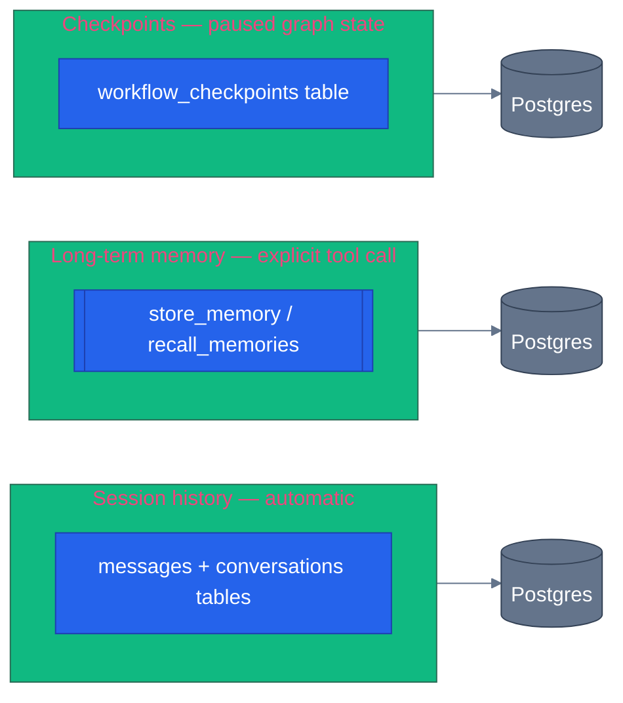

# State, memory, and sessions

> **New to this?** [Context engineering](https://nitinksingh.com/ai-resources/02-agents/context-engineering/) on the AI Knowledge Hub covers the
> same ground from scratch, vendor-neutral, with a lab you can run locally for free.
> This page assumes the concept and shows how it is built *here*.

## What it is

Three genuinely different mechanisms get called "memory" in casual conversation about agents, and
conflating them is a common source of confusion:

1. **Session history** — what was said earlier in *this* conversation. Automatic, short-lived
   (scoped to one conversation), and the model never has to ask for it — it's just part of the
   context on the next turn.
2. **Long-term memory** — a specific fact worth keeping *across* conversations, like "this user
   prefers eco-friendly packaging." Not automatic — something (usually the model itself, via a
   tool) decides a fact is worth persisting, separately from the moment-to-moment conversation.
3. **Checkpoints** — a snapshot of a workflow graph's execution state, so a multi-step run can
   pause and resume later, possibly in a different process entirely. This isn't about
   conversation content at all — it's about *where a graph was* when it stopped.

## Why it matters

An agent is stateless by default — every call to the model is independent unless something
explicitly reconstructs context for it. Without session history, every message would restart the
conversation from nothing ("what was my order number again?" — asked three times). Without
long-term memory, every conversation would rediscover the same preferences from scratch. Without
checkpoints, a workflow that needs to pause for something slow (a human's approval, in this repo's
case — see [human-in-the-loop](11-human-in-the-loop.md)) would have nowhere to put its
in-progress state, and would have to either block a request open indefinitely or restart from
the beginning on resume.

Treating these three as one thing causes real bugs: caching "memory" at the session-history layer
means it vanishes the moment the conversation ends, even though the fact should have outlived it.
Trying to resume a paused workflow from session history instead of a real checkpoint means losing
exactly the execution-position information a checkpoint exists to preserve.

## When to use it — and when not to

Use session history for anything scoped to the current conversation only. Use long-term memory
for a fact specific enough and durable enough to matter in a *future* conversation — not every
detail is worth this; a one-off search query isn't a preference. Use checkpoints only when a
graph genuinely needs to survive past the request that's currently running it — a workflow that
never pauses doesn't need them.

## How it works here — three mechanisms, three files

**Session history** — [`shared/session.py`](https://github.com/nitin27may/e-commerce-agents/blob/main/agents/python/shared/session.py) (250 lines). A MAF `AgentSession` is a lightweight
state holder; `HistoryProvider` subclasses read and write the actual conversation turns, invoked
automatically via `before_run`/`after_run` hooks (module docstring, lines 1-19) — the agent code
never manually fetches history, it just happens. Three swappable backends selected by
`settings.MAF_SESSION_BACKEND`: `postgres` (the real `messages`/`conversations` tables — what
production actually uses), `file` (JSONL, dev only), `memory` (in-process, tests only).

**Long-term memory** — [`shared/tools/memory_tools.py`](https://github.com/nitin27may/e-commerce-agents/blob/main/agents/python/shared/tools/memory_tools.py) (80 lines), and it's *not* automatic — it's
two ordinary tools the model chooses to call, following the exact `@tool` +
`Annotated[..., Field(...)]` pattern from [tools](03-tools.md):

```python
# agents/python/shared/tools/memory_tools.py
@tool(name="store_memory", description="Store a memory about the current user's preferences, behavior, or feedback for future reference.")
async def store_memory(
    category: Annotated[str, Field(description="Memory category: preference, behavior, feedback, or context")],
    content: Annotated[str, Field(description="The memory content to store")],
    importance: Annotated[int, Field(description="Importance score from 1 (low) to 10 (high)")] = 5,
) -> dict:
```

`recall_memories` (line 39) is the read side. Both are attached to `product-discovery` and
`review-sentiment`'s tool lists — the model decides, mid-conversation, that something is worth
remembering (or worth recalling before answering) by calling these tools, exactly like it decides
to call `search_products`. This is the piece that survives past the conversation that created it —
a fact stored today is available in a conversation next week.

**Checkpoints** — [`shared/checkpoint_storage.py`](https://github.com/nitin27may/e-commerce-agents/blob/main/agents/python/shared/checkpoint_storage.py) (175 lines), `PostgresCheckpointStorage` at
line 34. Reads and writes a real `workflow_checkpoints` table, encoding each checkpoint with MAF's
own `encode_checkpoint_value` so the wire format matches what MAF's file-based checkpoint storage
would have written — this repo just keeps it in Postgres instead of on disk (module docstring,
lines 1-10). This is what makes `workflow:return-replace`'s in-workflow approval pause (see
[human-in-the-loop](11-human-in-the-loop.md)) actually durable: the paused workflow's exact
execution position is written to Postgres, and a *completely different* HTTP request — possibly
served by a different process — can resume it later by reading that checkpoint back, not by
holding the original request open.



All three end up in the same Postgres database, which is exactly why it's worth being precise
about which one you mean — they're different tables, different lifecycles, and different code
paths, not three names for the same row.

Next: [grounding and RAG](09-grounding-and-rag.md) — why a model can produce a confident-sounding
answer that's still wrong, and what this repo checks before trusting one.
