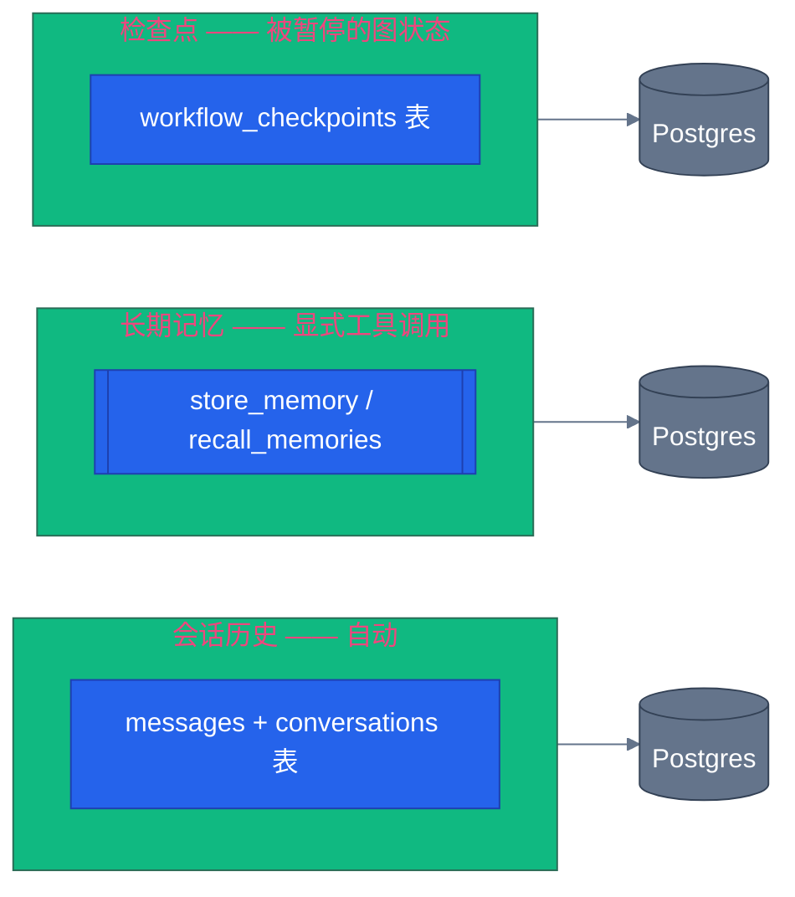

# 状态、记忆与会话

> **初次接触？** 本页假定你已经了解这个概念，重点展示它在本项目中是如何实现的。

## 它是什么

在关于智能体的日常讨论中，有三种截然不同的机制都被叫做「记忆」，把它们混为一谈是常见的困惑
来源：

1. **会话历史** —— *本次*对话中此前说过什么。自动、短命（作用域为一次对话），模型从不需要主动
   索取——它只是下一轮上下文的一部分。
2. **长期记忆** —— 值得*跨*对话保留的具体事实，比如「这位用户偏好环保包装」。它不是自动的
   ——由某个东西（通常是模型自己，通过工具）判断某个事实值得持久化，与当下的对话分开。
3. **检查点** —— 工作流图执行状态的快照，使一次多步运行可以暂停、之后再恢复，甚至可能在完全
   不同的进程里恢复。这与对话内容完全无关——它关乎图停下时*走到了哪里*。

## 为什么重要

智能体默认是无状态的——除非有东西显式地为它重建上下文，否则每次对模型的调用都是独立的。没有
会话历史，每条消息都会让对话从零重启（「我的订单号是多少来着？」——问了三遍）。没有长期记忆，
每段对话都要从零重新发现同样的偏好。没有检查点，一条需要为某个慢操作而暂停的工作流（在本仓库
里是人工审批——见[人工参与](11-human-in-the-loop.md)）就无处存放它进行中的状态，只能要么无限期
挂住一个请求，要么在恢复时从头重跑。

把这三者当成一回事会造成真实的 bug：把「记忆」缓存到会话历史层，意味着对话一结束它就消失了，
尽管这个事实本应比对话活得更久。想用会话历史而不是真正的检查点来恢复被暂停的工作流，恰恰会
丢掉检查点存在的意义所在——执行位置信息。

## 什么时候用——什么时候不用

只作用于当前对话的内容用会话历史。足够具体、足够持久、会在*未来*对话中起作用的事实，才用长期
记忆——不是每个细节都值得，一次性的搜索查询不是偏好。只有当图确实需要活过当前正在运行它的那个
请求时，才用检查点——从不暂停的工作流不需要它们。

## 本项目怎么实现——三种机制，三个文件

**会话历史** —— [`shared/session.py`](../../agents/python/shared/session.py)（250 行）。MAF 的 `AgentSession` 是一个轻量状态
容器；`HistoryProvider` 的子类读写真正的对话轮次，通过 `before_run`/`after_run` 钩子自动被调用
（模块文档字符串，第 1-19 行）——智能体代码从不手动获取历史，它自然发生。由
`settings.MAF_SESSION_BACKEND` 选择三种可替换后端：`postgres`（真实的 `messages`/`conversations`
表——生产环境实际使用的）、`file`（JSONL，仅开发）、`memory`（进程内，仅测试）。

**长期记忆** —— [`shared/tools/memory_tools.py`](../../agents/python/shared/tools/memory_tools.py)（80 行），它*不是*自动的——它是
模型选择调用的两个普通工具，遵循[工具](03-tools.md)里那套完全相同的 `@tool` +
`Annotated[..., Field(...)]` 模式：

```python
# agents/python/shared/tools/memory_tools.py
@tool(name="store_memory", description="Store a memory about the current user's preferences, behavior, or feedback for future reference.")
async def store_memory(
    category: Annotated[str, Field(description="Memory category: preference, behavior, feedback, or context")],
    content: Annotated[str, Field(description="The memory content to store")],
    importance: Annotated[int, Field(description="Importance score from 1 (low) to 10 (high)")] = 5,
) -> dict:
```

`recall_memories`（第 39 行）是读取侧。两者都被挂到 `product-discovery` 和 `review-sentiment`
的工具列表上——模型在对话中途，通过调用这些工具来判断某件事值得记住（或值得在回答前回想），
就像它判断要调用 `search_products` 一样。这正是能活过创建它的那段对话的部分——今天存下的事实，
下周的一段对话里依然可用。

**检查点** —— [`shared/checkpoint_storage.py`](../../agents/python/shared/checkpoint_storage.py)（175 行），`PostgresCheckpointStorage` 在
第 34 行。读写真实的 `workflow_checkpoints` 表，用 MAF 自己的 `encode_checkpoint_value` 编码
每个检查点，使线上格式与 MAF 基于文件的检查点存储会写出的格式一致——本仓库只是把它存在
Postgres 里而不是磁盘上（模块文档字符串，第 1-10 行）。这正是让 `workflow:return-replace` 的
工作流内审批暂停（见[人工参与](11-human-in-the-loop.md)）真正持久的原因：被暂停工作流的确切
执行位置被写入 Postgres，而一个*完全不同*的 HTTP 请求——可能由另一个进程处理——之后可以通过
读回那个检查点来恢复它，而不是把原请求一直挂着。


```mermaid
%%{init: {'theme':'base', 'themeVariables': {
  'primaryColor': '#2563eb','primaryTextColor': '#ffffff','primaryBorderColor': '#1e40af',
  'lineColor': '#64748b','secondaryColor': '#f59e0b','tertiaryColor': '#10b981',
  'background': 'transparent'}}}%%
flowchart LR
  classDef core  fill:#2563eb,stroke:#1e40af,color:#ffffff
  classDef infra fill:#64748b,stroke:#334155,color:#ffffff

  subgraph history["会话历史 —— 自动"]
    h1["messages + conversations 表"]
  end
  subgraph memory["长期记忆 —— 显式工具调用"]
    m1[["store_memory / recall_memories"]]
  end
  subgraph checkpoints["检查点 —— 被暂停的图状态"]
    c1["workflow_checkpoints 表"]
  end

  history --> pg1[("Postgres")]
  memory --> pg2[("Postgres")]
  checkpoints --> pg3[("Postgres")]

  class h1,m1,c1 core
  class pg1,pg2,pg3 infra
```

三者最终都落在同一个 Postgres 数据库里，这恰恰是值得说清你指的是哪一个的原因——它们是不同的
表、不同的生命周期、不同的代码路径，而不是同一行的三个名字。

下一页：[事实核验与 RAG](09-grounding-and-rag.md) —— 为什么模型能给出一个听起来很确定但依然错误
的答案，以及本仓库在信任它之前会检查什么。
