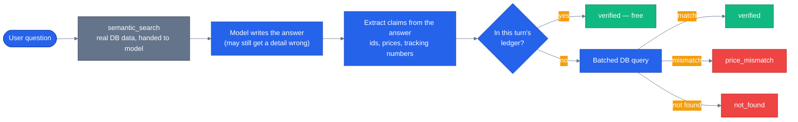

# Grounding and RAG

> **New to this?** [Retrieval](https://nitinksingh.com/ai-resources/02-agents/retrieval/) on the AI Knowledge Hub covers the
> same ground from scratch, vendor-neutral, with a lab you can run locally for free.
> This page assumes the concept and shows how it is built *here*.

## What it is

A language model produces the most statistically plausible next words given everything it's seen
so far — it does not, and structurally cannot, distinguish "I recall this fact" from "this sounds
like the kind of thing that would be true here." **Fabrication** (often called "hallucination") is
what happens when the second kind of output looks exactly as confident as the first. **Retrieval**
(the "R" in RAG, retrieval-augmented generation) is giving the model real data to read before it
answers, so it has something true to draw from instead of only its training data. **Grounding** is
verifying, after the model has answered, that specific claims in its answer actually match real
data — retrieval and grounding are not the same step, and conflating them is the single biggest
gap this page exists to close.

## Why it matters

Retrieval alone doesn't guarantee a truthful answer — it only guarantees the model *had access* to
true information. A model can be handed a real product's real price in a tool result and still
write a *different* number in its final sentence, because the sentence is still generated the same
way every other sentence is: as the most plausible continuation, not as a database lookup. The gap
between "the tool returned the right answer" and "the model's prose repeated the right answer" is
exactly where fabrication survives retrieval. Grounding is the step that closes that specific gap
— checking the model's actual output against what the tools actually returned, not just trusting
that having good data available produced a good answer.

## When to use it — and when not to

Retrieval earns its cost whenever the model needs to reason about something outside its training
data — current prices, this user's orders, anything that changes after the model was trained.
Grounding verification earns its cost specifically when the model's output contains **checkable,
specific claims** — a product id, a price, an order status — because those are exactly the claims
where "sounds right" and "is right" can silently diverge. A purely conversational reply with no
specific factual claims ("happy to help — what are you looking for?") has nothing to verify, and
this repo's own grounding pipeline treats that as free, not as a claim that failed to verify — see
below.

## How it works here

`product_discovery/tools.py::semantic_search` (lines 159-196) is the retrieval half: it embeds the
user's query and runs a pgvector cosine-similarity search against `product_embeddings`
(`ORDER BY pe.embedding <=> $1::vector`) — real data, handed to the model as a tool result, for
descriptive queries a plain keyword search would miss ("something cozy for winter").

The verification half is `shared/grounding/verifier.py::verify_claims()`:

```python
# agents/python/shared/grounding/verifier.py
async def verify_claims(
    claims: ExtractedClaims,
    ledger: GroundingLedger | None,
    pool: asyncpg.Pool | None,
) -> GroundingReport:
```

It runs in three tiers, cheapest first: check the claim against a **ledger** of facts this same
turn's tool calls already surfaced (free — no DB hit), fall back to a **live database query** for
anything the ledger didn't cover, and fold **consistency** checking into both — a real id with the
wrong price attached scores `price_mismatch`, not `verified`. A response with no checkable claims
at all scores as fully grounded, not as a failure — there's nothing to disprove. This is what
closes the gap the paragraph above described: it isn't asking "did retrieval happen," it's asking
"does what the model actually wrote match what came back from the database."

This runs on every real request via `GroundingVerificationMiddleware`, wired into
`build_specialist_middleware()` (see [guardrails](10-guardrails.md) for the full middleware
stack), and the result is visible in the product UI: [`web/src/components/chat/grounding-badge.tsx`](https://github.com/nitin27may/e-commerce-agents/blob/main/web/src/components/chat/grounding-badge.tsx)
renders "N facts verified against the database, M unverified" under any message that made a
checkable claim, expandable to see exactly which claim and why.



Next: [guardrails](10-guardrails.md) — grounding catches fabricated *facts*; guardrails are the
separate layer that catches malicious or unauthorized *inputs*.
