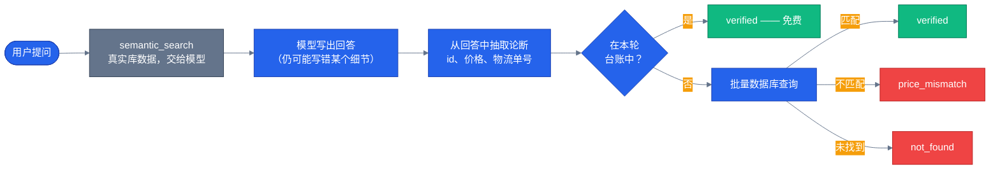

# 事实核验与 RAG

> **初次接触？** 本页假定你已经了解这个概念，重点展示它在本项目中是如何实现的。

## 它是什么

大语言模型（LLM）会产出在它此前所见内容下统计上最像样的后续词——它无法、且从结构上就无法区分
「我记得这个事实」和「这听起来像是那种在这里会成立的说法」。**编造**（常被称为「幻觉」）发生在
后一类输出看起来和前一类一样自信的时候。**检索**（RAG 中的 R，检索增强生成）是在模型作答之前
给它真实数据去读，让它有真实的东西可依据，而不只是训练数据。**事实核验（grounding）**是在模型
作答之后，核实其回答中具体的论断是否确实与真实数据相符——检索和事实核验不是同一步，把它们
混为一谈正是本页要弥合的最大缺口。

## 为什么重要

只有检索并不能保证答案真实——它只保证模型*接触到*了真实信息。一个模型可以拿到某个商品真实价格
的工具结果，却仍然在最后一句里写下*另一个*数字，因为那句话依然和其他所有句子一样被生成：作为
最像样的续写，而不是一次数据库查询。「工具返回了正确答案」与「模型的文字复述了正确答案」之间
的差距，正是编造得以在检索之后存活的地方。事实核验就是弥合这个具体缺口的一步——把模型的实际
输出与工具实际返回的内容做比对，而不是仅仅相信「有好的数据可用」就产生了好的答案。

## 什么时候用——什么时候不用

只要模型需要就训练数据之外的东西进行推理——实时价格、这位用户的订单、任何在模型训练之后会
变化的东西——检索就值回它的成本。事实核验则特别在模型的输出包含**可核实、具体的论断**时才值回
成本——一个商品 id、一个价格、一个订单状态——因为正是这些论断，「听起来对」和「确实对」会悄悄
分岔。一段纯对话式、不含具体事实论断的回复（「很高兴为您服务——您想找什么？」）没有什么可核实
的，本仓库自己的事实核验流水线会把它当作免费通过，而不是当作一条核实失败的论断——见下文。

## 本项目怎么实现

`product_discovery/tools.py::semantic_search`（第 159-196 行）是检索那一半：它把用户的查询做向量
嵌入，对 `product_embeddings` 跑一次 pgvector 余弦相似度检索（`ORDER BY pe.embedding <=> $1::vector`）
——真实数据，作为工具结果交给模型，用于纯关键词检索会漏掉的描述性查询（「冬天用的暖和一点的
东西」）。

核实那一半是 `shared/grounding/verifier.py::verify_claims()`：

```python
# agents/python/shared/grounding/verifier.py
async def verify_claims(
    claims: ExtractedClaims,
    ledger: GroundingLedger | None,
    pool: asyncpg.Pool | None,
) -> GroundingReport:
```

它分三层运行，从最便宜的开始：先在**台账**（ledger）中核对论断——那是同一轮工具调用已经带出的
事实（免费，不查库）；对台账未覆盖的内容退回到**实时数据库查询**；并把**一致性**检查折进前两者
——一个真实的 id 配上错误的价格会被判为 `price_mismatch`，而不是 `verified`。完全没有可核实论断
的回复会被判为完全有据，而不是失败——因为没有什么可证伪。这正是弥合上一段所述缺口的东西：它问
的不是「有没有发生检索」，而是「模型实际写下的内容，是否与数据库返回的内容一致」。

这在每个真实请求上通过 `GroundingVerificationMiddleware` 运行，接在
`build_specialist_middleware()` 中（完整中间件栈见[护栏](10-guardrails.md)），结果在产品界面中
可见：[`web/src/components/chat/grounding-badge.tsx`](../../web/src/components/chat/grounding-badge.tsx) 会在任何做出可核实论断的消息下方渲染
「已与数据库核实 N 项事实，M 项未核实」，可展开查看具体是哪条论断以及原因。


```mermaid
%%{init: {'theme':'base', 'themeVariables': {
  'primaryColor': '#2563eb','primaryTextColor': '#ffffff','primaryBorderColor': '#1e40af',
  'lineColor': '#64748b','secondaryColor': '#f59e0b','tertiaryColor': '#10b981',
  'background': 'transparent'}}}%%
flowchart LR
  classDef core    fill:#2563eb,stroke:#1e40af,color:#ffffff
  classDef success fill:#10b981,stroke:#047857,color:#ffffff
  classDef error   fill:#ef4444,stroke:#b91c1c,color:#ffffff
  classDef infra   fill:#64748b,stroke:#334155,color:#ffffff

  q(["用户提问"]) --> retrieve["semantic_search<br/>真实库数据，交给模型"]
  retrieve --> model["模型写出回答<br/>（仍可能写错某个细节）"]
  model --> extract["从回答中抽取论断<br/>id、价格、物流单号"]
  extract --> tier1{"在本轮<br/>台账中？"}
  tier1 -->|是| verified1["verified —— 免费"]
  tier1 -->|否| tier2["批量数据库查询"]
  tier2 -->|匹配| verified2["verified"]
  tier2 -->|不匹配| mismatch["price_mismatch"]
  tier2 -->|未找到| notfound["not_found"]

  class q,model core
  class retrieve infra
  class verified1,verified2 success
  class mismatch,notfound error
```

下一页：[护栏](10-guardrails.md) —— 事实核验抓的是被编造的*事实*；护栏是另一层，抓的是恶意或
未授权的*输入*。
