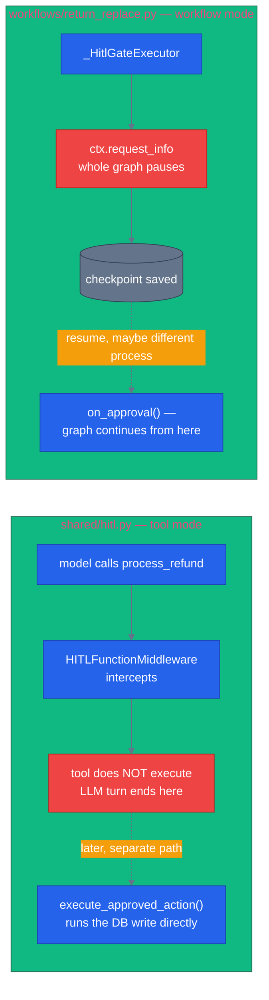

# Human-in-the-loop

> **New to this?** [The harness](https://nitinksingh.com/ai-resources/02-agents/the-harness/) on the AI Knowledge Hub covers the
> same ground from scratch, vendor-neutral, with a lab you can run locally for free.
> This page assumes the concept and shows how it is built *here*.

## What it is

Human-in-the-loop (HITL) means a specific action requires an explicit human approval before it's
allowed to execute, no matter how confident the model is. It's the acknowledgment that
"confidence" and "correctness" are different things, and that some actions are expensive enough to
get wrong — financially, or in terms of trust — that the cost of asking a human first is worth
paying every time, not just when the model seems unsure.

## Why it matters

A model can be well-grounded (see [grounding and RAG](09-grounding-and-rag.md)), well-guarded (see
[guardrails](10-guardrails.md)), and still make a judgment call a human wouldn't have made — an
$800 refund approved for a return that's technically eligible but unusual enough that a person
would have asked a follow-up question first. Grounding and guardrails answer "is this response
factually correct and safe from attack"; HITL answers a different question entirely: "even if this
is exactly what the model intends to do, should it be allowed to do it without a person saying
yes?" Money moving and data being modified irreversibly are the two cases in this repo where the
answer is "not without asking."

## When to use it — and when not to

Gate an action behind human approval when it's high-stakes and hard to reverse — canceling an
order, issuing a refund, anything moving money or committing to an irreversible state change.
**Don't** gate everything — a HITL check on every tool call would make the product unusable, and
it dilutes the signal: if a human has to approve searching for a product, they'll rubber-stamp
everything, including the refund that actually needed scrutiny. The gate is only meaningful if
it's rare enough to get real attention.

## How it works here — two structurally different mechanisms, on purpose

This repo has two HITL implementations, and they are not interchangeable — knowing which one a
given mode uses matters for understanding what actually happens when a gate fires.

**Middleware-based approval** — [`shared/hitl.py`](https://github.com/nitin27may/e-commerce-agents/blob/main/agents/python/shared/hitl.py). A fixed set of high-stakes tools —
`HITL_GATED_TOOLS` (line 38): `cancel_order`, `process_refund`, `initiate_return`, `modify_order`,
`place_backorder` — are intercepted by `HITLFunctionMiddleware` *before* they execute. The
docstring is explicit about what happens next: "the tool does NOT execute" (line 55). A
`hitl_requests` row is written with `status="pending"`, and the agent's tool call returns
immediately with a `pending_approval` result — the LLM's turn ends there, having been told the
action is awaiting approval. When an admin later approves it, a *separate* code path,
`execute_approved_action()` (line 254), runs the underlying database operation directly. **The
original LLM loop is never resumed.** The approval doesn't continue the conversation — it just
performs the action the model asked for, outside the conversation entirely.

**In-workflow suspend/resume** — [`workflows/return_replace.py`](https://github.com/nitin27may/e-commerce-agents/blob/main/agents/python/workflows/return_replace.py)'s `_HitlGateExecutor` (line 157).
For return workflows above a value threshold (`settings.RETURN_HITL_THRESHOLD`), the executor
calls `await ctx.request_info(ReturnApprovalRequest(...), response_type=bool)` (line 172) — and
this doesn't short-circuit a single tool call, it **pauses the entire workflow graph**. Everything
the graph had already computed is written to a checkpoint (see
[state, memory, and sessions](08-state-memory-and-sessions.md)) so the pause can outlive the
current request. Resume happens via a handler MAF calls back into automatically —
`@response_handler(request=ReturnApprovalRequest, response=bool)` on `on_approval()` (line 185) —
which picks the workflow back up from exactly where it paused and keeps running the remaining
steps (loyalty discount, finalize).

The difference in one sentence: `shared/hitl.py` intercepts one tool call and the tool simply never
runs — there's no "loop" to resume, because nothing was ever mid-sequence. `return_replace.py`
suspends a whole multi-step sequence mid-execution and picks it back up later, possibly served by
a completely different process than the one that paused it.

Next: [evaluation](12-evaluation.md) — how to know any of this — grounding, guardrails, HITL gates
— is actually working, instead of just looking right in a demo.
