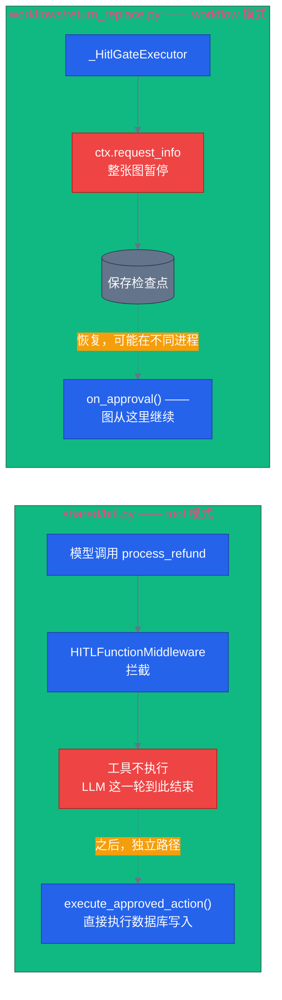

# 人工参与

> **初次接触？** 本页假定你已经了解这个概念，重点展示它在本项目中是如何实现的。

## 它是什么

人工参与（Human-in-the-Loop，HITL）指某个具体操作在执行之前必须有明确的人工审批，无论模型
多自信。它承认「自信」和「正确」是两件事，也承认有些操作一旦做错——在金钱上或在信任上——代价
高到值得每一次都先问人，而不只是在模型看起来不确定时才问。

## 为什么重要

一个模型可以事实核验良好（见[事实核验与 RAG](09-grounding-and-rag.md)）、护栏良好（见
[护栏](10-guardrails.md)），却仍然做出一个人不会做的判断——为一笔技术上符合条件、但异常到人
一定会先追问一句的退货批准 800 元退款。事实核验和护栏回答的是「这段回复在事实上是否正确、是否
免于攻击」；HITL 回答的是一个完全不同的问题：「即便这正是模型打算做的事，是否应该在没有人点头
的情况下允许它做？」资金流动和不可逆的数据修改，是本仓库里答案为「不先问就不行」的两类情况。

## 什么时候用——什么时候不用

当一个操作高风险且难以撤销时，把它挡在人工审批之后——取消订单、发起退款，任何涉及资金流动或
提交不可逆状态变更的操作。**不要**把所有东西都挡住——对每一次工具调用都做 HITL 检查会让产品
无法使用，而且会稀释信号：如果搜个商品都要人工批准，人就会一律盖章放行，包括那笔真正需要审视
的退款。这个门只有在足够罕见、能获得真正注意力时才有意义。

## 本项目怎么实现——两种结构上不同的机制，刻意如此

本仓库有两套 HITL 实现，它们不能互换——知道某个模式用的是哪一套，对理解门被触发时实际发生
什么很重要。

**基于中间件的审批** —— [`shared/hitl.py`](../../agents/python/shared/hitl.py)。一组固定的高风险工具——
`HITL_GATED_TOOLS`（第 38 行）：`cancel_order`、`process_refund`、`initiate_return`、`modify_order`、
`place_backorder`——会在执行*之前*被 `HITLFunctionMiddleware` 拦截。文档字符串明确写明了接下来
发生什么：「工具不会执行」（第 55 行）。一行 `hitl_requests` 记录被写入，`status="pending"`，而
智能体的工具调用立即以 `pending_approval` 结果返回——LLM 的这一轮到此结束，它已经被告知该操作
正在等待审批。之后管理员批准时，一条*独立的*代码路径 `execute_approved_action()`（第 254 行）
直接执行底层的数据库操作。**原来的 LLM 循环永远不会被恢复。** 审批不会继续对话——它只是在对话
之外，执行模型请求的那个操作。

**工作流内挂起/恢复** —— [`workflows/return_replace.py`](../../agents/python/workflows/return_replace.py) 的 `_HitlGateExecutor`（第 157 行）。
对于金额超过阈值的退货工作流（`settings.RETURN_HITL_THRESHOLD`），该执行器调用
`await ctx.request_info(ReturnApprovalRequest(...), response_type=bool)`（第 172 行）——这不会
短路单次工具调用，而是**暂停整张工作流图**。图已经算出的所有东西都被写入检查点（见
[状态、记忆与会话](08-state-memory-and-sessions.md)），使这次暂停能活过当前请求。恢复通过 MAF
自动回调的一个处理函数发生——`on_approval()`（第 185 行）上的
`@response_handler(request=ReturnApprovalRequest, response=bool)`——它把工作流从暂停的确切位置
接起来，继续跑完剩余步骤（会员折扣、收尾）。

用一句话说清区别：`shared/hitl.py` 拦截一次工具调用，那个工具就干脆不运行——没有「循环」需要
恢复，因为从来没有东西处在序列中途。`return_replace.py` 挂起整条多步序列的执行中状态，之后再
把它接起来，而且可能由与暂停它的那个进程完全不同的进程来处理。

```mermaid
%%{init: {'theme':'base', 'themeVariables': {
  'primaryColor': '#2563eb','primaryTextColor': '#ffffff','primaryBorderColor': '#1e40af',
  'lineColor': '#64748b','secondaryColor': '#f59e0b','tertiaryColor': '#10b981',
  'background': 'transparent'}}}%%
flowchart LR
  classDef core    fill:#2563eb,stroke:#1e40af,color:#ffffff
  classDef error   fill:#ef4444,stroke:#b91c1c,color:#ffffff
  classDef success fill:#10b981,stroke:#047857,color:#ffffff
  classDef infra   fill:#64748b,stroke:#334155,color:#ffffff

  subgraph mw["shared/hitl.py —— tool 模式"]
    t1["模型调用 process_refund"] --> gate1["HITLFunctionMiddleware<br/>拦截"]
    gate1 --> block["工具不执行<br/>LLM 这一轮到此结束"]
    block -.之后，独立路径.-> exec["execute_approved_action()<br/>直接执行数据库写入"]
  end

  subgraph wf["workflows/return_replace.py —— workflow 模式"]
    t2["_HitlGateExecutor"] --> pause["ctx.request_info<br/>整张图暂停"]
    pause --> cp[("保存检查点")]
    cp -.恢复，可能在不同进程.-> resume["on_approval() ——<br/>图从这里继续"]
  end

  class t1,t2,gate1,exec,resume core
  class block,pause error
  class cp infra
```

下一页：[评测](12-evaluation.md) —— 怎么知道这些——事实核验、护栏、HITL 门——真的在起作用，而
不是只在 demo 里看起来对。
