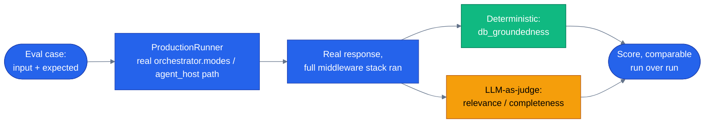

# Evaluation

> **New to this?** [Evaluation](https://nitinksingh.com/ai-resources/02-agents/evaluation/) on the AI Knowledge Hub covers the
> same ground from scratch, vendor-neutral, with a lab you can run locally for free.
> This page assumes the concept and shows how it is built *here*.

## What it is

Evaluation is running a set of known test cases through the agent and scoring the results
automatically, so "does this still work" is a number you can check on every change instead of a
feeling from having tried a few prompts in a chat window. A good eval suite has two kinds of
scorer: **deterministic** (a check with a definite right answer — did the response's claimed
product id actually exist in the database) and **LLM-as-judge** (a second model call scoring
something that doesn't have a mechanically checkable answer, like "did this response actually
address what was asked"). Neither replaces the other — deterministic checks are free and exact but
can only check what's mechanically checkable; a judge can assess quality but costs money and isn't
perfectly consistent between two identical inputs.

## Why it matters

"It looked right when I tried it" is not evidence about anything except that one specific prompt,
on that one specific day, against whatever the model happened to produce at that moment. It
doesn't tell you whether a prompt change improved or regressed the other forty cases you didn't
happen to try, and it doesn't survive being repeated by someone else. The sharpest version of this
problem is a scorer that *looks* rigorous but measures the wrong thing — a groundedness check that
only confirms "a tool was called," without checking whether the response's actual words matched
what that tool returned, will give a fabricated price the exact same passing score as a correct
one. A scorer that doesn't check the thing it claims to check is worse than no scorer, because it
creates false confidence.

## When to use it — and when not to

Run the deterministic suite on every change that touches agent behavior — prompts, tools, model
version — because it's free (no LLM cost) and catches regressions immediately. Reserve the
LLM-judge suite for changes where the deterministic checks genuinely can't tell you enough —
judging whether a response is *well-written*, not just factually anchored, needs a judge. Don't run
the judge suite on every commit if it's not free to do so; that's a cost/thoroughness trade worth
making deliberately, not by default.

## How it works here

The core design point in this repo's eval harness is that it runs cases through the **real**
production code path, not a stand-in. `evals/harness.py::ProductionRunner.run()` (line 110) drives
requests through the exact same dispatch a live user's request would use — `orchestrator.modes`
for the orchestrator, the real specialist entry point for each specialist — so the full guardrail,
HITL, and grounding middleware stack from [guardrails](10-guardrails.md) actually runs during
evaluation. An earlier version of this harness hand-rolled its own simplified tool-calling loop
that bypassed all of that middleware — which meant a red-team safety case could "pass" without
ever exercising the guardrails that were supposed to be the thing being tested. That's the
practical version of "a scorer that doesn't check the thing it claims to check": routing evals
around production code doesn't just risk missing bugs, it actively hides whether your defenses are
wired in at all.

The two scorer types, concretely:

- **Deterministic** — `evals/scorers/db_groundedness.py::score_from_report()` (line 26) reads the
  same `GroundingReport` [grounding](09-grounding-and-rag.md)'s middleware already computed during
  the run — free, no extra database round trip, no LLM cost. Score is simply
  `verified_claims / total_claims`.
- **LLM-as-judge** — `evals/scorers/llm_judge.py::judge_response()` (line 57) asks a second model
  call to score relevance/completeness against a structured `JudgeVerdict` (line 41: `score`,
  `reasoning`, `failure_mode`) — for exactly the part deterministic checks can't reach: whether
  the response actually answered what was asked, in substance, not just whether specific facts in
  it check out.

Next: [observability and cost](13-observability-and-cost.md) — once a request has run, how to see
what actually happened inside it, and what it cost.
