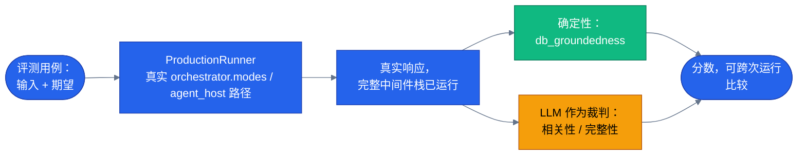

# 评测

> **初次接触？** 本页假定你已经了解这个概念，重点展示它在本项目中是如何实现的。

## 它是什么

评测（evaluation）是把一组已知测试用例跑过智能体并自动给结果打分，使「这东西还好用吗」成为
每次改动都能查的一个数字，而不是在聊天窗口里试了几个提示词之后的感觉。一套好的评测集包含两类
评分器：**确定性**评分器（有确定正确答案的检查——回复中声称的商品 id 是否真的存在于数据库里）
和 **LLM 作为裁判**（LLM-as-judge，用第二次模型调用给那些没有机械可查答案的东西打分，比如
「这段回复是否真的回应了所问的内容」）。两者不可互相替代——确定性检查免费且精确，但只能检查
机械可查的东西；裁判能评估质量，但要花钱，而且对两个完全相同的输入也并非完全一致。

## 为什么重要

「我试的时候看着是对的」不构成任何证据，除了证明那一个特定提示词、在那一天、针对模型当时恰好
产出的东西。它不会告诉你某次提示词改动是改善还是回退了另外四十个你没试过的用例，也经不起别人
复现。这个问题最尖锐的形态是：一个*看起来*严谨、却测错了东西的评分器——一个只确认「调用了
工具」、却不检查回复的实际文字是否与工具返回内容相符的有据性检查，会给一个被编造的价格和正确
答案完全相同的及格分。一个不检查它所声称要检查的东西的评分器，比没有评分器更糟，因为它制造
虚假的信心。

## 什么时候用——什么时候不用

每次改动涉及智能体行为——提示词、工具、模型版本——都跑确定性套件，因为它免费（无 LLM 成本）
且能立刻抓住回退。LLM 裁判套件留给确定性检查确实说不出足够信息的改动——判断一段回复是否
*写得好*、而不只是事实有据，需要裁判。如果跑裁判套件不是免费的，就不要每次提交都跑；那是一个
值得刻意做出的成本/彻底度权衡，而不是默认选择。

## 本项目怎么实现

本仓库评测运行框架的核心设计点是：它把用例跑过**真实的**生产代码路径，而不是替身。
`evals/harness.py::ProductionRunner.run()`（第 110 行）让请求走与真实用户请求完全相同的分发
路径——编排器走 `orchestrator.modes`，每个专业智能体走其真实入口——因此[护栏](10-guardrails.md)
里那整套护栏、HITL 和事实核验中间件栈在评测期间确实会运行。这套运行框架的早期版本手写了自己
简化版的工具调用循环，绕过了所有那些中间件——这意味着一个红队安全用例可以在从未触发本该被
测试的护栏的情况下「通过」。这就是「一个不检查它所声称要检查的东西的评分器」的实际版本：把
评测绕开生产代码，不只是有漏掉 bug 的风险，它还主动掩盖了你的防御到底有没有接上。

两类评分器，具体来说：

- **确定性** —— `evals/scorers/db_groundedness.py::score_from_report()`（第 26 行）读取运行期间
  [事实核验](09-grounding-and-rag.md)中间件已经算出的同一个 `GroundingReport`——免费，没有额外
  的数据库往返，没有 LLM 成本。分数就是 `verified_claims / total_claims`。
- **LLM 作为裁判** —— `evals/scorers/llm_judge.py::judge_response()`（第 57 行）让第二次模型调用
  依据结构化的 `JudgeVerdict`（第 41 行：`score`、`reasoning`、`failure_mode`）对相关性/完整性
  打分——正是确定性检查触及不到的那部分：回复是否在实质上真的回答了所问的问题，而不只是其中
  的具体事实是否对得上。

```mermaid
%%{init: {'theme':'base', 'themeVariables': {
  'primaryColor': '#2563eb','primaryTextColor': '#ffffff','primaryBorderColor': '#1e40af',
  'lineColor': '#64748b','secondaryColor': '#f59e0b','tertiaryColor': '#10b981',
  'background': 'transparent'}}}%%
flowchart LR
  classDef core    fill:#2563eb,stroke:#1e40af,color:#ffffff
  classDef success fill:#10b981,stroke:#047857,color:#ffffff
  classDef external fill:#f59e0b,stroke:#b45309,color:#000000

  case(["评测用例：<br/>输入 + 期望"]) --> runner["ProductionRunner<br/>真实 orchestrator.modes / agent_host 路径"]
  runner --> outcome["真实响应，<br/>完整中间件栈已运行"]
  outcome --> det["确定性：<br/>db_groundedness"]
  outcome --> judge["LLM 作为裁判：<br/>相关性 / 完整性"]
  det --> score(["分数，可跨次运行<br/>比较"])
  judge --> score

  class case core
  class runner,outcome core
  class det success
  class judge external
```

下一页：[可观测性与成本](13-observability-and-cost.md) —— 请求跑完之后，怎么看它内部到底发生了
什么，以及花了多少钱。
