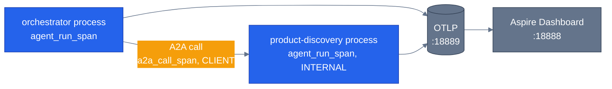

# Observability and cost

> **New to this?** [Observability](https://nitinksingh.com/ai-resources/02-agents/observability/) on the AI Knowledge Hub covers the
> same ground from scratch, vendor-neutral, with a lab you can run locally for free.
> This page assumes the concept and shows how it is built *here*.

## What it is

Observability, here, means being able to answer "what actually happened during this request" after
the fact — which agent ran, which tools it called, how long each step took, and which of the six
services (in a multi-agent request) were involved — without having to reproduce the request live.
**Tracing** is the specific mechanism: every unit of work gets a **span** (a timed, named record of
"this operation happened, it took this long, here's what it touched"), and spans from the same
request are linked together into one trace, even across process boundaries. Cost, in this context,
is a related but separate concern: tokens are the unit LLM providers actually bill on, so turning
"N input tokens + M output tokens" into a dollar figure is what makes cost a comparable number
across models, across orchestration modes, and over time — not just a vague sense that "this felt
expensive."

## Why it matters

A multi-agent request is, almost by definition, distributed — the orchestrator calls a specialist
over real HTTP ([why multi-agent](05-why-multi-agent.md)), which calls a tool, which queries
Postgres. Without tracing that links those pieces together, "why was this request slow" becomes
guesswork: was it the model thinking, the specialist's network round trip, or the database query?
Three completely different problems, indistinguishable from the outside without a trace showing
where the time actually went. Cost matters for a parallel reason specific to this repo's own
argument: [orchestration patterns](06-orchestration-patterns.md) are a genuine trade between
flexibility and cost, and "which mode is actually cheaper for this kind of question" is an
empirical question, not a guess — you need real token numbers per mode to answer it, which is
exactly what the mode-comparison feature in this repo's web UI is for.

## When to use it — and when not to

Trace everything that crosses a process or service boundary — that's where "what happened" stops
being visible just by reading the code that ran, because the *next* thing that ran is a different
process entirely. Don't bother instrumenting purely in-process, single-function work with its own
span — the overhead isn't worth it, and the trace becomes noisy without adding real visibility.

## How it works here

Every agent process calls `setup_telemetry(service_name)` once, at startup
([`shared/telemetry.py`](https://github.com/nitin27may/e-commerce-agents/blob/main/agents/python/shared/telemetry.py)), which wires up OpenTelemetry and explicitly opts into the GenAI
semantic conventions (`OTEL_SEMCONV_STABILITY_OPT_IN`, line 64) — the standard attribute names
(`gen_ai.operation.name`, `gen_ai.agent.name`, `gen_ai.conversation.id`) that let a generic
dashboard like Aspire render LLM-specific spans meaningfully instead of as opaque blobs.

Two span helpers do the actual work, and their relationship is the interesting part —
`agent_run_span()`'s own docstring draws the nesting out explicitly (`shared/telemetry.py`):

```
invoke_agent orchestrator            ← agent_run_span, in the orchestrator's own process
  invoke_agent product-discovery     ← a2a_call_span, CLIENT span for the cross-process A2A call
    invoke_agent product-discovery   ← agent_run_span again, inside the specialist's own process
```

`agent_run_span(agent_name)` (line 224) wraps one agent's own run — `SpanKind.INTERNAL`, the work
this process did. `a2a_call_span(source_agent, target_agent, target_url)` (line 261) wraps the
network call *between* two agents — `SpanKind.CLIENT`, deliberately so a distributed trace
correctly shows "the orchestrator was waiting on a network call here," not just "the orchestrator
was busy." Both use the same `invoke_agent {name}` naming convention (lines 245, 271), which is
what lets Aspire nest them correctly instead of showing three unrelated-looking spans.
`enrich_span_with_session()` (line 194) tags the active span with `gen_ai.conversation.id` so every
span from the same conversation — across every service it touched — can be grouped together in
the dashboard, not just correlated by trace id.

Cost is a separate, smaller piece: `shared/cost.py::estimate_cost(model, tokens_in, tokens_out)` —
a plain per-model USD-per-1K-token lookup table, falling back to a sane default for an unrecognized
model rather than raising (a cost estimate should degrade gracefully, not break a request). This is
what turns the raw token counts a trace captures into the dollar figures shown in the eval reports
and the mode-comparison UI.

All of this lands in the .NET Aspire Dashboard at `localhost:18888` — `docker-compose.yml` runs it
as a real service (`aspire`, mapped to `18888`/`18889`), and every agent's
`OTEL_EXPORTER_OTLP_ENDPOINT` points at it. It's a generic OpenTelemetry viewer, not something
built for this repo specifically — the GenAI semantic conventions above are what make it render
agent/LLM spans usefully instead of as generic, unlabeled work.



Next: [production concerns](14-production-concerns.md) — idempotency, retries, rate limits, and an
honest look at which of these this repo actually has.
