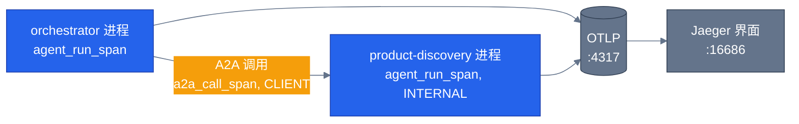

# 可观测性与成本

> **初次接触？** 本页假定你已经了解这个概念，重点展示它在本项目中是如何实现的。

## 它是什么

这里的可观测性（observability）指事后能够回答「这次请求期间到底发生了什么」——哪个智能体跑了、
调用了哪些工具、每一步花了多久，以及（在一次多智能体请求中）六个服务里有哪些参与其中——而不必
现场复现该请求。**追踪（trace/span）**是具体机制：每个工作单元都有一个**跨度（span）**（一条带
时间戳、带名字的记录：「这个操作发生过，花了这么久，它触及了这些」），同一次请求的跨度被串成
一条追踪，即使跨越进程边界。成本在这里是一个相关但独立的关注点：token 是 LLM 提供商实际计费的
单位，所以把「N 个输入 token + M 个输出 token」换算成人民币金额，才使成本成为跨模型、跨编排
模式、跨时间可比较的数字——而不只是「感觉这次挺贵」的模糊印象。

## 为什么重要

一次多智能体请求几乎从定义上就是分布式的——编排器通过真实 HTTP 调用一个专业智能体
（[为什么要多智能体](05-why-multi-agent.md)），后者调用一个工具，工具再查询 Postgres。如果没有把
这些片段串起来的追踪，「这次请求为什么慢」就变成了猜谜：是模型在思考，是专业智能体的网络往返，
还是数据库查询？这是三个完全不同的问题，没有一条显示时间究竟花在哪里的追踪，从外部无法区分。
成本重要则有一个与本仓库自身论点相关的理由：[编排模式](06-orchestration-patterns.md)是灵活性
与成本之间的真实权衡，而「对这类问题哪种模式实际更便宜」是一个实证问题，不是猜测——要回答它，
你需要每种模式的真实 token 数字，而这正是本仓库 Web UI 中模式对比功能的用途。

## 什么时候用——什么时候不用

追踪一切跨越进程或服务边界的东西——那正是「发生了什么」不再能靠读运行过的代码看出来的地方，
因为*下一个*运行的东西完全是另一个进程。不要费心给纯进程内、单个函数、自带跨度的工作加埋点
——开销不划算，而且追踪会变得嘈杂却不增加真正的可见性。

## 本项目怎么实现

每个智能体进程在启动时调用一次 `setup_telemetry(service_name)`
（[`shared/telemetry.py`](../../agents/python/shared/telemetry.py)），它会接好 OpenTelemetry（OTel，开放遥测）并显式启用 GenAI
语义约定（`OTEL_SEMCONV_STABILITY_OPT_IN`，第 64 行）——即那些标准属性名
（`gen_ai.operation.name`、`gen_ai.agent.name`、`gen_ai.conversation.id`），它们让 Jaeger 这样的
通用界面能够有意义地渲染 LLM 专属跨度，而不是当作不透明的块。

两个跨度辅助函数承担实际工作，它们之间的关系才是有趣的部分——`agent_run_span()` 自己的文档
字符串把嵌套关系明确画了出来（`shared/telemetry.py`）：

```
invoke_agent orchestrator            ← agent_run_span，在编排器自己的进程中
  invoke_agent product-discovery     ← a2a_call_span，跨进程 A2A 调用的 CLIENT 跨度
    invoke_agent product-discovery   ← 再次 agent_run_span，在专业智能体自己的进程中
```

`agent_run_span(agent_name)`（第 224 行）包住一个智能体自己的运行——`SpanKind.INTERNAL`，本进程
做的工作。`a2a_call_span(source_agent, target_agent, target_url)`（第 261 行）包住两个智能体*之间*
的网络调用——`SpanKind.CLIENT`，刻意如此，好让一条分布式追踪正确显示「编排器在这里等了一次网络
调用」，而不只是「编排器在忙」。两者都用同一个 `invoke_agent {name}` 命名约定（第 245、271 行），
这才让 Jaeger 能把它们正确嵌套，而不是显示成三个看起来互不相关的跨度。
`enrich_span_with_session()`（第 194 行）给活跃跨度打上 `gen_ai.conversation.id` 标签，使同一段
对话产生的每个跨度——跨它所触及的每个服务——都能在界面里归到一起，而不只是靠 trace id 关联。

成本是一个独立、更小的部分：`shared/cost.py::estimate_cost(model, tokens_in, tokens_out)`——一张
按模型维护的每千 token 人民币单价查询表，对无法识别的模型回退到一个合理默认值而不是抛错（成本
估算应该优雅降级，而不是让请求崩掉）。它把追踪捕获的原始 token 计数，变成评测报告和模式对比
界面里显示的人民币金额。

所有这些最终都汇入位于 `localhost:16686` 的 Jaeger 界面——`docker-compose.yml` 把它作为真实
服务运行（`jaeger`，映射到 `16686`/`4317`），每个智能体的 `OTEL_EXPORTER_OTLP_ENDPOINT` 都指向
它。它是一个通用的 OpenTelemetry 查看器，不是为本仓库专门构建的东西——上面的 GenAI 语义约定
才是让它把智能体/LLM 跨度渲染得有用的原因，而不是当作通用的、没有标签的工作。


```mermaid
%%{init: {'theme':'base', 'themeVariables': {
  'primaryColor': '#2563eb','primaryTextColor': '#ffffff','primaryBorderColor': '#1e40af',
  'lineColor': '#64748b','secondaryColor': '#f59e0b','tertiaryColor': '#10b981',
  'background': 'transparent'}}}%%
flowchart LR
  classDef core  fill:#2563eb,stroke:#1e40af,color:#ffffff
  classDef infra fill:#64748b,stroke:#334155,color:#ffffff

  orch["orchestrator 进程<br/>agent_run_span"] -->|A2A 调用<br/>a2a_call_span, CLIENT| spec["product-discovery 进程<br/>agent_run_span, INTERNAL"]
  orch --> otlp[("OTLP<br/>:4317")]
  spec --> otlp
  otlp --> jaeger["Jaeger 界面<br/>:16686"]

  class orch,spec core
  class otlp,jaeger infra
```

下一页：[生产环境关注点](14-production-concerns.md) —— 幂等性、重试、限流，以及诚实审视本仓库
实际拥有其中哪些。
