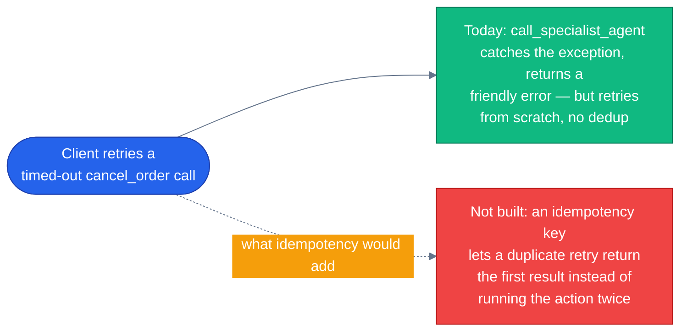

# Production concerns

> **New to this?** [Production](https://nitinksingh.com/ai-resources/02-agents/production/) on the AI Knowledge Hub covers the
> same ground from scratch, vendor-neutral, with a lab you can run locally for free.
> This page assumes the concept and shows how it is built *here*.

## What it is

Three specific things that separate a demo from a system that survives contact with real,
imperfect networks and real, sometimes-duplicate requests:

- **Idempotency** — making an operation safe to receive twice. If a "cancel this order" request
  times out on the client side after the server actually processed it, the client's natural
  reaction is to retry — and without idempotency, that retry cancels an order a second time (or
  double-refunds it, which is the expensive version of this bug).
- **Retries with backoff** — automatically re-attempting a failed network call a bounded number of
  times, waiting longer between each attempt, instead of either giving up on the first blip or
  hammering a struggling service harder.
- **Rate limiting** — capping how many requests a single user or client can make in a window, so
  one runaway script or one confused retry loop can't take the whole system down for everyone else.

## Why it matters

These aren't defensive-programming nice-to-haves — they're the difference between a network blip
being invisible and a network blip becoming a customer-visible incident. A refund tool with no
idempotency protection, called twice because a client retried a slow request, doesn't fail loudly
— it succeeds twice, silently, and the business is out the difference. A specialist agent with no
retry logic turns a half-second network hiccup into a full failure the user sees, even though the
same request would have succeeded a moment later. No rate limiting means there's no floor under
how bad a single client's misbehavior — a bug, not even malice — can get for everyone else sharing
the system.

## When to use it — and when not to

Idempotency matters most exactly where this repo already flags the highest-stakes actions —
[human-in-the-loop](11-human-in-the-loop.md)'s gated tools (`cancel_order`, `process_refund`,
`initiate_return`, `modify_order`) are precisely the set where "ran twice by accident" is
expensive. Retries matter for any network call that can fail transiently and is safe to repeat —
which is not every call: retrying a non-idempotent operation without deduplication makes the
idempotency problem worse, not better, so the two concerns are linked, not independent. Rate
limiting matters wherever a single caller's volume could meaningfully affect other callers' service
— which, for a customer-facing API, is essentially every public endpoint.

## How it works here — an honest gap, not a claim

This is the one page in this concepts library that has to say plainly: **this repo does not have
dedicated idempotency, retry, or rate-limiting infrastructure yet.** No `idempotency_keys` table,
no request-deduplication decorator, no backoff/circuit-breaker wrapper around the A2A HTTP calls,
no rate-limiting middleware on any FastAPI route. This isn't a case of the mechanism existing under
a different name — there's no retry library in the Python dependencies, and a repo-wide search for
retry logic turns up exactly one hit that isn't this page: a string in the chat UI telling the
*user* to manually retry after a stream times out
([`agents/python/orchestrator/routes/chat.py`](https://github.com/nitin27may/e-commerce-agents/blob/main/agents/python/orchestrator/routes/chat.py)), not any automated mechanism.

What *does* exist today, and is worth naming honestly as a partial mitigation rather than nothing:
`orchestrator/agent.py::call_specialist_agent` (lines 116-137) wraps every A2A call in error
handling that catches `httpx.TimeoutException`, `httpx.HTTPStatusError`, and any other exception,
returning a plain-language message to the model instead of crashing the whole request:

```python
# agents/python/orchestrator/agent.py
except httpx.TimeoutException:
    logger.error("a2a.timeout target=%s", agent_name)
    return f"The {agent_name} agent took too long to respond. Please try again."
```

That's real, and it's better than an unhandled exception taking down the orchestrator — but it's
error *handling*, not resilience. It doesn't retry, it doesn't back off, and it doesn't deduplicate
a request a client sends twice. A production deployment of a system shaped like this one would need
all three of the mechanisms this page describes before handling real payment-adjacent traffic at
scale — they're a known, named gap, not something this page is pretending isn't there.



This closes the core reading path. From here: [`docs/architecture.md`](../architecture.md) for
how all six agents fit together as a system, or back to
[the concepts index](README.md#the-rest-of-the-pages) for anything you skipped.
