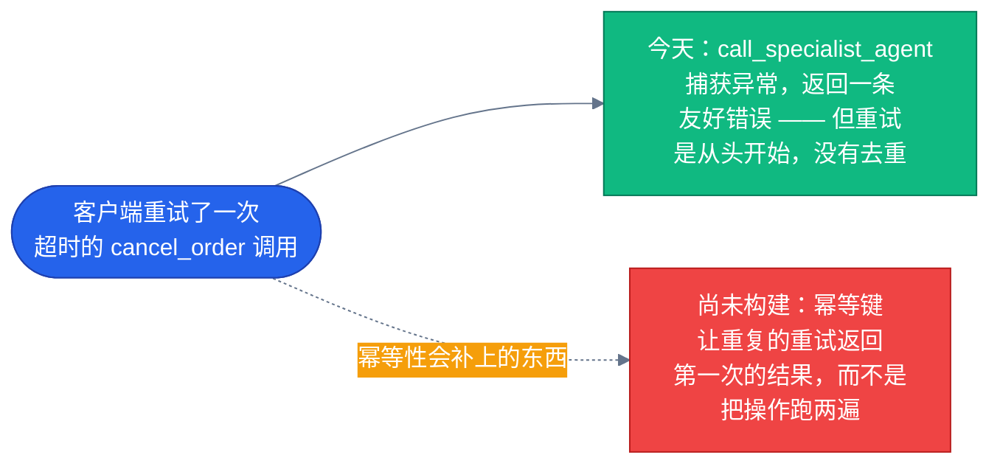

# 生产环境关注点

> **初次接触？** 本页假定你已经了解这个概念，重点展示它在本项目中是如何实现的。

## 它是什么

三件把 demo 与一个能在真实、不完美的网络和真实、偶尔重复的请求下存活的系统区分开来的具体
事情：

- **幂等性（idempotency）** —— 让一个操作可以被安全地接收两次。如果一个「取消此订单」请求在
  服务端实际已处理之后于客户端侧超时，客户端的自然反应是重试——而没有幂等性，那次重试会第二次
  取消订单（或者重复退款，这是这个 bug 昂贵的版本）。
- **带退避的重试** —— 自动地、有上限地重新尝试失败的网络调用，每次尝试之间等待更久，而不是在
  第一次抖动时就放弃，或者把已经吃力的服务打得更狠。
- **限流（rate limiting）** —— 限制单个用户或客户端在一个时间窗口内能发多少请求，使一个失控的
  脚本或一个混乱的重试循环不会把整个系统拖垮，让所有人都用不了。

## 为什么重要

这些不是防御式编程的锦上添花——它们决定了一次网络抖动是隐形的，还是变成一次客户可见的事故。
一个没有幂等性保护的退款工具，因为客户端重试了一个慢请求而被调用两次，不会响亮地失败——它会
静默地成功两次，差额由业务承担。一个没有重试逻辑的专业智能体，会把半秒的网络抖动变成用户看到
的彻底失败，尽管同一个请求再等一会儿就会成功。没有限流，就意味着单个客户端的异常行为——一个
bug，甚至都不是恶意——能把共享同一系统的其他人害到什么程度，是没有下限的。

## 什么时候用——什么时候不用

幂等性最要紧的地方，恰恰是本仓库已经标出的最高风险操作——[人工参与](11-human-in-the-loop.md)
里的受控工具（`cancel_order`、`process_refund`、`initiate_return`、`modify_order`）正是「不小心
跑了两次」代价昂贵的那一组。重试对任何可能瞬时失败、且可以安全重复的网络调用都重要——但不是
每一次调用都可以：在没有去重的情况下重试一个非幂等操作，只会让幂等性问题更糟而不是更好，所以
这两个关注点是关联的，不是独立的。限流在任何单个调用方的流量可能实质影响其他调用方服务的场景
下都重要——对一个面向客户的 API 而言，这基本就是每一个公开端点。

## 本项目怎么实现——一个诚实的缺口，而不是一句宣称

这是本套概念文档中唯一必须明说的一页：**本仓库目前还没有专门的幂等性、重试或限流基础设施。**
没有 `idempotency_keys` 表，没有请求去重装饰器，没有包在 A2A HTTP 调用外面的退避/熔断包装，
任何 FastAPI 路由上都没有限流中间件。这不是「机制换个名字存在」的情况——Python 依赖里没有任何
重试库，全仓库搜索重试逻辑只会命中一处（且不是本页）：聊天界面里一句提示*用户*在流超时后手动
重试的文案（[`agents/python/orchestrator/routes/chat.py`](../../agents/python/orchestrator/routes/chat.py)），而不是任何自动机制。

今天*确实*存在的、值得诚实地作为部分缓解而非空无一物来点名的东西是：
`orchestrator/agent.py::call_specialist_agent`（第 116-137 行）把每次 A2A 调用包在错误处理里，
捕获 `httpx.TimeoutException`、`httpx.HTTPStatusError` 以及任何其他异常，向模型返回一段平实的
消息，而不是让整个请求崩掉：

```python
# agents/python/orchestrator/agent.py
except httpx.TimeoutException:
    logger.error("a2a.timeout target=%s", agent_name)
    return f"The {agent_name} agent took too long to respond. Please try again."
```

这是真实存在的，也比让未处理异常拖垮编排器要好——但它是错误*处理*，不是韧性。它不重试、不退避，
也不对客户端发送两次的请求去重。一个形状像本项目的系统，若要在规模化下处理真实、接近支付的
流量，就需要本页描述的全部三种机制——它们是一个已知、具名的缺口，而不是本页假装不存在的东西。


```mermaid
%%{init: {'theme':'base', 'themeVariables': {
  'primaryColor': '#2563eb','primaryTextColor': '#ffffff','primaryBorderColor': '#1e40af',
  'lineColor': '#64748b','secondaryColor': '#f59e0b','tertiaryColor': '#10b981',
  'background': 'transparent'}}}%%
flowchart LR
  classDef core    fill:#2563eb,stroke:#1e40af,color:#ffffff
  classDef success fill:#10b981,stroke:#047857,color:#ffffff
  classDef error   fill:#ef4444,stroke:#b91c1c,color:#ffffff

  req(["客户端重试了一次<br/>超时的 cancel_order 调用"]) --> today["今天：call_specialist_agent<br/>捕获异常，返回一条<br/>友好错误 —— 但重试<br/>是从头开始，没有去重"]
  req -.幂等性会补上的东西.-> future["尚未构建：幂等键<br/>让重复的重试返回<br/>第一次的结果，而不是<br/>把操作跑两遍"]

  class req core
  class today success
  class future error
```

这收束了核心阅读路径。接下来：[`docs/architecture.md`](../architecture.md) 看六个智能体如何作为
一个系统拼在一起，或者回到[概念索引](README.md#其余页面)查看你跳过的任何内容。
