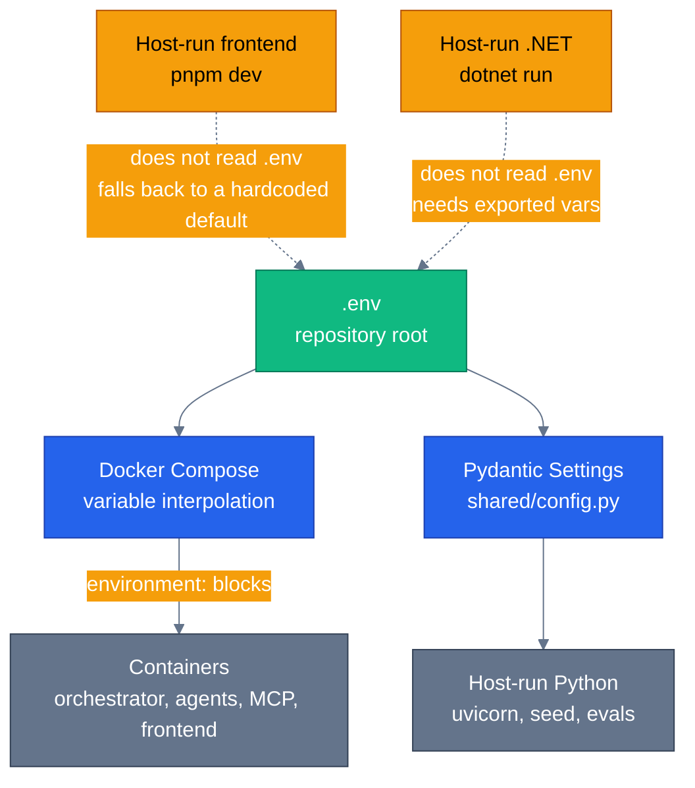

# Configuration

Every configurable value in this repository comes from **one file: `.env` at the repository root.**
There is no second location, no per-service env file, and no per-stack override file.

This page explains how that one file reaches four very different consumers, why it lives at the
root and not somewhere tidier, and what you have to touch when you add a new variable.

## The three files

| File | Committed | Purpose |
|---|---|---|
| `.env.minimal` | Yes | What a first run needs. One variable. Copy it to `.env` and set your key. |
| `.env.example` | Yes | The complete surface — every variable, grouped, with defaults and commentary. Reference material, not a starting point. |
| `.env` | **No** (`.gitignore`) | Yours. Created by copying one of the above. |

```bash
cp .env.minimal .env      # then set OPENAI_API_KEY
```

The file must be named exactly `.env` and must sit at the repository root. Docker Compose only
auto-loads a file with that name from the project directory — anything else requires passing
`--env-file` on every single `docker compose` invocation, which would break the plain
`docker compose up` that the quick start advertises.

## How one file reaches four consumers



### 1. Docker Compose — variable interpolation

Compose reads `.env` from the project directory and uses it to expand `${VAR}` references **inside
the compose file**. It does not inject the file into containers.

```yaml
environment:
  OPENAI_API_KEY: ${OPENAI_API_KEY:-}
  LLM_MODEL: ${LLM_MODEL:-gpt-4.1}
```

**A container only receives what its `environment:` block names.** A variable you add to `.env`
but not to the compose file will be silently absent inside every container — this is the single
most common configuration mistake in this repo, and it produces a default-valued setting rather
than an error.

Most of the agent services inherit one shared block via a YAML anchor:

```yaml
environment: &agent-env     # declared on the orchestrator
  ...

environment:
  <<: *agent-env            # every specialist merges it
  OTEL_SERVICE_NAME: ecommerce.product-discovery
```

So a variable added to `&agent-env` reaches the orchestrator and all five specialists at once. The
MCP servers and `auth-server` have their own blocks and do not inherit it.

### 2. Pydantic Settings — host-run Python

`shared/config.py` resolves the same file by **absolute path**, computed from the location of
`config.py` itself rather than from the current working directory:

```python
_REPO_ROOT = _resolve_repo_root(Path(__file__))
_ENV_FILE = _REPO_ROOT / ".env"
```

This is why `cd agents/python && uv run uvicorn product_discovery.main:app` picks up the root
`.env` even though the working directory is two levels down. It is deliberate, and it carries two
fixed bugs worth knowing about, both documented in the source:

- The repo root is **three** levels above `config.py`, not two. An earlier `parents[2]` resolved to
  `<repo>/agents`, which contains no `.env`, so Pydantic's `env_file` loading never fired and every
  setting silently fell back to its default even with a real `.env` present.
- Inside the Docker image, `config.py` is copied flatly to `/app/shared/config.py` — the build
  context is `./agents/python`, so that path depth does not exist. `parents[3]` raised `IndexError`
  and crashed every container at import time. `_resolve_repo_root` falls back to the immediate
  parent there, which contains no `.env` — correct, because containers get their config from the
  compose `environment:` block.

**Do not change how this path is resolved without re-reading those comments.**

### 3. The frontend — does not read `.env`

Next.js reads `web/.env.local`, not the repository root, so `pnpm dev` outside Docker sees nothing
from the root `.env`. It does not need to: `ORCHESTRATOR_URL` has a fallback that matches the
compose default.

```ts
// web/src/app/api/[...path]/route.ts
return (process.env.ORCHESTRATOR_URL ?? "http://localhost:8080").replace(/\/+$/, "");
```

So `cd web && pnpm dev` works with no configuration at all, as long as the orchestrator is on
`:8080`. Create `web/.env.local` only if you need it somewhere else.

**The browser never calls the orchestrator directly.** It calls the frontend's own origin, and
`web/src/app/api/[...path]/route.ts` forwards `/api/*` to `ORCHESTRATOR_URL`. That variable is
server-side and read per request, so changing it means restarting the container, not rebuilding the
image — and the orchestrator needs no public ingress and no CORS configuration.

This used to be `NEXT_PUBLIC_API_URL`, which Next **inlines at build time**. Two consequences are
recorded elsewhere in this repo and both are now gone: a second `next dev` started against a warm
build directory served the *first* one's API URL, and a cloud deployment could not know its own API
URL before the infrastructure that assigns it existed. `NEXT_PUBLIC_API_URL` is still honoured by
`web/src/lib/api.ts` as an escape hatch for calling an orchestrator directly, which works and
brings CORS back with it.

### 4. The .NET stack — containers yes, host no

`docker-compose.dotnet.yml` interpolates from the same root `.env` in exactly the same way, so the
containerised .NET stack needs no separate configuration.

Running .NET on the host (`dotnet run`) reads environment variables and `appsettings.json` — not
`.env`. Export what you need first:

```bash
set -a && source .env && set +a      # bash/zsh
dotnet run --project agents/dotnet/src/ECommerceAgents.Orchestrator
```

## One stack at a time

The Python and .NET stacks publish the same host ports — 3000, 5432, 6379, 8080–8085, 8090, 18888 —
so **only one runs at a time**. This is deliberate rather than a limitation waiting to be fixed.

Running both simultaneously would need a second published port set. It no longer needs a second
frontend build — one image addresses either orchestrator through `ORCHESTRATOR_URL` — but the port
collision is reason enough for a case that does not arise in normal use: you compare the stacks by
switching, not by running both.

Each stack is its own Compose project (`e-commerce-agents`, `e-commerce-agents-dotnet`,
`e-commerce-agents-demo`), set explicitly with `name:` at the top of each file. Without that they
all inherit the directory name, share container names, and `docker compose down` with one file
leaves the other's containers running as orphans that only `docker rm -f` clears.

`dev.sh` / `dev.ps1` detect the other stack at startup and stop with the command to fix it:

```bash
./scripts/dev.sh --dotnet --switch      # tear the other stack down, volumes included, then start
./scripts/dev.ps1 -Dotnet -Switch       # PowerShell equivalent
```

`--switch` drops the other stack's volumes as part of the change. That is intentional: a switch
that leaves the old volume behind is how you end up running against a database seeded for the other
stack, which is the stale-schema failure the startup probe exists to catch.

## Adding a new variable

A new setting has to be declared in more than one place. This is the actual reason `.env.example`
runs to 210 lines — not the location of the file.

1. **`agents/python/shared/config.py`** — add the field to `Settings`, with a default and a comment
   explaining what it does and what happens when it is wrong.
2. **`.env.example`** — add it to the right group, with the default and the commentary.
3. **`docker-compose.yml`** — add it to the `environment:` block of every service that needs it, as
   `${VAR:-default}`. Use the `&agent-env` anchor when all agents need it.
4. **`docker-compose.dotnet.yml`** — the same, if the .NET stack honours it.
5. **The .NET side** — `AgentSettings` / `appsettings.json`, if it applies there.
6. **`docs/deployment.md`** — add a row to the environment table.

Steps 1 and 3 are the ones that break independently: a field added to `Settings` but not to the
compose block works perfectly on the host and silently uses the default in every container.

Do **not** add it to `.env.minimal`. That file exists to stay at one variable.

## What must never go in `.env`

`.env` is gitignored, but it is still a plaintext file on a development machine. Production secrets
belong in a secret manager — Key Vault, or your platform's equivalent — injected at runtime.

`shared/config.py` fails fast on weak or placeholder secrets when `ENVIRONMENT` is not
`development`, and warns loudly even when it is. The placeholders shipped in `.env.example` are
explicitly rejected outside development, so copying it verbatim into a deployed environment cannot
work by accident.

## Related

- [Quick Start](quick-start.md) — the fastest path to a running stack
- [Deployment](deployment.md) — the full environment variable table, per service
- [Security Guide](security-guide.md) — secret handling and the threat model
- [Releasing](releasing.md) — how versions and images are cut
