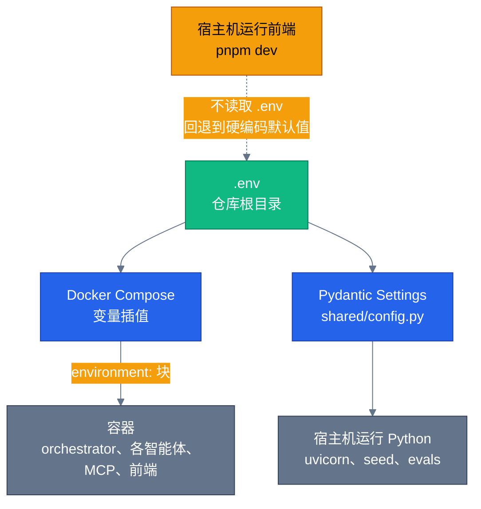

# 配置

本仓库中每一个可配置项都来自**同一个文件：仓库根目录下的 `.env`。**
没有第二个位置，没有按服务拆分的 env 文件，也没有按技术栈覆盖的文件。

本页说明这一个文件如何抵达三类完全不同的使用方、它为什么放在根目录而不是更整齐的地方，
以及新增一个变量时你需要动哪些地方。

## 三个文件

| 文件 | 是否入库 | 用途 |
|---|---|---|
| `.env.minimal` | 是 | 首次运行所需的内容。只有一个变量。把它复制为 `.env` 并填入你的密钥。 |
| `.env.example` | 是 | 完整配置面 —— 所有变量、已分组，并带默认值与说明。属于参考资料，不是起步模板。 |
| `.env` | **否**（`.gitignore`） | 属于你自己的文件。由上述任一文件复制而来。 |

```bash
cp .env.minimal .env      # 然后设置 OPENAI_API_KEY
```

该文件必须严格命名为 `.env`，且必须位于仓库根目录。Docker Compose 只会从项目目录自动加载
这个名称的文件 —— 其他名称都要求在每一次 `docker compose` 调用时传入 `--env-file`，
那会破坏快速开始所宣传的裸 `docker compose up`。

## 一个文件如何抵达三类使用方


```mermaid
%%{init: {'theme':'base', 'themeVariables': {
  'primaryColor': '#2563eb','primaryTextColor': '#ffffff','primaryBorderColor': '#1e40af',
  'lineColor': '#64748b','secondaryColor': '#f59e0b','tertiaryColor': '#10b981',
  'background': 'transparent'}}}%%
flowchart TB
  classDef core     fill:#2563eb,stroke:#1e40af,color:#ffffff
  classDef external fill:#f59e0b,stroke:#b45309,color:#000000
  classDef success  fill:#10b981,stroke:#047857,color:#ffffff
  classDef infra    fill:#64748b,stroke:#334155,color:#ffffff

  ENV[".env<br/>仓库根目录"]

  COMPOSE["Docker Compose<br/>变量插值"]
  PYD["Pydantic Settings<br/>shared/config.py"]

  CONTAINERS["容器<br/>orchestrator、各智能体、MCP、前端"]
  HOSTPY["宿主机运行 Python<br/>uvicorn、seed、evals"]
  HOSTWEB["宿主机运行前端<br/>pnpm dev"]

  ENV --> COMPOSE
  ENV --> PYD
  COMPOSE -->|"environment: 块"| CONTAINERS
  PYD --> HOSTPY
  HOSTWEB -.->|"不读取 .env<br/>回退到硬编码默认值"| ENV

  class ENV success
  class COMPOSE,PYD core
  class CONTAINERS,HOSTPY infra
  class HOSTWEB external
```

### 1. Docker Compose —— 变量插值

Compose 从项目目录读取 `.env`，并用它展开 **compose 文件内部**的 `${VAR}` 引用。
它不会把该文件注入容器。

```yaml
environment:
  OPENAI_API_KEY: ${OPENAI_API_KEY:-}
  LLM_MODEL: ${LLM_MODEL:-gpt-4.1}
```

**容器只接收其 `environment:` 块中列出的内容。** 你在 `.env` 里新增了变量，却没写进 compose
文件，它在所有容器内都会静默缺失 —— 这是本仓库最常见的配置错误，而且它的表现是取到默认值，
而不是报错。

大多数智能体服务通过 YAML 锚点继承同一个共享块：

```yaml
environment: &agent-env     # 在 orchestrator 上声明
  ...

environment:
  <<: *agent-env            # 每个专业智能体都合并它
  OTEL_SERVICE_NAME: ecommerce.product-discovery
```

因此，加到 `&agent-env` 的变量会同时抵达编排器和全部五个专业智能体。MCP 服务器与
`auth-server` 有自己的块，不继承它。

### 2. Pydantic Settings —— 宿主机运行 Python

`shared/config.py` 通过**绝对路径**解析同一个文件，该路径由 `config.py` 自身的位置计算得出，
而不是依据当前工作目录：

```python
_REPO_ROOT = _resolve_repo_root(Path(__file__))
_ENV_FILE = _REPO_ROOT / ".env"
```

这就是为什么 `cd agents/python && uv run uvicorn product_discovery.main:app` 能读取到根目录的
`.env`，尽管工作目录在下面两层。这是刻意设计的，它修正了两个值得了解的缺陷，源码中都有记录：

- 仓库根在 `config.py` 之上**三**层，而不是两层。早先的 `parents[2]` 解析到
  `<repo>/agents`，那里没有 `.env`，因此 Pydantic 的 `env_file` 加载从未生效，
  即便真实存在 `.env`，每一项设置也都静默回退到默认值。
- 在 Docker 镜像内，`config.py` 被平铺复制到 `/app/shared/config.py` —— 构建上下文是
  `./agents/python`，因此那个路径深度并不存在。`parents[3]` 抛出 `IndexError`，
  导致所有容器在导入阶段崩溃。`_resolve_repo_root` 在那里回退到直接父目录，
  该目录没有 `.env` —— 这是正确的，因为容器从 compose 的 `environment:` 块获取配置。

**在未重新阅读这些注释之前，不要修改该路径的解析方式。**

### 3. 前端 —— 不读取 `.env`

Next.js 读取的是 `web/.env.local`，而非仓库根目录，因此在 Docker 之外运行 `pnpm dev`
从根 `.env` 中看不到任何内容。它也不需要：`ORCHESTRATOR_URL` 有一个与 compose 默认值一致的兜底。

```ts
// web/src/app/api/[...path]/route.ts
return (process.env.ORCHESTRATOR_URL ?? "http://localhost:8080").replace(/\/+$/, "");
```

因此只要编排器在 `:8080` 上，`cd web && pnpm dev` 无需任何配置即可运行。只有当你需要指向
其他地方时才创建 `web/.env.local`。

**浏览器从不直接调用编排器。** 它调用前端自身的源，由
`web/src/app/api/[...path]/route.ts` 把 `/api/*` 转发到 `ORCHESTRATOR_URL`。该变量是服务端的，
且按请求读取，因此修改它只需重启容器，而不必重建镜像 —— 并且编排器不需要任何公网入口，
也无需配置跨域资源共享（CORS）。

这里过去用的是 `NEXT_PUBLIC_API_URL`，而 Next 会在**构建时内联**它。由此产生的两个后果在
本仓库其他地方有记录，如今都已消除：针对一个已构建过的目录再启动第二个 `next dev` 时，
它会使用**第一个**实例的 API 地址；云上部署也无法在分配该地址的基础设施存在之前得知自己的
API 地址。`web/src/lib/api.ts` 仍然尊重 `NEXT_PUBLIC_API_URL`，作为直连编排器的逃生通道 ——
它可用，但会把 CORS 问题一并带回来。

## 新增一个变量

一个新的设置需要在多个地方声明。这才是 `.env.example` 长达 210 行的真正原因 ——
而不是文件位置本身。

1. **`agents/python/shared/config.py`** —— 把字段加入 `Settings`，带默认值，并写注释说明它的
   作用以及出错时的表现。
2. **`.env.example`** —— 加入正确的分组，附默认值与说明。
3. **`docker-compose.yml`** —— 加入每个需要它的服务的 `environment:` 块，形式为
   `${VAR:-default}`。若所有智能体都需要，就使用 `&agent-env` 锚点。
4. **`docs/deployment.md`** —— 在环境变量表中新增一行。

第 1 步和第 3 步会各自独立地出问题：字段加进了 `Settings` 却没加进 compose 块，
在宿主机上运行完全正常，而在所有容器里都静默使用默认值。

**不要**把它加进 `.env.minimal`。那个文件存在的意义就是保持只有一个变量。

## 绝不能放进 `.env` 的内容

`.env` 已被 gitignore，但它仍然是开发机上的一份明文文件。生产密钥应放在密钥管理服务中
（Key Vault，或你所使用平台的等价物），在运行时注入。

当 `ENVIRONMENT` 不是 `development` 时，`shared/config.py` 会针对薄弱或占位式密钥快速失败，
即便在开发环境下也会大声告警。`.env.example` 中附带的占位值在非开发环境下会被明确拒绝，
因此把它原样复制到已部署环境不可能意外生效。

## 相关内容

- [快速开始](quick-start.md) —— 让服务栈跑起来的最快路径
- [部署](deployment.md) —— 按服务划分的完整环境变量表
- [安全指南](security-guide.md) —— 密钥处理与威胁模型
- [发布流程](releasing.md) —— 版本与镜像如何产出
