# Database Schema

E-Commerce Agents uses PostgreSQL 16 with the **pgvector** extension for embedding-based semantic search and **pgcrypto** for UUID generation. The schema contains 34 tables organized into 12 logical groups.

## Entity-Relationship Diagram

```mermaid
erDiagram
    %% ── Auth & Users ──────────────────────────────────
    users {
        uuid id PK
        varchar email UK
        varchar password_hash
        varchar name
        varchar role
        varchar loyalty_tier
        decimal total_spend
        timestamptz created_at
        boolean is_active
    }

    %% ── Product Catalog ───────────────────────────────
    products {
        uuid id PK
        varchar name
        text description
        varchar category
        varchar brand
        decimal price
        decimal original_price
        varchar image_url
        decimal rating
        integer review_count
        jsonb specs
        boolean is_active
        timestamptz created_at
    }

    product_embeddings {
        uuid id PK
        uuid product_id FK
        vector_1536 embedding
        timestamptz created_at
    }

    price_history {
        uuid id PK
        uuid product_id FK
        decimal price
        timestamptz recorded_at
    }

    %% ── Orders & Returns ──────────────────────────────
    orders {
        uuid id PK
        uuid user_id FK
        varchar status
        decimal total
        jsonb shipping_address
        varchar shipping_carrier
        varchar tracking_number
        varchar coupon_code
        decimal discount_amount
        timestamptz created_at
    }

    order_items {
        uuid id PK
        uuid order_id FK
        uuid product_id FK
        integer quantity
        decimal unit_price
        decimal subtotal
    }

    order_status_history {
        uuid id PK
        uuid order_id FK
        varchar status
        text notes
        varchar location
        timestamptz timestamp
    }

    returns {
        uuid id PK
        uuid order_id FK
        uuid user_id FK
        varchar reason
        varchar status
        varchar return_label_url
        varchar refund_method
        decimal refund_amount
        timestamptz created_at
        timestamptz resolved_at
    }

    %% ── Reviews ───────────────────────────────────────
    reviews {
        uuid id PK
        uuid product_id FK
        uuid user_id FK
        integer rating
        varchar title
        text body
        boolean verified_purchase
        integer helpful_count
        boolean is_flagged
        timestamptz created_at
    }

    %% ── Inventory & Shipping ──────────────────────────
    warehouses {
        uuid id PK
        varchar name
        varchar location
        varchar region
    }

    warehouse_inventory {
        uuid warehouse_id PK_FK
        uuid product_id PK_FK
        integer quantity
        integer reorder_threshold
    }

    carriers {
        uuid id PK
        varchar name
        varchar speed_tier
        decimal base_rate
    }

    shipping_rates {
        uuid id PK
        uuid carrier_id FK
        varchar region_from
        varchar region_to
        decimal price
        integer estimated_days_min
        integer estimated_days_max
    }

    restock_schedule {
        uuid id PK
        uuid product_id FK
        uuid warehouse_id FK
        integer expected_quantity
        date expected_date
    }

    %% ── Pricing & Promotions ─────────────────────────
    coupons {
        uuid id PK
        varchar code UK
        text description
        varchar discount_type
        decimal discount_value
        decimal min_spend
        decimal max_discount
        integer usage_limit
        integer times_used
        timestamptz valid_from
        timestamptz valid_until
        text_array applicable_categories
        varchar user_specific_email
        boolean is_active
    }

    promotions {
        uuid id PK
        varchar name
        varchar type
        jsonb rules
        timestamptz start_date
        timestamptz end_date
        boolean is_active
    }

    loyalty_tiers {
        uuid id PK
        varchar name UK
        decimal min_spend
        decimal discount_pct
        decimal free_shipping_threshold
        boolean priority_support
    }

    %% ── Marketplace ──────────────────────────────────
    agent_catalog {
        uuid id PK
        varchar name UK
        varchar display_name
        text description
        varchar category
        varchar icon
        varchar status
        varchar version
        text_array capabilities
        text_array input_types
        text_array output_types
        boolean requires_approval
        text_array allowed_roles
        jsonb config
    }

    access_requests {
        uuid id PK
        uuid user_id FK
        varchar agent_name FK
        varchar role_requested
        text use_case
        varchar status
        text admin_notes
        uuid reviewed_by FK
        timestamptz created_at
        timestamptz resolved_at
    }

    agent_permissions {
        uuid id PK
        uuid user_id FK
        varchar agent_name FK
        varchar role
        timestamptz granted_at
        uuid granted_by FK
    }

    %% ── Conversations & Usage ────────────────────────
    conversations {
        uuid id PK
        uuid user_id FK
        varchar title
        boolean is_active
        timestamptz created_at
        timestamptz last_message_at
    }

    messages {
        uuid id PK
        uuid conversation_id FK
        varchar role
        text content
        varchar agent_name
        text_array agents_involved
        jsonb metadata
        integer tokens_in
        integer tokens_out
        timestamptz created_at
    }

    usage_logs {
        uuid id PK
        uuid user_id FK
        varchar agent_name
        uuid session_id
        varchar trace_id
        text input_summary
        integer tokens_in
        integer tokens_out
        integer tool_calls_count
        integer duration_ms
        varchar status
        text error_message
        timestamptz created_at
    }

    agent_execution_steps {
        uuid id PK
        uuid usage_log_id FK
        integer step_index
        varchar tool_name
        jsonb tool_input
        jsonb tool_output
        varchar status
        integer duration_ms
        timestamptz created_at
    }

    %% ── Relationships ─────────────────────────────────

    users ||--o{ orders : places
    users ||--o{ reviews : writes
    users ||--o{ returns : requests
    users ||--o{ conversations : has
    users ||--o{ access_requests : submits
    users ||--o{ agent_permissions : granted
    users ||--o{ usage_logs : generates

    products ||--o| product_embeddings : has
    products ||--o{ price_history : tracks
    products ||--o{ order_items : sold_in
    products ||--o{ reviews : reviewed_in
    products ||--o{ warehouse_inventory : stocked_at
    products ||--o{ restock_schedule : restocked_by

    orders ||--o{ order_items : contains
    orders ||--o{ order_status_history : tracked_by
    orders ||--o| returns : returned_via

    warehouses ||--o{ warehouse_inventory : holds
    warehouses ||--o{ restock_schedule : receives
    carriers ||--o{ shipping_rates : priced_at

    agent_catalog ||--o{ access_requests : requested_for
    agent_catalog ||--o{ agent_permissions : controls

    conversations ||--o{ messages : contains
    usage_logs ||--o{ agent_execution_steps : details
```



---

## Table Groups

### Auth & Users

| Table | Key Columns | Notes |
|-------|-------------|-------|
| **users** | `id` (PK), `email` (unique), `password_hash`, `name`, `role`, `loyalty_tier`, `total_spend`, `is_active` | Roles: `customer`, `power_user`, `seller`, `admin`. Loyalty tiers: `bronze`, `silver`, `gold`. Passwords hashed with bcrypt. |

### Product Catalog

| Table | Key Columns | Notes |
|-------|-------------|-------|
| **products** | `id` (PK), `name`, `category`, `brand`, `price`, `original_price`, `rating`, `specs` (JSONB) | Categories: Electronics, Clothing, Home, Sports, Books. `specs` stores product-specific attributes as flexible JSON. |
| **product_embeddings** | `id` (PK), `product_id` (FK -> products), `embedding` (vector(1536)) | One embedding per product. Uses `text-embedding-3-small` (1536 dimensions). IVFFlat index with 10 lists for cosine similarity search. |
| **price_history** | `id` (PK), `product_id` (FK -> products), `price`, `recorded_at` | Daily price snapshots. Seeder generates 90 days of history. |

**Indexes**
- `idx_products_category` on `products(category)`
- `idx_products_price` on `products(price)`
- `idx_products_rating` on `products(rating DESC)`
- `idx_product_embedding` on `product_embeddings(embedding)` using IVFFlat with `vector_cosine_ops`


### `promotions.rules` schema

`rules` is untyped JSONB, which for a long time meant *undocumented* rather than
flexible: `scripts/seed.py` wrote one set of key names and
`pricing_promotions/tools.py::optimize_cart` read another, so **no promotion had
ever applied correctly** (#51). Only one of the three failed loudly.

| type | Accepted keys | Meaning |
|---|---|---|
| `bundle` | `products` (names) **or** `product_ids` (UUIDs), `discount_pct` | Percentage off the listed items, only when **all** of them are in the cart |
| `buy_x_get_y` | `buy_quantity` + `free_quantity`, optional `category`/`categories` | Genuine buy-X-get-Y-free |
| `buy_x_get_y` | `min_quantity` + `discount_pct`, optional `category`/`categories` | Percentage off once a minimum quantity is reached — what "Buy 2 Books Get 10% Off" actually means |
| `flash_sale` | `categories` **and/or** `product_ids`, `discount_pct` | Percentage off matching items |

Both singular (`category`) and plural (`categories`) are accepted, because the
seeded rows use both.

Two rules the reader enforces, each closing a defect that shipped:

- **An empty requirement list never matches.** A `bundle` with no `products` and
  no `product_ids` used to match *every* cart, because `all([])` is `True`. It
  then contributed £0 — silent noise on every cart-optimisation call.
- **Unparseable rules are skipped, not guessed at.** A `buy_x_get_y` row
  describing neither shape used to leave `buy_quantity` and `free_quantity` at
  `0`, making `quantity >= 0 + 0` always true and dividing by zero on the next
  line. A discount outside 0–100% is treated as a data error and ignored rather
  than applied.

> **Gotcha — an IVFFlat index must be built *after* the vectors exist.**
> IVFFlat partitions the vector space into `lists` clusters using whatever data
> is present when the index is built. `init.sql` creates this index on an empty
> table, so it has nothing to derive centroids from, and at the default
> `ivfflat.probes = 1` a query probes one degenerate partition and returns
> whatever happens to be in it — or nothing.
>
> Measured on a seeded database, same data and same query, index alone being
> the difference:
>
> | | Top result | Similarity |
> |---|---|---|
> | through the index | Patagonia Better Sweater | 0.000 |
> | exact scan | Sony WH-1000XM5 | 0.420 |
>
> Nothing errors. Semantic search simply returns unrelated products, which is
> why this survived: it looks like a weak embedding model rather than a broken
> index. Two defences are in place — `scripts/generate_embeddings.py` runs
> `REINDEX INDEX idx_product_embedding` after writing, and `semantic_search` /
> `find_similar_products` raise `ivfflat.probes` for their own query so
> correctness does not depend on someone having remembered to reindex. The
> same applies after any wholesale re-embedding: centroids computed for the
> previous vectors do not describe the new ones.
- `idx_price_history` on `price_history(product_id, recorded_at DESC)`

### Orders & Returns

| Table | Key Columns | Notes |
|-------|-------------|-------|
| **orders** | `id` (PK), `user_id` (FK -> users), `status`, `total`, `shipping_address` (JSONB), `coupon_code`, `discount_amount` | Statuses: `placed`, `confirmed`, `shipped`, `out_for_delivery`, `delivered`, `cancelled`, `returned`. Shipping address stored as `{street, city, state, zip, country}`. |
| **order_items** | `id` (PK), `order_id` (FK -> orders), `product_id` (FK -> products), `quantity`, `unit_price`, `subtotal` | Line items for each order. |
| **order_status_history** | `id` (PK), `order_id` (FK -> orders), `status`, `notes`, `location`, `timestamp` | Tracking timeline with location info per status change. |
| **returns** | `id` (PK), `order_id` (FK -> orders), `user_id` (FK -> users), `reason`, `status`, `refund_method`, `refund_amount` | Return statuses: `requested`, `approved`, `shipped_back`, `received`, `refunded`, `denied`. Refund methods: `original_payment`, `store_credit`. |

**Indexes**
- `idx_orders_user` on `orders(user_id, created_at DESC)`
- `idx_orders_status` on `orders(status)`

### Reviews

| Table | Key Columns | Notes |
|-------|-------------|-------|
| **reviews** | `id` (PK), `product_id` (FK -> products), `user_id` (FK -> users), `rating` (1-5), `title`, `body`, `verified_purchase`, `is_flagged` | `CHECK (rating BETWEEN 1 AND 5)`. `is_flagged` marks reviews detected as potentially fake by the sentiment agent. |

**Indexes**
- `idx_reviews_product` on `reviews(product_id, created_at DESC)`
- `idx_reviews_rating` on `reviews(product_id, rating)`

### Inventory & Shipping

| Table | Key Columns | Notes |
|-------|-------------|-------|
| **warehouses** | `id` (PK), `name`, `location`, `region` | 3 warehouses: East (Richmond, VA), Central (Chicago, IL), West (Portland, OR). |
| **warehouse_inventory** | `warehouse_id` + `product_id` (composite PK), `quantity`, `reorder_threshold` | Per-warehouse stock levels. Composite primary key. |
| **carriers** | `id` (PK), `name`, `speed_tier`, `base_rate` | Speed tiers: `standard`, `express`, `overnight`. |
| **shipping_rates** | `id` (PK), `carrier_id` (FK -> carriers), `region_from`, `region_to`, `price`, `estimated_days_min/max` | Region-to-region pricing with delivery time estimates. |
| **restock_schedule** | `id` (PK), `product_id` (FK -> products), `warehouse_id` (FK -> warehouses), `expected_quantity`, `expected_date` | Scheduled incoming inventory. |

**Indexes**
- `idx_warehouse_inv` on `warehouse_inventory(product_id)`

### Pricing & Promotions

| Table | Key Columns | Notes |
|-------|-------------|-------|
| **coupons** | `id` (PK), `code` (unique), `discount_type`, `discount_value`, `min_spend`, `max_discount`, `applicable_categories` (TEXT[]), `user_specific_email` | Types: `percentage`, `fixed`. `applicable_categories` is NULL for all-category coupons. `user_specific_email` is NULL for universal coupons. |
| **promotions** | `id` (PK), `name`, `type`, `rules` (JSONB), `start_date`, `end_date` | Types: `bundle`, `buy_x_get_y`, `flash_sale`. See the rules schema below — "flexible JSONB" is what let the seed and the reader drift apart. |
| **loyalty_tiers** | `id` (PK), `name` (unique), `min_spend`, `discount_pct`, `free_shipping_threshold`, `priority_support` | 3 tiers: bronze ($0, 0%), silver ($1000, 5%), gold ($3000, 10%). |

### Marketplace

| Table | Key Columns | Notes |
|-------|-------------|-------|
| **agent_catalog** | `id` (PK), `name` (unique), `display_name`, `description`, `capabilities` (TEXT[]), `requires_approval`, `allowed_roles` (TEXT[]) | 6 agents registered. `name` is the FK target (not `id`) for simpler references. |
| **access_requests** | `id` (PK), `user_id` (FK -> users), `agent_name` (FK -> agent_catalog.name), `role_requested`, `use_case`, `status`, `reviewed_by` (FK -> users) | Statuses: `pending`, `approved`, `denied`. Admin review tracked with `reviewed_by` and `resolved_at`. |
| **agent_permissions** | `id` (PK), `user_id` (FK -> users), `agent_name` (FK -> agent_catalog.name), `role`, `granted_by` (FK -> users) | UNIQUE constraint on `(user_id, agent_name)`. Upserted on approval. |

**Indexes**
- `idx_access_requests_status` on `access_requests(status, created_at DESC)`

### Conversations & Usage

| Table | Key Columns | Notes |
|-------|-------------|-------|
| **conversations** | `id` (PK), `user_id` (FK -> users), `title`, `is_active`, `last_message_at` | Soft-delete via `is_active`. Title auto-set from first user message (first 100 chars). |
| **messages** | `id` (PK), `conversation_id` (FK -> conversations), `role`, `content`, `agent_name`, `agents_involved` (TEXT[]), `metadata` (JSONB) | Roles: `user`, `assistant`, `system`. `agents_involved` tracks which specialist agents contributed. `metadata` stores tool call data and trace info. |
| **usage_logs** | `id` (PK), `user_id` (FK -> users), `agent_name`, `trace_id`, `tokens_in`, `tokens_out`, `tool_calls_count`, `duration_ms`, `status` | `trace_id` correlates with OTel traces in the Aspire Dashboard. Status: `success` or `error`. |
| **agent_execution_steps** | `id` (PK), `usage_log_id` (FK -> usage_logs), `step_index`, `tool_name`, `tool_input` (JSONB), `tool_output` (JSONB), `duration_ms` | Ordered by `step_index`. Records each tool invocation within an agent execution. |

**Indexes**
- `idx_usage_logs_user` on `usage_logs(user_id, created_at DESC)`
- `idx_usage_logs_agent` on `usage_logs(agent_name, created_at DESC)`
- `idx_usage_logs_trace` on `usage_logs(trace_id)`
- `idx_messages_conversation` on `messages(conversation_id, created_at)`

### Cart & Checkout

| Table | Key Columns | Notes |
|-------|-------------|-------|
| **carts** | `id` (PK), `user_id` (FK -> users, **UNIQUE**), `shipping_address` (JSONB), `billing_address` (JSONB), `billing_same_as_shipping`, `coupon_code`, `discount_amount` | One cart per user, enforced by the unique constraint — a second cart is impossible rather than merely unlikely. Addresses are JSONB (`{name, street, city, state, zip, country, phone}`), which is why the UI has to handle both string and object shapes when rendering one. |
| **cart_items** | `id` (PK), `cart_id` (FK -> carts, `ON DELETE CASCADE`), `product_id` (FK -> products), `quantity` (`CHECK > 0`) | `UNIQUE(cart_id, product_id)` — adding the same product twice increments the quantity instead of inserting a second row. |

### Agent Memory

| Table | Key Columns | Notes |
|-------|-------------|-------|
| **agent_memories** | `id` (PK), `user_id` (FK -> users), `category`, `content`, `importance` (SMALLINT), `embedding` (`vector(1536)`), `expires_at`, `is_active` | Long-term per-user memory, distinct from conversation history: written by `store_memory` and read by `recall_memories`. Embedded, so recall is semantic rather than keyword. Soft-deleted via `is_active`; `expires_at` lets a memory age out. |

### Human-in-the-Loop & Durability

| Table | Key Columns | Notes |
|-------|-------------|-------|
| **tool_approval_requests** | `id` (PK), `session_id`, `user_email`, `agent_name`, `tool_name`, `tool_input` (JSONB), `status`, `approved_by`, `execution_result` (JSONB) | The *middleware* HITL path: a gated tool is intercepted before it runs, a row is written, and the tool returns `pending_approval` without calling through. Approval re-executes the operation directly — the LLM loop is never resumed. Writes fail **closed**: if the row cannot be written the tool does not execute. |
| **hitl_requests** | `id` (PK), `workflow_run_id` (FK -> usage_logs, `ON DELETE CASCADE`), `request_id`, `checkpoint_id` (FK -> workflow_checkpoints), `kind`, `payload` (JSONB), `status`, `response` (JSONB) | The *in-workflow* HITL path, and a genuinely different mechanism: `request_id` is MAF's own resume token and `checkpoint_id` points at the paused graph, so approving one resumes the real workflow from where it stopped. Status: `pending`, `approved`, `rejected`, `timeout`. |
| **workflow_checkpoints** | `checkpoint_id` (PK), `workflow_name`, `payload` (JSONB), `usage_log_id` (FK -> usage_logs) | Encoded MAF `WorkflowCheckpoint`. A workflow that pauses does not survive as a live object across requests — resume rebuilds a fresh graph from this row plus the response. |
| **idempotency_keys** | `key` (PK, VARCHAR(600)), `scope`, `status` (`in_progress` \| `completed`), `result` (JSONB), `completed_at` | Reserved with `INSERT ... ON CONFLICT DO NOTHING`, so a duplicate is refused rather than racing. A completed reservation replays its cached `result`; one older than 60s is reclaimed, which is how a crashed process recovers. This is what stops an approved refund from executing twice. |

**Note on the FK between them:** `hitl_requests.checkpoint_id` references `workflow_checkpoints`, so a bare `TRUNCATE workflow_checkpoints` fails regardless of the FK's `ON DELETE` action — truncate both together or use `CASCADE`.

### OAuth2 Authorization Server

Present only when `AUTH_MODE=oauth`; the default `local` mode never touches these.

| Table | Key Columns | Notes |
|-------|-------------|-------|
| **oauth_clients** | `client_id` (PK), `client_secret_hash`, `client_name`, `is_confidential`, `allowed_grant_types` (TEXT[]), `allowed_scopes` (TEXT[]), `allowed_audiences` (TEXT[]), `token_endpoint_auth_method` | Secrets are hashed, never stored raw. The three array columns are what make cross-scope and cross-audience token requests refusable. |
| **oauth_signing_keys** | `kid` (PK), `alg` (default RS256), `public_jwk` (JSONB), `private_pem_enc` (BYTEA), `is_active`, `retired_at` | The private key is Fernet-encrypted at rest; only `public_jwk` is served from the JWKS endpoint. `retired_at` supports rotation without invalidating tokens still in flight. |
| **oauth_tokens** | `id` (PK), `client_id` (FK -> oauth_clients), `subject`, `token_type`, `token_hash`, `scope`, `audience`, `expires_at`, `revoked` | Only refresh tokens are persisted, and only as a SHA-256 digest — the raw token is never stored. `subject` is the user's email for password-grant tokens and NULL for client-credentials service tokens. |

---

## Seed Data Summary

The seeder (`scripts/seed.py`) populates the database with deterministic data (`random.seed(42)`):

| Table | Count | Details |
|-------|-------|---------|
| users | 20 | 1 admin, 2 power users, 2 sellers, 15 customers |
| products | 50 | 10 per category (Electronics, Clothing, Home, Sports, Books) |
| product_embeddings | 50 | Generated separately via `scripts/generate_embeddings.py` |
| orders | 200 | Distributed across statuses (placed through delivered/cancelled) |
| order_items | ~400 | 1-4 items per order |
| order_status_history | ~600 | Full tracking timeline per order |
| returns | ~20 | Subset of delivered orders |
| reviews | 500 | 5% flagged as potentially fake |
| warehouses | 3 | East, Central, West |
| warehouse_inventory | 150 | Each product stocked at all 3 warehouses |
| carriers | 3 | Standard, Express, Overnight |
| shipping_rates | ~27 | All region-to-region combinations for all carriers |
| restock_schedule | ~30 | Upcoming restocks for low-inventory products |
| coupons | 15 | Mix of percentage and fixed discounts, some user-specific |
| promotions | 5 | Bundle deals, buy-X-get-Y, flash sales |
| loyalty_tiers | 3 | Bronze (0%), Silver (5%), Gold (10%) |
| price_history | ~4500 | 90 daily snapshots per product |
| agent_catalog | 6 | One entry per specialist agent |
| agent_permissions | ~8 | Pre-seeded for admin and power users |

### Default Login Credentials

| Role | Email | Password |
|------|-------|----------|
| Admin | `admin.demo@gmail.com` | `admin123` |
| Power User | `power.demo@gmail.com` | `power123` |
| Customer | `alice.johnson@gmail.com` | `customer123` |

---

## Extensions

```sql
CREATE EXTENSION IF NOT EXISTS vector;     -- pgvector for embedding search
CREATE EXTENSION IF NOT EXISTS pgcrypto;   -- gen_random_uuid()
```

## Gotchas

- **product_embeddings** uses an IVFFlat index (`lists = 10`). This index type requires the table to have existing data before creation, or it will be empty. The seeder runs `generate_embeddings.py` as a post-step.
- **agent_catalog.name** is the FK target for `access_requests` and `agent_permissions`, not the `id` column. This simplifies lookups but means agent names cannot be renamed without cascading updates.
- **warehouse_inventory** has a composite primary key `(warehouse_id, product_id)` rather than a surrogate UUID.
- **usage_logs.user_id** is typed as `UUID REFERENCES users(id)`, but some queries cast it with `::uuid` defensively in the audit endpoint.
- **shipping_address** on orders is stored as JSONB, not normalized. Expected shape: `{street, city, state, zip, country}`.

---

## Related

- [`docs/architecture.md`](architecture.md) — data flow showing how queries reach these tables
- [`docs/api-reference.md`](api-reference.md) — REST endpoints that read and write these tables
- [`docs/deployment.md`](deployment.md) — `init.sql` location and volume/seeder lifecycle
- [Project README](../README.md)
