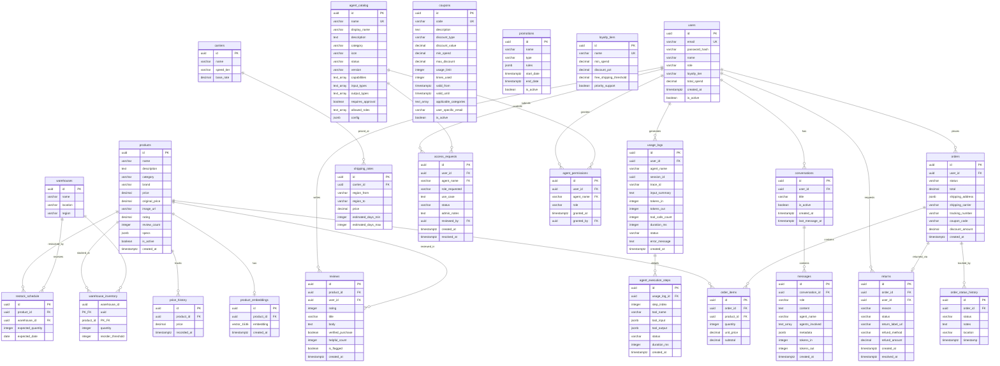

# 数据库模式（schema）

可靠电商多智能体平台使用 PostgreSQL 16，并通过 **pgvector** 扩展实现基于嵌入（embedding）的语义检索、通过 **pgcrypto** 实现 UUID 生成。该模式（schema）包含 34 张表，划分为 12 个逻辑分组。

## 实体关系图


```mermaid
erDiagram
    %% ── Auth & Users ──────────────────────────────────
    users {
        uuid id PK
        varchar email UK
        varchar password_hash
        varchar name
        varchar role
        varchar loyalty_tier
        decimal total_spend
        timestamptz created_at
        boolean is_active
    }

    %% ── Product Catalog ───────────────────────────────
    products {
        uuid id PK
        varchar name
        text description
        varchar category
        varchar brand
        decimal price
        decimal original_price
        varchar image_url
        decimal rating
        integer review_count
        jsonb specs
        boolean is_active
        timestamptz created_at
    }

    product_embeddings {
        uuid id PK
        uuid product_id FK
        vector_1536 embedding
        timestamptz created_at
    }

    price_history {
        uuid id PK
        uuid product_id FK
        decimal price
        timestamptz recorded_at
    }

    %% ── Orders & Returns ──────────────────────────────
    orders {
        uuid id PK
        uuid user_id FK
        varchar status
        decimal total
        jsonb shipping_address
        varchar shipping_carrier
        varchar tracking_number
        varchar coupon_code
        decimal discount_amount
        timestamptz created_at
    }

    order_items {
        uuid id PK
        uuid order_id FK
        uuid product_id FK
        integer quantity
        decimal unit_price
        decimal subtotal
    }

    order_status_history {
        uuid id PK
        uuid order_id FK
        varchar status
        text notes
        varchar location
        timestamptz timestamp
    }

    returns {
        uuid id PK
        uuid order_id FK
        uuid user_id FK
        varchar reason
        varchar status
        varchar return_label_url
        varchar refund_method
        decimal refund_amount
        timestamptz created_at
        timestamptz resolved_at
    }

    %% ── Reviews ───────────────────────────────────────
    reviews {
        uuid id PK
        uuid product_id FK
        uuid user_id FK
        integer rating
        varchar title
        text body
        boolean verified_purchase
        integer helpful_count
        boolean is_flagged
        timestamptz created_at
    }

    %% ── Inventory & Shipping ──────────────────────────
    warehouses {
        uuid id PK
        varchar name
        varchar location
        varchar region
    }

    warehouse_inventory {
        uuid warehouse_id PK_FK
        uuid product_id PK_FK
        integer quantity
        integer reorder_threshold
    }

    carriers {
        uuid id PK
        varchar name
        varchar speed_tier
        decimal base_rate
    }

    shipping_rates {
        uuid id PK
        uuid carrier_id FK
        varchar region_from
        varchar region_to
        decimal price
        integer estimated_days_min
        integer estimated_days_max
    }

    restock_schedule {
        uuid id PK
        uuid product_id FK
        uuid warehouse_id FK
        integer expected_quantity
        date expected_date
    }

    %% ── Pricing & Promotions ─────────────────────────
    coupons {
        uuid id PK
        varchar code UK
        text description
        varchar discount_type
        decimal discount_value
        decimal min_spend
        decimal max_discount
        integer usage_limit
        integer times_used
        timestamptz valid_from
        timestamptz valid_until
        text_array applicable_categories
        varchar user_specific_email
        boolean is_active
    }

    promotions {
        uuid id PK
        varchar name
        varchar type
        jsonb rules
        timestamptz start_date
        timestamptz end_date
        boolean is_active
    }

    loyalty_tiers {
        uuid id PK
        varchar name UK
        decimal min_spend
        decimal discount_pct
        decimal free_shipping_threshold
        boolean priority_support
    }

    %% ── Marketplace ──────────────────────────────────
    agent_catalog {
        uuid id PK
        varchar name UK
        varchar display_name
        text description
        varchar category
        varchar icon
        varchar status
        varchar version
        text_array capabilities
        text_array input_types
        text_array output_types
        boolean requires_approval
        text_array allowed_roles
        jsonb config
    }

    access_requests {
        uuid id PK
        uuid user_id FK
        varchar agent_name FK
        varchar role_requested
        text use_case
        varchar status
        text admin_notes
        uuid reviewed_by FK
        timestamptz created_at
        timestamptz resolved_at
    }

    agent_permissions {
        uuid id PK
        uuid user_id FK
        varchar agent_name FK
        varchar role
        timestamptz granted_at
        uuid granted_by FK
    }

    %% ── Conversations & Usage ────────────────────────
    conversations {
        uuid id PK
        uuid user_id FK
        varchar title
        boolean is_active
        timestamptz created_at
        timestamptz last_message_at
    }

    messages {
        uuid id PK
        uuid conversation_id FK
        varchar role
        text content
        varchar agent_name
        text_array agents_involved
        jsonb metadata
        integer tokens_in
        integer tokens_out
        timestamptz created_at
    }

    usage_logs {
        uuid id PK
        uuid user_id FK
        varchar agent_name
        uuid session_id
        varchar trace_id
        text input_summary
        integer tokens_in
        integer tokens_out
        integer tool_calls_count
        integer duration_ms
        varchar status
        text error_message
        timestamptz created_at
    }

    agent_execution_steps {
        uuid id PK
        uuid usage_log_id FK
        integer step_index
        varchar tool_name
        jsonb tool_input
        jsonb tool_output
        varchar status
        integer duration_ms
        timestamptz created_at
    }

    %% ── Relationships ─────────────────────────────────

    users ||--o{ orders : places
    users ||--o{ reviews : writes
    users ||--o{ returns : requests
    users ||--o{ conversations : has
    users ||--o{ access_requests : submits
    users ||--o{ agent_permissions : granted
    users ||--o{ usage_logs : generates

    products ||--o| product_embeddings : has
    products ||--o{ price_history : tracks
    products ||--o{ order_items : sold_in
    products ||--o{ reviews : reviewed_in
    products ||--o{ warehouse_inventory : stocked_at
    products ||--o{ restock_schedule : restocked_by

    orders ||--o{ order_items : contains
    orders ||--o{ order_status_history : tracked_by
    orders ||--o| returns : returned_via

    warehouses ||--o{ warehouse_inventory : holds
    warehouses ||--o{ restock_schedule : receives
    carriers ||--o{ shipping_rates : priced_at

    agent_catalog ||--o{ access_requests : requested_for
    agent_catalog ||--o{ agent_permissions : controls

    conversations ||--o{ messages : contains
    usage_logs ||--o{ agent_execution_steps : details
```

---

## 表分组

### 认证与用户

| 表 | 关键列 | 说明 |
|-------|-------------|-------|
| **users** | `id` (PK), `email` (unique), `password_hash`, `name`, `role`, `loyalty_tier`, `total_spend`, `is_active` | 角色：`customer`、`power_user`、`seller`、`admin`。忠诚度等级：`bronze`、`silver`、`gold`。密码使用 bcrypt 哈希存储。 |

### 商品目录

| 表 | 关键列 | 说明 |
|-------|-------------|-------|
| **products** | `id` (PK), `name`, `category`, `brand`, `price`, `original_price`, `rating`, `specs` (JSONB) | 类别：Electronics、Clothing、Home、Sports、Books。`specs` 以灵活的 JSON 存储商品特有的属性。 |
| **product_embeddings** | `id` (PK), `product_id` (FK -> products), `embedding` (vector(1536)) | 每个商品一条嵌入（embedding）。使用 `text-embedding-3-small`（1536 维）。使用带 10 个 lists 的 IVFFlat 索引进行余弦相似度检索。 |
| **price_history** | `id` (PK), `product_id` (FK -> products), `price`, `recorded_at` | 每日价格快照。种子数据生成器生成 90 天的历史记录。 |

**索引**
- `idx_products_category` on `products(category)`
- `idx_products_price` on `products(price)`
- `idx_products_rating` on `products(rating DESC)`
- `idx_product_embedding`：在 `product_embeddings(embedding)` 上使用 IVFFlat 与 `vector_cosine_ops`。


### `promotions.rules` 模式（schema）

`rules` 是无类型的 JSONB，长期以来它意味着*没有文档*而非灵活：`scripts/seed.py`
写入了一套键名，而 `pricing_promotions/tools.py::optimize_cart` 读取的是另一套，
因此**从未有任何一个促销活动被正确应用**（#51）。三者中只有一个会显式报错。

| type | 接受的键 | 含义 |
|---|---|---|
| `bundle` | `products`（名称）**或** `product_ids`（UUID）、`discount_pct` | 对列出的商品打折，仅当它们**全部**都在购物车中时才生效 |
| `buy_x_get_y` | `buy_quantity` + `free_quantity`，可选 `category`/`categories` | 真正的买 X 赠 Y |
| `buy_x_get_y` | `min_quantity` + `discount_pct`，可选 `category`/`categories` | 达到最小数量后打折 —— 「买 2 本书享 10% 折扣」实际表达的就是这个含义 |
| `flash_sale` | `categories` **和/或** `product_ids`、`discount_pct` | 对匹配的商品打折 |

单数（`category`）与复数（`categories`）都会被接受，因为种子数据行两者都用了。

读取方强制执行两条规则，每条都修补了一个已经上线的缺陷：

- **空的需求列表永不匹配。** 一个既没有 `products` 也没有 `product_ids` 的 `bundle`
  过去会匹配*每一个*购物车，因为 `all([])` 为 `True`。随后它只贡献 £0 ——
  在每次购物车优化调用中都是无声的噪声。
- **无法解析的规则会被跳过，而不是被猜测。** 一个两种形态都不描述的 `buy_x_get_y`
  行过去会让 `buy_quantity` 和 `free_quantity` 停留在 `0`，使得 `quantity >= 0 + 0`
  恒为真，并在下一行发生除零。落在 0–100% 之外的折扣会被视为数据错误并忽略，
  而不是被应用。

> **易错点 —— IVFFlat 索引必须在向量存在*之后*构建。**
> IVFFlat 在构建索引时会用当时存在的数据把向量空间划分成 `lists` 个簇。`init.sql`
> 在空表上创建该索引，因此它没有任何数据可以推导质心；而在默认的
> `ivfflat.probes = 1` 下，查询只探测一个退化的分区，返回其中恰好存在的任何内容 ——
> 或者什么都没有。
>
> 在已灌入种子数据的数据库上实测，数据相同、查询相同，唯一的差异是有无该索引：
>
> | | 首位结果 | 相似度 |
> |---|---|---|
> | 走索引 | Patagonia Better Sweater | 0.000 |
> | 精确扫描 | Sony WH-1000XM5 | 0.420 |
>
> 不会有任何报错。语义检索只是返回不相关的商品，这也正是它一直没被发现的原因：
> 它看起来像是嵌入模型太弱，而不是索引损坏。目前有两道防线 ——
> `scripts/generate_embeddings.py` 在写入后执行 `REINDEX INDEX idx_product_embedding`，
> 而 `semantic_search` / `find_similar_products` 会为自己的查询调高 `ivfflat.probes`，
> 因此正确性并不依赖于是否有人记得重建索引。任何整体重新生成嵌入之后同理：
> 为旧向量计算出的质心并不能描述新向量。
- `idx_price_history` on `price_history(product_id, recorded_at DESC)`

### 订单与退货

| 表 | 关键列 | 说明 |
|-------|-------------|-------|
| **orders** | `id` (PK), `user_id` (FK -> users), `status`, `total`, `shipping_address` (JSONB), `coupon_code`, `discount_amount` | 状态：`placed`、`confirmed`、`shipped`、`out_for_delivery`、`delivered`、`cancelled`、`returned`。收货地址以 `{street, city, state, zip, country}` 形式存储。 |
| **order_items** | `id` (PK), `order_id` (FK -> orders), `product_id` (FK -> products), `quantity`, `unit_price`, `subtotal` | 每张订单的行项目。 |
| **order_status_history** | `id` (PK), `order_id` (FK -> orders), `status`, `notes`, `location`, `timestamp` | 带位置信息的追踪时间线，每次状态变更记录一条。 |
| **returns** | `id` (PK), `order_id` (FK -> orders), `user_id` (FK -> users), `reason`, `status`, `refund_method`, `refund_amount` | 退货状态：`requested`、`approved`、`shipped_back`、`received`、`refunded`、`denied`。退款方式：`original_payment`、`store_credit`。 |

**索引**
- `idx_orders_user` on `orders(user_id, created_at DESC)`
- `idx_orders_status` on `orders(status)`

### 评论

| 表 | 关键列 | 说明 |
|-------|-------------|-------|
| **reviews** | `id` (PK), `product_id` (FK -> products), `user_id` (FK -> users), `rating` (1-5), `title`, `body`, `verified_purchase`, `is_flagged` | `CHECK (rating BETWEEN 1 AND 5)`。`is_flagged` 标记被情感分析智能体检测为可能虚假的评论。 |

**索引**
- `idx_reviews_product` on `reviews(product_id, created_at DESC)`
- `idx_reviews_rating` on `reviews(product_id, rating)`

### 库存与配送

| 表 | 关键列 | 说明 |
|-------|-------------|-------|
| **warehouses** | `id` (PK), `name`, `location`, `region` | 3 个仓库：East（Richmond, VA）、Central（Chicago, IL）、West（Portland, OR）。 |
| **warehouse_inventory** | `warehouse_id` + `product_id` (composite PK), `quantity`, `reorder_threshold` | 每个仓库的库存水平。复合主键。 |
| **carriers** | `id` (PK), `name`, `speed_tier`, `base_rate` | 时效等级：`standard`、`express`、`overnight`。 |
| **shipping_rates** | `id` (PK), `carrier_id` (FK -> carriers), `region_from`, `region_to`, `price`, `estimated_days_min/max` | 区域到区域的定价，含预计送达时间。 |
| **restock_schedule** | `id` (PK), `product_id` (FK -> products), `warehouse_id` (FK -> warehouses), `expected_quantity`, `expected_date` | 计划入库的库存。 |

**索引**
- `idx_warehouse_inv` on `warehouse_inventory(product_id)`

### 定价与促销

| 表 | 关键列 | 说明 |
|-------|-------------|-------|
| **coupons** | `id` (PK), `code` (unique), `discount_type`, `discount_value`, `min_spend`, `max_discount`, `applicable_categories` (TEXT[]), `user_specific_email` | 类型：`percentage`、`fixed`。全类别优惠券的 `applicable_categories` 为 NULL。通用优惠券的 `user_specific_email` 为 NULL。 |
| **promotions** | `id` (PK), `name`, `type`, `rules` (JSONB), `start_date`, `end_date` | 类型：`bundle`、`buy_x_get_y`、`flash_sale`。规则模式见下文 —— 正是「灵活的 JSONB」让种子数据与读取方逐渐偏离。 |
| **loyalty_tiers** | `id` (PK), `name` (unique), `min_spend`, `discount_pct`, `free_shipping_threshold`, `priority_support` | 3 个等级：bronze（$0，0%）、silver（$1000，5%）、gold（$3000，10%）。 |

### 智能体市场

| 表 | 关键列 | 说明 |
|-------|-------------|-------|
| **agent_catalog** | `id` (PK), `name` (unique), `display_name`, `description`, `capabilities` (TEXT[]), `requires_approval`, `allowed_roles` (TEXT[]) | 已注册 6 个智能体。`name` 是外键目标（而非 `id`），以简化引用。 |
| **access_requests** | `id` (PK), `user_id` (FK -> users), `agent_name` (FK -> agent_catalog.name), `role_requested`, `use_case`, `status`, `reviewed_by` (FK -> users) | 状态：`pending`、`approved`、`denied`。管理员审核通过 `reviewed_by` 和 `resolved_at` 追踪。 |
| **agent_permissions** | `id` (PK), `user_id` (FK -> users), `agent_name` (FK -> agent_catalog.name), `role`, `granted_by` (FK -> users) | 对 `(user_id, agent_name)` 有 UNIQUE 约束。审批通过时以 upsert 写入。 |

**索引**
- `idx_access_requests_status` on `access_requests(status, created_at DESC)`

### 会话与用量

| 表 | 关键列 | 说明 |
|-------|-------------|-------|
| **conversations** | `id` (PK), `user_id` (FK -> users), `title`, `is_active`, `last_message_at` | 通过 `is_active` 软删除。标题自动取自首条用户消息（前 100 个字符）。 |
| **messages** | `id` (PK), `conversation_id` (FK -> conversations), `role`, `content`, `agent_name`, `agents_involved` (TEXT[]), `metadata` (JSONB) | 角色：`user`、`assistant`、`system`。`agents_involved` 记录哪些专业智能体参与贡献。`metadata` 存储工具调用数据与追踪信息。 |
| **usage_logs** | `id` (PK), `user_id` (FK -> users), `agent_name`, `trace_id`, `tokens_in`, `tokens_out`, `tool_calls_count`, `duration_ms`, `status` | `trace_id` 与 Jaeger 中的 OTel 追踪相关联。状态：`success` 或 `error`。 |
| **agent_execution_steps** | `id` (PK), `usage_log_id` (FK -> usage_logs), `step_index`, `tool_name`, `tool_input` (JSONB), `tool_output` (JSONB), `duration_ms` | 按 `step_index` 排序。记录一次智能体执行中的每次工具调用。 |

**索引**
- `idx_usage_logs_user` on `usage_logs(user_id, created_at DESC)`
- `idx_usage_logs_agent` on `usage_logs(agent_name, created_at DESC)`
- `idx_usage_logs_trace` on `usage_logs(trace_id)`
- `idx_messages_conversation` on `messages(conversation_id, created_at)`

### 购物车与结算

| 表 | 关键列 | 说明 |
|-------|-------------|-------|
| **carts** | `id` (PK), `user_id` (FK -> users, **UNIQUE**), `shipping_address` (JSONB), `billing_address` (JSONB), `billing_same_as_shipping`, `coupon_code`, `discount_amount` | 每个用户一个购物车，由唯一约束强制 —— 第二个购物车是不可能存在，而不只是不太可能。地址为 JSONB（`{name, street, city, state, zip, country, phone}`），这也是 UI 在渲染时必须同时处理字符串与对象两种形态的原因。 |
| **cart_items** | `id` (PK), `cart_id` (FK -> carts, `ON DELETE CASCADE`), `product_id` (FK -> products), `quantity` (`CHECK > 0`) | `UNIQUE(cart_id, product_id)` —— 重复添加同一商品会增加数量，而不是插入第二行。 |

### 智能体记忆

| 表 | 关键列 | 说明 |
|-------|-------------|-------|
| **agent_memories** | `id` (PK), `user_id` (FK -> users), `category`, `content`, `importance` (SMALLINT), `embedding` (`vector(1536)`), `expires_at`, `is_active` | 每个用户的长期记忆，区别于会话历史：由 `store_memory` 写入，由 `recall_memories` 读取。带有嵌入，因此召回是语义的而非关键字的。通过 `is_active` 软删除；`expires_at` 让记忆自然过期。 |

### 人工参与与持久性

| 表 | 关键列 | 说明 |
|-------|-------------|-------|
| **tool_approval_requests** | `id` (PK), `session_id`, `user_email`, `agent_name`, `tool_name`, `tool_input` (JSONB), `status`, `approved_by`, `execution_result` (JSONB) | *中间件*式的 HITL 路径：受门控的工具在运行前被拦截，写入一行记录，工具返回 `pending_approval` 而不实际调用下游。审批会直接重新执行该操作 —— LLM 循环不会被恢复。写入是**失败关闭**的：如果这一行写不进去，工具就不会执行。 |
| **hitl_requests** | `id` (PK), `workflow_run_id` (FK -> usage_logs, `ON DELETE CASCADE`), `request_id`, `checkpoint_id` (FK -> workflow_checkpoints), `kind`, `payload` (JSONB), `status`, `response` (JSONB) | *工作流内*的 HITL 路径，是一种真正不同的机制：`request_id` 是 MAF 自己的恢复令牌，`checkpoint_id` 指向被暂停的图，因此批准其中一个会从停止处恢复真实的工作流。状态：`pending`、`approved`、`rejected`、`timeout`。 |
| **workflow_checkpoints** | `checkpoint_id` (PK), `workflow_name`, `payload` (JSONB), `usage_log_id` (FK -> usage_logs) | 编码后的 MAF `WorkflowCheckpoint`。暂停的工作流不会作为活对象跨请求存活 —— 恢复时会基于这一行加上响应重建一张全新的图。 |
| **idempotency_keys** | `key` (PK, VARCHAR(600)), `scope`, `status` (`in_progress` \| `completed`), `result` (JSONB), `completed_at` | 通过 `INSERT ... ON CONFLICT DO NOTHING` 预留，因此重复请求会被拒绝而不是竞态。已完成的预留会重放其缓存的 `result`；超过 60s 的预留会被回收，进程崩溃后正是靠这一点恢复。这就是阻止已批准的退款被执行两次的机制。 |

**关于两者之间外键的说明：** `hitl_requests.checkpoint_id` 引用 `workflow_checkpoints`，因此无论外键的 `ON DELETE` 动作是什么，单独执行 `TRUNCATE workflow_checkpoints` 都会失败 —— 要么把两者一起 truncate，要么使用 `CASCADE`。

### OAuth2 授权服务器

仅在 `AUTH_MODE=oauth` 时存在；默认的 `local` 模式从不触及这些表。

| 表 | 关键列 | 说明 |
|-------|-------------|-------|
| **oauth_clients** | `client_id` (PK), `client_secret_hash`, `client_name`, `is_confidential`, `allowed_grant_types` (TEXT[]), `allowed_scopes` (TEXT[]), `allowed_audiences` (TEXT[]), `token_endpoint_auth_method` | 密钥经过哈希，绝不原样存储。三个数组列正是让跨 scope 与跨 audience 的令牌请求可被拒绝的原因。 |
| **oauth_signing_keys** | `kid` (PK), `alg` (default RS256), `public_jwk` (JSONB), `private_pem_enc` (BYTEA), `is_active`, `retired_at` | 私钥在静态存储时使用 Fernet 加密；JWKS 端点只提供 `public_jwk`。`retired_at` 支持轮换而不使仍在有效期内的令牌失效。 |
| **oauth_tokens** | `id` (PK), `client_id` (FK -> oauth_clients), `subject`, `token_type`, `token_hash`, `scope`, `audience`, `expires_at`, `revoked` | 只持久化刷新令牌，且仅以 SHA-256 摘要形式 —— 原始令牌绝不存储。对于密码授权令牌，`subject` 是用户邮箱；对于客户端凭据服务令牌则为 NULL。 |

---

## 种子数据摘要

种子数据生成器（`scripts/seed.py`）用确定性数据（`random.seed(42)`）填充数据库：

| 表 | 数量 | 详情 |
|-------|-------|---------|
| users | 20 | 1 个管理员、2 个高级用户、2 个商家、15 个客户 |
| products | 50 | 每个类别 10 个（Electronics、Clothing、Home、Sports、Books） |
| product_embeddings | 50 | 通过 `scripts/generate_embeddings.py` 单独生成 |
| orders | 200 | 分布在各状态（从 placed 到 delivered/cancelled） |
| order_items | ~400 | 每张订单 1-4 个商品 |
| order_status_history | ~600 | 每张订单的完整追踪时间线 |
| returns | ~20 | 已送达订单的子集 |
| reviews | 500 | 5% 被标记为可能虚假 |
| warehouses | 3 | East、Central、West |
| warehouse_inventory | 150 | 每个商品在全部 3 个仓库都有库存 |
| carriers | 3 | Standard、Express、Overnight |
| shipping_rates | ~27 | 所有承运商的所有区域间组合 |
| restock_schedule | ~30 | 低库存商品的即将补货 |
| coupons | 15 | 百分比与固定折扣的混合，部分面向特定用户 |
| promotions | 5 | 捆绑优惠、买 X 赠 Y、限时抢购 |
| loyalty_tiers | 3 | Bronze（0%）、Silver（5%）、Gold（10%） |
| price_history | ~4500 | 每个商品 90 天的每日快照 |
| agent_catalog | 6 | 每个专业智能体一条记录 |
| agent_permissions | ~8 | 为管理员和高级用户预置 |

### 默认登录凭据

| 角色 | 邮箱 | 密码 |
|------|-------|----------|
| 管理员 | `admin.demo@gmail.com` | `admin123` |
| 高级用户 | `power.demo@gmail.com` | `power123` |
| 客户 | `alice.johnson@gmail.com` | `customer123` |

---

## 扩展

```sql
CREATE EXTENSION IF NOT EXISTS vector;     -- pgvector for embedding search
CREATE EXTENSION IF NOT EXISTS pgcrypto;   -- gen_random_uuid()
```

## 易错点

- **product_embeddings** 使用 IVFFlat 索引（`lists = 10`）。该索引类型要求表在创建索引前已有数据，否则索引会是空的。种子数据生成器把 `generate_embeddings.py` 作为后置步骤运行。
- **agent_catalog.name** 是 `access_requests` 和 `agent_permissions` 的外键目标，而不是 `id` 列。这简化了查询，但也意味着智能体名称一旦重命名就必须级联更新。
- **warehouse_inventory** 使用复合主键 `(warehouse_id, product_id)`，而不是代理 UUID。
- **usage_logs.user_id** 的类型是 `UUID REFERENCES users(id)`，但在审计端点中，部分查询会防御性地用 `::uuid` 对其做类型转换。
- 订单上的 **shipping_address** 以 JSONB 存储，未做规范化。预期形态：`{street, city, state, zip, country}`。

---

## 相关文档

- [`docs/architecture.md`](architecture.md) —— 展示查询如何到达这些表的数据流
- [`docs/api-reference.md`](api-reference.md) —— 读写这些表的 REST 端点
- [`docs/deployment.md`](deployment.md) —— `init.sql` 的位置以及卷/种子数据的生命周期
- [项目 README](../README.md)
