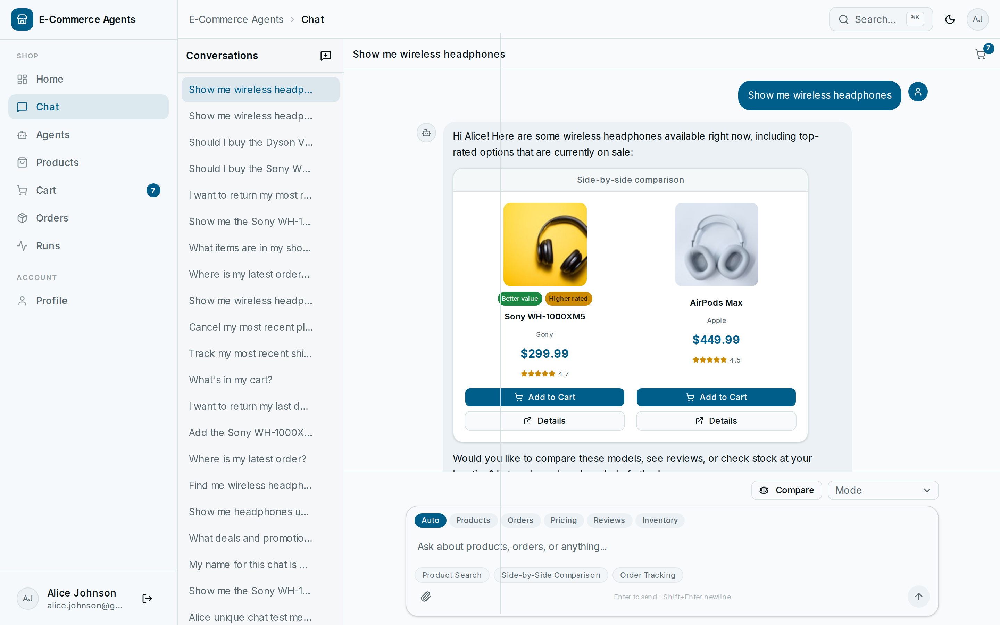
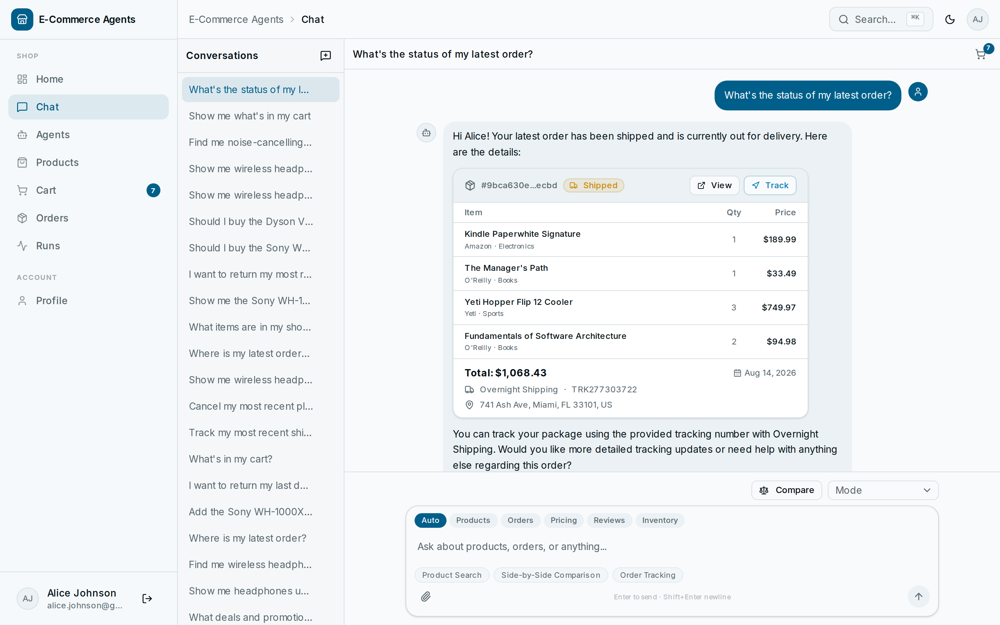
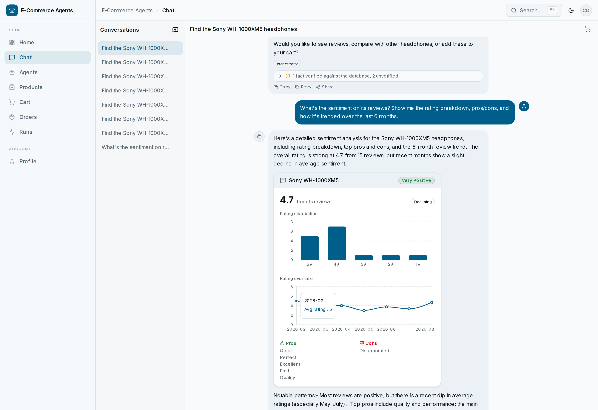
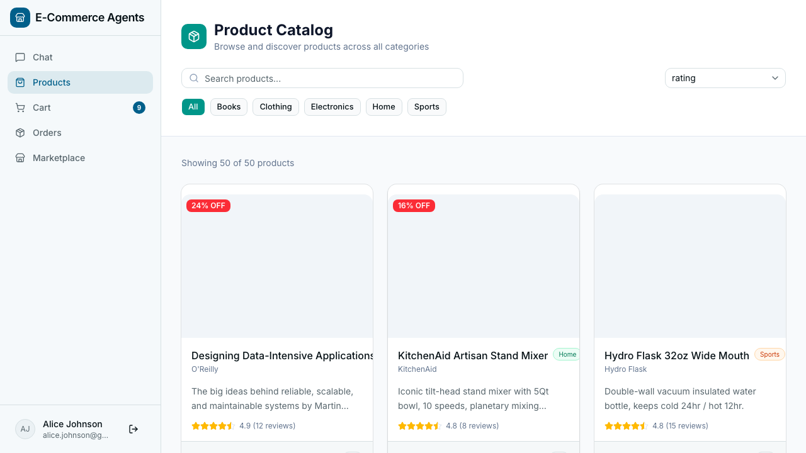
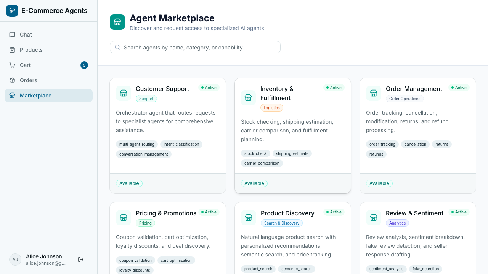
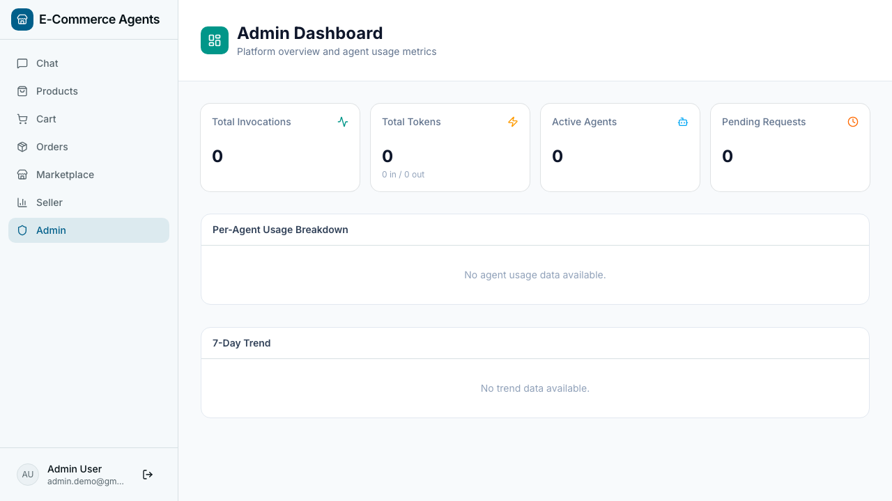
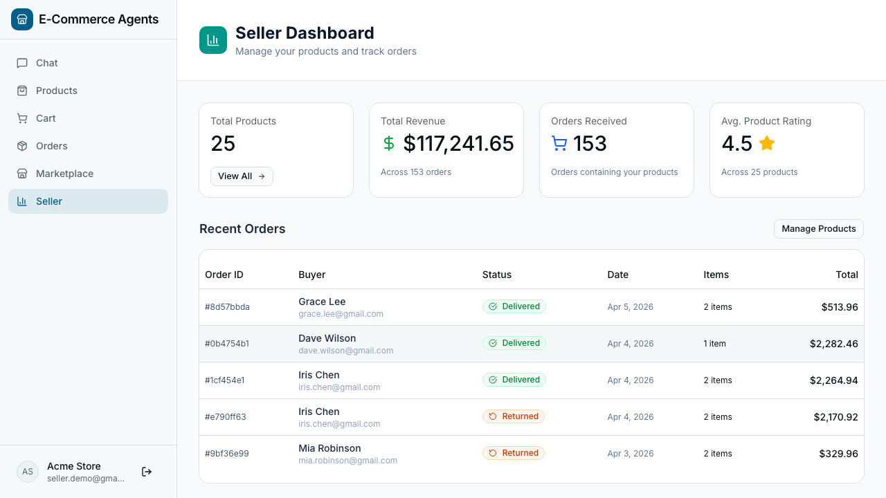

# Demo Guide

What to click, who to sign in as, and what to ask — for a walkthrough, a
screen recording, or your first ten minutes with the app.

Start the stack first: [Quick Start](quick-start.md). The fast path is
`./scripts/dev.sh --demo`, which pulls prebuilt images rather than building.

## Test Users

Pre-seeded accounts for testing different roles:

| Email | Password | Role | Loyalty Tier |
|-------|----------|------|-------------|
| `admin.demo@gmail.com` | admin123 | Admin | Gold |
| `seller.demo@gmail.com` | seller123 | Seller | Bronze |
| `seller2.demo@gmail.com` | seller123 | Seller | Bronze |
| `alice.johnson@gmail.com` | customer123 | Customer | Gold |
| `bob.smith@gmail.com` | customer123 | Customer | Silver |

---

## Agent Catalog

| Agent | Port | Description | Key Tools |
|-------|------|-------------|-----------|
| **Customer Support** (Orchestrator) | 8080 | Routes requests to specialists via A2A | `call_specialist_agent` |
| **Product Discovery** | 8081 | Search, semantic search, comparisons, trending | `search_products`, `semantic_search`, `compare_products` |
| **Order Management** | 8082 | Order tracking, cancellation, returns, refunds | `get_user_orders`, `cancel_order`, `initiate_return` |
| **Pricing & Promotions** | 8083 | Coupon validation, cart optimization, loyalty | `validate_coupon`, `optimize_cart`, `get_active_deals` |
| **Review & Sentiment** | 8084 | Sentiment analysis, fake review detection | `analyze_sentiment`, `detect_fake_reviews` |
| **Inventory & Fulfillment** | 8085 | Stock, shipping estimates, fulfillment planning | `check_stock`, `estimate_shipping` |

---

## Demo Scenarios

Try these in the chat after logging in:

1. **Product Search**: "Find me wireless headphones under $300 with good noise cancellation"
2. **Comparison**: "Compare the Sony WH-1000XM5 with AirPods Max"
3. **Order Tracking**: "Where's my latest order?"
4. **Return Flow**: "I want to return my last order"
5. **Price Check**: "Is the Logitech MX Master 3S a good deal right now?"
6. **Review Analysis**: "What do people think about the Dyson V15?"
7. **Stock Check**: "Is the Dyson V15 Detect in stock?"
8. **Multi-Intent**: "Return my jacket and find me a warmer one under $200"

---

## Screens

Screenshots — guest browsing, the AI shopping flow, and the platform (click to collapse)

### Guest experience (no login required)

Anyone can browse the catalog, use the AI shopping assistant, and explore product details without creating an account.

<table>
<tr><td></td></tr>
<tr><td align="center"><em>Product detail — full info, pricing, reviews, and stock status</em></td></tr>
<tr><td></td></tr>
<tr><td align="center"><em>AI shopping assistant — product questions answered via multi-agent routing, no login needed</em></td></tr>
</table>

### AI shopping flow (signed in)

Sign in as any seeded user to access cart, checkout, order tracking, and returns — all driven by natural language in the chat interface. Every response renders as generative UI, not raw text: the component (card, table, chart, badge) is chosen by the shape of the data an agent returns.

<table>
<tr><td></td></tr>
<tr><td align="center"><em>Find a product — orchestrator routes to Product Discovery; results render as interactive cards</em></td></tr>
<tr><td></td></tr>
<tr><td align="center"><em>Add to cart — ask the assistant; it calls the cart API and confirms with a card</em></td></tr>
<tr><td></td></tr>
<tr><td align="center"><em>View cart — the agent renders a cart summary with totals and a checkout link</em></td></tr>
<tr><td></td></tr>
<tr><td align="center"><em>Track an order — Order Management agent returns live status and shipment detail</em></td></tr>
<tr><td></td></tr>
<tr><td align="center"><em>Return / refund — agent initiates the return flow and issues a return label</em></td></tr>
<tr><td></td></tr>
<tr><td align="center"><em>Generative UI — the Review & Sentiment agent's data renders as an interactive card: a rating-distribution bar chart, a 6-month trend line chart, and tone-coded pros/cons, all picked from the shape of the data itself, not a fixed template</em></td></tr>
</table>

### Platform

<table>
<tr><td></td></tr>
<tr><td align="center"><em>Agent timeline — orchestrator → specialist → tool routing surfaced live in chat</em></td></tr>
<tr><td></td></tr>
<tr><td align="center"><em>Product storefront — authenticated view with cart and account access</em></td></tr>
<tr><td></td></tr>
<tr><td align="center"><em>Agent marketplace — browse, request, and manage specialist agent access</em></td></tr>
<tr><td></td></tr>
<tr><td align="center"><em>Admin dashboard — usage analytics, approval queues, and audit log</em></td></tr>
<tr><td></td></tr>
<tr><td align="center"><em>Seller dashboard — product catalog and order management</em></td></tr>
</table>

---

