# 演示指南

点什么、用哪个账号登录、问什么 —— 适用于一次讲解、一次录屏，或者你与这个应用的
最初十分钟。

先启动服务栈：[快速开始](quick-start.md)。最快的路径是
`./scripts/dev.sh --demo`，它会拉取预构建镜像而不是本地构建。

## 测试用户

为测试不同角色而预置的账号：

| 邮箱 | 密码 | 角色 | 会员等级 |
|-------|----------|------|-------------|
| `admin@example.cn` | admin123 | 管理员 | 黄金 |
| `seller@example.cn` | seller123 | 商家 | 青铜 |
| `seller2@example.cn` | seller123 | 商家 | 青铜 |
| `zhangwei@example.com` | customer123 | 客户 | 黄金 |
| `lina@example.com` | customer123 | 客户 | 白银 |

---

## 智能体清单

| 智能体 | 端口 | 说明 | 关键工具 |
|-------|------|-------------|-----------|
| **客服编排器** | 8080 | 通过 A2A 把请求路由到专业智能体 | `call_specialist_agent` |
| **商品发现** | 8081 | 检索、语义检索、对比、热门商品 | `search_products`、`semantic_search`、`compare_products` |
| **订单管理** | 8082 | 订单跟踪、取消、退货、退款 | `get_user_orders`、`cancel_order`、`initiate_return` |
| **定价与促销** | 8083 | 优惠券校验、购物车优化、会员权益 | `validate_coupon`、`optimize_cart`、`get_active_deals` |
| **评论与情感分析** | 8084 | 情感分析、虚假评论检测 | `analyze_sentiment`、`detect_fake_reviews` |
| **库存与履约** | 8085 | 库存、运费估算、履约方案 | `check_stock`、`estimate_shipping` |

---

## 演示场景

登录后在对话框中试试这些：

1. **商品检索**：「帮我找 300 元以内、降噪效果好的无线耳机」
2. **商品对比**：「对比一下 Sony WH-1000XM5 和 AirPods Max」
3. **订单跟踪**：「我最近一笔订单到哪了？」
4. **退货流程**：「我想退掉最近一笔订单」
5. **价格判断**：「Logitech MX Master 3S 现在这个价划算吗？」
6. **评论分析**：「大家对 Dyson V15 的评价怎么样？」
7. **库存查询**：「Dyson V15 Detect 有现货吗？」
8. **多意图**：「帮我把夹克退掉，再找一件 200 元以内更保暖的」

---

## 界面截图

截图 —— 访客浏览、AI 购物流程与平台管理（点击可折叠）

### 访客体验（无需登录）

任何人都可以浏览商品目录、使用 AI 购物助手、查看商品详情，无需注册账号。

<table>
<tr><td>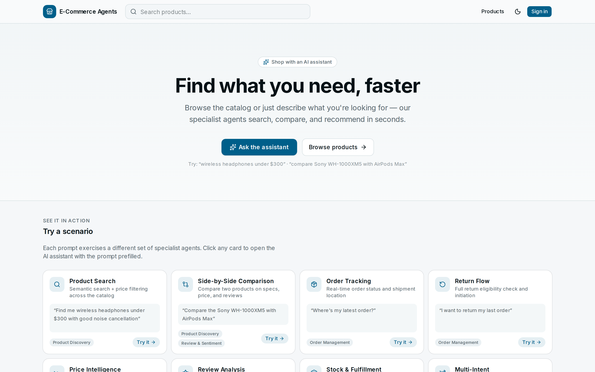</td></tr>
<tr><td align="center"><em>商品详情 —— 完整信息、价格、评论与库存状态</em></td></tr>
<tr><td>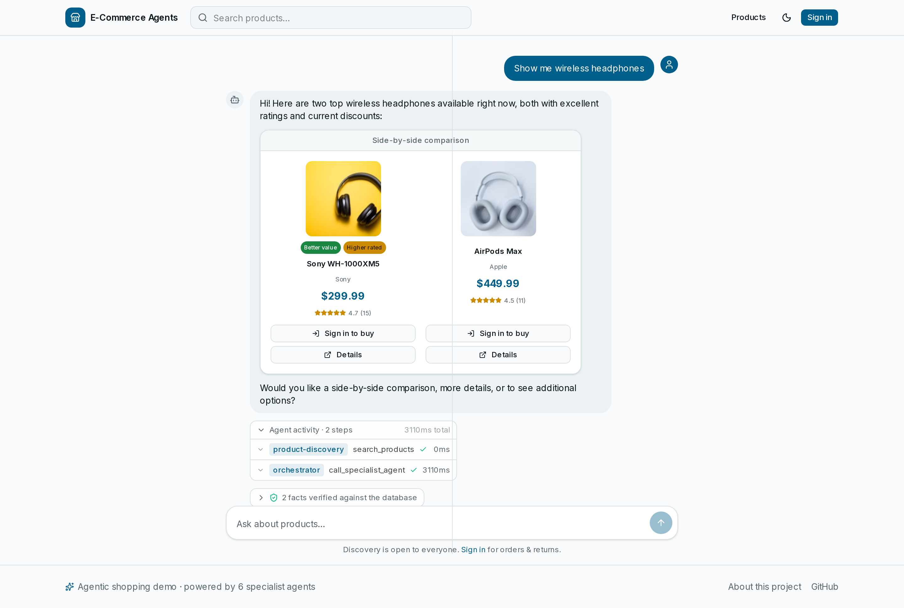</td></tr>
<tr><td align="center"><em>AI 购物助手 —— 通过多智能体路由回答商品问题，无需登录</em></td></tr>
</table>

### AI 购物流程（已登录）

用任意一个预置账号登录，即可使用购物车、结算、订单跟踪与退货 —— 全部通过对话界面中的自然语言驱动。每条回复都以生成式 UI 呈现，而非纯文本：组件（卡片、表格、图表、徽标）由智能体返回的数据形状决定。

<table>
<tr><td>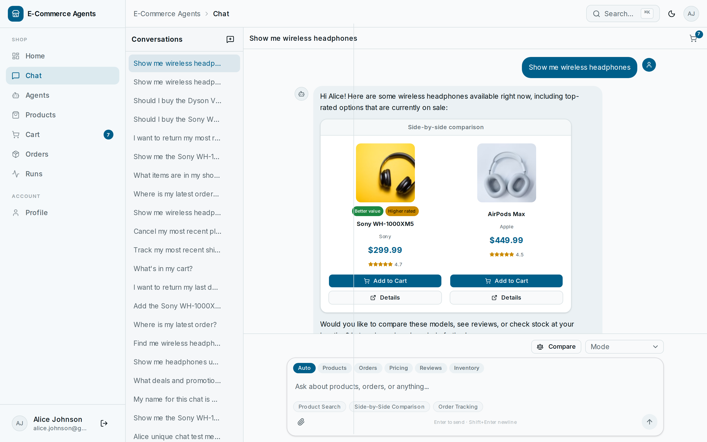</td></tr>
<tr><td align="center"><em>查找商品 —— 编排器路由到商品发现；结果渲染为可交互卡片</em></td></tr>
<tr><td>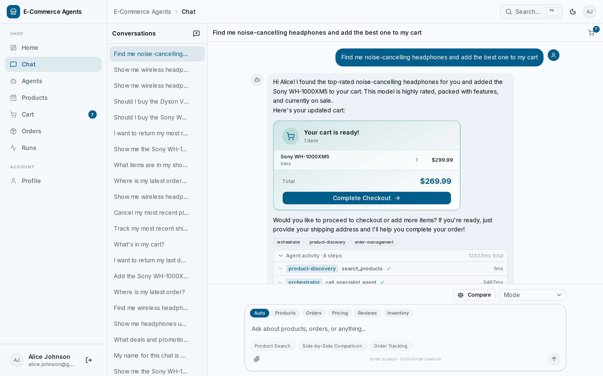</td></tr>
<tr><td align="center"><em>加入购物车 —— 直接对助手说；它调用购物车 API 并用卡片确认</em></td></tr>
<tr><td>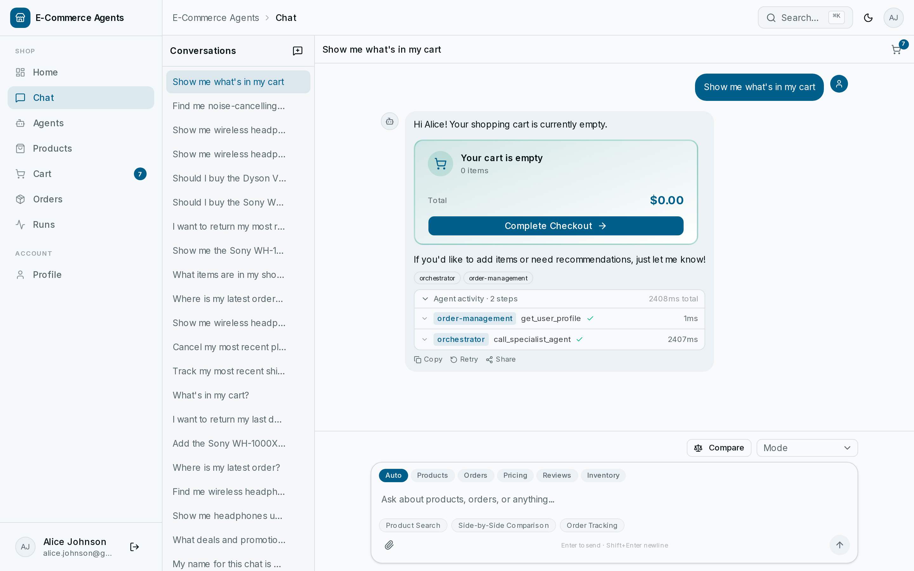</td></tr>
<tr><td align="center"><em>查看购物车 —— 智能体渲染出含合计金额与结算入口的购物车摘要</em></td></tr>
<tr><td>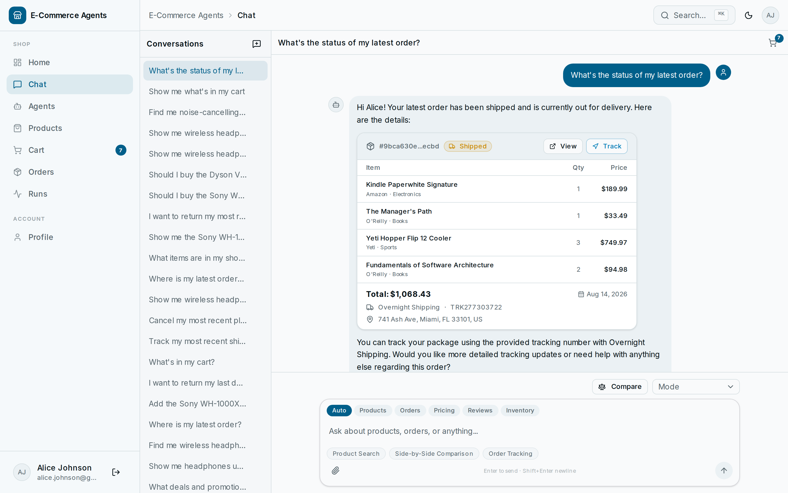</td></tr>
<tr><td align="center"><em>跟踪订单 —— 订单管理智能体返回实时状态与物流详情</em></td></tr>
<tr><td>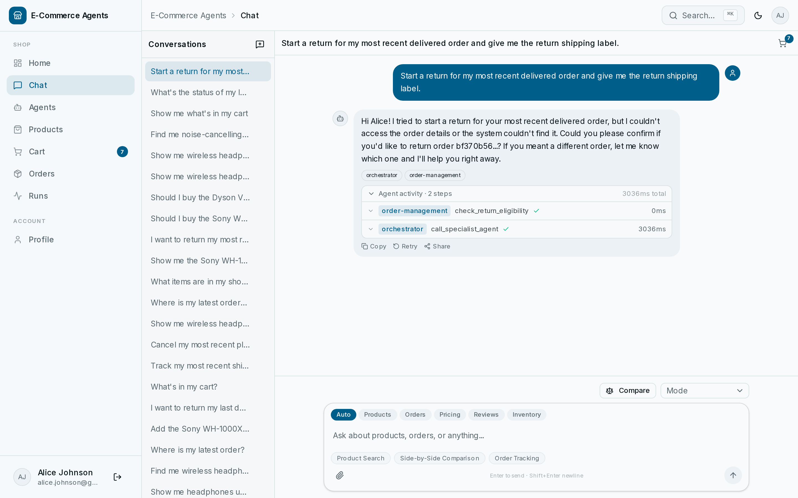</td></tr>
<tr><td align="center"><em>退货 / 退款 —— 智能体发起退货流程并出具退货面单</em></td></tr>
<tr><td>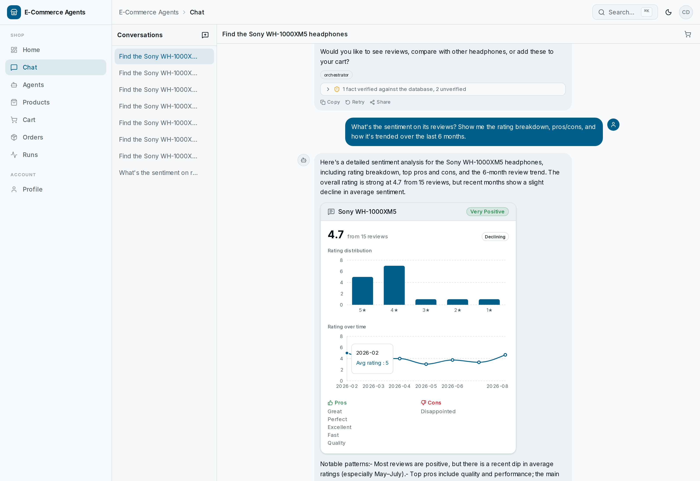</td></tr>
<tr><td align="center"><em>生成式 UI —— 评论与情感分析智能体的数据渲染为可交互卡片：评分分布柱状图、6 个月趋势折线图，以及按情感着色的优缺点列表，全部由数据形状本身决定，而非固定模板</em></td></tr>
</table>

### 平台管理

<table>
<tr><td>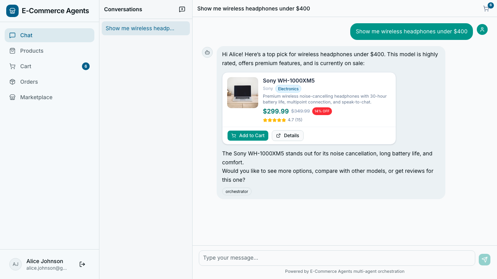</td></tr>
<tr><td align="center"><em>智能体时间线 —— 编排器 → 专业智能体 → 工具的路由过程在对话中实时呈现</em></td></tr>
<tr><td>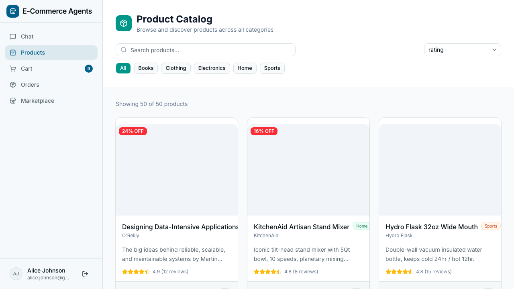</td></tr>
<tr><td align="center"><em>商品店铺 —— 已登录视图，可访问购物车与账户</em></td></tr>
<tr><td>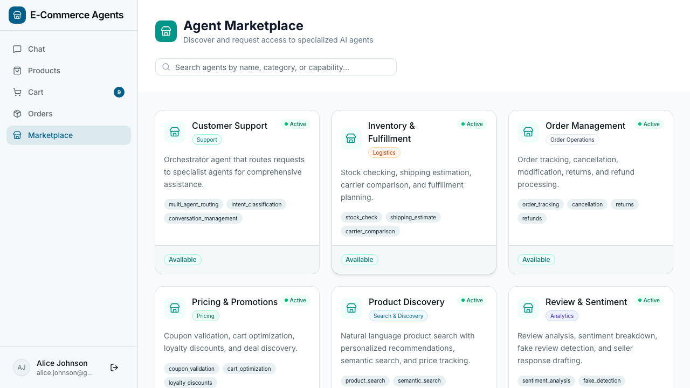</td></tr>
<tr><td align="center"><em>智能体应用市场 —— 浏览、申请并管理专业智能体的使用权限</em></td></tr>
<tr><td>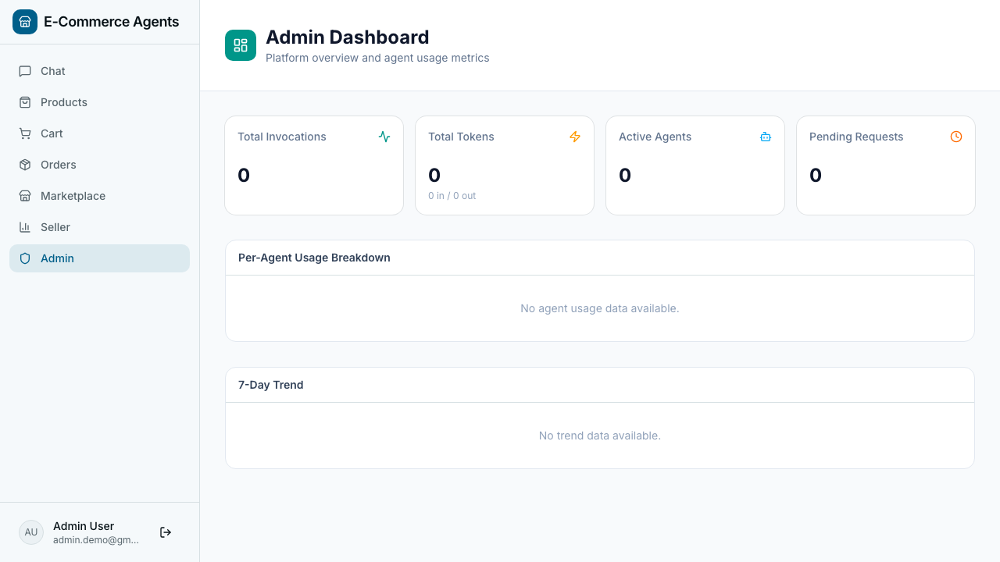</td></tr>
<tr><td align="center"><em>管理后台 —— 用量分析、审批队列与审计日志</em></td></tr>
<tr><td>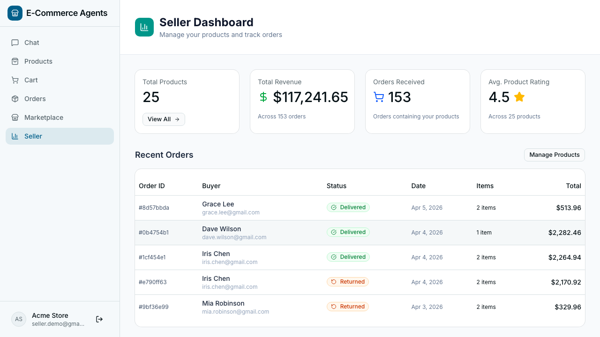</td></tr>
<tr><td align="center"><em>商家后台 —— 商品目录与订单管理</em></td></tr>
</table>

---

