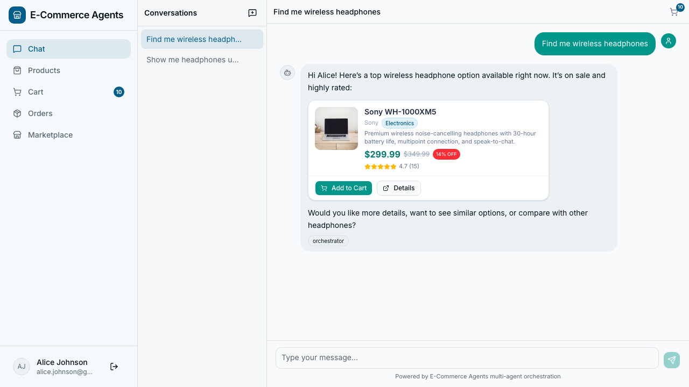
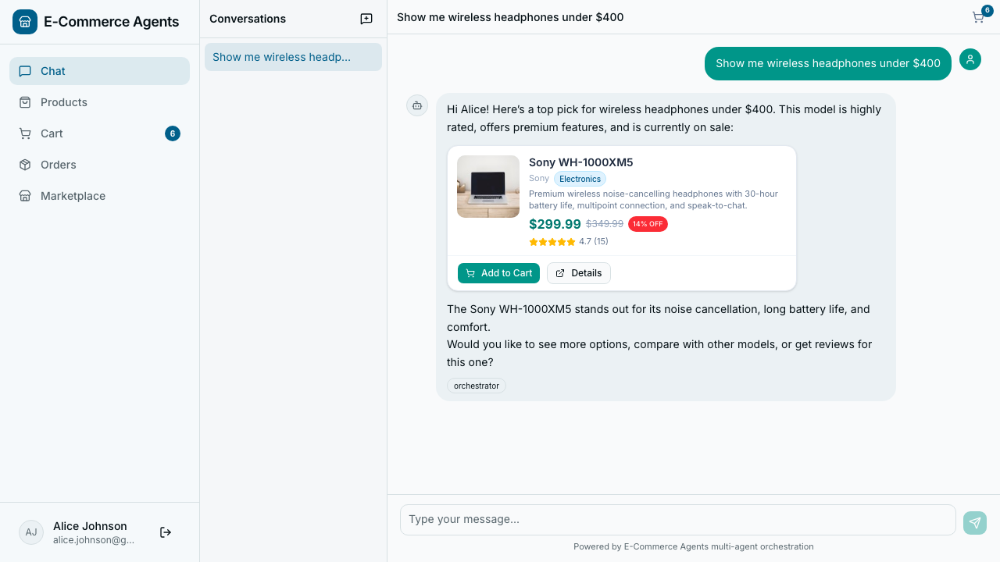
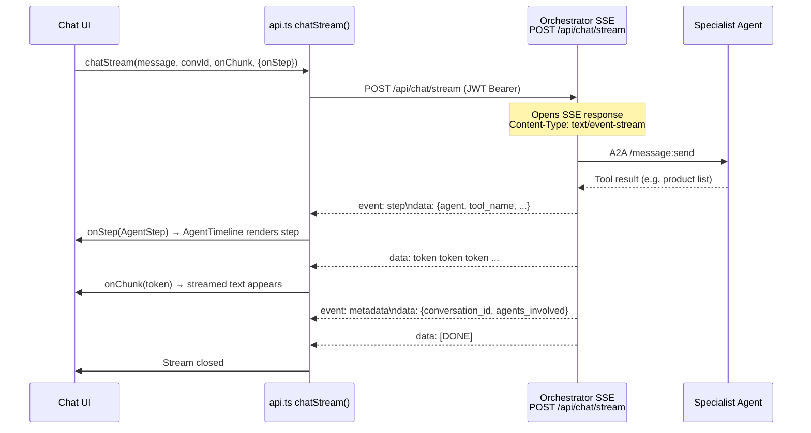

# Frontend Architecture

Next.js 16 (App Router) · React 19 · Tailwind CSS 4 · shadcn/ui · framer-motion ·
recharts. Source in [`web/`](../web). All backend calls go through the typed
client `web/src/lib/api.ts`.

> Next.js 16 has breaking changes vs older docs — read `node_modules/next/dist/docs/`
> before editing framework code.

## Screenshots

<table>
<tr>
  <td></td>
  <td></td>
</tr>
<tr>
  <td align="center"><em>AI shopping assistant — product cards from Product Discovery agent</em></td>
  <td align="center"><em>Agent activity timeline — live orchestrator → specialist → tool trace</em></td>
</tr>
</table>

## Audiences & routing

Two front doors, by audience:

| Area | Routes | Auth | Notes |
|---|---|---|---|
| **Project landing** | `/` | public | OSS showcase page (architecture, agents, stack). CTA "Try the demo" → `/shop`. |
| **Public storefront** | `/shop`, `/shop/products`, `/shop/products/[id]`, `/shop/assistant` | public | Browse, search, and discovery chat with **no login**. |
| **Account console** | `(app)/` → `/home`, `/chat`, `/orders`, `/orders/[id]`, `/checkout`, `/profile`, `/admin/*`, `/seller/*` | required | Sidebar shell; `(app)/layout.tsx` redirects anonymous users to `/login`. |
| **Auth** | `/login`, `/signup` | public | Self-contained JWT. |

The storefront is **public because the backend serves product browse + chat
anonymously** (`optional_auth` on `/api/products` and `/api/chat*`). Account
actions (cart checkout, orders, tracking, returns) require sign-in.

## Design system & theming

- OKLCH tokens in `web/src/app/globals.css` (`--background`, `--foreground`,
  `--card`, `--primary`, `--muted`, `--chart-1..5`, sidebar tokens). **Use tokens,
  not hardcoded slate/white** — that breaks dark mode.
- Dark mode = a `.dark` class on `<html>`. `ThemeToggle`
  (`components/ui/theme-toggle.tsx`) flips it via `useSyncExternalStore`; a no-flash
  init script in the root layout applies the persisted/system theme before paint.
- Motion variants in `web/src/lib/motion.ts` (reduced-motion aware).
- Primitives: `StatCard`, `SectionHeader`, `Skeleton`, `ChartContainer`
  (recharts wrapper), command palette (Cmd-K).

## Chat / SSE streaming + agent timeline

`api.chatStream(message, conversationId, onChunk, signal?, { onStep })` consumes
the orchestrator SSE stream `POST /api/chat/stream`. Frame types:

- `data: <text>` — streamed answer tokens (`onChunk`).
- `event: step` + `data: {AgentStep}` — one tool-call step
  (`{agent, tool_name, tool_input, tool_output, status, duration_ms}`) → `onStep`.
- `event: metadata` + `data: {conversation_id, agents_involved}` — final.
- `data: [DONE]` — terminator.

`AgentTimeline` (`components/chat/agent-timeline.tsx`) renders the steps as a
collapsible "Agent activity" disclosure (orchestrator → specialist → tool). Rich
assistant content (product/order/checkout cards) is parsed by
`components/chat/rich-message.tsx`.

### SSE streaming sequence

## Testing

- Unit/component: **vitest + React Testing Library** (`pnpm test`, jsdom).
- E2E: **Playwright** under `web/e2e/`. `ui-smoke.spec.ts` runs backend-free
  (mocked auth via localStorage + `page.route('**/api/**')`); the other specs
  need the full live stack. Playwright is intentionally not run in CI.

## Related

- [`docs/architecture.md`](architecture.md) — full system architecture and SSE orchestration pattern
- [`docs/api-reference.md`](api-reference.md) — REST endpoints the frontend calls
- [`docs/troubleshooting.md`](troubleshooting.md) — frontend-specific issues (products not showing, CORS)
- [Project README](../README.md)
