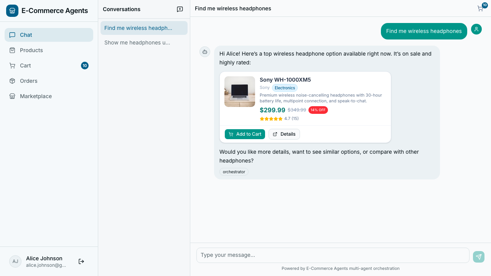
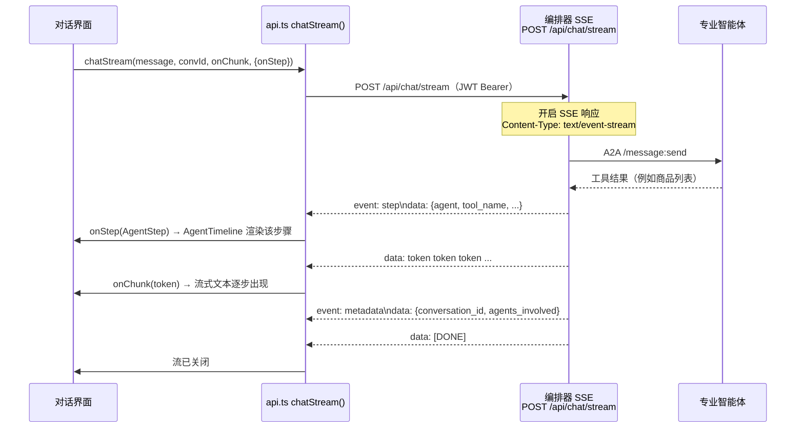

# 前端架构

Next.js 16（App Router）· React 19 · Tailwind CSS 4 · shadcn/ui · framer-motion ·
recharts。源码位于 [`web/`](../web)。所有后端调用都经由类型化客户端
`web/src/lib/api.ts`。

> Next.js 16 相比旧文档存在破坏性变更 —— 在改动框架相关代码前，请先阅读
> `node_modules/next/dist/docs/`。

## 界面截图

<table>
<tr>
  <td></td>
  <td></td>
</tr>
<tr>
  <td align="center"><em>AI 购物助手 —— 由商品发现智能体返回的商品卡片</em></td>
  <td align="center"><em>智能体活动时间线 —— 编排器 → 专业智能体 → 工具的实时追踪</em></td>
</tr>
</table>

## 面向的用户与路由

按受众划分两个入口：

| 区域 | 路由 | 认证 | 说明 |
|---|---|---|---|
| **项目首页** | `/` | 公开 | 开源项目展示页（架构、智能体、技术栈）。CTA「试试演示」→ `/shop`。 |
| **公开店铺** | `/shop`、`/shop/products`、`/shop/products/[id]`、`/shop/assistant` | 公开 | 浏览、检索与商品发现对话，**无需登录**。 |
| **账户控制台** | `(app)/` → `/home`、`/chat`、`/orders`、`/orders/[id]`、`/checkout`、`/profile`、`/admin/*`、`/seller/*` | 必需 | 带侧边栏的布局；`(app)/layout.tsx` 会把匿名用户重定向到 `/login`。 |
| **认证** | `/login`、`/signup` | 公开 | 自包含 JWT。 |

店铺之所以**公开**，是因为后端对商品浏览与对话提供了匿名访问
（`/api/products` 与 `/api/chat*` 上的 `optional_auth`）。账户相关操作
（购物车结算、订单、物流、退货）仍需登录。

## 设计系统与主题

- `web/src/app/globals.css` 中的 OKLCH 令牌（`--background`、`--foreground`、
  `--card`、`--primary`、`--muted`、`--chart-1..5`、侧边栏令牌）。**请使用令牌，
  不要硬编码 slate/white** —— 那会破坏深色模式。
- 深色模式 = `<html>` 上的 `.dark` 类。`ThemeToggle`
  （`components/ui/theme-toggle.tsx`）通过 `useSyncExternalStore` 切换它；根布局中有一段
  无闪烁的初始化脚本，在首次绘制前应用持久化或系统主题。
- 动效变体位于 `web/src/lib/motion.ts`（已适配「减少动态效果」偏好）。
- 基础组件：`StatCard`、`SectionHeader`、`Skeleton`、`ChartContainer`
  （recharts 封装）、命令面板（Cmd-K）。

## 对话 / SSE 流式输出 + 智能体时间线

`api.chatStream(message, conversationId, onChunk, signal?, { onStep })` 消费
编排器的 SSE 流 `POST /api/chat/stream`。帧类型：

- `data: <text>` —— 流式返回的答案 token（`onChunk`）。
- `event: step` + `data: {AgentStep}` —— 一条工具调用步骤
  （`{agent, tool_name, tool_input, tool_output, status, duration_ms}`）→ `onStep`。
- `event: metadata` + `data: {conversation_id, agents_involved}` —— 最终元数据。
- `data: [DONE]` —— 结束标记。

`AgentTimeline`（`components/chat/agent-timeline.tsx`）把步骤渲染为可折叠的
「Agent activity」区块（编排器 → 专业智能体 → 工具）。助手的富内容
（商品/订单/结算卡片）由 `components/chat/rich-message.tsx` 解析。

### SSE 流式输出时序

```mermaid
sequenceDiagram
    participant UI as 对话界面
    participant API as api.ts chatStream()
    participant ORCH as 编排器 SSE<br/>POST /api/chat/stream
    participant SPEC as 专业智能体

    UI->>API: chatStream(message, convId, onChunk, {onStep})
    API->>ORCH: POST /api/chat/stream（JWT Bearer）
    Note over ORCH: 开启 SSE 响应<br/>Content-Type: text/event-stream

    ORCH->>SPEC: A2A /message:send
    SPEC-->>ORCH: 工具结果（例如商品列表）

    ORCH-->>API: event: step\ndata: {agent, tool_name, ...}
    API->>UI: onStep(AgentStep) → AgentTimeline 渲染该步骤

    ORCH-->>API: data: token token token ...
    API->>UI: onChunk(token) → 流式文本逐步出现

    ORCH-->>API: event: metadata\ndata: {conversation_id, agents_involved}
    ORCH-->>API: data: [DONE]
    API->>UI: 流已关闭
```

## 测试

- 单元/组件测试：**vitest + React Testing Library**（`pnpm test`，jsdom）。
- 端到端测试：`web/e2e/` 下的 **Playwright**。`ui-smoke.spec.ts` 不依赖后端运行
  （通过 localStorage + `page.route('**/api/**')` 模拟认证）；其余用例
  需要完整在线服务栈。Playwright 有意不在 CI 中运行。

## 相关内容

- [`docs/architecture.md`](architecture.md) —— 完整系统架构与 SSE 编排模式
- [`docs/api-reference.md`](api-reference.md) —— 前端调用的 REST 端点
- [`docs/troubleshooting.md`](troubleshooting.md) —— 前端相关问题（商品不显示、CORS）
- [项目 README](../README.md)
