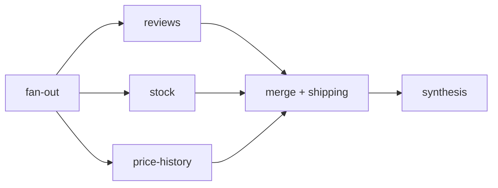
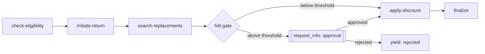
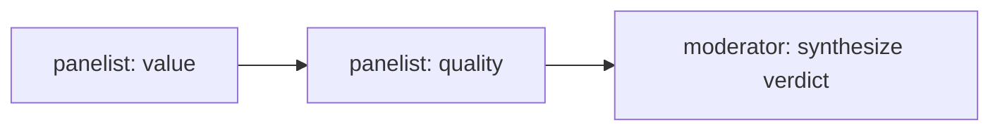

# Microsoft Agent Framework — Patterns & Best Practices

How this repo uses Microsoft Agent Framework (MAF v1.0) for agents and workflows,
which orchestration pattern fits which problem, and the conventions that keep the
code testable and portable across OpenAI / Azure OpenAI — and, via `LLM_BASE_URL`,
any OpenAI-compatible endpoint (Ollama, LM Studio, vLLM, OpenRouter).

## Agent execution

Every specialist and the orchestrator is a MAF `Agent` built by a
`create_*_agent()` factory (`agents/python/<agent>/agent.py`):

```python
Agent(
    client=create_chat_client(),          # OpenAI or Azure OpenAI (shared.factory)
    name="product-discovery",
    instructions=SYSTEM_PROMPT,            # composed from YAML (shared.prompt_loader)
    tools=AGENT_TOOLS,                     # @tool functions
    context_providers=[ECommerceContextProvider()],
    middleware=build_specialist_middleware(),  # observability + guardrails
)
```

Requests run through MAF's native path — `agent.run(messages)` /
`agent.run(messages, stream=True)` in `shared/agent_host.py`. The legacy custom
chat-completions loop was retired once Azure compatibility was confirmed.

**Conventions**

- Tools use the `@tool` decorator with `Annotated` type hints; identity comes from
  ContextVars (`shared/context.py`), never from tool arguments.
- Prompts live in YAML (`config/prompts/`), composed per request and per role by
  `shared/prompt_loader.py` — no hardcoded prompt strings.
- Middleware is composed once by `shared/middleware.build_specialist_middleware()`
  (run logging, tool audit, injection detection, PII redaction, output
  sanitization, timeline capture). See [`docs/security-guide.md`](security-guide.md).

## Workflow primitives

MAF workflows are graphs of `Executor`s connected by edges. Each executor handles
a typed message and either forwards it or yields output:

```python
from agent_framework._workflows._executor import Executor, handler
from agent_framework._workflows._workflow_builder import WorkflowBuilder
from agent_framework._workflows._workflow_context import WorkflowContext

class MyExecutor(Executor):
    def __init__(self) -> None:
        super().__init__(id="my-executor")

    @handler
    async def run(self, state: State, ctx: WorkflowContext[State, State]) -> None:
        ...
        await ctx.send_message(state)     # forward to the next executor
        # or: await ctx.yield_output(state)   # emit a terminal result
```

- Import from the `agent_framework._workflows` submodules — the v1.0 beta ships an
  empty top-level `__init__` in a plain checkout.
- A forwarding executor is typed `WorkflowContext[In, Out]`; a terminal executor
  that only yields is typed `WorkflowContext[None, Out]`.
- Build with `WorkflowBuilder(start_executor=..., name=...)` then `.add_edge(a, b)`
  / `.add_fan_out_edges(a, [b, c])` / `.add_fan_in_edges([b, c], d)` and `.build()`.
- Run with `async for event in workflow.run(state, stream=True)` and collect the
  `event.type == "output"` payload.

## Pattern catalog

| Pattern | When to use | Implementation |
|---------|-------------|----------------|
| **Concurrent** (fan-out / fan-in) | Independent data gathering that merges once | `workflows/pre_purchase.py` |
| **Sequential + HITL** | Ordered steps where a step needs human approval | `workflows/return_replace.py` |
| **Round-table group chat** | Multiple perspectives debate over a shared transcript, then synthesize | `workflows/group_chat.py` |
| **Handoff** | LLM-driven hand-off of control between agents | `orchestrator/handoff.py` (`HandoffBuilder`), reachable via `orchestrator/modes/handoff_mode.py` (`ORCHESTRATION_MODE=handoff` or per-request `mode`) |
| **Declarative (YAML)** | Simple, config-defined pipelines without code | `shared/workflow_loader.py` + `config/workflows/*.yaml` |
| **Tool routing** | Front-door orchestrator picks a specialist per turn | `orchestrator/agent.py` `call_specialist_agent` (default) |

### Concurrent — pre-purchase research

Fan three independent probes out in parallel, fan them into a merge that runs a
dependent step, then synthesize.



Use when sub-tasks don't depend on each other and you want the wall-clock of the
slowest probe, not their sum. Built with `add_fan_out_edges` + `add_fan_in_edges`;
the fan-in handler receives `list[State]` and merges.

### Sequential + human-in-the-loop — return & replace

Ordered chain that pauses for approval above a value threshold.



The gate uses `ctx.request_info(ReturnApprovalRequest, response_type=bool)` to
pause, and a `@response_handler` resumes the chain when the approval arrives.

### Round-table group chat — debate then synthesize

Panelists take turns over a **shared transcript** (each sees prior turns); a
moderator synthesizes the verdict. Distinct from the concurrent pattern: turns are
sequential and context-aware, not independent.



Panelist behavior is a `Responder` callable, so the workflow is deterministic and
unit-testable without an LLM; production wires panelists to agents. See
`tutorials/22-group-chat-debate/`.

### Handoff & tool-routing — orchestration

The orchestrator routes user requests to specialists. Multiple interchangeable modes
live behind `orchestrator/modes/` (see `GET /api/orchestration/modes`); as of this
writing:

- **Tool routing (default):** the orchestrator LLM calls the `call_specialist_agent`
  tool over A2A. Simple, observable, and what the routing eval scores.
- **MAF Handoff (`mode=handoff`, or `ORCHESTRATION_MODE=handoff` as the default):**
  a `HandoffBuilder` mesh where the orchestrator mechanically hands control to a
  specialist and back.

Per-request selection takes priority over the `ORCHESTRATION_MODE` env default —
see `orchestrator/modes/__init__.py::get_mode` for the resolution order.

### Declarative — YAML pipelines

`shared/workflow_loader.py` builds a `WorkflowBuilder` graph from a YAML spec
(`config/workflows/*.yaml`) using a small op registry. Use for simple,
non-branching pipelines that shouldn't require code. `scripts/visualize_workflows.py`
renders these to Mermaid + Graphviz under `docs/workflows/`.

## Best practices

- **Preserve the public surface.** Each workflow exposes a class with an
  `execute(state) -> state` method and builds a *fresh* MAF workflow per call —
  callers never touch MAF types.
- **Keep executors deterministic and injectable.** Pass tools / responders in so
  workflows can be unit-tested with `FakeChatClient` or plain callables — no live
  LLM in unit tests (`tests/test_*_workflow*.py`).
- **Type the context correctly.** Forwarders `WorkflowContext[In, Out]`; terminals
  `WorkflowContext[None, Out]`. A wrong terminal type can stop a chain early.
- **Carry state as a dataclass.** One state object threads through the graph;
  accumulate `completed_steps` / `errors` for observability.
- **Pick the simplest pattern that fits.** Tool routing < declarative YAML <
  sequential < concurrent < handoff, in rough order of complexity.

## Gotchas

- Import workflow types from `agent_framework._workflows.*` submodules, not the
  package root (empty `__init__` in v1.0 beta; `patch_maf.py` only re-exports
  inside the Docker image).
- Do not add `from __future__ import annotations` to a module using
  `@response_handler` — MAF resolves its parameter types via `inspect.signature`
  at import time, and stringified annotations break that.
- `scripts/visualize_workflows.py` renders **declarative YAML** workflows; Python
  `WorkflowBuilder` graphs (pre-purchase, return-replace, group-chat) are
  diagrammed by hand in this doc and the tutorials.

## Related documents

- [`docs/security-guide.md`](security-guide.md) — guardrails middleware stack, auth, SQL controls, threat model
- [`docs/agent-audit-matrix.md`](agent-audit-matrix.md) — per-agent security posture and open hardening items
- [`docs/agent-quality.md`](agent-quality.md) — eval methodology, red-team suite, CI gate
- [`docs/architecture.md`](architecture.md) — full system architecture and agent communication patterns
