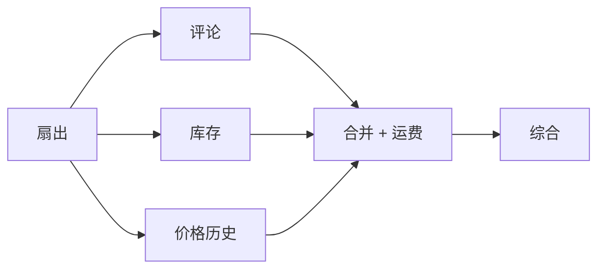
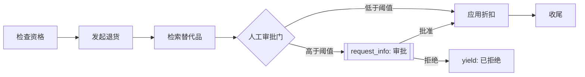
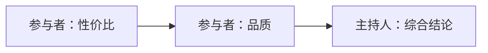

# 微软智能体框架 —— 模式与最佳实践

本仓库如何使用微软智能体框架（Microsoft Agent Framework，MAF v1.0）构建智能体与工作流，
哪种编排模式适合哪类问题，以及让代码保持可测试、并可在 OpenAI / Azure OpenAI 之间移植
（以及通过 `LLM_BASE_URL` 接入任何兼容 OpenAI 的端点：Ollama、LM Studio、vLLM、OpenRouter）的约定。

## 智能体执行

每个专业智能体与编排器都是一个 MAF `Agent`，由 `create_*_agent()` 工厂函数构建
（`agents/python/<agent>/agent.py`）：

```python
Agent(
    client=create_chat_client(),          # OpenAI 或 Azure OpenAI（shared.factory）
    name="product-discovery",
    instructions=SYSTEM_PROMPT,            # 由 YAML 组装（shared.prompt_loader）
    tools=AGENT_TOOLS,                     # @tool 函数
    context_providers=[ECommerceContextProvider()],
    middleware=build_specialist_middleware(),  # 可观测性 + 护栏
)
```

请求走 MAF 的原生路径 —— `shared/agent_host.py` 中的 `agent.run(messages)` /
`agent.run(messages, stream=True)`。在确认 Azure 兼容性之后，早期自定义的
chat-completions 循环已被废弃。

**约定**

- 工具使用 `@tool` 装饰器配合 `Annotated` 类型标注；身份来自 ContextVars
  （`shared/context.py`），绝不来自工具参数。
- 提示词存放在 YAML 中（`config/prompts/`），由 `shared/prompt_loader.py` 按请求、按角色组装
  —— 不存在硬编码的提示词字符串。
- 中间件由 `shared/middleware.build_specialist_middleware()` 统一组装一次
  （运行日志、工具审计、注入检测、PII 脱敏、输出净化、时间线采集）。见
  [`docs/security-guide.md`](security-guide.md)。

## 工作流原语

MAF 工作流是由边连接的 `Executor` 图。每个执行器处理一条带类型的消息，然后转发它或产出结果：

```python
from agent_framework._workflows._executor import Executor, handler
from agent_framework._workflows._workflow_builder import WorkflowBuilder
from agent_framework._workflows._workflow_context import WorkflowContext

class MyExecutor(Executor):
    def __init__(self) -> None:
        super().__init__(id="my-executor")

    @handler
    async def run(self, state: State, ctx: WorkflowContext[State, State]) -> None:
        ...
        await ctx.send_message(state)     # 转发给下一个执行器
        # 或：await ctx.yield_output(state)   # 产出终止结果
```

- 从 `agent_framework._workflows` 的子模块导入 —— 在普通检出中，v1.0 beta 的顶层
  `__init__` 是空的。
- 转发型执行器的类型是 `WorkflowContext[In, Out]`；只产出结果的终止型执行器类型是
  `WorkflowContext[None, Out]`。
- 用 `WorkflowBuilder(start_executor=..., name=...)` 构建，然后调用 `.add_edge(a, b)`
  / `.add_fan_out_edges(a, [b, c])` / `.add_fan_in_edges([b, c], d)`，最后 `.build()`。
- 用 `async for event in workflow.run(state, stream=True)` 运行，并收集
  `event.type == "output"` 的载荷。

## 模式目录

| 模式 | 适用场景 | 实现位置 |
|---------|-------------|----------------|
| **并发**（扇出 / 扇入） | 相互独立的数据采集，最后合并一次 | `workflows/pre_purchase.py` |
| **顺序 + 人工参与** | 有序步骤，其中某一步需要人工审批 | `workflows/return_replace.py` |
| **圆桌群聊** | 多个视角在共享会议记录上辩论，随后综合 | `workflows/group_chat.py` |
| **处理权交接** | 由 LLM 驱动在智能体之间移交控制权 | `orchestrator/handoff.py`（`HandoffBuilder`），可经 `orchestrator/modes/handoff_mode.py` 触达（`ORCHESTRATION_MODE=handoff` 或按请求传 `mode`） |
| **声明式（YAML）** | 简单、由配置定义的流水线，无需写代码 | `shared/workflow_loader.py` + `config/workflows/*.yaml` |
| **工具路由** | 前门编排器每轮挑选一个专业智能体 | `orchestrator/agent.py` 的 `call_specialist_agent`（默认） |

### 并发 —— 购买前调研

把三个相互独立的探测并行扇出，扇入到一个合并节点执行依赖步骤，最后综合。


```mermaid
flowchart LR
    FO[扇出] --> R[评论]
    FO --> S[库存]
    FO --> P[价格历史]
    R --> M[合并 + 运费]
    S --> M
    P --> M
    M --> SY[综合]
```

适用于子任务之间互不依赖、且你希望总耗时取决于最慢的那个探测而非它们之和的场景。
用 `add_fan_out_edges` + `add_fan_in_edges` 构建；扇入处理器收到 `list[State]` 并做合并。

### 顺序 + 人工参与 —— 退货与换购

一条有序链路，在超过金额阈值时暂停等待审批。


```mermaid
flowchart LR
    C[检查资格] --> I[发起退货]
    I --> SR[检索替代品]
    SR --> G{人工审批门}
    G -- 低于阈值 --> D[应用折扣]
    G -- 高于阈值 --> RI[[request_info: 审批]]
    RI -- 批准 --> D
    RI -- 拒绝 --> X[yield: 已拒绝]
    D --> F[收尾]
```

该门控使用 `ctx.request_info(ReturnApprovalRequest, response_type=bool)` 暂停，
审批到达时由 `@response_handler` 恢复链路。

### 圆桌群聊 —— 先辩论再综合

参与者轮流在**共享会议记录**上发言（每人都能看到此前的发言）；主持人综合出结论。
与并发模式的区别在于：发言是顺序且带上下文的，而非相互独立。


```mermaid
flowchart LR
    V[参与者：性价比] --> Q[参与者：品质]
    Q --> MOD[主持人：综合结论]
```

参与者的行为是一个 `Responder` 可调用对象，因此该工作流是确定性的，且无需 LLM 即可单元测试；
生产环境把参与者接到真实智能体上。见 `tutorials/22-group-chat-debate/`。

### 处理权交接与工具路由 —— 编排

编排器把用户请求路由到专业智能体。多种可互换的模式位于 `orchestrator/modes/` 之下
（见 `GET /api/orchestration/modes`）；截至本文撰写时：

- **工具路由（默认）：** 编排器的 LLM 通过 A2A 调用 `call_specialist_agent` 工具。
  简单、可观测，也是路由评测所评分的对象。
- **MAF 处理权交接（`mode=handoff`，或以 `ORCHESTRATION_MODE=handoff` 作为默认值）：**
  一个 `HandoffBuilder` 网格，编排器机械地把控制权交给某个专业智能体再收回。

按请求的选择优先于 `ORCHESTRATION_MODE` 环境变量默认值 ——
解析顺序见 `orchestrator/modes/__init__.py::get_mode`。

### 声明式 —— YAML 流水线

`shared/workflow_loader.py` 借助一个小型算子注册表，从 YAML 规格
（`config/workflows/*.yaml`）构建 `WorkflowBuilder` 图。适用于简单的、无分支、
不应要求写代码的流水线。`scripts/visualize_workflows.py` 会把它们渲染为 Mermaid + Graphviz，
输出到 `docs/workflows/`。

## 最佳实践

- **保持对外接口稳定。** 每个工作流都暴露一个带有 `execute(state) -> state` 方法的类，
  并在每次调用时构建一个*全新的* MAF 工作流 —— 调用方永远不接触 MAF 类型。
- **让执行器保持确定性且可注入。** 把工具 / 响应器作为参数传入，这样工作流就能用
  `FakeChatClient` 或普通可调用对象做单元测试 —— 单元测试中不接真实 LLM
  （`tests/test_*_workflow*.py`）。
- **正确标注上下文类型。** 转发器用 `WorkflowContext[In, Out]`；终止器用
  `WorkflowContext[None, Out]`。终止类型写错会让链路提前终止。
- **用 dataclass 承载状态。** 一个状态对象贯穿整张图；累积 `completed_steps` / `errors`
  以便观测。
- **选择能满足需求的最简模式。** 按复杂度大致递增：工具路由 < 声明式 YAML <
  顺序 < 并发 < 处理权交接。

## 易踩的坑

- 工作流类型要从 `agent_framework._workflows.*` 子模块导入，而不是包根
  （v1.0 beta 中 `__init__` 为空；`patch_maf.py` 只在 Docker 镜像内做重新导出）。
- 不要给使用 `@response_handler` 的模块添加 `from __future__ import annotations` ——
  MAF 在导入时通过 `inspect.signature` 解析其参数类型，字符串化的标注会破坏这一点。
- `scripts/visualize_workflows.py` 渲染的是**声明式 YAML** 工作流；Python 的
  `WorkflowBuilder` 图（pre-purchase、return-replace、group-chat）在本文件和教程中
  以手工方式绘制。

## 相关文档

- [`docs/security-guide.md`](security-guide.md) —— 护栏中间件栈、认证、SQL 管控、威胁模型
- `docs/agent-audit-matrix.md` —— 各智能体的安全状况与待完成的加固项
- [`docs/agent-quality.md`](agent-quality.md) —— 评测方法论、红队套件、CI 门禁
- [`docs/architecture.md`](architecture.md) —— 完整系统架构与智能体通信模式
