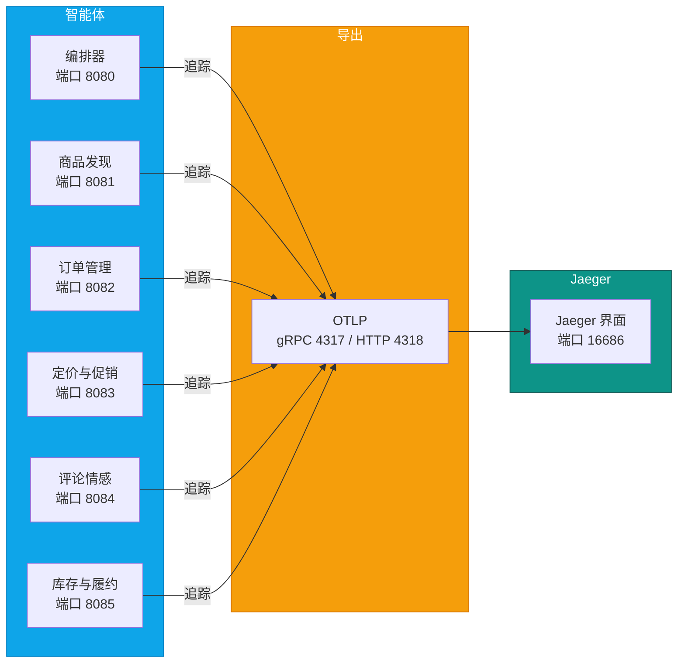
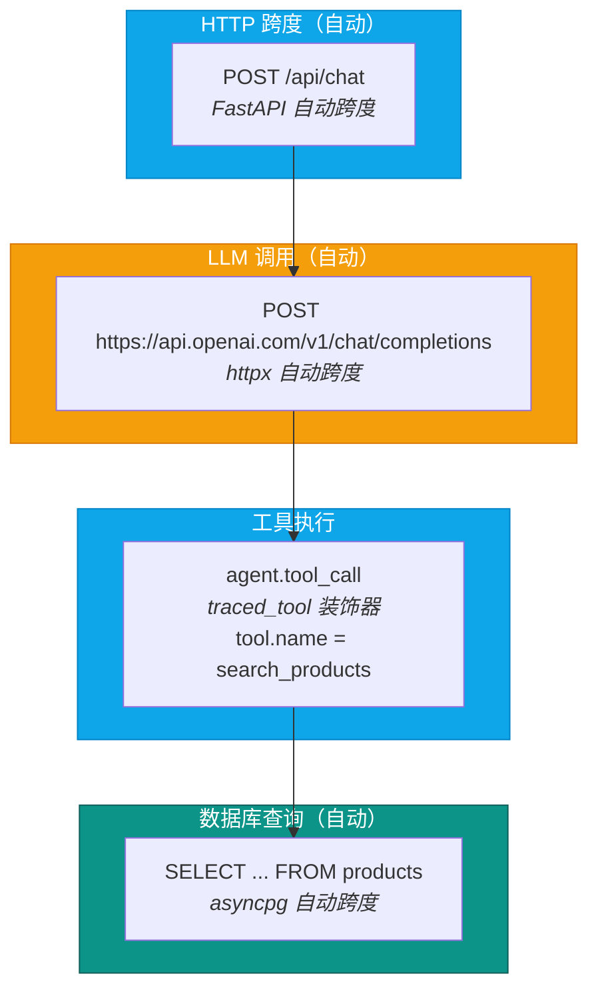
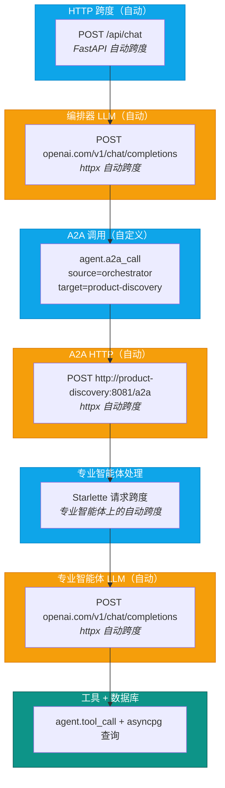

# 遥测与可观测性

可靠电商多智能体平台使用 OpenTelemetry，把分布式追踪导出到 Jaeger。代码还配置了指标与日志导出器，但这两类信号需要额外支持它们的 OTLP 接收端。每个智能体都在其 lifespan 启动时调用 `setup_telemetry(service_name)`，一次调用即完成提供器、导出器与自动埋点的配置。

## 遥测流水线



Jaeger 接收并查询追踪，不存储独立的 OTLP 指标或日志。当前 Compose 未提供这两类信号的存储后端；将同一端点指向 Jaeger 不代表三类导出都成功。完整采集需要配置支持对应信号的 OpenTelemetry Collector 与存储后端。参见 [Jaeger 官方 API 说明](https://www.jaegertracing.io/docs/1.76/architecture/apis/)。

---

## 自动埋点

以下库无需改动任何智能体逻辑即可获得自动埋点。每个 instrumentor 都在提供器配置完成之后，于 `_do_setup()` 中加载。

| 库 | Instrumentor | 采集内容 |
|---------|-------------|------------------|
| **httpx** | `HTTPXClientInstrumentor` | 所有出站 HTTP 调用：OpenAI/Azure OpenAI 的 API 请求、智能体之间的 A2A 调用。采集 URL、方法、状态码、耗时。 |
| **asyncpg** | `AsyncPGInstrumentor` | 所有 PostgreSQL 查询。采集 SQL 文本、数据库名、耗时。参数化查询显示为 `$1, $2` 占位符（不泄漏敏感数据）。 |
| **FastAPI** | `FastAPIInstrumentor` | 编排器的 HTTP 请求/响应跨度。采集路由、方法、状态码、请求耗时。通过 `instrument_fastapi(app)` 应用。 |
| **Starlette** | `StarletteInstrumentor` | 专业智能体的 HTTP 跨度（`A2AAgentHost` 运行在 Starlette 上）。通过 `instrument_starlette(app)` 应用。 |
| **Python logging** | `LoggingInstrumentor` | 把 Python 日志记录桥接进 OTel 日志流水线，并关联 trace/span ID。`set_logging_format=False` 保留既有的日志格式。 |

---

## 跨度层级

### 单智能体请求（直接调用工具）

当编排器使用自己的工具处理请求、不委派给专业智能体时：



### 多智能体请求（编排器委派给专业智能体）

当编排器通过 A2A 协议委派给专业智能体时：



自定义跨度 `agent.a2a_call` 包裹了整个 A2A 交互，因此在 Jaeger 中，「编排器 → 专业智能体」的这次委派呈现为一个逻辑操作，其中包含 HTTP 调用、专业智能体处理，以及嵌套的 LLM 调用与数据库查询。

---

## 自定义跨度

除自动埋点之外，还手工埋点了两种自定义跨度。

### `agent.a2a_call`

由编排器中的 `a2a_call_span()` 上下文管理器在调用专业智能体时创建。

```python
with a2a_call_span("orchestrator", "product-discovery", "http://product-discovery:8081/a2a"):
    result = await a2a_client.send(task)
```

**属性：**

| 属性 | 示例 |
|-----------|---------|
| `agent.source` | `orchestrator` |
| `agent.target` | `product-discovery` |
| `agent.target_url` | `http://product-discovery:8081/a2a` |

发生异常时，该跨度会记录异常并设置 `StatusCode.ERROR`。

### `agent.tool_call`

由 `@traced_tool` 装饰器创建，作用于工具函数上、位于 MAF 的 `@tool` 装饰器之后。

```python
@tool(name="search_products", description="...")
@traced_tool
async def search_products(...) -> ...:
```

**属性：**

| 属性 | 示例 |
|-----------|---------|
| `tool.name` | `search_products` |
| `tool.success` | `True` / `False` |

发生异常时，该跨度会记录异常、设置 `StatusCode.ERROR`，并把 `tool.success` 置为 `False`。

---

## 服务名

每个智能体都用各自独立的 `OTEL_SERVICE_NAME` 上报，因此可以在 Jaeger 中按服务筛选追踪。

| 智能体 | 服务名 | 端口 |
|-------|-------------|------|
| 编排器（客户支持） | `ecommerce-orchestrator` | 8080 |
| 商品发现 | `ecommerce-product-discovery` | 8081 |
| 订单管理 | `ecommerce-order-management` | 8082 |
| 定价与促销 | `ecommerce-pricing-promotions` | 8083 |
| 评论情感 | `ecommerce-review-sentiment` | 8084 |
| 库存与履约 | `ecommerce-inventory-fulfillment` | 8085 |

服务名在各智能体的 lifespan 函数中传给 `setup_telemetry()`，并成为所有遥测上的 `service.name` 资源属性。

---

## 日志关联

Python 日志记录会自动从当前 OTel 上下文补全 `trace_id` 与 `span_id`。这通过两种机制实现：

1. **LoggingInstrumentor** —— 把 `otelTraceID` 与 `otelSpanID` 注入 Python 的 `LogRecord` 属性。这样，在被追踪的请求期间产生的日志语句就能被关联回具体的某条追踪。

2. **OTel LoggerProvider + LoggingHandler** —— 给 Python 根 logger 挂上一个 `LoggingHandler`，把所有日志记录桥接进 OTel 日志流水线。这些记录通过 `OTLPLogExporter` 经 `BatchLogRecordProcessor` 尝试导出；接收端必须支持 OTLP 日志，Jaeger 本身不提供该能力。

`trace_id` 还会被提取出来、经 `get_current_trace_id()` 存入 `usage_logs` 表，从而在应用的审计日志与分布式追踪之间建立关联：

```
usage_logs.trace_id  -->  Jaeger 追踪详情页
```

这意味着你可以从管理员审计日志（`GET /api/admin/audit`）出发，用 `trace_id` 的值直接检索到 Jaeger 中对应的那条追踪。

---

## Jaeger 界面

Jaeger 以 Docker 容器方式运行，提供可观测性界面。

**访问地址：** [http://localhost:16686](http://localhost:16686)

Jaeger 的查询界面围绕三个视图组织：**搜索（Search）**、**追踪详情（Trace）** 与 **服务列表（Services）**。按服务名与操作名筛选是最常用的入口。

### 值得关注的内容

| 视图 / 操作 | 用途 |
|------|----------|
| **按服务筛选** | 从 HTTP 入口一路看到 LLM 调用、A2A 委派、工具执行与数据库查询的完整请求生命周期。按服务名筛选即可隔离出某个智能体。 |
| **按操作名筛选** | 智能体调用的操作名统一为 `invoke_agent <智能体名>`，因此可以直接按操作名检索出所有智能体运行记录（见下文「跨度命名是承重的」）。 |
| **追踪详情** | 展开任意一条追踪即可看到每个跨度的耗时、状态与属性，并定位到最慢的子跨度。 |
| **日志关联** | 跨度上的 `trace_id` 与审计日志中的 `trace_id` 一一对应，可从应用侧日志跳转到对应追踪。 |
| **指标边界** | 代码每 5 秒尝试导出指标，但默认 Jaeger 不接收这些指标。请求数、错误率等聚合监测需另行配置指标后端。 |
| **资源属性** | 查看所有已注册服务的 `service.name`、`service.version` 与 `deployment.environment` 属性。 |

### 典型排查流程

1. 用户反馈响应变慢 —— 进入**搜索**，按服务 `ecommerce-orchestrator` 筛选，再按耗时排序。
2. 找到那条慢追踪 —— 展开，看是哪个子跨度耗时最长（LLM 调用？数据库查询？还是发给专业智能体的 A2A 调用？）。
3. 若瓶颈是 A2A 调用 —— 进入专业智能体自己的那条追踪，查看其内部跨度。
4. 结合该追踪期间记录的日志，确认是否有警告或错误。
5. 用 `trace_id` 对照 `GET /api/admin/audit`，核对应用层的审计记录。

---

## 配置

所有遥测设置都通过环境变量管理，经 Pydantic Settings（`shared/config.py`）加载。

| 变量 | 默认值 | 说明 |
|----------|---------|-------------|
| `OTEL_ENABLED` | `false` | 总开关。为 `false` 时 `setup_telemetry()` 立即返回，不加载任何埋点。 |
| `OTEL_EXPORTER_OTLP_ENDPOINT` | `http://localhost:4317` | OTLP 接收端的基地址。使用 HTTP 传输时，代码会自动追加 `/v1/traces`、`/v1/metrics` 与 `/v1/logs`。 |
| `OTEL_SERVICE_NAME` | `ecommerce` | 兜底服务名。会被各智能体的 `setup_telemetry(service_name)` 调用覆盖。 |
| `ENVIRONMENT` | `development` | 映射为 `deployment.environment` 资源属性。 |

### Docker Compose 端口

| 端口 | 服务 |
|------|---------|
| `16686` | Jaeger 查询界面 |
| `4317` | OTLP gRPC 接收端 |
| `4318` | OTLP HTTP 接收端 |

在 Docker 网络内部，智能体连接 `http://jaeger:4317`。三个端口都按 1:1 映射到宿主机，因此在宿主机上界面位于 `http://localhost:16686`，HTTP 接收端位于 `http://localhost:4318`。

### 启用遥测

在 `.env` 或 `docker-compose.yml` 的 environment 段中：

```bash
OTEL_ENABLED=true
OTEL_EXPORTER_OTLP_ENDPOINT=http://jaeger:4317
```

### 优雅降级

`setup_telemetry()` 把整个初始化过程包在 try/except 中。若 Jaeger 不可达，或某个 instrumentor 加载失败，智能体会记录一条警告并继续运行（只是没有遥测）。各 instrumentor（`_instrument_httpx`、`_instrument_asyncpg`、`_instrument_logging`）也会各自捕获异常，因此其中一个失败不会阻止其他几个加载。

---

## 资源属性

每条跨度、指标与日志记录都带有以下资源属性：

| 属性 | 来源 |
|-----------|--------|
| `service.name` | 传给 `setup_telemetry()` 的值 |
| `service.version` | 默认为 `1.0.0` |
| `deployment.environment` | 来自 `settings.ENVIRONMENT` |

---

## 遥测信号细节

| 信号 | 导出器 | 处理器 | 导出行为 |
|--------|----------|-----------|-----------------|
| **追踪** | `OTLPSpanExporter`（gRPC，可回退 HTTP） | `BatchSpanProcessor` | 批量导出（SDK 默认：5 秒间隔，每批 512 条跨度） |
| **指标** | `OTLPMetricExporter`（gRPC，可回退 HTTP） | `PeriodicExportingMetricReader` | 每 5 秒一次（`export_interval_millis=5000`） |
| **日志** | `OTLPLogExporter` | `BatchLogRecordProcessor` | 批量导出 |

`setup_telemetry()` 会先尝试 gRPC 导出器，若未安装 gRPC 相关包则回退到 HTTP（此时在端点后追加 `/v1/traces` 与 `/v1/metrics`）。实际使用的是哪一种，会在启动时记录到日志。

指标导出间隔为 5 秒；只有接入兼容的指标后端后才可消费这些数据，不能据此声称 Jaeger 会显示应用指标。

---

## 跨度命名是承重的

智能体调用跨度统一命名为 `invoke_agent <智能体名>`，并打上 `gen_ai.operation.name = invoke_agent` 属性。统一命名便于在 Jaeger 中按操作名查询，也方便其他遵循 GenAI 语义约定的消费者识别。使用不同名称的跨度仍可按其实际名称检索；Jaeger 并不要求专用 GenAI 视图。

最终的跨度层级如下：

```
invoke_agent orchestrator          INTERNAL，编排器进程
  chat gpt-4.1                     LLM 调用（自动埋点）
  invoke_agent product-discovery   CLIENT，即 A2A 调用
    invoke_agent product-discovery INTERNAL，位于专业智能体进程内
      chat gpt-4.1
      SELECT ...                   数据库查询
```

### 会话分组

跨度上带有 `enduser.id`、`enduser.role`、`session.id` 与 `gen_ai.conversation.id`。最后一个（`gen_ai.conversation.id`）取与 `session.id` 相同的值，正是按会话归组 LLM 调用的依据。

阅读较早的追踪时值得知道：在 #9 修复之前，该值对所有浏览器流量都是空的，因为会话 ID 只从入站请求头填充，而 Web 客户端从未发送过该请求头。因此在那个修复之前，无论这些属性是否存在，会话分组实际上从未生效过。

---

## 可选：Langfuse 集成

[Langfuse](https://langfuse.com) 是专为 LLM 可观测性打造的平台。本平台把它作为一个**可并行、受开关控制的 OTel 接收端**来支持 —— Jaeger 仍是主要的追踪目标，启用后 Langfuse 会收到一份副本。

### 工作原理

`shared/telemetry.py` 使用标准的 `opentelemetry-exporter-otlp-proto-http` 包（已安装）新增第二个 `BatchSpanProcessor`，指向 Langfuse 的 OTLP 端点。无需额外的 SDK 依赖。

### 配置步骤

1. 在 [cloud.langfuse.com](https://cloud.langfuse.com) 注册免费账号并创建一个项目。
2. 在项目设置中复制 **Public Key** 与 **Secret Key**。
3. 加入 `.env`：

```bash
LANGFUSE_ENABLED=true
LANGFUSE_PUBLIC_KEY=pk-lf-...
LANGFUSE_SECRET_KEY=sk-lf-...
LANGFUSE_HOST=https://cloud.langfuse.com   # 默认值；云端可省略
```

4. 重启服务栈。追踪会同时出现在 Jaeger 与 Langfuse 中。

### 自托管 Langfuse

把 `LANGFUSE_HOST` 指向你的自托管实例：

```bash
LANGFUSE_HOST=http://langfuse.internal:3000
```

### 失败行为

若 Langfuse 导出器初始化失败（凭据错误、网络不可达），`setup_telemetry()` 会记录一条警告并继续运行。Jaeger 侧的追踪不受影响 —— Langfuse 严格是增量附加的。

### 在 Langfuse 中能看到什么

- 每次智能体调用都呈现为一条**追踪（trace）**，以智能体名作为根跨度。
- 编排器与专业智能体之间的 A2A 调用呈现为**子跨度**（`invoke_agent`）。
- LLM 调用（OpenAI/Azure OpenAI）呈现为带 token 数、模型名的跨度；当 `GENAI_CAPTURE_CONTENT=true` 时还（可选地）包含提示词/补全内容。
- 当 `agent_execution_steps` 有数据时，工具调用呈现为带输入/输出的函数跨度。

---

## 相关文档

- [`docs/architecture.md`](architecture.md) —— 系统总览，含 OTel → Jaeger 流水线
- [`docs/deployment.md`](deployment.md) —— `OTEL_ENABLED`、`OTEL_EXPORTER_OTLP_ENDPOINT`、Jaeger 端口映射
- [`docs/troubleshooting.md`](troubleshooting.md) —— Jaeger 界面为空 / 无追踪的排查方法
- [项目 README](../README.md)
