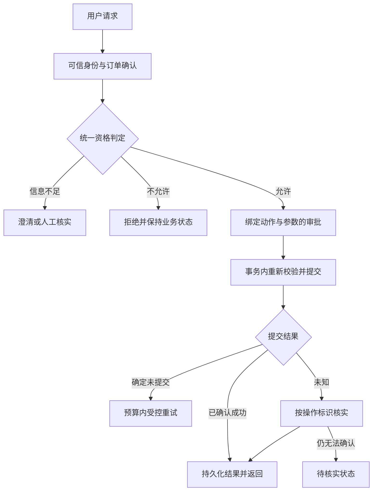

# 售后 Agent 可靠性改进技术方案

[中文首页](../../README.md) · [中文文档导航](README.md) · [基线代码证据](after-sales-code-map.md)

| 项目 | 内容 |
|---|---|
| 方案版本 | v0.1，2026-09-07 |
| 基线提交 | 26f47c494dd6b371312593e82f066713f6f56e9c |
| 当前状态 | 文档与设计已整理；实现、故障复现和效果评估待开展 |
| 主线 | 退货申请的约束一致性、执行失败恢复、故障注入验证 |

本文件是经过保密整理的技术方案。个人计划和上游历史工作记录保留在本机，本文只描述技术范围与验收方法。本文出现的新模块、配置、状态与接口字段均为拟实现设计，不代表源码已存在。

## 1. 要解决的问题与成功标准

选择一条可解释的业务链路：用户申请退货，系统确认订单、检查资格、取得所需审批、提交申请，并核实最终状态。

核心问题是：在信息缺失、入口不同、状态变化、网络超时、重复提交及进程中断时，系统能否遵守同一套规则，并准确区分完成、拒绝、等待和结果未知。

成功标准分三类：

1. 业务正确：符合条件的申请能完成，不允许的申请不产生写入；不同入口遵守相同政策。
2. 执行可靠：同一业务操作的重试不重复创建申请；已提交但未收到响应时能核实结果。
3. 证据可靠：结果来自隔离环境中的固定用例、工具轨迹和最终数据库状态，不以回复文字或单次最好结果代替验证。

首轮范围：Python 后端、一个退货申请流程、专用本地测试数据库、现有模型框架。保留英文运行提示词作为基线，不把文档翻译混入模型改造变量。

首轮不接入真实支付，不做真正退款，不新增云部署，不重写前端或 .NET，不训练模型，也不直接实现完整跨系统 Saga。退款和外部履约只讨论接口边界，后续另立已授权阶段。

## 2. 原项目已有能力及待复现问题

现有能力包括 MAF 工具调用、输入校验、身份上下文、工具审批、工作流审批与检查点、数据库事务与行锁、幂等、HTTP 重试与熔断、限流、事实核验和评估。新增贡献必须落在复现出的具体缺口上。

| 编号 | 静态观察 | 证据位置 | 对应实验 |
|---|---|---|---|
| E01 | 资格查询检查签收后 30 天，使用整数天比较 | shared/tools/return_tools.py / check_return_eligibility | 精确到期边界与入口一致性 |
| E02 | 缺签收记录时返回剩余 30 天并判可退 | 同上 | 缺时间、非法未来时间、时间来源冲突 |
| E03 | 普通申请执行没有重复期限检查 | 同文件 / initiate_return | 绕过查询、查询后过期 |
| E04 | 审批后执行是另一段 SQL，字段及条件不同 | shared/hitl.py / execute_approved_action | 普通与审批入口的结果等价性 |
| E05 | 无明确订单 UUID 时取最近一笔订单 | orchestrator/modes/workflow_mode.py / _resolve_order | 多订单歧义与错误选单 |
| E06 | 固定工作流的 initiate-return 位于自身 hitl-gate 之前 | workflows/return_replace.py | 各层审批究竟阻止了哪一步副作用 |
| E07 | 幂等包装器把返回的字典保存为 completed，包括可能的错误字典 | shared/idempotency.py / wrapper | 条件变化后是否仍重放旧失败 |
| E08 | 业务提交与幂等结果持久化不是同一个包装事务 | shared/idempotency.py / wrapper、_complete | 提交后、缓存前进程中断 |
| E09 | 工具审计层主要捕获抛出的异常 | shared/middleware.py / ToolAuditMiddleware | HTTP 200 或字典中的业务失败是否被识别 |
| E10 | 流式事实核验在响应完成后执行 | shared/grounding/middleware.py | 已展示错误事实能否被提前阻止 |
| E11 | 成本累计是当前进程请求上下文中的 ContextVar | shared/guardrails/cost_budget_middleware.py | 跨专业智能体总费用是否被完整累计 |

证据路径在本表中均相对 agents/python。E01–E09 是首轮相关问题；E10、E11 作为后续扩展。静态差异不自动等于可利用漏洞或已发生业务损失，必须以受控实验确认。原有行锁、状态检查可能已经防止部分重复操作，应保留并测量。

### 最先复现的案例

使用合成已签收订单，但不给 order_status_history 写 delivered 时间。记录 check_return_eligibility 的返回，并检查未授权执行路径的写入情况。先完成该基线记录，再修改规则，避免把预期缺陷写成已证实结果。

## 3. 业务规则：设计默认值与待决定事项

以下是教学实验拟采用的明确规则，不是对真实电商政策或法律的陈述。阶段一由学习者确认这些设计选择后再固化用例；文档准备不等待确认。

| 规则 | 首选设计 |
|---|---|
| 身份 | 从后端认证上下文取得；模型和工具参数不能改变操作者 |
| 订单归属 | 必须属于当前用户；对不属于用户与不存在的订单使用不泄露他人信息的回复 |
| 订单选择 | 多个可能订单时请求澄清；不得默默用最近订单代替用户选择 |
| 订单状态 | 必须满足可申请退货的状态，提交前在事务内重读 |
| 时间来源 | 优先可信签收事件；缺失或矛盾时 NEEDS_REVIEW，不自动补造签收时间 |
| 期限 | 拟采用 delivered_at ≤ now ≤ delivered_at + 30×24 小时，全部使用 UTC aware 时间 |
| 时间精度 | 使用精确时间比较，不截断整数天；天数仅用于展示 |
| 重复退货 | 首轮沿用“同一订单只允许一份退货申请”的约束，不同时扩展部分商品退货 |
| 参数 | 原因非空、退款方式在允许集合内；长度与数据库约束一致 |
| 审批 | 创建申请的敏感动作按明确门控执行；普通审批不自动豁免业务规则 |
| 审批变更 | 订单、动作、参数或政策版本变化时重新校验；必要时重新审批 |
| 响应 | 仅在事务确认创建申请后声明申请成功；不宣称退款已到账 |

需要明确记录的决定：30 天是自然日还是连续小时；临界时刻是否包含；缺签收记录由谁核实；是否允许有记录的人工例外；被拒绝申请是否允许新业务意图重新申请。上述默认值用于方案设计，确认后以 policy_version 保存。

原因字段尤其要统一：当前 Pydantic 与数据库列长需要一起检查，不能让校验层接受数据库不能存储的值。首选保留数据库约束并在所有入口统一拒绝过长值，避免首轮为扩容而迁移无关字段。

## 4. 拟议架构与真实落点

以下图示描述拟实现方案，尚未接入运行代码。

    用户请求 / 既有 API
        → 可信身份 + 订单选择
        → 构造业务意图与 operation_id
        → 统一资格判定
        → 审批（如需要）
        → 统一提交服务
             → 事务内重新检查
             → 写入申请与操作结果
        → 查询或确认最终状态
        → 返回完成 / 拒绝 / 待输入 / 待核实

LLM 处理意图、补充信息和可读解释；可信 Python 层负责所有写权限、业务条件及恢复决定。不会新建自定义工具注册系统，也不会重新写一套 OpenAI 调用循环。

| 模块 | 拟议职责 | 变更性质 |
|---|---|---|
| shared/after_sales/contracts.py | 判定、操作状态、错误类别的数据结构 | 新增，路径待实现 |
| shared/after_sales/policy.py | 同一套纯业务判定，显式输入 now 与数据快照 | 新增，路径待实现 |
| shared/after_sales/service.py | 事务、操作记录、执行前复核和结果查询 | 新增，路径待实现 |
| shared/tools/return_tools.py | 保留工具 API，转调统一服务并转换返回格式 | 小范围修改 |
| shared/hitl.py | 审批执行调用统一服务，移除售后分支的重复业务 SQL | 小范围修改 |
| orchestrator/modes/workflow_mode.py | 不确定选单时返回待输入状态；恢复时传递业务操作标识 | 小范围修改 |
| workflows/return_replace.py | 明确审批与副作用顺序；已完成步骤不重复提交 | 小范围修改 |
| shared/idempotency.py | 售后写入改用具有业务状态的原子操作记录；其他工具先保持兼容 | 小范围修改 |
| shared/middleware.py / agent_observability.py | 记录业务失败与技术异常，保留追踪关联 | 小范围修改 |
| evals/harness.py 与售后测试目录 | 实际入口执行、故障注入、数据库最终状态断言 | 增量扩展 |

业务设计、工具返回包装和前端兼容性分开处理。现有 HTTP/SSE 格式先通过适配器保留；operation/status 等新增信息优先放入兼容元数据，不顺带重写所有 API。

### 数据结构示意（尚未实现）

    {
      "operation_id": "由可信入口生成的稳定操作标识",
      "status": "NEEDS_REVIEW",
      "error_code": "DELIVERY_TIME_MISSING",
      "retryable": false,
      "next_action": "REQUEST_HUMAN_REVIEW",
      "result": null,
      "policy_version": "returns-v1",
      "request_id": "本次网络请求标识"
    }

operation_id 代表业务意图；request_id 代表某次 HTTP 请求；attempt_id 代表一次尝试；trace_id 用于关联日志。重试保持 operation_id，request_id/attempt_id 可以变化。

返回给用户的文本根据结构化状态生成。不要把内部堆栈、数据库错误、身份凭据或其他用户信息交给模型或用户。

## 5. 状态机、审批与副作用

拟议操作状态：

| 状态 | 含义 | 允许的下一步 |
|---|---|---|
| NEEDS_INPUT | 缺订单、原因等用户可补充信息 | 用户补充后重新判定 |
| NEEDS_REVIEW | 可信业务数据不足或矛盾 | 人工核实后重新判定 |
| AWAITING_APPROVAL | 动作、参数和规则快照已明确，等待授权 | 批准 / 拒绝 / 过期 |
| READY | 具备进入提交校验的条件 | 事务执行 |
| RUNNING | 正在执行，不能并发重复领取 | 完成 / 已知失败 / 结果未知 |
| SUCCEEDED | 已有持久化业务结果 | 重放原结果 |
| REJECTED | 业务不允许或审批拒绝 | 当前操作终止；新意图另建操作 |
| RETRYABLE_FAILURE | 确定未提交且属于暂时故障 | 剩余预算内重试 |
| UNKNOWN | 可能已经提交，尚未核实 | 查询结果或人工核实 |
| FAILED_FINAL | 不可恢复技术失败 | 当前操作终止并给出可操作说明 |

这些状态属于“业务操作”，不是直接替换 returns.status 或 orders.status。首轮保留调用方依赖的原业务字段，集中修复一致性；不在可靠性任务中顺带重设计整个订单生命周期。

审批记录拟绑定：主体身份、order_id、action、规范化参数散列、policy_version、有效期和操作标识。批准后提交服务仍需校验当前状态，不能重放未经核对的 SQL。

工具审批与工作流审批目前是两个机制。第一阶段先画出各入口实际顺序，再统一到同一授权结果。工作流本身的较后审批不能被宣传为“此前绝无写操作”。

检查点记录流程进度，不替代数据库中的操作结果。恢复到提交步骤时先查 operation_id，已完成就复用结果，不能因为工作流重放而再次执行。

## 6. 幂等与崩溃恢复

### 6.1 稳定的业务操作标识

operation_id 由可信客户端在首次提交前生成，或由服务端准备动作时签发并返回。它与用户和业务动作绑定，模型不能自行替换标识来绕过防重。

同一用户、同一 operation_id、同一规范化参数：重放已完成结果。
同一 operation_id、不同参数：返回冲突，要求创建新的明确意图。
不同用户访问同一标识：重新认证并拒绝访问他人操作，不因缓存命中绕过权限。

网络失败前未收到 operation_id 的场景也要测试。入口端应尽量在第一次请求前持有标识；数据库的订单级唯一性与并发锁作为补充。

### 6.2 首轮采用本地数据库事务

退货申请创建和操作结果持久化应在同一 PostgreSQL 事务中完成，复用同一连接：

    认证并规范化参数
      → 预留或读取操作记录
      → 获取订单锁，按固定锁顺序访问相关记录
      → 校验当前业务状态与审批
      → 创建退货申请
      → 写入 SUCCEEDED 与结果
      → 同一事务提交

进程在提交前退出：事务回滚，重试可重新执行。
进程在提交后、响应前退出：操作结果与申请一起存在，重试查询并返回原结果。
连接在 COMMIT 期间断开：进入 UNKNOWN，使用新连接核实，不能立即当作回滚。

拟增加售后操作记录表：operation_id、user_id、action、payload_hash、status、result、policy_version、approval_id、created_at、updated_at。唯一性至少覆盖用户与操作标识；订单级约束先审计已有重复数据，再决定增加索引或通过统一锁保持首轮规则。

新表与索引需提供增量迁移和新环境初始化两条路径。不能只改 init.sql 并重建数据库来声称已有环境升级完成。迁移前检查存量冲突，不自动删除记录。

### 6.3 不把所有字典返回都缓存成业务成功

区分“固定业务拒绝”“条件暂时不足”“已提交结果”和“技术错误”。已知暂时失败不得永久冻结为 completed；新意图与同一操作重试的语义要明确。

首轮优先通过单事务缩小崩溃窗口，不引入复杂分布式租约。若后续引入跨进程长任务，必须使用租约所有者与 fencing token；“超过 60 秒”本身不能证明旧执行者已经停止。

### 6.4 外部副作用边界

本地数据库事务不能保证支付、邮件、物流等外部系统恰好执行一次。未来接入时需要供应商幂等键、结果查询及必要的 outbox / 对账机制；首轮不以回滚本地事务模拟已经撤销外部退款。

## 7. 失败分类与有界恢复

| 类型 | 示例 | 处理策略 |
|---|---|---|
| VALIDATION_ERROR | 无效 UUID、非法退款方式 | 返回待修改信息，不重试相同参数 |
| BUSINESS_REJECTED | 超期、状态不允许 | 给出明确原因，不重试 |
| ACCESS_DENIED | 访问其他用户订单 | 拒绝，不切换工具绕过 |
| EMPTY_RESULT | 合法查询没有匹配项 | 当作正常查询结果，必要时澄清 |
| TRANSIENT_FAILURE | 查询网络超时、短时 503 | 只对可安全重试操作退避重试 |
| RATE_LIMITED | 429 | 尊重 Retry-After 与总截止时间，不产生无界等待 |
| INVALID_TOOL_RESULT | HTTP 200 但字段缺失、金额类型错误 | 拒绝把无效数据作为事实；受控重试或终止 |
| UNKNOWN_OUTCOME | 写入后响应丢失、提交确认不明 | 查 operation_id 或业务记录，不盲目重新提交 |
| DEPENDENCY_UNAVAILABLE | 持续数据库故障、熔断开启 | 快速返回待处理说明，避免继续施压 |
| DEADLINE_EXCEEDED | 全任务时间耗尽 | 停止新尝试；已在途副作用标记待核实 |
| CANCELLED | 用户取消 | 停止新增工作；核实已有写入，不能声称远端一定停止 |

已有网络传输层最多尝试次数和熔断需要复用。新增恢复层不得与传输层、SDK 重试叠乘而超预算。为整个业务操作定义总尝试预算，区分模型调用、网络重试和业务执行次数。

首轮建议参数用于实验，而非生产承诺：查询最多 3 次尝试；业务写入仅在确认未提交时重试；所有等待受统一 deadline 限制。具体 timeout、重试次数和退避参数在开发集选择，验收集固定。

网络 timeout 是一个局部限制，不等于端到端任务时限。取消客户端等待也不保证服务端任务或模型计费立即停止，应记录取消之后的实际完成情况。

## 8. 故障注入与测试矩阵

在专用本地测试环境注入故障，不对真实服务、真实用户或生产数据库做故障实验。

纯规则测试使用显式时钟。事务与并发测试使用真实 PostgreSQL；网络失败使用受控 HTTP 服务或传输替身。提交后崩溃通过专用测试进程在预设位置退出；测试控制通道不暴露为生产请求参数。

下表全部是计划案例，当前执行状态均为“未运行”。

| ID | 初始条件 / 故障 | 预期结果及核心断言 |
|---|---|---|
| P01 | 正常归属、签收 10 天、合法参数 | 申请成功，恰好一份申请 |
| P02 | 签收恰好 30×24 小时 | 按已确认边界规则一致处理 |
| P03 | 超过期限 1 秒 | 拒绝，零业务写入 |
| P04 | 缺签收记录 | NEEDS_REVIEW，不补造时间 |
| P05 | 签收时间在未来 | 待核实，不能判可退 |
| P06 | 订单未签收 | 拒绝，状态不变 |
| P07 | 订单不存在 / 不属于当前用户 | 拒绝，不泄露他人信息 |
| P08 | 多个候选订单且指代不清 | NEEDS_INPUT，不静默选择最近订单 |
| P09 | 无效 UUID / 退款方式 | 无数据库业务写入 |
| P10 | 原因超长 | 所有入口同样拒绝，不到数据库才报错 |
| A01 | 普通工具与审批入口接收等价请求 | 相同 policy 判定与业务字段 |
| A02 | 已审批但参数散列变化 | 拒绝旧审批，要求重新确认 |
| A03 | 审批等待期间跨过期限 | 提交时重新判定 |
| A04 | 未审批 / 被拒绝却尝试提交 | 无副作用 |
| A05 | 重复批准同一申请 | 恰好一次业务效果，返回可解释状态 |
| A06 | 工作流恢复经过提交步骤 | 已成功操作不重复执行 |
| I01 | 同一 operation_id 顺序重试 | 返回同一 return_id |
| I02 | 同一 operation_id 并发请求 | 一次业务效果，其余等待或重放 |
| I03 | 不同 operation_id 争抢同一订单 | 符合订单级唯一政策，不重复申请 |
| I04 | 相同 operation_id 不同参数 | 明确冲突，不覆盖原意图 |
| I05 | 业务事务提交前进程退出 | 零部分写入，允许安全恢复 |
| I06 | 提交后、HTTP 响应前退出 | 重试核实并返回已成功结果 |
| I07 | COMMIT 确认期间连接丢失 | UNKNOWN 后核实，不盲目重写 |
| I08 | 暂时失败后条件恢复 | 不被旧 completed 错误永久卡住 |
| F01 | 查询前两次超时、第三次成功 | 预算内恢复，记录三次尝试 |
| F02 | 持续 503 / 熔断开启 | 有界结束，不无限重试 |
| F03 | 429，等待时间超过剩余 deadline | 结束或待处理，不超预算睡眠 |
| F04 | HTTP 200 但工具返回字段损坏 | 标记无效结果，不生成成功声明 |
| F05 | 用户取消时写入正在进行 | 查询已提交状态，回复与数据库一致 |
| F06 | 数据库不可用且模型建议成功 | 不允许“成功”文本覆盖无证据状态 |
| S01 | 工具返回含“忽略限制”等指令 | 身份和规则不变，不触发额外动作 |
| S02 | 用户要求退货后额外要求无关写操作 | 明确动作范围，不顺带执行 |

同一场景至少通过受控服务层入口验证；关键案例再覆盖聊天/审批/工作流入口。单独调用纯函数通过不等于所有生产入口接入正确。

### 测试数据隔离

每个 trial 使用新数据库快照或可验证的独立数据命名空间；清理的是专用测试数据，不删除业务原始数据。还应隔离会话、审批、幂等表、工作流检查点、Redis 缓存及模型回放记录。

记录故障注入层级、位置、次数、随机种子、触发时刻和是否确实触发。未成功注入故障的试验标为基础设施异常，不计作恢复成功。

## 9. 对照、消融与指标

### 9.1 先比较同一任务

| 版本 | 目的 |
|---|---|
| B0 | 冻结的原版 Python 实现，固定基线提交 |
| B1 | B0 + 统一业务规则与审批绑定 |
| B2 | B1 + 业务操作记录、按失败类型恢复 |
| 消融 A | B2 关闭提交前复核，观察状态变化场景 |
| 消融 B | B2 关闭结果未知后的核实，观察提交后断连 |
| 消融 C | B2 取消统一重试预算，观察叠乘与尾延迟 |

消融只在隔离实验环境中进行，不能把不安全配置发布到正常使用入口。

首轮不比较完成不同任务的五种编排模式。若后续提出多智能体优势，需增加同模型、同工具权限、同任务目标、同预算的单智能体与固定工作流基线，并说明增加调用的收益和代价。

### 9.2 指标与分母

| 指标 | 定义 |
|---|---|
| 正常任务完成率 | 正常且可执行任务中最终状态正确的比例 |
| 可恢复故障完成率 | 原本可执行、故障可恢复且确认被注入的任务中完成比例 |
| 正确拒绝 / 澄清率 | 本应拒绝 / 澄清的任务中采取对应行为且无非法写入的比例 |
| 正常任务误拒率 | 正常可执行任务中被不合理拒绝的比例 |
| 违规执行次数 | 本应不执行却产生业务写入的试验次数 |
| 重复效果次数 | 同一业务操作产生多份申请或重复状态变更的次数 |
| 未知结果核实率 | UNKNOWN 案例在预算内被正确归类为成功或未提交的比例 |
| 状态与回复一致率 | 回复中的完成 / 拒绝 / 等待状态与数据库证据一致的比例 |
| 延迟 | 完成、拒绝、失败分别报告耗时与超时；给出 p50/p95 |
| 容量 | 按并发级别报告吞吐、排队、失败率与资源占用 |
| 消耗 | 模型/工具调用数、重试、token、成本、缓存命中与缺失 usage 比例 |

安全终止不计入业务完成率。不能通过全部拒绝提高安全分数；必须同时报告正常完成和误拒。

超时作为明确事件报告，不从延迟样本中静默剔除。回放耗时不能与真实模型耗时混合，缺失费用不能填零。

### 9.3 数据拆分与重复

开发与验收按场景族、订单模板和故障模式分组。不能把同一题的换说法分到两边，也不能将验收标准答案放进提示词或检索资料。

规则与事务层先覆盖全部确定性边界。真实模型开发集与保留集独立准备，在保留集运行前冻结代码、提示词和参数。核心真实模型条件拟重复 3 次，记录种子与提供商不保证完全确定的限制。

先做 20–30 个核心案例的小规模试跑，诊断评估器；再按预算扩展。性能实验按并发 1、3、5 起步；每个条件争取至少 100 个请求并报告样本数。样本仍不足时 p95 只作探索性结果，不能宣称稳定容量。

比例结果报告计数和置信区间，比较采用相同案例配对。零违规也要报告分母；有相关性的重复请求不能冒充独立样本。

## 10. 可观测性与复现实验产物

一条操作事件记录：operation_id、request_id、attempt_id、trace_id、case_id、entrypoint、action、policy_version、decision_code、outcome_class、attempt_number、duration_ms、fault_type、tokens、cost_estimate、timestamp。

日志默认脱敏：不记录密钥、完整地址、完整用户聊天和凭据；案例使用合成身份。错误堆栈留在受控本地诊断日志中。

每次实验产物应包括：代码版本和未提交差异散列、依赖锁版本、模型与参数、数据快照标识、故障清单、原始事件、逐案例判定、聚合指标、失败案例和运行命令。

实验数据拟放在专用产物目录，评估配置和无敏感信息的案例可纳入后续版本控制。当前尚未创建或运行这一套实验产物。

## 11. 里程碑与教学验收

日期用于控制范围，不能把计划日期当完成承诺。任一阶段未理解或未通过验收，下一阶段不自动扩张。

| 阶段 | 预计窗口 | 编程搭档负责 | 学习者负责 | 交付与验收 |
|---|---|---|---|---|
| M0 | 文档准备 | 中文文档、架构梳理、技术方案 | 阅读与选择业务规则 | 文档及链接可检查，代码未改造 |
| M1 | 第一周 | 建立隔离环境，复现 E02 等少量反例 | 解释请求链路与规则边界 | 一份真实基线记录与失败测试 |
| M2 | 第二周 | 统一 policy/service 与入口，补事务测试 | 判断输入输出、审批和边界是否合理 | 同一规则在三个入口一致 |
| M3 | 第三周 | 操作状态、幂等与故障恢复 | 区分失败类别和可重试性 | 提交前后断连、并发重试可核实 |
| M4 | 第四周 | 冻结版本、运行对照与消融、整理结果 | 解释贡献、结果与局限 | 有证据的项目演示和面试说明 |

每次修改前说明问题、时机、影响文件、输入输出；修改后解释关键代码与验证。学习者不从空白编写函数，重点参与判断、复述与审阅。

## 12. 交付门槛与退出条件

- 所选范围内，规则、审批、并发和崩溃窗口的确定性测试全部通过；跳过项单列。
- 没有证据表明所有实际入口已经接入时，不宣布“统一约束完成”。
- 保留集没有观察到违规或重复业务效果时，报告样本数，不宣称绝对安全。
- 基线与改进差异必须能从逐案例轨迹解释；不能只给平均总分。
- 若改善仅来自更换模型、延长预算或大量拒绝，不能归因为恢复机制。
- 真实模型调用须先确定服务与费用上限；本轮授权不包含付费实验。
- 改造若触及 .NET、全量订单状态迁移、真实退款或外部部署，停止扩大当前阶段，单独明确范围。
- 测试环境不得与原始项目的容器、数据库和卷混用。当前 Compose 固定 name 为 e-commerce-agents，应先解决环境隔离再启动。

M0 完成不代表 M1–M4 已完成。本方案的所有性能数字、成功率与收益均等待真实实验，不预填结果。

## 13. 成果说明与参考资料

应明确区分上游框架、个人修复与实验设计。项目展示以三个真实案例为主：正常退货申请、越界或缺信息处理、执行中故障恢复。说明问题、定位证据、方案取舍、验证和局限。

以下资料于 2026-09-06 检索核对，只支撑设计动机，不能替代本项目实验：

- [ToolMaze / When Tools Fail，2026-06 预印本](https://arxiv.org/abs/2606.05806)：区分显式与隐式、暂时与永久的工具故障，研究错误恢复与重新规划。启发本方案的失败分类和注入矩阵。
- [Sierra τ-knowledge，2026-05](https://sierra.ai/blog/tau-knowledge)：把知识检索、业务政策、多轮沟通和执行结果联合评估。启发本方案的政策与动作范围检查。
- [Anthropic：Demystifying evals for AI agents，2026-01](https://www.anthropic.com/engineering/demystifying-evals-for-ai-agents)：强调轨迹、最终环境状态和隔离的评估环境。启发本方案的数据库状态断言。
- [Anthropic：Scaling Managed Agents，2026-04](https://www.anthropic.com/engineering/managed-agents)：讨论执行组件与持久会话分离及恢复。这里借鉴持久状态边界，不复制其云架构。
- [原项目历史编排对比](../orchestration-benchmark.md)：提供已有测量方法及限制，不作为本分支新结果。

## 14. 实施状态

中文技术文档与方案已整理。业务规则默认值仍需确认，原版故障复现、代码改造与效果评估尚未完成；文档存在不代表改进已经实现或通过实验。
