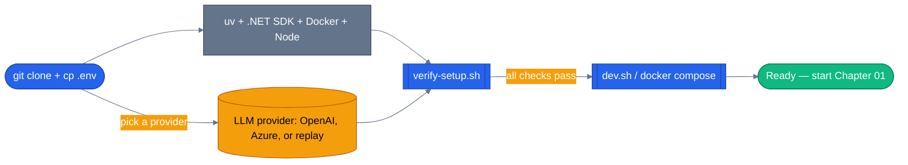

# Chapter 00 — Setup your dev environment

Everything you need installed before Chapter 1 — `uv`, a .NET SDK, Docker, an LLM
key (or none at all), and a one-shot verify script. Do this once and forget it.

## Why this chapter

The rest of the series runs real code against a real LLM, in two languages, backed
by Postgres and Redis. Rather than re-explaining toolchain setup in every chapter,
this one gets your machine ready and gives you a single command
(`./scripts/verify-setup.sh`) that tells you exactly what's missing. Every later
chapter assumes you've already run it once.

You need one Python toolchain (`uv`), one .NET SDK, Docker for the infra
containers (Postgres, Redis, the Aspire telemetry dashboard), and either an LLM
key or nothing at all — the replay mode described below runs the entire tutorial
series offline, no credentials required.

## Prerequisites

A Unix-like shell. macOS and Linux work out of the box; on Windows use WSL2.

## The concept

Chapter 00 has no MAF concept of its own — it's the on-ramp. The one idea worth
internalizing here is the shape every later chapter follows: a shared `uv`
workspace for Python so you only run `uv sync` once for the whole series, a
per-chapter `dotnet run` for .NET, and a single `.env` at the repo root that every
chapter — tutorial or capstone app — reads from.



The diagram is the whole chapter: install tools, pick an LLM path (including
"none"), run the verify script, then either run individual tutorial chapters or
bring up the full capstone stack with `dev.sh`.

## Install the toolchains

### `uv` (Python package manager)

```bash
curl -LsSf https://astral.sh/uv/install.sh | sh
uv --version          # expect: uv 0.5.x or later
uv python install 3.12
```

The repo is pinned to `uv`, not `pip`/`poetry` — it resolves and installs an order
of magnitude faster and handles virtualenv creation for you.

### .NET SDK (9 or 10)

- macOS: `brew install --cask dotnet-sdk`
- Ubuntu: follow [Microsoft's official instructions](https://learn.microsoft.com/en-us/dotnet/core/install/linux-ubuntu).
- Windows: download from [dotnet.microsoft.com](https://dotnet.microsoft.com/download).

```bash
dotnet --list-sdks    # expect: 9.0.x or 10.0.x
```

`agents/dotnet/ECommerceAgents.sln` currently targets `net10.0`; `verify-setup.sh`
accepts either 9 or 10 on the machine.

### Docker + Compose v2

Install Docker Desktop (macOS/Windows) or Docker Engine + `docker-compose-plugin`
on Linux. `docker compose version` must work — the tutorials themselves don't need
Docker, but the capstone app (Postgres, Redis, the Aspire dashboard) does.

### Node 20+ and pnpm (for the Next.js frontend)

```bash
# If you don't have Node:
curl -o- https://raw.githubusercontent.com/nvm-sh/nvm/v0.40.1/install.sh | bash
nvm install 20

# pnpm:
corepack enable pnpm
```

## Clone and configure

```bash
git clone https://github.com/nitin27may/e-commerce-agents.git
cd e-commerce-agents
cp .env.example .env
```

`.env` at the repo root is read by every tutorial chapter and by the capstone app
alike. `LLM_PROVIDER` selects the block: `openai`, `azure`, or `replay`.

### Option A — OpenAI (or any OpenAI-compatible endpoint)

```dotenv
LLM_PROVIDER=openai
OPENAI_API_KEY=sk-...
LLM_MODEL=gpt-4.1
EMBEDDING_MODEL=text-embedding-3-small
```

### Option B — Azure OpenAI

```dotenv
LLM_PROVIDER=azure
AZURE_OPENAI_ENDPOINT=https://your-resource.openai.azure.com/
AZURE_OPENAI_KEY=...
AZURE_OPENAI_DEPLOYMENT=gpt-4.1
AZURE_OPENAI_API_VERSION=2025-03-01-preview
AZURE_EMBEDDING_DEPLOYMENT=text-embedding-3-small
```

(`AZURE_OPENAI_KEY`/`AZURE_OPENAI_DEPLOYMENT` are the repo-native names;
`AZURE_OPENAI_API_KEY`/`AZURE_OPENAI_DEPLOYMENT_NAME` — the MAF-docs spelling —
work as aliases.)

Keep `JWT_SECRET` and `AGENT_SHARED_SECRET` at their `.env.example` defaults for
local dev; they're only rotated in production.

### Don't have a paid API key? Two options

> **Note (2026-08):** earlier versions of this guide recommended GitHub Models as
> the free option. GitHub Models was retired at the end of July 2026 and its
> endpoint no longer resolves. Ollama is now the free path.

**Option 1 — Ollama / LM Studio (free, real model, fully local, zero network).**
`LLM_PROVIDER=openai` plus `LLM_BASE_URL` points `OpenAIChatClient` at any
OpenAI-compatible endpoint — including a model server on your own machine:

```dotenv
# Ollama — `ollama pull qwen2.5:14b` first, and start the server with a raised
# context window: OLLAMA_CONTEXT_LENGTH=64000 ollama serve
LLM_PROVIDER=openai
LLM_BASE_URL=http://localhost:11434/v1
OPENAI_API_KEY=ollama          # any non-empty string — Ollama doesn't check it
LLM_MODEL=qwen2.5:14b           # or whatever tag you pulled
```

```dotenv
# LM Studio — load a model in LM Studio's local server first, then:
LLM_PROVIDER=openai
LLM_BASE_URL=http://localhost:1234/v1
OPENAI_API_KEY=lm-studio       # any non-empty string
LLM_MODEL=<the model identifier shown in LM Studio's server tab>
```

**Gotcha:** every chapter from Ch02 onward calls at least one tool
(`@tool`-decorated function), and the capstone's specialist agents are
tool-calling-heavy by design. Many small or quantized local models expose an
OpenAI-compatible chat-completions endpoint but have unreliable or absent
function-calling support — the agent won't raise an error, it will just
silently stop calling tools and answer from its own (often fabricated)
knowledge instead. Prefer a model explicitly tagged for tool use (Llama
3.1+, Qwen2.5, Mistral "instruct"/"tool-use" variants) over a generic small
chat model. If a tutorial chapter's tool-calling test passes but the printed
answer doesn't reflect the tool's canned data, that's the model's
tool-calling support, not a bug in the chapter.

**Option 2 — Replay (free, no network, no key at all).** Every tutorial chapter's
`tests/` directory ships committed fixtures recorded against a real model. Set
`LLM_PROVIDER=replay` and the chapter's own client construction plays them back
with zero credentials:

```bash
LLM_PROVIDER=replay uv run --project tutorials python tutorials/01-first-agent/python/main.py
```

This is also what lets the tutorial test suite run in CI without secrets — see
`agents/python/shared/replay_client.py` (production) and
`tutorials/_shared/replay_client.py` (tutorials) for how it works. To record a
fixture yourself (e.g. after changing a chapter's prompt), set `RECORD=true` and a
real provider's credentials — `REPLAY_RECORD_PROVIDER` picks which one (`openai` or
`azure`, default `openai`):

```bash
LLM_PROVIDER=replay RECORD=true REPLAY_RECORD_PROVIDER=azure \
  uv run --project tutorials python tutorials/01-first-agent/python/main.py "your question"
```

Re-run without `RECORD` afterward to confirm it replays deterministically, and
commit the new fixture under that chapter's `tests/fixtures/replay/`.

## Verify

One script checks everything:

```bash
./scripts/verify-setup.sh
```

It checks, in order: `uv` present, Python 3.12+, a .NET SDK (9 or 10), Docker,
Docker Compose v2, Node 20+, pnpm, that `.env` exists and has a real (non-placeholder)
key for whichever `LLM_PROVIDER` you picked, that the expected top-level folders
exist (`tutorials/`, `agents/python/`, `agents/dotnet/ECommerceAgents.sln`, `web/`,
both compose files), and — if a .NET SDK is installed — that `agents/dotnet`
actually builds. It exits non-zero on the first category of failures and prints a
`✓`/`✗` line per check either way, so a failing run tells you exactly what to fix.

## What's in this folder

Unlike every other chapter, `00-setup/python/` and `00-setup/dotnet/` are
intentionally empty (just `.gitkeep`) — there's no runnable example here. Chapter
01 is where the first line of MAF code shows up.

## Running the tutorial chapters vs. the full capstone

Once `verify-setup.sh` is green, you have two things you can run:

**A single tutorial chapter** (no Docker needed, just `uv`/`dotnet`):

```bash
uv sync --project tutorials
uv run --project tutorials python tutorials/01-first-agent/python/main.py

# or the .NET side
cd tutorials/01-first-agent/dotnet && dotnet run
```

**The full capstone app** (Docker, both backends, the seeded Postgres/Redis stack):

```bash
./scripts/dev.sh            # Python backend
./scripts/dev.sh --dotnet   # .NET backend

# On Windows (PowerShell), or anywhere with pwsh 7:
./scripts/dev.ps1
./scripts/dev.ps1 -Dotnet
```

- Frontend: http://localhost:3000
- Orchestrator: http://localhost:8080
- Aspire Dashboard (telemetry): http://localhost:18888

You don't need the capstone app running to work through Chapters 01–20b — it only
matters once you get to [Chapter 21 — Capstone Tour](../21-capstone-tour/).

## Side-by-side differences

There's no code yet, but one setup-time difference is worth knowing early:

| Concern | Python | .NET |
|---------|--------|------|
| Env-var loading | `pydantic-settings` reads `.env` automatically | ASP.NET Core reads env vars + `launchSettings.json`; the shared config loader handles `.env` |
| Package management | `uv sync --project tutorials` (one command, whole series) | `dotnet restore` per chapter, or `dotnet build` on the solution |

## Gotchas

- **Azure deployment name mismatch.** If the Azure portal shows `gpt-4.1-prod` but
  your `.env` has `gpt-4.1`, requests fail with a 404. The deployment name has to
  match exactly.
- **`OPENAI_API_KEY=sk-your-openai-api-key-here`** is the literal placeholder
  shipped in `.env.example`. `verify-setup.sh` specifically checks for and
  rejects that string — replace it with a real key (or switch to
  `LLM_PROVIDER=replay`, which needs no key at all).
- **Ports 5432 / 6379 / 8080 already in use.** Only matters if you're running the
  full capstone app (`dev.sh`), not the standalone tutorial chapters. Stop any
  local Postgres/Redis or change the ports in `docker-compose.yml`.
- **Don't chase the old "empty `agent_framework/__init__.py`" bug.** Earlier
  builds of this repo needed `agents/python/patch_maf.py` to work around a
  packaging bug in `agent-framework-core==1.0.0`. The repo now pins
  `agent-framework-core>=1.14.0`, which ships a real `__init__.py`, so that patch
  is already a no-op — you don't need to think about it.

## Tests

The setup script is the test — run it in CI to catch toolchain regressions:

```bash
./scripts/verify-setup.sh
echo "exit code: $?"   # 0 if every check passed
```

## How this shows up in the capstone

`scripts/verify-setup.sh` and `scripts/dev.sh` are what the main
[`README.md`](../../README.md#quick-start) points to under Quick Start — this
chapter and the repo root's onboarding path are the same script, not a
tutorial-only stand-in.

## What's next

- Next chapter: [Chapter 01 — Your First Agent](../01-first-agent/)
- [Repository root](../../) for the full quick-start
- [Series index](../README.md)
- Shared: [Mermaid style guide](../_shared/mermaid-style-guide.md) · [Jargon glossary](../_shared/jargon-glossary.md)
