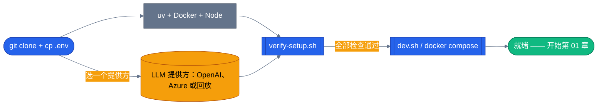

# 第 00 章 · 环境准备

[项目首页](../../README.md) · [教程总览](../README.md) · [术语表](../_shared/jargon-glossary.md)

第 01 章之前需要装好的一切 —— `uv`、Docker、一个 LLM 密钥（或者一个都不要），以及一个一次性的校验脚本。做一次，然后忘掉它。

## 本章动机

本系列的其余部分会运行真实代码、访问真实 LLM，背后还有 Postgres 与 Redis。与其在每一章重复解释工具链安装，不如由本章把机器准备好，并给你一条命令（`./scripts/verify-setup.sh`）来明确告诉你缺什么。后面每一章都假定你已经跑过它一次。

你需要一套 Python 工具链（`uv`）、Docker（用于基础设施容器：Postgres、Redis、Jaeger 遥测界面），以及一个 LLM 密钥 —— 或者一个都不要：下文描述的回放模式可以在完全离线的状态下跑完整个教程系列，不需要任何凭据。

## 前置条件

一个类 Unix 的 shell。macOS 与 Linux 开箱可用；Windows 上请使用 WSL2。

## 核心概念

第 00 章本身没有 MAF 概念 —— 它是入口坡道。这里唯一值得内化的想法，是后续每一章都遵循的形态：Python 共用**一个** `uv` 工作区，于是整个系列只需跑一次 `uv sync`；仓库根目录有**唯一一个** `.env`，无论教程章节还是完整应用都从它读取。


```mermaid
%%{init: {'theme':'base', 'themeVariables': {
  'primaryColor': '#2563eb','primaryTextColor': '#ffffff','primaryBorderColor': '#1e40af',
  'lineColor': '#64748b','secondaryColor': '#f59e0b','tertiaryColor': '#10b981',
  'background': 'transparent'}}}%%
flowchart LR
  classDef core     fill:#2563eb,stroke:#1e40af,color:#ffffff
  classDef external fill:#f59e0b,stroke:#b45309,color:#000000
  classDef success  fill:#10b981,stroke:#047857,color:#ffffff
  classDef infra    fill:#64748b,stroke:#334155,color:#ffffff

  clone([git clone + cp .env])
  toolchain[uv + Docker + Node]
  llm[(LLM 提供方：OpenAI、Azure 或回放)]
  verify[[verify-setup.sh]]
  devsh[[dev.sh / docker compose]]
  ready([就绪 —— 开始第 01 章])

  clone --> toolchain
  toolchain --> verify
  clone -- "选一个提供方" --> llm
  llm --> verify
  verify -- "全部检查通过" --> devsh
  devsh --> ready

  class clone core
  class toolchain infra
  class llm external
  class verify core
  class devsh core
  class ready success
```

这张图就是本章全部内容：装工具、选一条 LLM 路径（包括「不用」）、跑校验脚本，然后要么单独运行某个教程章节，要么用 `dev.sh` 起完整的作品项目。

## 安装工具链

### `uv`（Python 包管理器）

```bash
curl -LsSf https://astral.sh/uv/install.sh | sh
uv --version          # 期望：uv 0.5.x 或更高
uv python install 3.12
```

本仓库锁定使用 `uv`，而不是 `pip`/`poetry` —— 它的解析与安装速度快一个数量级，并且替你处理虚拟环境创建。

### Docker + Compose v2

在 macOS/Windows 上安装 Docker Desktop，在 Linux 上安装 Docker Engine + `docker-compose-plugin`。`docker compose version` 必须可用 —— 教程本身不需要 Docker，但完整应用需要（Postgres、Redis、Jaeger 界面）。

### Node 20+ 与 pnpm（用于 Next.js 前端）

```bash
# 如果还没有 Node：
curl -o- https://raw.githubusercontent.com/nvm-sh/nvm/v0.40.1/install.sh | bash
nvm install 20

# pnpm：
corepack enable pnpm
```

## 克隆与配置

```bash
git clone https://github.com/s1encisi/reliable-commerce-agents.git
cd reliable-commerce-agents
cp .env.example .env
```

仓库根目录的 `.env` 同时被每个教程章节与完整应用读取。`LLM_PROVIDER` 决定用哪一组配置：`openai`、`azure` 或 `replay`。

### 方案 A —— OpenAI（或任何兼容 OpenAI 的端点）

```dotenv
LLM_PROVIDER=openai
OPENAI_API_KEY=sk-...
LLM_MODEL=gpt-4.1
EMBEDDING_MODEL=text-embedding-3-small
```

### 方案 B —— Azure OpenAI

```dotenv
LLM_PROVIDER=azure
AZURE_OPENAI_ENDPOINT=https://your-resource.openai.azure.com/
AZURE_OPENAI_KEY=...
AZURE_OPENAI_DEPLOYMENT=gpt-4.1
AZURE_OPENAI_API_VERSION=2025-03-01-preview
AZURE_EMBEDDING_DEPLOYMENT=text-embedding-3-small
```

（`AZURE_OPENAI_KEY` / `AZURE_OPENAI_DEPLOYMENT` 是本仓库的原生变量名；MAF 官方文档里的写法 `AZURE_OPENAI_API_KEY` / `AZURE_OPENAI_DEPLOYMENT_NAME` 可作为别名使用。）

本地开发时，让 `JWT_SECRET` 与 `AGENT_SHARED_SECRET` 保持 `.env.example` 中的默认值即可；它们只在生产环境轮换。

### 没有付费 API 密钥？两条路

> **注（2026-08）：** 本指南的早期版本把 GitHub Models 推荐为免费方案。GitHub Models 已于 2026 年 7 月底停止服务，其端点不再解析。现在免费路径是 Ollama。

**方案 1 —— Ollama / LM Studio（免费、真实模型、完全本地、零网络）。**
`LLM_PROVIDER=openai` 加上 `LLM_BASE_URL`，就能把 `OpenAIChatClient` 指向任何兼容 OpenAI 的端点 —— 包括你自己机器上的模型服务：

```dotenv
# Ollama —— 先执行 `ollama pull qwen2.5:14b`，并用更大的上下文窗口启动服务：
# OLLAMA_CONTEXT_LENGTH=64000 ollama serve
LLM_PROVIDER=openai
LLM_BASE_URL=http://localhost:11434/v1
OPENAI_API_KEY=ollama          # 任意非空字符串 —— Ollama 不校验它
LLM_MODEL=qwen2.5:14b           # 或你拉取的任何 tag
```

```dotenv
# LM Studio —— 先在 LM Studio 的本地服务中加载模型，然后：
LLM_PROVIDER=openai
LLM_BASE_URL=http://localhost:1234/v1
OPENAI_API_KEY=lm-studio       # 任意非空字符串
LLM_MODEL=<LM Studio 服务标签页中显示的模型标识>
```

**坑：** 从第 02 章起，每章至少调用一个工具（`@tool` 装饰的函数），而完整项目中的专家智能体在设计上就是重工具调用的。许多小型或量化本地模型虽然暴露了兼容 OpenAI 的 chat-completions 端点，但函数调用支持不可靠甚至完全缺失 —— 这时智能体**不会报错**，它只会静默地停止调用工具，转而凭自己（往往是编造的）知识作答。请优先选择明确标注支持工具调用的模型（Llama 3.1+、Qwen2.5、Mistral 的 "instruct"/"tool-use" 变体），而不是通用的小型对话模型。如果某章的「工具调用」测试通过了，但打印出的回答并不反映工具的预设数据，那问题出在模型的工具调用支持上，不是章节的缺陷。

**方案 2 —— 回放（免费、无网络、完全不需要密钥）。** 每个教程章节的 `tests/` 目录都带有针对真实模型录制的、已提交的 fixture。设置 `LLM_PROVIDER=replay`，该章自己的客户端构造逻辑就会零凭据地回放它们：

```bash
LLM_PROVIDER=replay uv run --project tutorials python tutorials/01-first-agent/python/main.py
```

这也正是教程测试套件能在没有密钥的 CI 中运行的原因 —— 实现方式见 `tutorials/_shared/replay_client.py`。若你想自己录制 fixture（例如修改了某章的提示词之后），设置 `RECORD=true` 并提供真实提供方的凭据 —— `REPLAY_RECORD_PROVIDER` 决定用哪一个（`openai` 或 `azure`，默认 `openai`）：

```bash
LLM_PROVIDER=replay RECORD=true REPLAY_RECORD_PROVIDER=azure \
  uv run --project tutorials python tutorials/01-first-agent/python/main.py "你的问题"
```

随后去掉 `RECORD` 再跑一次，确认它确定性地回放，然后把新的 fixture 提交到该章的 `tests/fixtures/replay/` 下。

## 校验

一个脚本检查全部内容：

```bash
./scripts/verify-setup.sh
```

它按顺序检查：`uv` 是否存在、Python 3.12+、Docker、Docker Compose v2、Node 20+、pnpm、`.env` 是否存在且为你所选的 `LLM_PROVIDER` 填入了真实（非占位符）密钥、预期的顶层目录是否存在（`tutorials/`、`agents/python/`、`web/`、两个 compose 文件）。它会在第一类失败出现时以非零码退出，并且无论结果如何都会逐项打印 `✓`/`✗`，因此一次失败的运行会明确告诉你该修什么。

## 这个目录里有什么

与其他章节不同，`00-setup/python/` 是**刻意留空的**（只有一个 `.gitkeep`）—— 这里没有可运行的示例。第一行 MAF 代码出现在第 01 章。

## 运行教程章节 vs. 运行完整项目

`verify-setup.sh` 全绿之后，你有两样东西可以运行：

**单个教程章节**（不需要 Docker，只要 `uv`）：

```bash
uv sync --project tutorials
uv run --project tutorials python tutorials/01-first-agent/python/main.py
```

**完整的作品项目**（需要 Docker、Postgres/Redis 已灌数据）：

```bash
./scripts/dev.sh

# Windows（PowerShell），或任何装有 pwsh 7 的环境：
./scripts/dev.ps1
```

- 前端：http://localhost:3000
- 编排服务：http://localhost:8080
- Jaeger 界面（遥测）：http://localhost:16686

在学完第 01–20b 章的过程中，你**不需要**把完整应用跑起来 —— 只有到了 [第 21 章 · 完整项目导览](../21-capstone-tour/) 它才变得重要。

## 常见坑

- **Azure 部署名不匹配。** 如果 Azure 门户里显示 `gpt-4.1-prod`，而你的 `.env` 里写的是 `gpt-4.1`，请求会以 404 失败。部署名必须完全一致。
- **`OPENAI_API_KEY=sk-your-openai-api-key-here`** 是 `.env.example` 里自带的字面占位符。`verify-setup.sh` 会专门检查并拒绝这个字符串 —— 请换成真实密钥（或改用 `LLM_PROVIDER=replay`，它完全不需要密钥）。
- **端口 5432 / 6379 / 8080 已被占用。** 只有在你运行完整应用（`dev.sh`）时才需要关心，与独立运行的教程章节无关。停掉本地的 Postgres/Redis，或修改 `docker-compose.yml` 里的端口。
- **不要再去追那个旧的「`agent_framework/__init__.py` 为空」缺陷。** 本仓库早期的构建需要 `agents/python/patch_maf.py` 来绕过 `agent-framework-core==1.0.0` 的打包问题。仓库现已锁定 `agent-framework-core>=1.14.0`，其中带有真实的 `__init__.py`，因此那处补丁早已是空操作 —— 你不必再考虑它。

## 测试

环境脚本本身就是测试 —— 在 CI 中运行它来捕捉工具链回退：

```bash
./scripts/verify-setup.sh
echo "exit code: $?"   # 全部检查通过则为 0
```

## 在完整项目中的落点

`scripts/verify-setup.sh` 与 `scripts/dev.sh` 正是仓库根目录 [`README.md`](../../README.md) 的「快速开始」一节所指向的脚本 —— 本章与仓库根的上手路径用的是同一个脚本，而不是一个只在教程里存在的替身。

## 下一步

- 下一章：[第 01 章 · 第一个智能体](../01-first-agent/)
- [仓库根目录](../../) 查看完整快速开始
- [系列总览](../README.md)
- 共享材料：[Mermaid 风格指南](../_shared/mermaid-style-guide.md) · [术语表](../_shared/jargon-glossary.md)
