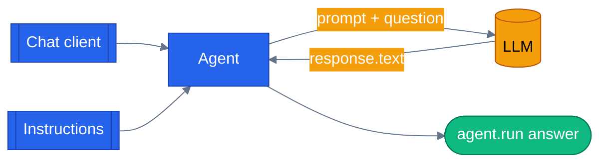

# Chapter 01 — Your First Agent

The smallest useful Microsoft Agent Framework program — one chat client, one instructions string, one `agent.run()` call — in both Python and .NET.

## Why this chapter

An *agent* in MAF is a chat client plus instructions. That's it. Before later chapters add tools, memory, middleware, or workflows, we need that baseline running on both stacks — every subsequent chapter adds exactly one thing to this starting point.

We'll answer one question: **"What is the capital of France?"**

## Prerequisites

- Completed [Chapter 00 — Setup](../00-setup/) (uv, .NET 9/10 SDK, Docker).
- Repo-root `.env` with one LLM provider configured:

| Provider | Required | Optional |
|----------|----------|----------|
| **OpenAI** | `OPENAI_API_KEY` | `LLM_MODEL` (default `gpt-4.1`) |
| **Azure OpenAI** | `AZURE_OPENAI_ENDPOINT`, `AZURE_OPENAI_KEY`, `AZURE_OPENAI_DEPLOYMENT` | `AZURE_OPENAI_API_VERSION` (default `2024-10-21`) |

## The concept

A Microsoft Agent Framework agent wraps three things:

1. A **chat client** — the thing that talks to the LLM (OpenAI Responses API, Chat Completions, or Azure OpenAI).
2. **Instructions** — the agent's persona, passed as the system prompt.
3. A **name** (optional) — for logs and telemetry.

You call `await agent.run(question)` (Python) or `await agent.RunAsync(question)` (.NET) and get back a response with `.text` / `.Text`. Nothing fancier yet — no tools, no memory, no orchestration.



The chat client and instructions are the only two inputs to `Agent(...)`; `agent.run()` is the only call surface this chapter exercises.

One gotcha that matters for the rest of the series: MAF v1 has two code paths to OpenAI-style APIs — the **Responses API** (newer, richer) and **Chat Completions** (older, universally supported). Public OpenAI supports both; not every Azure OpenAI deployment supports the Responses API. Both examples in this chapter default to `OpenAIChatClient`/`OpenAIClient.GetChatClient` for OpenAI and switch to the Chat Completions path (`OpenAIChatCompletionClient` in Python, the same `GetChatClient` surface via `AzureOpenAIClient` in .NET) when `LLM_PROVIDER=azure`.

## Python

Source: [`python/main.py`](./python/main.py).

Run from the repo root using the shared `tutorials/` uv project (one `uv sync` covers every chapter):

```bash
uv sync --project tutorials
uv run --project tutorials python tutorials/01-first-agent/python/main.py
```

The provider switch and agent construction:

```python
def _default_client() -> OpenAIChatClient | OpenAIChatCompletionClient | ReplayChatClient:
    provider = os.environ.get("LLM_PROVIDER", "openai").lower()
    if provider == "replay":
        return ReplayChatClient(fixtures_dir=FIXTURES_DIR, ...)
    if provider == "azure":
        return OpenAIChatCompletionClient(
            model=os.environ["AZURE_OPENAI_DEPLOYMENT"],
            azure_endpoint=os.environ["AZURE_OPENAI_ENDPOINT"],
            api_key=os.environ.get("AZURE_OPENAI_KEY") or os.environ.get("AZURE_OPENAI_API_KEY"),
            api_version=os.environ.get("AZURE_OPENAI_API_VERSION", "2024-10-21"),
        )
    return OpenAIChatClient(
        model=os.environ.get("LLM_MODEL", "gpt-4.1"),
        api_key=os.environ["OPENAI_API_KEY"],
    )


def build_agent(client: object | None = None) -> Agent:
    return Agent(client or _default_client(), instructions=INSTRUCTIONS, name="first-agent")


async def ask(agent: Agent, question: str) -> str:
    response = await agent.run(question)
    return response.text
```

`build_agent()` accepts an optional pre-built client so the test suite can inject a canned one instead of hitting a real LLM. There's also a third provider, `replay`, backed by `tutorials/_shared/replay_client.py` — it plays back a committed fixture from `tests/fixtures/replay/`, which is how the test suite gets a "real answer" assertion without network access or credentials.

## .NET

Source: [`dotnet/Program.cs`](./dotnet/Program.cs).

```bash
cd tutorials/01-first-agent/dotnet
dotnet run
```

The equivalent provider switch and agent construction:

```csharp
public static AIAgent BuildAgent()
{
    var provider = Environment.GetEnvironmentVariable("LLM_PROVIDER")?.ToLowerInvariant() ?? "openai";

    if (provider == "azure")
    {
        var endpoint = Required("AZURE_OPENAI_ENDPOINT");
        var deployment = Required("AZURE_OPENAI_DEPLOYMENT");
        var apiKey = Environment.GetEnvironmentVariable("AZURE_OPENAI_KEY")
                     ?? Environment.GetEnvironmentVariable("AZURE_OPENAI_API_KEY")
                     ?? throw new InvalidOperationException("Azure requires AZURE_OPENAI_KEY.");

        var azureClient = new AzureOpenAIClient(new Uri(endpoint), new ApiKeyCredential(apiKey));
        return azureClient.GetChatClient(deployment).AsAIAgent(instructions: Instructions, name: "first-agent");
    }

    var openAiKey = Required("OPENAI_API_KEY");
    var model = Environment.GetEnvironmentVariable("LLM_MODEL") ?? "gpt-4.1";
    var openAi = new OpenAIClient(new ApiKeyCredential(openAiKey));
    return openAi.GetChatClient(model).AsAIAgent(instructions: Instructions, name: "first-agent");
}

public static async Task<string> Ask(AIAgent agent, string question)
{
    var response = await agent.RunAsync(question);
    return response.Text;
}
```

`Program.cs` loads the repo-root `.env` itself (`LoadDotEnv()` walks up from `AppContext.BaseDirectory` looking for it) — no `dotnet user-secrets` or shell sourcing needed. `BuildAgent()` is a static method so the test project can call it directly, and `Ask()` is the shared entry point both `Main` and the tests use.

## Side-by-side differences

| Aspect | Python | .NET |
|--------|--------|------|
| Agent type | `agent_framework.Agent` | `Microsoft.Agents.AI.AIAgent` (a `ChatClientAgent` under the hood) |
| Chat client | `OpenAIChatClient` (Responses API) or `OpenAIChatCompletionClient` (Chat Completions) | `OpenAI.Chat.ChatClient` via `GetChatClient(...)`, then `.AsAIAgent(...)` |
| Instructions | `Agent(client, instructions="...")` | `.AsAIAgent(instructions: "...")` |
| Invocation | `await agent.run("...")` → `.text` | `await agent.RunAsync("...")` → `.Text` |
| `.env` loading | `tutorials/_shared/maf_bootstrap.py` (`bootstrap()`) | hand-rolled `LoadDotEnv()` in `Program.cs` |
| Test doubles | `BaseChatClient` subclass (`CannedChatClient`) | `IChatClient` implementation (`StubChatClient`) |

## Gotchas

- **"API version not supported" on Azure.** If you hit this, your deployment doesn't support the Responses API. Set `LLM_PROVIDER=azure` — both examples already fall back to Chat Completions (`OpenAIChatCompletionClient` in Python, the same `GetChatClient` surface via `AzureOpenAIClient` in .NET) and default to `api_version=2024-10-21`.
- **MAF packaging bug — now a no-op.** Older `agent-framework-core==1.0.0` wheels shipped an empty `__init__.py`. `tutorials/_shared/maf_bootstrap.py` patches it before any `agent_framework` import (every chapter's `main.py` calls `maf_bootstrap.bootstrap()` first). This repo now pins `agent-framework` 1.14.0, which fixed the bug upstream, so the patch step is defensive and does nothing on a current install — `bootstrap()` is kept mainly because it also loads the repo-root `.env`, which every chapter still needs. The capstone app has the equivalent `agents/python/patch_maf.py`, same no-op status, for the same reason (see `CLAUDE.md`'s "MAF Package Patch" note).
- **Don't forget `using OpenAI.Chat;`** in .NET — the `AsAIAgent` extension lives in that namespace.
- **`TreatWarningsAsErrors` is on** in `FirstAgent.csproj` — an unused `using` or nullable warning fails the build, not just the analyzer pass.

## Tests

Both languages ship with tests covering the same shape:

- **Python** (`python/tests/test_first_agent.py`, 7 tests): a `CannedChatClient` stub proves instructions and the user question both reach the chat client and that `ask()` returns its canned text; one test asserts `build_agent()` runs out of canned responses correctly; a replay test plays back a committed fixture (`tests/fixtures/replay/`) via `LLM_PROVIDER=replay` — no credentials needed, so it runs in CI; and one `@pytest.mark.integration` test hits a real LLM, skipped automatically when no credentials are configured.
- **.NET** (`dotnet/tests/FirstAgentTests.cs`, 5 facts): a `StubChatClient` (implementing `IChatClient`) proves the same three things — canned answer returned, user question forwarded, instructions threaded through `ChatOptions.Instructions` — plus an `Agent_Name_Is_Set` check, and one `[Trait("Category", "Integration")]` fact that hits the real LLM and simply logs+returns if credentials are absent (xunit has no built-in conditional skip).

```bash
# Python
uv run --project tutorials pytest tutorials/01-first-agent/python/tests -v

# .NET
cd tutorials/01-first-agent/dotnet
dotnet test tests/FirstAgent.Tests.csproj
```

Both integration tests only run against a real Azure/OpenAI endpoint when credentials are present in `.env`; without them they no-op rather than fail, so a full pass count depends on your local `.env`.

## How this shows up in the capstone

The orchestrator builds its agent the same way, just with more fields — `agents/python/orchestrator/agent.py:147`:

```python
def create_orchestrator_agent() -> Agent:
    """Create the Customer Support orchestrator ChatAgent."""
    return Agent(
        client=create_chat_client(),
        name="orchestrator",
        description="Customer support orchestrator that routes requests to specialist agents.",
        instructions=get_system_prompt(current_user_role.get() or "customer"),
        tools=ORCHESTRATOR_TOOLS,
        context_providers=[ECommerceContextProvider()],
        middleware=build_specialist_middleware(),
        ...
    )
```

Same `client` + `instructions` + `name` triple from this chapter, plus `tools`, `context_providers`, and `middleware` that later chapters teach one at a time. Every specialist agent (`agents/python/product_discovery/agent.py:86-94` is one example) follows this identical shape.

## What's next

- Next chapter: [Chapter 02 — Adding Tools](../02-add-tools/)
- Full source: [`python/`](./python/) · [`dotnet/`](./dotnet/)
- Shared: [Mermaid style guide](../_shared/mermaid-style-guide.md) · [Jargon glossary](../_shared/jargon-glossary.md)
- [MAF docs — Your first agent](https://learn.microsoft.com/en-us/agent-framework/get-started/?pivots=programming-language-csharp)
